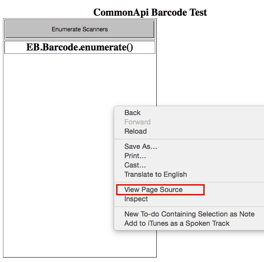

## Overview 

Sample apps are intended to demonstrate the basic functionality of common Enterprise Browser APIs and provide a basic understanding of how to integrate API code into an HTML page. Apps are fully functional only when launched using Enterprise Browser. 

This section requires a basic understanding of the workings of Enterprise Browser and its APIs and `Config.xml` runtime configuration file. For help editing this file, see the [Config Editor Utility guide](../ConfigEditor). 

**Related Guides**

* **[API Usage Guide](../apioverview) -** specifics of working with APIs
* **[API Compatibility Matrix](../../guide/compatibility) -** which APIs work with which platforms
* **[Config.xml Reference](../configreference) -** how to control an EB app's runtime settings
* **[Migration Guides](../) -** moving to EB from Pocket Browser or RhoElements
* **[Config Editor Utility guide](../ConfigEditor) -** an easy way to update config files

-----
## Using Sample Apps
Tapping on the sample-app links below from a desktop browser will display its layout and controls but the API will be inoperative. **To see how a sample app and its API works, it must be opened from within Enterprise Browser**. This can be done either by navigating in EB to the page using its URL, or setting the URL as EB app's start page through the &lt;StartPage> parameter in the `Config.xml` file. The latter process is explained below. 

**To activate a sample app in Enterprise Browser**:

1. **Identify the sample app and API** on the platform of interest. 
2. Right-click on its link and **select "Copy Link Address."** 
3. **Paste the link into the [&lt;StartPage> parameter](../configreference/#startpage)** of the `Config.xml` file ([Help](../ConfigEditor)). 
4. **Push the updated** `config.xml` **file to the device**.  
5. **Launch Enterprise Browser** and test the sample app.

-----

### Barcode App
Enumerates all the scanning devices currently attached to the device and lists them for selection as the default scanner.    

[Enterprise Browser](../../../samples/barcode/EB_Barcode_API.html)

[Pocket Browser](../../../samples/barcode/PB_Scanner_API.html)

[RhoElements](../../../samples/barcode/RE_Scanner_API.html)

-----

### Battery App
[Enterprise Browser](../../../samples/battery/BatteryCommAPI.html)

[Pocket Browser](../../../samples/battery/BatteryPB.html)

[RhoElements (correct?)](../../../samples/battery/Battery2.2API.html)

-----

### Camera App
[Enterprise Browser](../../../samples/camera/CameraCommonAPI.html)

[Pocket Browser](../../../samples/camera/CameraPB.html)

[RhoElements](../../../samples/camera/Camera2.2API.html)

-----

### ezNFC App
[Enterprise Browser](../../../samples/eznfc/ezNFC_CommonAPI.html)

-----

### Intent App
[Enterprise Browser](../../../samples/Intent/intent.html)

-----

### KeyCapture App
[Enterprise Browser](../../../samples/keycapture/KeyCommAPI.html)

[Pocket Browser](../../../samples/keycapture/KeyPB.html)

[RhoElements](../../../samples/keycapture/Key2.2API.html)

[WHO KNOWS?](../../../samples/keycapture/Remap.html)

-----

### Printer App
**For Enterprise Browser only**, use these APIs to   

[Bluetooth Enterprise Browser](../../../samples/printer/BT_CommonAPI.html)

[USB Enterprise Browser](../../../samples/printer/USB_CommonAPI.html)

[Wi-Fi Enterprise Browser](../../../samples/printer/WIFI_CommonAPI.html)

[Adaptive Printer Driver (APD)](../../../samples/printer/APD_2_2API.html)

-----

### Signal App
[Enterprise Browser](../../../samples/signal/SignalCommAPI.html)

[Pocket Browser](../../../samples/signal/SignalPB.html)

[RhoElements](../../../samples/signal/Signal2.2API.html)

-----

### Signature App
[Enterprise Browser](../../../samples/signature/SignatureCommAPI.html)

[Pocket Browser](../../../samples/signature/SignaturePB.html)

[RhoElements](../../../samples/signature/Signature2.2API.html)

-----

## Accessing the Code
To view or use the source code contained a sample app, simply view it through a desktop browser to expose and/or save its source code using the steps below. 

**To access the source code of a sample app**:

&#49;. Using a desktop browser, **click the link for the sample app and API** on the platform of interest. 

&#50;. Depending on the browser, **right-click and select View Page Source** or use the browser's View or Tools menu to find the corresponding command to expose the source: 

_Chrome and Firefox offer a "View Page Source" right-click option_. 
 

&#51;. **View and/or copy the desired source code** and paste it where needed:  

_In Firefox, select Tools -> Web Developer -> Page Source_. 
 

### JavaScript API Files
Enterprise Browser APIs are contained in one of two JavaScript files, which must of present and accessible to any app page that calls them. The Enterprise Browser installation by default adds a `C:/EnterpriseBrowser/JavaScriptFiles/` directory to the host machine, inside of which are two additional directories that contain the API files:

* `/EnterpriseBrowser/` - contains the Enterprise Browser JavaScript API file:
  * **ebapi-modules.js** - includes all `EB.module` APIs 
* `/BackwardCompatibility/` - contains legacy PocketBrowser and RhoElements 2.x APIs:
  * **elements.js** - for supporting RhoElements 2.x and PocketBrowser 2.x/3.x applications 

If Enterprise Browser APIs are used, these API files must be present on the device and referenced within the HTML of any page that uses them. See the [API Usage Guide](../apioverview) and [individual API pages](../../api) for details. 

-----

**Related Guides**

* **[API Usage Guide](../apioverview) -** specifics of working with APIs
* **[API Compatibility Matrix](../../guide/compatibility) -** which APIs work with which platforms
* **[Config.xml Reference](../configreference) -** how to control an EB app's runtime settings
* **[Migration Guides](../) -** moving to EB from Pocket Browser or RhoElements

