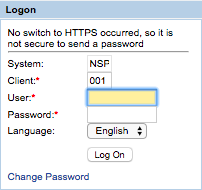

## Overview
Apps made with Enterprise Browser 1.7 (and higher) can capture an app screen image and source location for diagnosing application errors or malfunctions. The tool captures information for the screen in the foreground at the time the capture is initiated. 

> **This feature is available only on devices running Android**. 

## Enable Screen Capture
To enable the Screen Capture function in an app, the [&lt;WebPageCapture&gt; tag](../configreference/#webpagecapture) in the app's `Config.xml` file must contain a "1" value. When WebPageCapture is enabled on an app, the following functions are performed every time the app is launched: 

* Folders made from prior screen captures are deleted. 

* Two folders are created on the device: 
 * `/<internal_mem_root_dir>/Android/data/com.symbol/enterprisebrowser/Diagnostic/WebPageSource`
 * `/<internal_mem_root_dir>/Android/data/com.symbol/enterprisebrowser/Diagnostic/WebPageScreen`

### WebPageSource folder
After a capture, this folder will show the URL that contains the source files of the captured page (including .html, .jpg, etc.) plus a date and time stamp. A sample is shown below. 

[http://157.235.204.10:8000/sap/bc/gui/sap/its/test/mobile/itsmobile01](http://157.235.204.10:8000/sap/bc/gui/sap/its/test/mobile/itsmobile01)

Diagnostic feature is used for capturing the current web page content and for taking the screenshot of current foreground webview window. This feature will be enabled via Enterprise Browser configuration tag i.e. WebPageCapture with possible values 0(used for disabling) or 1(used for enabling). This feature will be in disabled state if the Enterprise Browser configuration tag i.e. WebPageCapture is not provided.

What it does?

If Enterprise Browser configuration tag i.e. WebPageCapture is provided and set to1, it will perform the below actions.

The Diagnostic folder will be created inside Enterprise Browser installed directory location during launch of an Enterprise Browser application. 

Two separate folders are created inside Diagnostic folder.oWebPageSource–Used for storing the web page content of the navigatedURL’s.oWebPageScreen –Used for storing the screenshot (current foreground webview window) of the navigated URL’s. 

The previously created Diagnostic folder is deleted during launching of an Enterprise Browser application.

Folder Explanation -WebPageSourceThis folder will contain individual folder where the content of navigated URLis stored. The folder name is generated  using the  last  index  name  of the URL concatenated  with  the  current timestamp i.e. _yyMMdd_HHmmss value. The downloading of webpage content will be forbidden if the navigated URL’s is same as one of the previously navigated URL’s. This behavior will only persist if the Enterprise Browser application is not exited and re-launched.

Folder Name Notes: The special characters while creating folder name is removed before creating the folder name. The characters of folder name before concatenating with the time stamp value is filtered and the mentioned characters inside square bracket i.e. ["*/:<>?\|] are removed.

Folder Name Examples: 
Folder name created for the below URL’s will look like as mentioned below.

URL 

1: http://157.235.204.10:8000/sap/bc/gui/sap/its/test/mobile/itsmobile01

Folder Name: itsmobile01_170323_142309URL 

2: http://10.233.85.82/neon/Test_EB.html

Folder Name: Test_EB.html_170323_142303

Internal File content of WebPageSource/<RESPECTIVE_URL_FOLDER_NAMES>:The internal respective folder contains the web page content. It could be any files i.e.*.html, *.css, *.js, *.jpg, *.jpeg, *.*, * etc. 

All files are saved with the last index name of respective resource URL’s. File Name Notes: The special characters while creating file name is removed before creating the file name. The characters of file name is filtered and the mentioned characters inside square bracket i.e. ["*/:<>?\|]are replaced with underscores i.e. _.

File Name Examples: File name created for the below resource URL’s will look like as mentioned below.URL 

1: http://157.235.204.10:8000/sap/bc/gui/sap/its/test/mobile/itsmobile01?

FileName: itsmobile01_URL 

2: http://10.233.85.82/neon/Test_EB.html

FileName: Test_EB.htmlFolder 

Explanation -WebPageScreenThis folder will contain individual files where the screenshot of navigated URLis stored in *.jpg format. The file name is generated using the last index name of the URL concatenated with the current time stamp i.e. _yyMMdd_HHmmssvalue. 

The screenshot (current foreground webview window) of navigated URL’s content will be captured every time even if the URL is same and was navigated and captured earlier. However, the screenshot is stored with different filename as the filename is concatenated with the current time stamp value. File Name 

Notes: The special characters while creating file name is removed before creating the file name. The characters of file name before concatenating with the time stamp value is filtered and the mentioned characters inside square bracket i.e. ["*/:<>?\|]are removed.File Name Examples: File name created for the below URL’s will look like as mentioned below.URL 

1: http://157.235.204.10:8000/sap/bc/gui/sap/its/test/mobile/itsmobile01?

File Name: itsmobile01_170323_142309.jpgURL 

2: http://10.233.85.82/neon/Test_EB.html

File Name: Test_EB.html_170323_142303.jpg

How to Configure?

The configuration option for enabling this feature is managed through Enterprise BrowserConfig.xml file as mentioned below. 

Default valueis set to 0in Enterprise BrowserConfig.xmlfile.

	<Diagnostic>
	 <WebPageCapture value="1"/>
	</Diagnostic> 

Possible values: 

	<WebPageCapture value="1"/>
	//Used for enabling the diagnostic feature 
	// OR
	
	<WebPageCapture value="0"/> 
	//Used for disabling the diagnostic feature.

General Notes & Warnings 

Sometimes the screenshot may not capture the right/full image of current webview window because the page might not be fully drawn as some page takes time to load the complete content into the webview window. 

Sometimes the screenshot may appear complete blank (white/black) image due to webview drawn issue. 

For some pages, it is not necessary that the entire web page content will be downloaded and stored as there could be restrictions from the server side.Some portion of the webpage content may be downloaded and some may not. 

Downloading time of content is dependent on the size of webpage content. The time of downloading will differ from one page to another page. It is not guaranteed/specific that how much time will it take to download the content. User need to wait for some time before diagnosing the same. 
 
Screenshot captures only webview window. Native buttons/window (such as Debug buttons or Alert Window), System Bar, Notification Bar are not captured as they are not part of webview window.Note:Alert Window is also a native window and not part of webview window. 

If alert window is called before drawing the actual content inside webview window, the blank white image is captured. This is as per Android Webview calls and design.