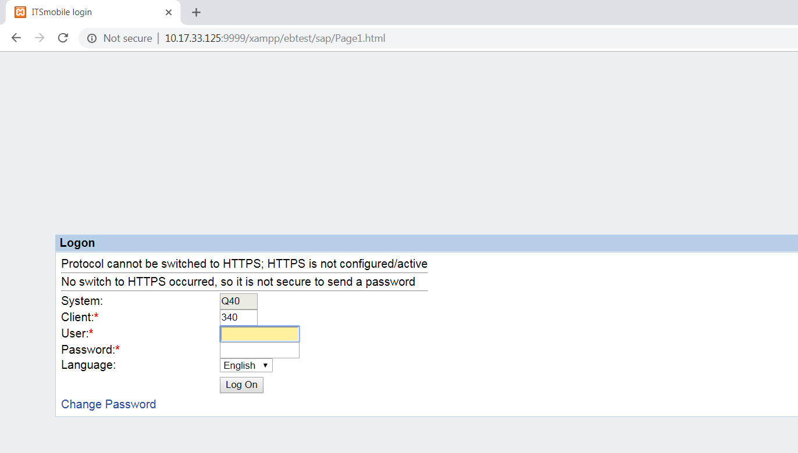

## Overview

Apps made with Enterprise Browser 1.3 and higher support DOM injection, which inserts CSS, JavaScript and/or meta tags into a running app without modifying the underlying app. This permits features, capabilities and even the look and feel of part or all of any app to be modified or customized at runtime **<u>without changing the original source code</u>**. 

This can be useful, for example, to inject EB JavaScript libraries or other business logic into an SAP ITSmobile or other app for which there's no way to edit the source. DOM injection occurs after the page is completely loaded, ensuring that page modifications are applied only after [the DOM](../../../1-8/guide/dominjection/#whatisthedom) is ready for them.

Enabled by default, DOM injection is **activated by the [&lt;CustomDOMElements&gt; tag](../configreference/#dominjection)** of the app's `Config.xml` file. No special licensing is required. 

### Requirements

To use DOM injection, **ALL of the following must be true**:

* The app being injected was made with Enterprise Browser 1.3 (or higher).
* A `tags` file containing elements to be injected has been created and pushed to the target device.
* The path to the `tags` file is specified in the app's `Config.xml` file (see [Step 2](#step2updateconfigxml)).
* The target device is running one of the following: 
	* Android with stock webkit 
	* Windows Mobile/CE device with Zebra Webkit
	* Windows CE with IE engine

**_DOM injection is NOT supported on Windows Mobile devices using the IE engine_**. 

### Supports injection of:

* JavaScript or CSS files stored locally on the device
* JavaScript or CSS files stored on a server 
* Meta tags described in the `tags` file (stored on the device)
* Local files specified using absolute paths or [EB substitution variables](../configreference/#substitutionvariables) (i.e. `%INSTALLDIR%`)

### Supported conditions:

* All navigated pages (using wildcard character)
* Only on specified pages (by file name or URL)
* All pages that contain a specified string or HTML element (using `pagecontent` attribute)

> **Zebra recommends using substitution variables rather than absolute paths whenever possible**.

-----

## Step 1 - Prepare 'Tags' File

The "tags" file is the list of elements (i.e. JavaScript, CSS and/or meta tags) to be injected into the DOM and the pages to receive the injections. Formatting syntax is similar to that of ordinary HTML tags for including scripts, style sheets and meta data. The specific tagging syntax for DOM injection is explained in the [tag file syntax section](#tagfilesyntax) below. The file can be saved using any name (i.e. `mytags.txt`).  

**To create a tags file**: 

1. **Create a text file** to contain the desired DOM-injection elements. 
2. **Copy code lines from the samples** below or in the [Example section](#examples), paste them into the new document and modify their contents to match the app's requirement. 
3. **Push the file to the device**; make note of the path and file name. 
4. **Modify the **`Config.xml` **file** the app to reflect the name and path of the `tag` file. 

-----

## Step 2- Update Config.xml

The `tags` file created in Step 1 must reside on the device. 

 * **Specify the path to the tags file** by adding a line (similar to the one below) in the `<Application>` section in the app's `Config.xml` file:  

		:::xml
		<Application>
		...
			<CustomDOMElements value="file://%INSTALLDIR%\rho\apps\app\mytags.txt"/>
		...
		</Application>

For information about how to configure the `Config.xml` file, see the [Config.xml Reference Guide](../configreference). **Note**: The &lt;CustomDOMElements&gt; tag cannot be configured using the [On-device Config Editor utility](../OndeviceConfig).  

> **The value inside the &lt;CustomDOMElements&gt; tag is empty by default. DOM injection cannot function unless a path to the `tags` file on the device is specified**. 

-----

## Tag File Syntax

### 'Pages' tag

The `pages` tag is used to specify the page(s) into which DOM elements are injected. This tag supports specification of an app's individual HTML pages ("startPage.html, scanPage.html" etc.), server-based application pages (specified as individual or relative URLs) and the wildcard character (&#42;), which injects the specified elements into all navigated pages of the app. 

### Sample Syntax

##### Inject a JavaScript file into all pages from "installed" directory (substitution variable): 
	:::javascript
	<script type='text/javascript' src='file://%INSTALLDIR%/enroll.js' pages='*' />
 

##### Inject a CSS file into all pages using absolute path:
	<link rel='stylesheet' type='text/css' href='file:///storage/emulated/0/Android/data/com.symbol.enterprisebrowser/mystyle.css'  pages='*' />

##### Inject a JavaScript file into one server page using relative reference:
	:::javascript
	<script type='text/javascript' src='file://%INSTALLDIR%/enroll.js' pages='/mypages/page2.html; /mypages/page5.html' />
_On server-based apps, DOM injection references are relative to the startPage URL.  For example, "http://myserver.com/mypages/startPage.html"_ could be the full URL for the example above. 
 

See [more code examples](#examples). 

-----

### 'Pagecontent' tag
***Supported in Enterprise Browser 2.0 (and higher) only***. 

The `pagecontent` tag is used for DOM injection into navigated pages only when a specific string or HTML element is present on the page. This allows the developer to set specific conditions under which an action is executed, for example to run a login script only on pages that contain a login prompt. 

Attributes of DOM Injection tags: 

**Note that the "pages" attribute specifies the file name of the page into which the element defined in the tag is injected**. 

**The following rules apply**: 

* <u>**All tags in the** `tags` **file *must* contain the injection-specific "pages" attribute**</u>.
* **Use of the wildcard (&#42;) character** causes injection into all nagivated pages.
* **If using server-based JavaScript**, see JavaScript injection section (below) for dependency cautions.
* **An optional pagecontent attribute can be used** to add a page-specific string for triggering injection (EB 2.0 and higher only).
* Attribute values must not be left blank.
* All tags must have beginning (&lt;) and ending (/&gt;) angle brackets.
* Each tag in the `tags` file must be on a separate line.
* Local pages support only the `pages='*’` syntax. To inject tags into a specific local page, use `pages='*'` in combination with the `pagecontent` attribute.

<!-- 12/5/18- removed per eng. 
* The `.html` file extension is assumed; specify the extension only if different.
* **For local files**, actions work from the directory relative to the installation root; include qualified path or substitution variable (**recommended**) only if different. 
* **For server-based CSS or JavaScript files**, actions work relative to the app's start page; include full URL if different.
* **URLs are supported for server-based CSS and JavaScript files only**.
* All meta tag data must be contained completely within the `tags` file.
-->

### Sample Syntax

##### Inject `enroll.js` file from the "install" directory if the string "Change Password" is found on any page:

	:::javascript
	<script type='text/javascript' src='file://%INSTALLDIR%/enroll.js' pagecontent='Enter Login ID' pages='*' />
 

*An app login page that contains 'Change Password' text*.
 

If injection is desired on a page that displays no visible text, it's possible to identify a unique 'pagecontent' element by using the inspection tool available on most standard browsers (i.e. Chrome or Firefox). The image below uses Chrome's "elements view" to show the HTML code behind a hidden login prompt from an SAP web app:

 

Once identified, copy the "outerXML" of the element and paste it into the 'pagecontent tag to allow the EB app identify the desired element for injection: 

	<script type='text/javascript' src='file://%INSTALLDIR%/previous.js' pagecontent='<input type="hidden" name="sap-system-login-oninputprocessing" value="onProceed">' pages='*' />

**Notes**: 
* When specifying lengthy HTML elements, check syntax carefully to avoid errors. 
* Multi-line values are not supported.

##### When all tags are completed, store the tags file on the device and take note of the file name and path. 

This tag must contain a fully qualified path to the device-resident "tags" file, which is required for DOM injection. The `tags` file defines the DOM element(s) to be injected and the names or identifying contents of the page(s) to receive injections whenever they're displayed. 

See [more code examples](#examples). 

-----

### JavaScript Injection Examples
JavaScript can be injected either through file protocol or by using an absolute path, [substitution variable](../configreference/#substitutionvariables), or server path relative to the EB app's start page. **Different rules apply to injection of local and server-based JavaScript, and might affect the app if dependencies exist between the JavaScript modules in use**. 

#### Inject Local JavaScript
When using the file protocol, the JavaScript file(s) must be resident on the target device and have path(s) specified in the `src` attribute of the script tag using the `file://` designation. For example, the following lines inject four JavaScript files into all pages of the app-relative directory:

	:::xml 
	<script type='text/javascript' src='file:///storage/emulated/0/Android/data/com.symbol.enterprisebrowser/mytest.js' pages='*'/>

	<script type='text/javascript' src='file:///storage/emulated/0/Android/data/com.symbol.enterprisebrowser/jquery.js' pages='*'/>
	
**Notes**
* Local JavaScript files are injected consecutively in the order they appear in the tags file.
* Each JavaScript file is loaded completely before the next file begins to load. 
* DOM injections occur every time a page is loaded, **so changes to JavaScript files injected in this way can be put into effect simply by refreshing the relevant page**.

#### Inject Server-based JavaScript
Here, four JavaScript files are injected from a server to all pages: 

		:::xml
		<script type='text/javascript' src='http:\\myserver.com\elements.js' pages='*' /> 
		<script type='text/javascript' src='http:\\myserver.com\jquery.js' pages='*' /> 
		<script type='text/javascript' src='http:\\myserver.com\jquery-1.11.3.js' pages='*' />
		<script type='text/javascript' src='http:\\myserver.com\test.js' pages='*' />  

With server-based injection, Enterprise Browser commands the engine to inject JavaScript to the DOM asynchronously, which (for example) might cause `jquery.js` to be loaded before `element.js`. Therefore, **if JavaScript files are interdependent, additional steps might be required to avoid failure due to a dependency issue** (see below). 

In another example, the tags file below is used to inject the `ebapi-modules.js` and `test.js` files into all navigated page. 

		:::xml
		<script type="text/javascript" src="http://myserver.com/scripts/ebapi-modules.js" pages="*" />
 
    	<script type="text/javascript" src="http://myserver.com/scripts/test.js" pages="*" />

If an attribute contained in the `ebapi-modules.js` file--for example the EB namespace--is required by `test.js`, an error might occur if `test.js` is injected first. To guard against this, it might be useful for `test.js` to include some logic (like the JavaScript below) so that it waits until its dependent JavaScript (`ebapi-modules.js`) is loaded.

Sample JavaScript to delay loading: 

		:::javascript
		(function() {
 
        // Poll for jQuery to come into existence
        var checkReady = function(callback) {
            if (window.EB) {
                callback(EB);
            }
            else {
                window.setTimeout(function() { checkReady(callback); }, 100); //check here
            }
        };
        // Start polling...
        checkReady(function(EB) {
          alert(EB.Application.appName); //use EB api here
        });
    })();

-----

## Examples

##### Inject a JavaScript file into all pages using absolute path:

	<script type='text/javascript' src='file:///storage/emulated/0/Android/data/com.symbol.enterprisebrowser/mytest.js' pages='*'/>
 

##### Inject a CSS file into all pages using absolute path:

	<link rel='stylesheet' type='text/css' href='file:///storage/emulated/0/Android/data/com.symbol.enterprisebrowser/mystyle.css'  pages='*' />
 

##### Inject a CSS file into all pages from the root directory (substitution variable):
	<link rel='stylesheet' type='text/css' href='file://%PRIMARYDIR%/mystyle.css'  pages='*' />
 

##### Inject a JavaScript file from a server into all pages:
	<script type='text/javascript' src='http://myserver.com/test.js' pages='*'/>
 

##### Inject a meta tag to refresh all pages every 30 seconds:

	<meta http-equiv="refresh" content="30" pages='*' />
 

##### Enable the scanner on all pages
	<meta HTTP-Equiv="scanner" Content="Enable" pages='*'/> 
 

##### Inject the JavaScript file `enroll.js` onto any page that contains a "Change Password" string:

	<script type='text/javascript' src='file://%INSTALLDIR%/enroll.js' pagecontent=' Change Password’pages='*' />
 

##### Inject the JavaScript file `previous.js` on any page that contains a specific HTML element: 
	::::html
	<script type='text/javascript' src='file://%INSTALLDIR%/previous.js' pagecontent='<input class="clr-button branded-highlight-bg branded-highlight-item" data-ats-id="Previous-button" name="Previous" onclick="" style="margin-right:5px;" type="button" value="Previous">' pages='*' />
 

##### Inject `mystyle.css` file from the "install" directory if the string "Enter User Name" is found on any page:

	:::javascript
	<link rel='stylesheet' type='text/css' href='file://%INSTALLDIR%/mystyle.css'  pagecontent='Enter User Name' pages='*' />
 

-----

##### Sample tags file
The following is an example of a complete tags file. Each tag is preceded by a description of that tag.  

	<!--Sample tags file -->
	<!--FILENAME: 'mytags.txt' -->
	<!--DESC: 'tags' file for DOM Injection -->

	<!--JavaScript section-->

	<!--inject mytest.js into pages p1 and p2 only-->
	<script type='text/javascript' src='./mytest.js' pages='p1;p2'/>

	<!--inject mytest.js into all pages-->
	<script type='text/javascript' src='./mytest.js' pages='*'/>

	<!--inject a server-based JavaScript (into all pages)-->
	<script type='text/javascript' src='http://192.168.10.1:8081/test.js' pages='*'/>

	<!--inject a local JavaScript file (into p1 into p2)-->
	<script type='text/javascript' src='file://\programfiles\enterprisebrowser\rho\apps\app\test.js' pages='p1;p2'/>

	<!--MetaTags section-->

	<!--refresh pages p1 and p2 every 30 seconds-->
	<meta http-equiv="refresh" content="30" pages='p1;p2'/> 

	<!--refresh all pages every 30 seconds-->
	<meta http-equiv="refresh" content="30" pages='*'/>

	<!--enable the scanner on all pages-->
	<meta HTTP-Equiv="scanner" Content="Enable" pages='*'/> 

	<!--StyleSheets section-->

	<link rel="stylesheet" type="text/css" href="mystyle.css" pages='p1;p2'/>
	<link rel="stylesheet" type="text/css" href="mystyle.css" pages='*'/>
	<!--link rel="stylesheet" type="text/css" href="mystyle.css" pages='*'-->   
	<link rel="stylesheet" type="text/css" href="file://\programfiles\enterprisebrowser\rho\apps\app\mystyle.css" pages='p1;p2'>