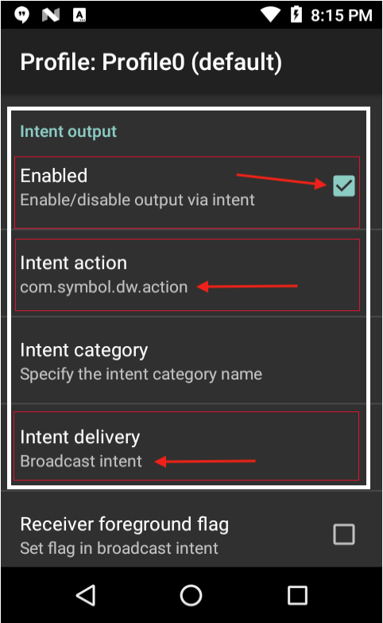

## Overview 

Apps running on Enterprise Browser 2.0 (and higher) can control DataWedge&ndash;Zebra's built-in scanning engine&ndash;using DataWedge intents. This makes it possible to adjust DataWedge settings from an EB app to adapt to changing data acquisition requirements without exiting the app. 

This guide illustrates the feature using a real-world example. It explains how to configure an EB app to scan and process barcode data, enter the captured data as keystrokes into any EB input field, and reconfigure DataWedge to switch the input type&nsdash; all using DataWedge intents from within the EB app. 

<!-- 
**Note: It's important to understand that <u>control of barcode scanning hardware is exclusive</u>. When DataWedge is active, Enterprise Browser <u>scanning APIs</u> are inoperable**. Likewise, an Enterprise Browser app that uses those APIs will prevent other apps (including DataWedge) from accessing the scanner(s). This guide explains how to take control of a device's scanner hardware and to subsequently release it to other apps when scanning is complete.  

-->

### Requirements

* Zebra device that supports EB and SimulScan
* Enterprise Browser 2.0 (or higher) installed on the device and on a Windows PC
* DataWedge 6.5 (or higher) on the device. [Which version is installed?](../../../../datawedge/latest/guide/about/#whichversionisinstalled)
* EB API module `ebapi-modules.js ` on the device. ([More about EB APIs](../apioverview)). 
* Knowledge of `Config.xml` file editing. ([About config-file editing](../ConfigEditor)).

-----

### Two-Profile Solution
Implementing this solution includes configuration of EB for using DataWedge and the creation of two DataWedge Profiles on the device: one configured for **Barcode input** and the other for **SimulScan input**. Both Profiles set the **Intent output as Broadcast**. 

FROM OTHER: 
EB 2.0 works directly with DataWedge 6.5 and later versions provided the `<usedwforscanning>` tag in the EB app's `Config.xml` file is configured correctly (see below). 

**To enable DataWedge 6.5 (or higher) in an EB 2.0 (or higher) app**: 

&#49;. **Confirm (or configure) the following** `Config.xml` **file settings**:   
* **Set a value of "1" in** `<usedwforscanning>` tag.
* **Set a value of "1" in** `<EnableReceiver>` tag.
* **Set a value of** "`com.symbol.dw.action`" **in the** `<IntentAction>` tag.
* **Set a value of** "`file://%INSTALLDIR%/DataWedgeIntent.html`" in `<StartPage>` tag.

		:::xml
		<Applications>
			<Application>
			...
				<usedwforscanning  value=”1” />
			...
				<IntentReceiver>
					...
        			<EnableReceiver  value="1"/>
        			<IntentAction  value="com.symbol.dw.action"/>
        			...
        		<General>
        			<Name value="Menu"/>
        			<StartPage value="file://%INSTALLDIR%/DataWedgeIntent.html" name="Menu"/> 
        	...

&#50;. In DataWedge, **select Profiles -> Profile0 (default)**.

&#51;. **Confirm that "Profile 0" is enabled**.

&#52;. **Confirm that Barcode Input is enabled**.

&#53;. **Scroll down to the Intent Output** section and set the following: 
* **Confirm that Intent Output is Enabled**.
* **Tap Intent action** and enter `com.symbol.dw.action` and **Tap OK**.
* **Tap Intent delivery** and select (or confirm) “Broadcast Intent” and **Tap OK**.

Settings should appear as in the image below: 

_Profile0 settings for using DataWedge from EB apps_.

-----

## `MORE TO COME`

<!-- 
RAW RAW
Install Enterprise Browser v2.0 apk file in zebra android device supported by Enterprise Browser application.
Launch Enterprise Browser for extracting Enterprise Browser Config.xml which is used for setting the runtime configuration parameters of Enterprise Browser application.

After application launch, extract Config.xml from "/[mass_storage_location]/Android/data/com.symbol.enterprisebrowser" present on the device. Here, [mass_storage_location] refers to "/sdcard" or "/Internal shared storage" etc., depending on the Zebra Android device used.

Open Config.xml and apply the below settings:
Set "usedwforscanning" config parameter value to 1 in Config.xml. This is used for enabling DataWedge inside Enterprise Browser application. For more details, refer to Enterprise Browser - DataWedge documentation.

Enable the IntentReceiver tags in Config.xml as shown below. For more details, refer to Enterprise Browser - Intent Receiver documentation.

Set "EnableReceiver" config tag to 1 in Config.xml.

Set "IntentAction" value to "com.symbol.dw.action" in Config.xml to retrieve Barcode scanned data using DataWedge as JavaScript callback in Enterprise Browser.

Set "IntentAction" value to "com.symbol.dwss.action" in Config.xml to retrieve simulscan captured data using DataWedge as JavaScript callback in Enterprise Browser.

Set the "IntentAction" value to "com.symbol.datawedge.api.RESULT_ACTION” in Config.xml to receive DataWedge configuration value as JavaScript callback in Enterprise Browser.

Set the “IntentCategory” value to “android.intent.category.DEFAULT” in Config.xml to receive DataWedge configuration value as JavaScript callback in Enterprise Browser. 
 
		<IntentReceiver>
       		<EnableReceiver   value="1"/>
        		<IntentAction  value="com.symbol.dw.action"/>
			<IntentAction  value="com.symbol.dwss.action"/>
			<IntentAction  value="com.symbol.datawedge.api.RESULT_ACTION"/>
       		<IntentCategory  value="android.intent.category.DEFAULT"/>
      	</IntentReceiver>

Create a web page which has a logic to send DataWedge Intent-specific APIs using Enterprise Browser Intent API.  Shown in below example how the user can switch the DataWedge profile (Here, “barcode” is DataWedge profile Name).

		var params = {
			intentType: EB.Intent.BROADCAST,
			action: 'com.symbol.datawedge.api.ACTION',
			appName: 'com.symbol.datawedge',
			data: {"com.symbol.datawedge.api.SWITCH_TO_PROFILE":"barcode"}
		EB.Intent.send(params);

Set “startPage” tag in config.xml to a webpage as shown below. For more details, refer to Enterprise Browser- startPage config parameter.

	<General>
              <Name value="Menu"/>
              <StartPage value="file://%INSTALLDIR%/DataWedgeIntent.html" name="Menu"/>
      </General>
	
Save and copy the updated config.xml file to the Enterprise Browser installed directory in the device after all the above-mentioned settings are applied.

Copy the html file to the respective directory given in “StartPage” config tag as shown in above example.

Copy the ebapi-modules.js to the location where the “.html” file resides. It is used for accessing the Enterprise Browser JavaScript API's.
 -->
-----

<!--  WE'LL PROBABLY TAKE ALL THIS OUT: 
### DW 6.0.1 - 6.4
**Important**: Some versions of DataWedge 6.x automatically disable Enterprise Browser after every device reboot by adding it to the "Disabled apps list." If `com.symbol.enterprisebrowser` reappears in the Disabled apps list after reboot, it must be manually removed before EB can use DataWedge for scanning. The only alternative is to upgrade DataWedge, which for Android requires a new BSP (OS image). Such updates should be attempted only with the guidance of [Zebra Support](https://www.zebra.com/us/en/about-zebra/contact-zebra/contact-tech-support.html).  

#### Use DataWedge for Scanning

**To enable an EB app to scan with DataWedge 6.0.1 and higher**: 

&#49;. Confirm that no association with `com.symbol.enterprisebrowser` exists in the "Disabled app list" in the DataWedge Settings panel:
  * In **DataWedge**, select **Menu->Settings->Disabled app list**. The list of disabled apps appears.

  * **Remove** `com.symbol.enterprisebrowser` **from the list**, if present (see note, above). 

&#50;. In the EB app's `config.xml` file, set a value of "1" in the [&lt;usedwforscanning&gt;](../configreference/#usedwforscanning) tag.

#### Use Enterprise Browser APIs for Scanning

**To use a device scanner through an Enterprise Browser API**:

  * Set the value in the [&lt;usedwforscanning&gt;](../configreference/#usedwforscanning) tag of the EB app's `config.xml` file to "0"

-----

##### Option 1: Disable DataWedge on the device

1. **Start DataWedge** on the device.
2. In DataWedge, select **Menu->Settings**.
3. **Uncheck the "DataWedge enabled"** checkbox.
4. In the EB app's `config.xml` file, set a value of "0" in the [&lt;usedwforscanning&gt;](../configreference/#usedwforscanning) tag.

DataWedge is now disabled and unavailable to any app on the device.  

**Note: DataWedge also can be disabled (or re-enabled) programmatically using [DataWedge APIs](../../../../datawedge)**.

##### Option 2: Disable DataWedge only for Enterprise Browser

**To create and disable an Enterprise Browser Profile in DataWedge**: 

1. **Install the Enterprise Browser app** that will use DataWedge.
2. **Start DataWedge**.
3. In DataWedge, select **Menu->New Profile**, **Enter a Profile name** and tap **OK**. The list of Profiles appears.
4. Tap on the newly created profile.
5. In the **Applications section**, **tap Associated apps**.
6. Tap **Menu->New app/activity**. A list of apps/activities appears. 
7. From the list, **select the package name of the EB app** (i.e. `com.symbol.enterprisebrowser`) that will use DataWedge. The app activities list appears. 
8. From the app activities list, **tap the asterisk (*) to associate all app activities** with the Profile, or tap on an indvidual activity to use DataWedge only for that specific activity. 
9. **Tap BACK** to return to the Profile screen.
10. Confirm that the Profile's **"Profile enabled" box is <u>checked</u>**.
11. In the new Profile, **<u>uncheck</u> the "Enabled" box** for these three sections: **Barcode input, Keystroke output and Intent output**.
12. In the EB app's `config.xml` file, set a value of "0" in the [&lt;usedwforscanning&gt;](../configreference/#usedwforscanning) tag.

DataWedge will now be disabled whenever an Enterprise Browser app is running. 
 -->
-----

Related guides: 

* [DataWedge User Guide](../../../../datawedge)
* [Enterprise Browser APIs](../../api)
* [API Compatibility Matrix](../compatibility)
