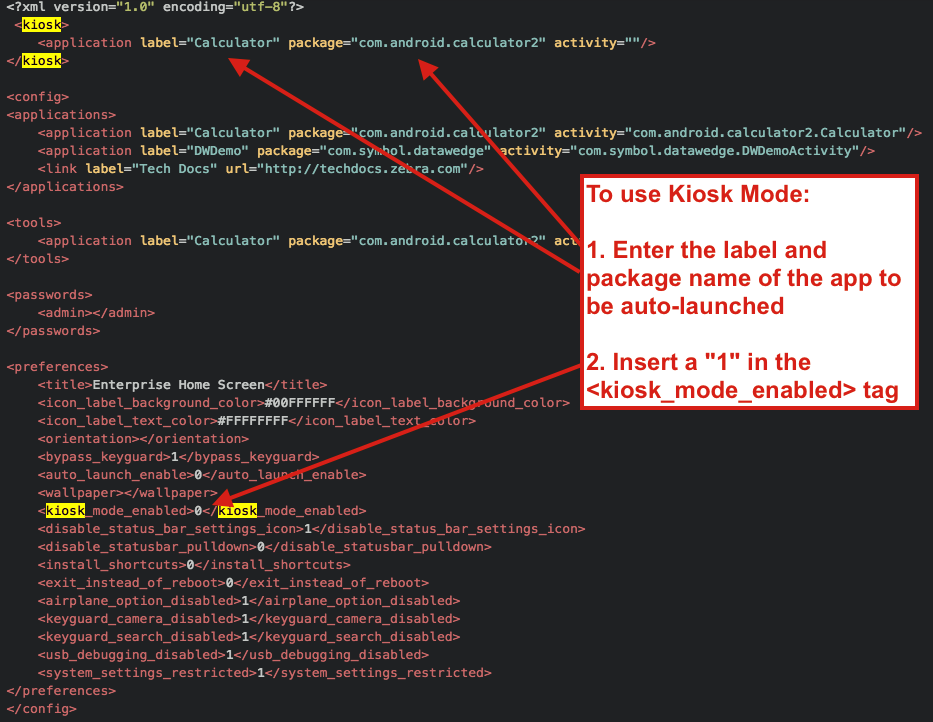

## Overview 

For applications that require tight control over device settings and apps, Enterprise Browser 1.6 and higher can integrate with [Enterprise Home Screen](../../../../ehs), Zebra's free Android solution that can lock users out of all but the apps and settings that a company wants them to see. In just a few minutes, EHS can be configured to show a selected set of apps, limit device usage to a single, auto-launched app (via "Kiosk Mode"), prevent changes to device settings, lock out HOME and BACK keys, and much more. 

All EHS settings are stored in the `enterprisehomescreen.xml`, a human-readable file and is easily edited by hand can be deployed via MDM. This guide contains the basic steps for editing the EHS config file to: 

* **Launch an EB app into Kiosk Mode**, which prevents quitting and changing of device settings
* **Display an EB app in User Mode**, which shows only desired apps and prevents changing of device settings

### Prerequisites
* A Windows or Mac OS X computer
* A USB cable connecting the computer to a Zebra Android device via ADB
* EHS and Enterprise Browser installed on the device 
* Any other desired device apps installed and working properly 

For more information, including EHS download, setup and deployment instructions, see the [Enterprise Home Screen documentation](../../../../ehs). 

-----

## Kiosk Mode

Kiosk Mode allows devices to run a single application that cannot be exited. Examples include retail price checkers, auto parts look-ups, patient check-in systems and so on. Kiosk Mode also can be useful when dedicating a device to a single user and/or task, such as a retail clerk's hand-held barcode scanner. Kiosk Mode opens the app in full-screen mode and prevents exit by blocking the BACK and HOME keys. 

##### Android Platform Notes: 
* **On devices running Android 5.x Lollipop**, Kiosk Mode should not be used with Screen Pinning, an Android L feature that works in a similar way.
* **On devices running Android 4.4 KitKat**, a "please wait" prompt remains displayed when starting up the device in Kiosk Mode. Press the HOME key to launch the Kiosk-Mode app and resume normal behavior. 

##### Kiosk Mode tags:
<b>&lt;kiosk&gt;</b> - Specifies the app that will run when Kiosk mode is enabled

<b>&lt;kiosk_mode_enabled&gt;</b> - Toggles the feature on and off
 

### Enable Kiosk Mode
**Before proceeding, be sure that the Kiosk Mode app is installed and working properly**. Zebra recommends starting these instructions by editing the default `enterprisehomescreen.xml` file, which is found in the `/enterprise/usr` directory on the device with Enterprise Home Screen installed. 

In the `enterprisehomescreen.xml` file:

1. Specify the Kiosk app label, package and activity (optional) in the &lt;kiosk&gt; section of the config file (shown below), replacing any pre-existing data. 
2. Enter a value of "1" in the &lt;kiosk_mode_enabled&gt; tag in the Preferences section of the file. 
3. If USB Debugging is desired in Kiosk Mode, enter a value of "0" in the &lt;usb_debugging_disabled&gt; tag (see Disable Kiosk Mode for more info).   
4. Remove all apps from the &lt;applications&gt; section. 
5. Make any other required changes in the file.  
4. Save and push the `enterprisehomescreen.xml` file to the device; changes take effect immediately. 

Once the `enterprisehomescreen.xml` file is pushed to the device, the named app will launch in full-screen mode and BACK and HOME keys will be disabled. For exiting instructions, see Disable Kiosk Mode section, below. 

<b>Security Note</b>: When using Kiosk Mode, Zebra recommends configuring the EB app to disable "key remapping" and other possible methods of launching applications, which would thereby defeat Kiosk Mode safeguards. 

_Click image to enlarge_

### Disable Kiosk Mode
Once Kiosk Mode is enabled, it can be disabled in only one of two ways (without writing custom program code):

* <b>If USB Debugging <u>was not</u> disabled for User Mode</b>, disable Kiosk Mode by pushing to the device a config file with a value of "0" in the &lt;kiosk_mode_enabled&gt; tag.

* <b>If USB Debugging <u>was</u> disabled for User Mode</b>, perform a factory reset. 

For more information about Kiosk mode, including UI and programmatic access, and working with the `enterprisehomescreen.xml` file, see the **Advanced Settings** and **Special Features** sections of the [EHS documentation](../../../../ehs). 

-----

## User Mode

User Mode is the default state for EHS. When EHS is running on a device, all apps on the device or installed later are hidden unless they're listed in the &lt;applications&gt; section of the `enterprisehomescreen.xml` file (shown below). For an application to be shown in User Mode (and available to a user), it must be specified in this list as detailed below. Start with the default `enterprisehomescreen.xml` file, which is found in the `/enterprise/usr` directory on the device with Enterprise Home Screen installed.

_Click image to enlarge_

### Add apps to User Mode 
**Before proceeding, be sure that any apps desired for User Mode are installed and working properly**.

In the `enterprisehomescreen.xml` file:

1. Specify the app label and package (and optional activity) in the &lt;applications&gt; section of the config file (shown above). 
2. Enter (or confirm) a value of "0" in the &lt;kiosk_mode_enabled&gt; tag in the Preferences section of the file. 
3. Push the `enterprisehomescreen.xml` file to the device; changes take effect immediately. 

Once the `enterprisehomescreen.xml` file is pushed to the device, the specified apps will be visible whenever the device is in User Mode.

-----

## Mass Deployment
A solution that uses EHS to lock down an EB app can be mass-deployed using Zebra [StageNow](../../../../stagenow) or a compatible MDM system, provided the system is capable of setting an Android app as the default Launcher for the device. 

**Zebra recommends testing all apps and configuration files on a working device before general deployment**. 

**Required files**:

- EHS installation package (.apk file)
- EHS `enterprisehomescreen.xml` file configured as desired 
- EB installation package (.apk file)
- EB `config.xml` file configured as desired 
- EB start-page file (if launched from the device) 

**To mass deploy an EB app locked down with EHS**: 

1. Create an installation package containing the required files listed above.
2. Set StageNow (or a compatible MDM system) to: 
 * Deploy `enterprisehomescreen.xml` to the `/enterprise/usr` device directory. 
 * Check the device for a `/<internal_mem_root_dir>/EnterpriseBrowser/` directory. Create if necessary.
 * Deploy `config.xml` to the `/<internal_mem_root_dir>/EnterpriseBrowser/` directory. 
 * Deploy and launch EB.
 * Deploy and launch EHS.
 * Set EHS as the default Launcher and set it to launch on device startup.
 * Restart the device.

On every subsequent restart, EHS will automatically run, and depending on the `enterprisehomescreen.xml` file, will launch the Kiosk Mode app or display the apps specified for User Mode.

-----

Related guides: 

* [Enterprise Home Screen user guide](../../../../ehs)
* [Enterprise Browser Security Overview](../security)
* [Enterprise Browser APIs](../../api)
