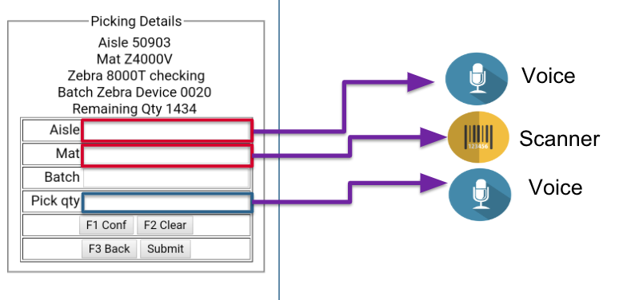
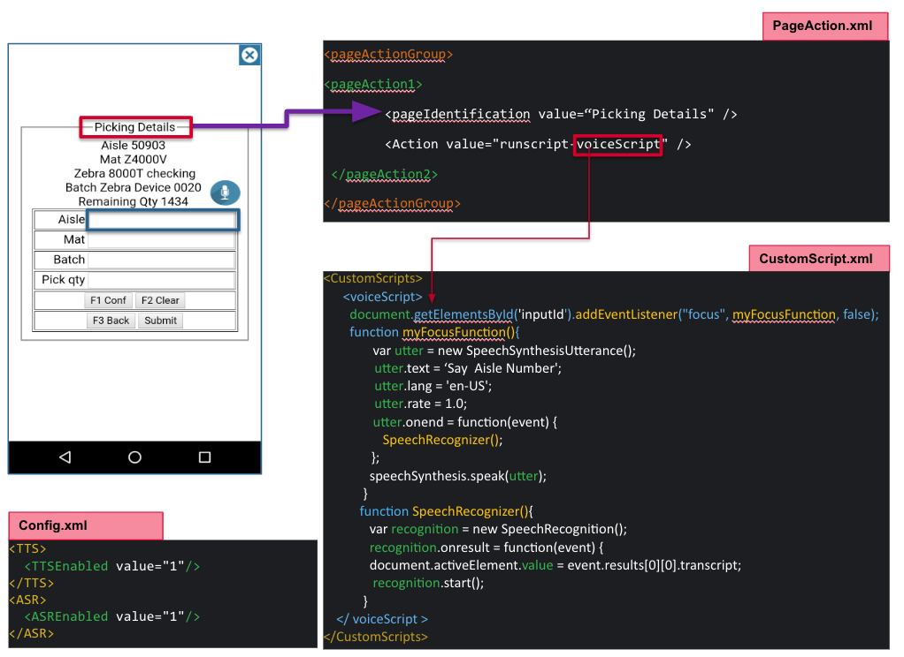

## Overview

Enterprise Browser 2.0 (and higher) supports the ability to process incoming voice commands,  convert the voice input to text and employ the text in an app. Voice input is enabled in an EB app using JavaScript, which can be added to the app directly or added through [DOM injection](../dominjectionandroid). **A Zebra GMS device running Android is required**. 

#### Interfaces in use: 

* [W3C Web Speech API](https://w3c.github.io/speech-api/speechapi.html) 
* [Automatic Speech Recognition (ASR) APIs](https://developer.android.com/reference/android/speech/SpeechRecognizer)
* [Text-to-speech (TTS) APIs](https://developer.android.com/reference/android/speech/tts/TextToSpeech)
* [Speech package summary](https://developer.android.com/reference/android/speech/package-summary)

### Requirements

* An app on Enterprise Browser 2.0 (or higher)
* A Zebra GMS device running Android

-----

### Enable With DOM Injection

The easiest way to add voice to an existing EB app is through DOM injection and its `pageAction` feature. This feature allows JavaScript code to be injected into one or more specific pages as determined by a unique string found on the page. For example, if the app contain one or more pages that display text prompting the user to "Speak a Command," voice input can be activated on every page that contains that particular string of text. 

Steps to use this feature:

1. Create two dependent files PageAction.xml and CustomScript.xml with below stub content.
2. Find a string (i.e. text, HTML element or label) that is **unique to that page**. 
3. Paste this string as the value of `<pageIdentification value=“unique string” />` in `PageAction.xml` file. 

#### PageAction.xml
	:::xml
	<pageActionGroup>
	<pageAction1> 
	        <pageIdentification value=“Picking Details" />
	        <Action value="runscript-voiceScript" />
	 </pageAction2>
	</pageActionGroup>

4. Add name of the file containing the JavaScript to be executed as the custom action value in `<Action value=“myScript1”/>`.
5. Paste the Action value into the `CustomScript.xml` as shown below.

#### CustomScript.xml
	:::xml
		<CustomScripts>
			<voiceScript>
		        document.getElementsById('inputId').addEventListener("focus", myFocusFunction, false);
		        function myFocusFunction(){
		               var utter = new SpeechSynthesisUtterance();
			 utter.text = ‘Say  Aisle Number';
		     	 utter.lang = 'en-US';
		     	 utter.rate = 1.0;
		               utter.onend = function(event) {
		                  SpeechRecognizer();
		      	};
		              speechSynthesis.speak(utter);        
		            }
		           function SpeechRecognizer(){
		              var recognition = new SpeechRecognition();
		              recognition.onresult = function(event) {
		              document.activeElement.value = event.results[0][0].transcript;
		               recognition.start();
		            }
		    </ voiceScript >
		</CustomScripts>
6. Push the two files to the EB installation directory: 
  `/Android/data/com.symbol.enterprisebrowser`
7. Add the path to the 

 

 

 

in case you can’t find any string unique in the page, you can inspect the page source to identify the same

Steps to Identify the unique string is:
1. In config.xml please enable the debug mode by modifying <DebugModeEnable value="1"/>
2. Make sure the device is connected in debugging mode.
3. Open chrome and navigate to chrome://inspect
4. Now you can see the complete web page source of that html and can identify the unique string in the page.

#### Config.xml

	:::xml
	<TTS>
	  <TTSEnabled value="1"/>
	</TTS>
	<ASR>
	  <ASREnabled value="1"/>
	</ASR>

