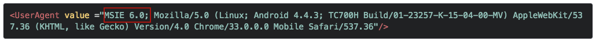

## Overview
This guide provides instructions for modifying an EB app for Windows Mobile/CE to work with ITSmobile, the SAP middleware system built around its Internet Transaction Server (ITS). ITSmobile provides browser-based access to SAP's ERP, SRM and other enterprise apps made with the company's proprietary dynpro language. Enterprise Browser apps can be built or adapted to work with ITSmobile, and hence to access SAP back-end enterprise apps. Doing so requires familiarity with editing the `Config.xml` and HTML file(s) of EB apps. 

**The [UserAgent section](#useragent) of this guide also includes troubleshooting issues that sometimes arise when migrating ITSmobile apps from one device or platform to another**.  

-----

**Related Guides**: 

* [Config.xml Reference](../configreference)
* [Enterprise Browser APIs](../apioverview)
* [Function Key Mapping Guide](../keycapture/#mappingproprietaryfunctionkeycodes)
* [Migration Guides](../migration)
* [DOM Injection guide](../DOMinjection)
* [SAP ITSmobile wiki page](https://wiki.scn.sap.com/wiki/display/HOME/ITSmobile)

-----

## Basic Steps 
The basic steps for accessing ITSmobile from an Enterprise Browser app are shown below with descriptions of (or links to) the detailed procedures for each. 

### 1. Set Start Page
Enterprise Browser must be set to start with the SAP ITSmobile application. Specify the URL of the SAP ITSmobile application in the [StartPage](../configreference/#startpage) parameter of the EB app's `Config.xml` file. 

### 2. Enable APIs
If the app uses Enterprise Browser APIs, the [API modules](../apioverview) must be present on the device and referenced from every HTML page that calls them. If the HTML is not available or cannot be edited, **access the API(s) through meta tags**, which does not require changes to the HTML files. See "Invoke API through DefaultMetaTags," below. 

### 3. Handle KeyEvents
Enterprise Browser can handle events triggered by keypresses, either by using the KeyCapture common API or the `onkeyup / onkeydown / onkeypress` JavaScript APIs. Zebra generally recommends the KeyCapture method, particularly on devices running Windows Mobile with the IE rendering engine because of several known limitations in the JavaScript APIs. For situations in which JavaScript is the only choice, consider switching to the Zebra Webkit engine, if possible. 

KeyCapture API functionality varies based on the device, its operating system and the rendering engine in use. The following table can help identify available functionality.  

<table>
<tr>
<th>SCENARIO</th>
<th>Windows Mobile, Zebra Webkit</th>
<th>Windows Mobile, IE engine</th> 
<th>Windows CE, Zebra Webkit</th>
<th>Windows CE, IE engine</th>
<th>Android, stock webkit</th>
</tr>  
<tr>
<td>EB KeyCapture API (EB namespace)</td>
<td>YES</td>
<td>NO</td>
<td>YES</td>
<td>NO</td>
<td>YES</td>
</tr>
<tr>
<td>JavaScript Object, backward compatibility API</td>
<td>YES</td>
<td>NO</td>
<td>YES</td>
<td>NO</td>
<td>YES</td>
</tr>
<tr>
<td>ActiveX Object, backward compatibility API</td>
<td>YES</td>
<td>YES</td>
<td>YES</td>
<td>YES</td>
<td>YES</td>
</tr>
<tr>
<td>HTML onkeyup/onkeydown Events</td>
<td>YES</td>
<td>NO</td>
<td>YES</td>
<td>YES</td>
<td>YES</td>
</tr>
</table>
 

### 4. Capture Keys
The KeyCapture API can be invoked directly from one of the app's HTML pages or through a meta tag, which us useful if the HTML is not available or cannot be edited. Both methods are shown below. 

#### Invoke API directly

Most JavaScript-based key handling for SAP ITSmobile applications is handled by the `mobile.js` file, which is hard to extract and modify from an SAP server and is subject to limitations and JavaScript issues of the IE rendering engine referenced above. **To overcome those issues, try the following technique**:

1. Configure KeyCapture functionality in the `config.xml` file as below:

          :::xml
          <DefaultMetaTags>
            <MetaTag VALUE="KeyCapture~KeyValue:All;Dispatch:True;KeyEvent:url('javascript:fireKeyEvent(%json);');" /> 
          </DefaultMetaTags> 
2. Add the following JavaScript method as described in the [DOM Injection guide](../dom). The same `fireKeyEvent` method has been configured in the `Config.xml` under the `DefaultMetaTags` attribute.

          :::javascript
          //Add the fireKeyEvent in the HTML page for handling in WM device with IE Engine
          function fireKeyEvent(event)
          {
            var getData = processKeyEvent(event);
          }

 
**KeyEvents also can be handled using any of the methods below**:

* **To capture keys via JavaScript Object** using backward compatibility API:

          :::javascript
          keyCapture.keyValue = 'All'; //Here keyCapture is 2.2 KeyCapture JavaScript Object.

* **To capture keys via Meta Tags** using backward compatibility API:

          :::xml
          <META HTTP-Equiv="KeyCapture" Content="KeyValue:All; Dispatch:True; KeyEvent:url('javascript:MyCallBack(%json);')">

* **To capture keys via ActiveX Object** using backward compatibility API:

          :::javascript
          var mygeneric = new ActiveXObject("PocketBrowser.Generic");
          var temp = "KeyValue:All;Dispatch:True;KeyEvent:url('javascript:MyCallBack('%s');')";
          mygeneric.InvokeMETAFunction("KeyCapture", temp);

* **To capture keys via Enterprise Browser KeyCapture API**:

          :::javascript
          EB.KeyCapture.captureKey(true,"ALL", MyCallBack);

* **To capture keys via JavaScript onkeydown event attribute**:

        :::html
        <html>
          <head>
          
          </head>
          <body onkeydown="jsKeyEvent(event);"></body>
        </html>
        

-----

#### Invoke API through DefaultMetaTags 

Invoking an API using DefaultMetaTags adds functionality without modifying the original HTML. The disadvantage is scalability; any functionality added by meta tags is available only on device(s) that contain the tags.

**To apply DefaultMetaTags**:

            :::xml
            <DefaultMetaTags>
              <MetaTag VALUE="KeyCapture~KeyValue:All;Dispatch:True;KeyEvent:url('javascript:fireKeyEvent(%json);');" />
            </DefaultMetaTags>

It's important to note that the functionality added by meta tags is available to all of the app's HTML pages. This is unlike direct API access, which requires a reference to the API from every HTML page that calls any of the API's functions. 

What's more, a series of meta tags can be included once to interact with an API from anywhere in the HTML. For example, the following code in an app's `Config.xml` file would use the Signal API to display the network signal icon in the app. This way it will be available in all HTML pages but can be controlled from one location (the `Config.xml` file):

          :::xml
          <DefaultMetaTags>
            <MetaTag value="Signal~left:10;top:200;color:#663300;"/>
          </DefaultMetaTags>

### 5. Set Function Keys

Function Keys can be configured to perform custom tasks on the device, and are captured in the same way as other keys. However, Function Keys are sometimes predefined by the operating system to perform certain default behaviors. For example, the F6 and F7 keys on some Zebra devices are reserved for controlling speaker volume. In such cases, Enterprise Browser cannot reassign those keys. **For Windows Mobile/CE, also see important [interaction notes](../configreference/#remarks)**.

#### Windows keys on Android
On devices equipped with a hardware keyboard, Android apps created with Enterprise 1.2 or later might benefit by using the [&lt;isWindowKey&gt;](../configreference/#iswindowskey) tag in the `Config.xml` file. This tag makes Android F1-F12 behave like those of a Windows Mobile device (returning the same key codes). This enables an app to support Android and Windows devices using a single instance of the application code. This feature is available only on Enterprise Browser 1.2 and higher, and supports PocketBrowser 2.x/3.x and RhoElements 2.x KeyCapture APIs.

#### Microsoft proprietary keycode values 

The function keys of certain Zebra devices running Windows Mobile, including the WorkAbout Pro 4 and Omnii XT15 (with Windows Embedded Handheld 6.5), return a proprietary set of Unicode values via Windows character messages rather than the expected values. 

For help handling these situations, please see the Enterprise Browser [Function Key Mapping Guide](../keycapture/#mappingproprietaryfunctionkeycodes).

-----

## UI Rendering

UI rendering varies depending on the rendering engine present in the device. Rendering also can be effected by web page layout and design, font selection and other factors. Many of the styles available today are not supported by the default IE rendering engine, and pages rendered on WM/CE devices using the IE engine will render differently than devices with the Zebra Webkit engine. When designing web pages for Enterprise Browser, **Zebra recommends adhering to [Responsive Web Design](https://developers.google.com/web/fundamentals/design-and-ui/responsive/fundamentals/?hl=en) practices whenever possible**.

To simply the usage of applications running on Enterprise Browser, users can now configure hardware function keys to perform ZoomIn and ZoomOut operations without having to make changes to the application.

**Note: The function keys used for ZoomIn and/or ZoomOut operations are not accessible via any Key Capture API**. 

-----

## Authentication 

### Using Webkit engine
Zebra recommends configuring SAP credentials through the [&lt;Authentication&gt; parameter](../configreference/#authentication) in the app's `Config.xml` file, which supports digest and basic authentication techniques. The syntax is shown below: 

          :::xml

          <Authentication>
            <Username VALUE="userName"/>
            <Password VALUE="passWord"/>
          </Authentication>

**Note for Windows Mobile with Webkit engine**: If a credential is entered incorrectly using the Authentication parameter, some devices will not present another opportunity to log in, showing only the "Login Failed" page until the device is restarted. 

### Using IE engine
To avoid a perpetual "login failure" message, disable the license confirmation screen in the app's `Config.xml` file by placing a "0" in the &lt;ShowLicenseConfirmation&gt; tag, as below:

          :::xml

          <ShowLicenseConfirmation value="0"/> 

To avoid rebooting the device after every failed log-in attempt, Zebra recommends adding Quit, Back and Reload buttons to login pages.

-----

## Optimizing Performance

If an app is performing poorly, the following techniques might help improve it.

* If the scanner is required by multiple pages of an SAP app, Zebra recommends [keeping the scanner enabled](../configreference/#disablescannerduringnavigation) when navigating from one page to another (it's disabled during navigation by default). The scanner should be disabled only when quitting the app or when reaching a page after which it will no longer be used. 

* Avoid pre-loading unwanted capabilities that are not required in SAP environment. Some common pre-loads are listed below. If they're not needed by the app, enter a "0" in their tag in the `Config.xml` (shown below) to disable them:

            :::xml
          <PreloadLegacyODAX value="0"/>
          <PreloadLegacyNoSIP value="0"/>
          <PreloadLegacyAirBeam value="0"/>
          <PreloadLegacyAPD value="0"/>
 
* Zebra recommends disabling the Hourglass "page loading" icon (shown below) to improve performance during page navigation:

            :::xml
          <HourglassEnabled value="0"/>
 
* Zebra recommends disabling screen orientation (shown below) to avoid issues while scanning:

            :::xml
          <ScreenOrientation value="0"/>
 
* Zebra recommends loading only the API modules required by the app, and adopting as many additional [Optimization techniques](../optimization) as possible.

-----

## Handling Service Interruptions

As with any app that relies on the internet, ITSmobile apps should be designed to gracefully handle occasional service interruptions and navigation failures. Enterprise Browser is designed to automatically display a [bad link page](../configreference/#badlinkuri) if the user encounters a link that no longer exists or if navigation is taking too long. 

One technique that page designers might consider is to add "Quit," "Back" and "Reload" buttons to pages so users never feel stuck. For ITSmobile apps, Zebra recommends that the Reload button direct the app back to the SAP authentication page.

-----

## UserAgent

For cases in which a page loads properly on one device and not on another, UserAgent values might be the cause, particularly when migrating an app from WM/CE to Android or vice versa. To check for this issue, follow the steps below. 

-----

### 1. Browser and Platform

**Identify the browser and platform** being used by the properly loading page from these possible combinations: 

* Windows Mobile/CE
  * with Enterprise Browser
  * with Internet Explorer
* Android 
  * with Enterprise Browser
  * with stock Android browser
  * with Google Chrome browser 
* Mac OSX or Windows 
  with desktop browser (IE/Chrome/Mozilla/Opera/Safari) 

-----

### 2. UserAgent Values

**Using the working browser, enter the URL below** to display the UserAgent values currently in use on the device.   If no connection is available, skip to Step 2a. 

[https://www.whatismybrowser.com/detect/what-is-my-user-agent](https://www.whatismybrowser.com/detect/what-is-my-user-agent)

**&#50;a. Alternatively, add one of the JavaScript snippets below** to the HTML on the working device. The UserAgent values will be displayed when the modified page is reloaded. Copy those values and go to Step 3. 

#### JavaScript Alert Display
Extracts and displays the UserAgent value as a JavaScript Alert (**not recommended for production use**):
 
    :::JavaScript
    <html>
    <head>
    <title>UserAgent Sample Page</title>
      
    </head>
    <body onload="getUserAgentValue();"></body>
    </html>
     

#### On-page Display
Extracts and displays the UserAgent value inside the HTML page:

    :::JavaScript
    <html>
    <head>
    <title>UserAgent Sample Page</title>
      
    </head>
    <body onload="getUserAgentValue();">
    <h1>UserAgent Sample Page</h1>
    

    
<b>UserAgent Value:</b>

    </body>
    </html>
     
     

-----

### 3. Edit Config.xml File

**Use the [Config Editor utility](../ConfigEditor)** to extract the `Config.xml` <u>from the non-working device</u> in preparation for editing its UserAgent tag. 

**As an alternative to Config Editor, copy the** `Config.xml` **from to non-working device** to the local development host, open the file in a text editor and locate the UserAgent tag. 

**Location of** `Config.xml` **file**: 

* **On Android**: `/Android/data/com.symbol.enterprisebrowser`
* **On Windows Mobile/CE**: `\Program Files\EnterpriseBrowser\Config`

-----

### 4. Transfer UserAgent Values

**Transfer the UserAgent values of the working device to the non-working device** using one of the procedures below. 

#### Procedure 1 

**Try this first**. Below is an example of UserAgent data from a working device:

    "Mozilla/5.0 (Linux; Android 4.4.3; TC700H Build/01-23257-K-15-04-00-MV) AppleWebKit/537.36 (KHTML, like Gecko) Version/4.0 Chrome/33.0.0.0 Mobile Safari/537.36"

**Copy all data <u>within the quotes</u>** and paste it into the UserAgent tag of the `Config.xml` file from the non-working device. **Be sure to paste the data <u>inside the quotes</u>** and replace everything that was there before. 

When finished, the UserAgent tag should look similar to the example below:

    <UserAgent value="Mozilla/5.0 (Linux; Android 4.4.3; TC700H Build/01-23257-K-15-04-00-MV) AppleWebKit/537.36 (KHTML, like Gecko) Version/4.0 Chrome/33.0.0.0 Mobile Safari/537.36"/>

**Proceed to Step 5**. 

-----

#### Procedure 2 

**Try this only if Procedure 1 has failed**. For the most effective troubleshooting, it's best to identify the issue and append the UserAgent data accordingly. If possible, enable debugging on the device (which on Android devices requires setting the [DebugModeEnable tag](../configreference/#debugmodeenable)) and use Chrome Inspector or a similar tool to identify problematic page elements. 

**Possible UserAgent/migration issues**: 

* Locally stored pages not present 
* Error loading pages from cache
* Unsupported browser
* Unsupported rendering engine 
* Page logic coupled with one or more UserAgent values
* A combination of these factors

**If the UserAgent data from the working device appears as below**...

    "Mozilla/4.0 (compatible; MSIE 6.0; Windows NT 5.1; Windows Phone 6.5.3.5)"

...and the UserAgent data from the non-working device appears as below... 

    "Mozilla/5.0 (Linux; Android 4.4.3; TC700H Build/01-23257-K-15-04-00-MV) AppleWebKit/537.36 (KHTML, like Gecko) Version/4.0 Chrome/33.0.0.0 Mobile Safari/537.36".

...**insert portions of the working UserAgent data into the non-working data** until the issue is resolved. For example, inserting the value `MSIE 6.0` from the working UserAgent data (top) into the non-working data as below could resolve some rendering issues.

<!-- 
    <UserAgent value ="MSIE 6.0; Mozilla/5.0 (Linux; Android 4.4.3; TC700H Build/01-23257-K-15-04-00-MV) AppleWebKit/537.36 (KHTML, like Gecko) Version/4.0 Chrome/33.0.0.0 Mobile Safari/537.36"/>

 -->
**_Note: This procedure is not specific to Android or Windows Mobile/CE devices_**.

-----

### 5. Push and Relaunch

**Following each change to the UserAgent data**, push the edited `Config.xml` file to the non-working device, launch Enterprise Browser and test the troublesome page(s). 

**Repeat Procedure 2** until the page loads correctly. 

-----

**Related Guides**: 

* [Enterprise Browser Config.xml Reference](../configreference)
* [Enterprise Browser APIs](../apioverview)
* [Function Key Mapping Guide](../keycapture/#mappingproprietaryfunctionkeycodes)
* [PocketBrowser and RhoElements Migration Guides](../)
* [DOM Injection guide](../DOMinjection)
* [SAP ITSmobile wiki page](https://wiki.scn.sap.com/wiki/display/HOME/ITSmobile)

