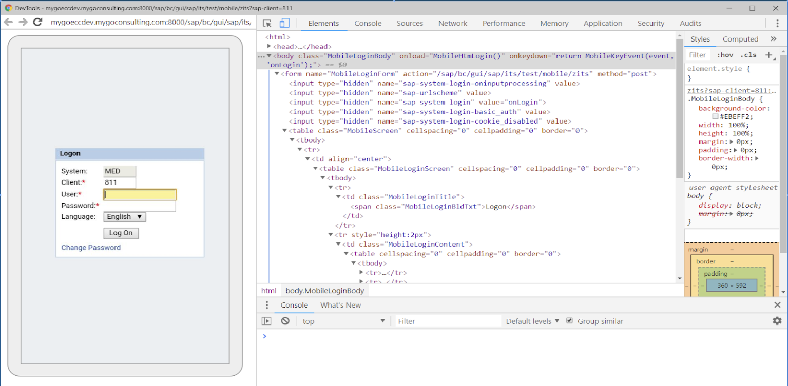

## Overview

Enterprise Browser 2.0 (and higher) supports the ability to process incoming voice commands and convert them to text.

EB is enabling voice by following the w3c voice APIs standard.
       Link: https://w3c.github.io/speech-api/speechapi.html                                        

EB 2.0 W3C speech APIs is being supported only using Google voice engine(GMS).
Google Speech  for Android  API specification can be found below

      TTS APIs: https://developer.android.com/reference/android/speech/tts/TextToSpeech
      ASR APIs: https://developer.android.com/reference/android/speech/SpeechRecognizer
      Speech link: https://developer.android.com/reference/android/speech/package-summary

Web standard speech APIs taken-care/ published by open source community - Speech API Community Group under the W3C Community Final Specification Agreement (FSA). 

      W3C APIs Public Link: https://w3c.github.io/speech-api/speechapi.html
               Community Link: https://www.w3.org/community/speech-api/
Introduced in 2012, are JavaScript APIs which allows web developers to provide speech input and text-to-speech output features in a web browser.

Widely used specification adopted by majority of web browsers.

Using a standard API set will future proof the customer investment as they will be able to switch to any platform/browser.

Enabling with DOM Injection

Simplified Dom injection (pageAction feature) is the way, introduced now in EB, which injects the Javascript code for a particular page depending on an unique string found in that page. So, if you want to use javascript page wise, this is going to help you a lot.

Steps to use this feature:
     1. Create two dependent files PageAction.xml and CustomScript.xml with below stub content.
     2. Find an unique string/text/label in the page which will not resemble to other string in other page.
     3. Now put this text as the value of `<pageIdentification value=“unique string” />` in PageAction.xml 
     4. Also put your custom action value in <Action value=“myScript1”/> .
     5. Now write down your Action value in CustomScript.xml as below mentioned.
     6. Push these files in EB installed directory i.e. (/Android/data/com.symbol.enterprisebrowser/) and you are done.

 

 

 

in case you can’t find any string unique in the page, you can inspect the page source to identify the same

Steps to Identify the unique string is:
     1. In config.xml please enable the debug mode by modifying <DebugModeEnable value="1"/>
     2. Make sure the device is connected in debugging mode.
     3. Open chrome and navigate to chrome://inspect
     4. Now you can see the complete web page source of that html and can identify the unique string in the page.

#### PageAction.xml

	:::xml
	<pageActionGroup>
	<pageAction1> 
	        <pageIdentification value=“Picking Details" />
	        <Action value="runscript-voiceScript" />
	 </pageAction2>
	</pageActionGroup>

#### CustomScript.xml

	:::xml
		<CustomScripts>
			<voiceScript>
		        document.getElementsById('inputId').addEventListener("focus", myFocusFunction, false);
		        function myFocusFunction(){
		               var utter = new SpeechSynthesisUtterance();
			 utter.text = ‘Say  Aisle Number';
		     	 utter.lang = 'en-US';
		     	 utter.rate = 1.0;
		               utter.onend = function(event) {
		                  SpeechRecognizer();
		      	};
		              speechSynthesis.speak(utter);        
		            }
		           function SpeechRecognizer(){
		              var recognition = new SpeechRecognition();
		              recognition.onresult = function(event) {
		              document.activeElement.value = event.results[0][0].transcript;
		               recognition.start();
		            }
		    </ voiceScript >
		</CustomScripts>

#### Config.xml

	:::xml
	<TTS>
	  <TTSEnabled value="1"/>
	</TTS>
	<ASR>
	  <ASREnabled value="1"/>
	</ASR>

