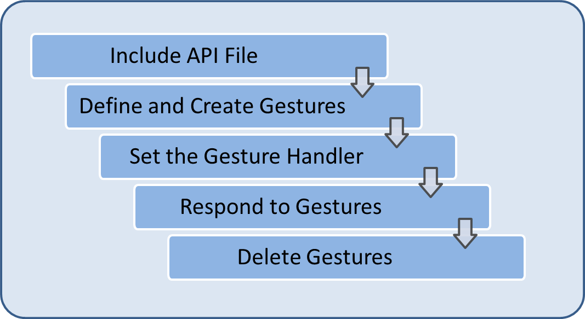
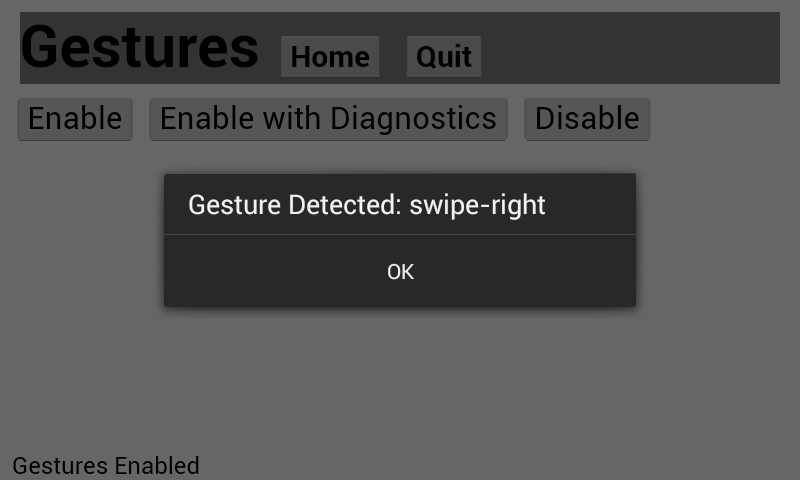
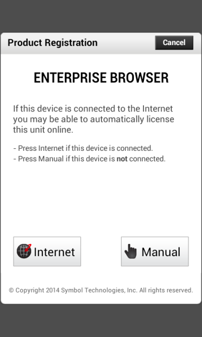
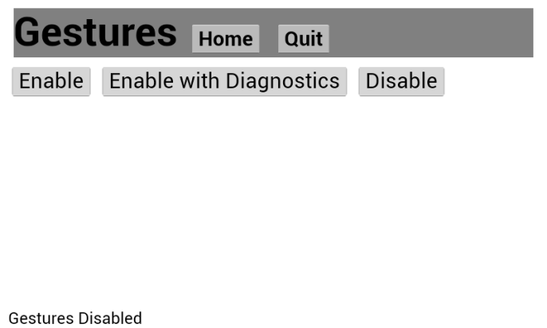
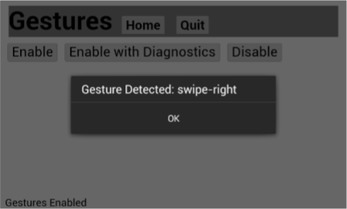
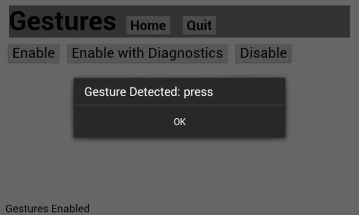
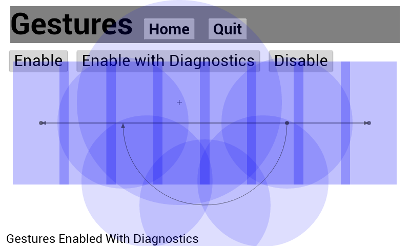
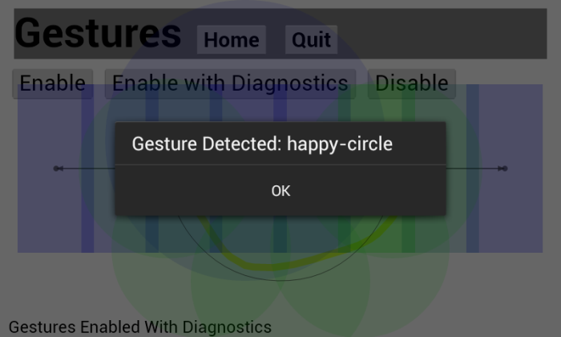

This tutorial covers the use of the Enterprise Browser Gesture API for recognizing touch screen gestures.

##Prerequisites

The following are required to complete this tutorial:

* A background in HTML, CSS and JavaScript coding
* Enterprise Browser installed on a development PC
* A Zebra mobile device and USB cable
* Enterprise Browser installed on the Zebra device

##Coding for the Gesture API
Enterprise Browser includes an API for recognizing touch screen gestures. The steps shown below are typical for code that uses this API. The following tutorial will walk through creating a working example application using these steps.

The resulting example application looks like this:

##Creating the App

The following HTML template will be used as a starting point for this tutorial. It includes the following features:

* Home button that returns the user to the Enterprise Browser start page 
* Quit button that exits Enterprise Browser
* Styling to size components in an appropriate manner for use on a device

HTML Starter Template:

    :::HTML
    <HTML>
        <HEAD>
            
            
        </HEAD>
        <BODY>
            <h1>Gestures
            <button onclick="window.location.href='./index.html'">Home</button>
            <button onclick="EB.Application.quit();">Quit</button>
            </h1>
            

            

            Gestures Disabled
         </BODY>
    
    </HTML>

###STEP 1: Create the application file

* **Create a directory** on your development machine for application files. 

* **Copy `ebapi-modules.js` from C:\EnterpriseBrowser\JavaScriptFiles\EnterpriseBrowser to your application directory**. The Quit button relies on code in this JavaScript file. 

* **Create a file named `gesture.html`** in your application directory and open it in a text editor. Make sure the file doesn't have an invisible '.txt' extension. 

* **Copy and paste the contents of the starter template above into the file** and save it.

###STEP 2: Add input field and control buttons
The Gesture app will have three buttons: one to enable gestures, a second to enable gestures with diagnostics and the third to disable gestures. We'll append these two lines of code in a later step. For now: 

* **Add three input buttons to the `controls div` section** of the `gesture.html` file you just created: 

Sample HTML:

    :::HTML
    <input type=button value="Enable" >
    <input type=button value="Enable with Diagnostics" >
    <input type=button value="Disable" >

###STEP 3: Include the API JavaScript file
* **Copy the `elements.js` file** from C:\EnterpriseBrowser\JavaScriptFiles\BackwardCompatibility to your application directory. The Gesture API requires this JavaScript file.  

To include this JavaScript file in your app, 

* **Add the following to `gesture.html`** as the first line in the HEAD section: 

Sample HTML:

    :::HTML
    

###STEP 4: Define and create gestures
* **Add the following method to the SCRIPT section** of `gesture html`:

Sample JavaScript:

    :::JavaScript
    function fnGestureEnable(diagsOn) {
        gesture.type = "linear";
        gesture.id = "swipe-right";
        gesture.diagnostics = diagsOn; 
        gesture.create();
                
        gesture.type = "linear";
        gesture.preset = "right-left";
        gesture.id = "swipe-left";
        gesture.diagnostics = diagsOn; 
        gesture.create();
        
        gesture.type = "hold";
        gesture.id = "press";
        gesture.centerX = 350;
        gesture.centerY = 200;
        gesture.radius = 200;
        gesture.delay = 500;
        gesture.interval = 0;
        gesture.diagnostics = diagsOn; 
        gesture.create();
        
        gesture.type = "circle";
        gesture.preset = "happy";
        gesture.id = "happy-circle";
        gesture.diagnostics = diagsOn; 
        gesture.create();
        
        gesture.detected = "fnGestureDetected(%json)";
        var diagsTag = (diagsOn)?"With Diagnostics":""
          document.getElementById("status").innerHTML = "Gestures Enabled " + diagsTag;
    }

Gestures are created by setting several attributes and then executing `gesture.create()`. Four gestures are created in the first four sections of the code. The diagnostics attribute being set for each gesture is used to turn on visual feedback for testing purposes. Toward the end on the line that starts "gesture.detected = ..." we assign a method to be called whenever a gesture is detected. The final two lines display a status message to let the user know that gestures have been enabled.

>NOTE: For more details about defining gestures, please refer to the [Enterprise Browser Gesture API documentation](../../api/Gesture). 

###STEP 5: Respond to gestures
The gesture handler in the previous method was set to `fnGestureDetected()`. 

* **Add the `fnGestureDetected()` method to the end of the SCRIPT section**.

Sample JavaScript:

    :::JavaScript
    function fnGestureDetected (jsGesture) { 
        alert ("Gesture Detected: " + jsGesture.id);
    }

Data is passed to the callback function in the form of a JSON object. The id of the gesture that was detected is one of the values passed. The code above posts an alert with the id of the detected gesture. In a production application, you might use the callback to initiate navigation. 

###STEP 6: Delete gestures
Next we'll add a means to delete any active gestures. 

* **Add the method `fnGestureDisable()`** to the end of the SCRIPT section:

Sample JavaScript:

    :::JavaScript
    function fnGestureDisable() {
        gesture.id = "swipe-right";  gesture.delete();
        gesture.id = "swipe-left";   gesture.delete();
        gesture.id = "press";        gesture.delete();
        gesture.id = "happy-circle"; gesture.delete();
        document.getElementById("status").innerHTML = "Gestures Disabled ";
    }

When this function is called, it sets and then deletes the current gesture once for each of the gestures that were previously created. The last line displays a text indicator to the user.

###STEP 7: Hook JavaScript methods to buttons 
Now that the JavaScript functions have been created, we can hook them to the control buttons. 

* **In `gesture.html`, append `onClick` handler code to the input button tags** we created earlier (or simply replace the buttons created earlier with the function-appended button code below): 

Sample JavaScript:

    :::JavaScript
    <input type=button value="Enable" onClick="fnGestureEnable(false);">
    <input type=button value="Enable with Diagnostics" onClick="fnGestureEnable(true);">
    <input type=button value="Disable" onClick="fnGestureDisable();">

###STEP 8: Copy files to the device

To test the application, you need to copy the application files to the device and set the StartPage setting in the Enterprise Browser `config.xml` file. Android- and Windows-based devices use different methods for transferring files. Please see the documentation for your device for specific instructions on copying files. 

In general, here's what is required:

1. **Create a directory on your device** for the Gesture application. Make sure the directory is in an unrestricted location to avoid any permissions issues when Enterprise Browser tries to open the files. We'll place our sample app's files in the device's root directory and show you how to modify the `config.xml` file accordingly. 
2. **Copy the `gesture.html` and any JavaScript API files** you have included to the directory you created on the device. 
3. **Copy the `config.xml` file to a suitable location on the development machine** from the Enterprise Browser install directory on the device and open it in a text editor. 
4. **Update the StartPage setting in `config.xml` to point to the location on the device** where you placed `gesture.html` and save the changes. 
5. **Copy the `config.xml` file back to its original location on the device**.    

Sample `config.xml` showing path to Android app in root directory: 

    :::HTML
        <General>
            <Name value="Gesture"/>
            <StartPage value="file:///gesture.html" name="Gesture"/>
            <UseRegularExpressions value="1"/>
        </General>

###STEP 9: Testing the App
* **Tap the Enterprise Browser icon** on the device. If the device is not yet licensed for Enterprise Browser you will see the following screen:

* **Click on the cancel button** in the upper right hand corner of the screen to dismiss the message and open the Gesture app. If you turn the device sideways it should look like this:

* **Click on the Enable button**. The status in the lower left hand corner changes to "Gestures Enabled". Now try swiping your finger from left to right across the middle of the screen. The callback function will be activated and you will see an alert dialog displaying the detected "swipe-right" gesture.

* **Click OK to dismiss** the alert. Then, **press and hold a point near the center of the screen**. The callback function will be activated and you will see an alert dialog displaying the detected "swipe-right" gesture.

* **Click the Disable button**. You will see the status text in the lower left hand corner change to "Gestures Disabled." 

* **Click the Enable with Diagnostics button**. The status will change and the screen will be overlaid with images that display the active gesture areas and paths.  

* **Try slowly tracing the semicircular path with your finger**. The Happy-Circle gesture should be detected.   

###Conclusion

This completes the Enterprise Browser Gesture API tutorial. For more information on the Gesture API, please refer to the [Enterprise Browser Gesture API documentation](../../api/Gesture).

