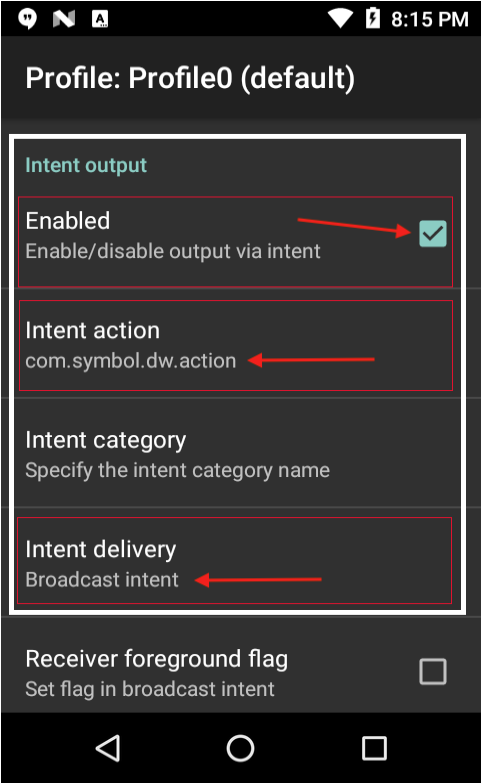
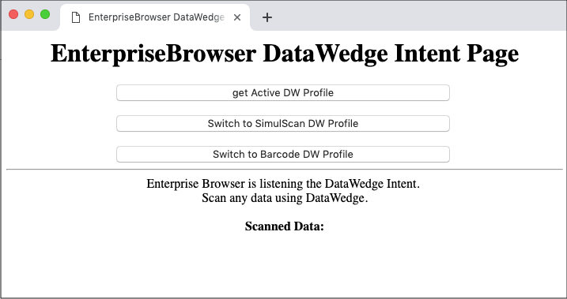

## Overview 

Apps running on Enterprise Browser 2.0 (and higher) can control DataWedge&ndash;Zebra's built-in scanning engine&ndash;using DataWedge intents. This makes it possible to adjust DataWedge settings from an EB app to adapt to changing data acquisition requirements without exiting the app. 

This guide illustrates the feature using a real-world example. It explains how to configure an EB app to scan and process barcode data, enter the captured data as keystrokes into any EB input field, and reconfigure DataWedge to switch the input type&nsdash; all using DataWedge intents from within the EB app. 

<!-- 
**Note: It's important to understand that <u>control of barcode scanning hardware is exclusive</u>. When DataWedge is active, Enterprise Browser <u>scanning APIs</u> are inoperable**. Likewise, an Enterprise Browser app that uses those APIs will prevent other apps (including DataWedge) from accessing the scanner(s). This guide explains how to take control of a device's scanner hardware and to subsequently release it to other apps when scanning is complete.  

-->

### Requirements

* Zebra device that supports EB and SimulScan
* Enterprise Browser 2.0 (or higher) installed on the device and on a Windows PC
* DataWedge 6.5 (or higher) on the device. [Which version is installed?](../../../../datawedge/latest/guide/about/#whichversionisinstalled)
* EB API module `ebapi-modules.js ` on the device. ([More about EB APIs](../apioverview)). 
* Knowledge of `Config.xml` file editing. ([About config-file editing](../ConfigEditor)).

-----

### Using DataWedge
DataWedge settings are stored in Profiles, each of which contains parameters for acquiring data (input), processing the acquired data, and sending it to an app (output). This example solution walks through the process of configuring EB to use DataWedge and to receive the data it acquires, to create two DataWedge Profiles on the device and to switch from one to the other from an EB app. One Profile is configured for **Barcode input**, the other for **SimulScan input**, and both are set to **output as an Intent Broadcast**. 

#### I. Enable DataWedge in EB

&#49;. **Confirm (or configure) the following** `Config.xml` **file settings**:   
* **Set a value of "1" in** `<usedwforscanning>` tag.
* **Set a value of "1" in** `<EnableReceiver>` tag.
* **Set a value of** "`com.symbol.dw.action`" **in a** `<IntentAction>` tag.
* **Set a value of** "`com.symbol.dwss.action`" **in another** `<IntentAction>` tag.
* **Set a value of** "`com.symbol.datawedge.api.RESULT_ACTION`" **in another** `<IntentAction>` tag.
* **Set a value of** "`android.intent.category.DEFAULT`" **in the** `<IntentCategory>` tag.
* **Set a value of** "`file://%INSTALLDIR%/DataWedgeIntent.html`" in `<StartPage>` tag.

The settings described above are shown in context of a `Config.xml` file below. Settings in the IntentReceiver section allow EB app to retrieve scanned data through a JavaScript callback.

		:::xml
		<Applications>
			<Application>
			...
				<usedwforscanning  value=”1” />
			...
				<IntentReceiver>
					...
        			<EnableReceiver  value="1"/>
        			<IntentAction  value="com.symbol.dw.action"/>
        			<IntentAction  value="com.symbol.dwss.action"/>
					<IntentAction  value="com.symbol.datawedge.api.RESULT_ACTION"/>
       				<IntentCategory  value="android.intent.category.DEFAULT"/>
        			...
        		<General>
        			<Name value="Menu"/>
        			<StartPage value="file://%INSTALLDIR%/DataWedgeIntent.html" name="Menu"/> 
        	...
 

#### II. Configure DataWedge

&#50;. **In DataWedge** on the device, **select Profiles -> Profile0 (default)** and:
* **Confirm that "Profile 0" is enabled**.
* **Confirm that Barcode Input is enabled**.

&#51;. **Scroll down to the Intent Output** section and set the following: 
* **Confirm that Intent Output is Enabled**.
* **Tap Intent action** and enter `com.symbol.dw.action` and **Tap OK**.
* **Tap Intent delivery** and select (or confirm) “Broadcast Intent” and **Tap OK**.

Settings should appear as in the image below: 

_Profile0 settings for using DataWedge from EB apps_.

#### III. Deploy JavaScript

&#52;. Create or modify a web page to include JavaScript logic like the example below, which sends a [DataWedge intent](/techdocs.zebra.com/datawedge/latest/guide/api/) using the [EB Intent API](../../api/intent) to switch to the DataWedge “barcode” Profile:

		var params = {
			intentType: EB.Intent.BROADCAST,
			action: 'com.symbol.datawedge.api.ACTION',
			appName: 'com.symbol.datawedge',
			data: {"com.symbol.datawedge.api.SWITCH_TO_PROFILE":"barcode"}
		EB.Intent.send(params);

`IMPORTANT:` The name of the file containing the JavaScript must match the file the specified in the `<StartPage>` tag referenced in Step 1. 

&#53;. Copy the modified `Config.xml` and `.HTML` files to the EB install directory on the device: 
* `/Android/data/com.symbol.enterprisebrowser`

&#54;. If not already present, also copy the `ebapi-modules.js` EB API module to the same location as the `.HTML` file. 

_Sample `.HTML` page easily switches between DataWedge Profiles_.

#### Sample files
`dw_profilebarcode.db` - Barcode Profile for import to DataWedge (do not edit manually) 
`dw_profilesimulscan.db` - SimulScan Profile for import to DataWedge (do not edit manually)
`Config.xml` - Sample EB configuration file can be edited or copied as needed  
`DataWedgeIntent.html` - Sample EB start page

[Download the sample files (.zip)](EB_SwitchDWProfile.zip)
[Importing a DataWedge Profile](/datawedge/latest/guide/settings/#importaprofile)

##### The EB app can now send DataWedge intents. 

<!--  WE'LL PROBABLY TAKE ALL THIS OUT: 
### DW 6.0.1 - 6.4
**Important**: Some versions of DataWedge 6.x automatically disable Enterprise Browser after every device reboot by adding it to the "Disabled apps list." If `com.symbol.enterprisebrowser` reappears in the Disabled apps list after reboot, it must be manually removed before EB can use DataWedge for scanning. The only alternative is to upgrade DataWedge, which for Android requires a new BSP (OS image). Such updates should be attempted only with the guidance of [Zebra Support](https://www.zebra.com/us/en/about-zebra/contact-zebra/contact-tech-support.html).  

#### Use DataWedge for Scanning

**To enable an EB app to scan with DataWedge 6.0.1 and higher**: 

&#49;. Confirm that no association with `com.symbol.enterprisebrowser` exists in the "Disabled app list" in the DataWedge Settings panel:
  * In **DataWedge**, select **Menu->Settings->Disabled app list**. The list of disabled apps appears.

  * **Remove** `com.symbol.enterprisebrowser` **from the list**, if present (see note, above). 

&#50;. In the EB app's `config.xml` file, set a value of "1" in the [&lt;usedwforscanning&gt;](../configreference/#usedwforscanning) tag.

#### Use Enterprise Browser APIs for Scanning

**To use a device scanner through an Enterprise Browser API**:

  * Set the value in the [&lt;usedwforscanning&gt;](../configreference/#usedwforscanning) tag of the EB app's `config.xml` file to "0"

-----

##### Option 1: Disable DataWedge on the device

1. **Start DataWedge** on the device.
2. In DataWedge, select **Menu->Settings**.
3. **Uncheck the "DataWedge enabled"** checkbox.
4. In the EB app's `config.xml` file, set a value of "0" in the [&lt;usedwforscanning&gt;](../configreference/#usedwforscanning) tag.

DataWedge is now disabled and unavailable to any app on the device.  

**Note: DataWedge also can be disabled (or re-enabled) programmatically using [DataWedge APIs](../../../../datawedge)**.

##### Option 2: Disable DataWedge only for Enterprise Browser

**To create and disable an Enterprise Browser Profile in DataWedge**: 

1. **Install the Enterprise Browser app** that will use DataWedge.
2. **Start DataWedge**.
3. In DataWedge, select **Menu->New Profile**, **Enter a Profile name** and tap **OK**. The list of Profiles appears.
4. Tap on the newly created profile.
5. In the **Applications section**, **tap Associated apps**.
6. Tap **Menu->New app/activity**. A list of apps/activities appears. 
7. From the list, **select the package name of the EB app** (i.e. `com.symbol.enterprisebrowser`) that will use DataWedge. The app activities list appears. 
8. From the app activities list, **tap the asterisk (*) to associate all app activities** with the Profile, or tap on an indvidual activity to use DataWedge only for that specific activity. 
9. **Tap BACK** to return to the Profile screen.
10. Confirm that the Profile's **"Profile enabled" box is <u>checked</u>**.
11. In the new Profile, **<u>uncheck</u> the "Enabled" box** for these three sections: **Barcode input, Keystroke output and Intent output**.
12. In the EB app's `config.xml` file, set a value of "0" in the [&lt;usedwforscanning&gt;](../configreference/#usedwforscanning) tag.

DataWedge will now be disabled whenever an Enterprise Browser app is running. 
 -->
-----

Related guides: 

* [DataWedge User Guide](../../../../datawedge)
* [Enterprise Browser APIs](../../api)
* [API Compatibility Matrix](../compatibility)
