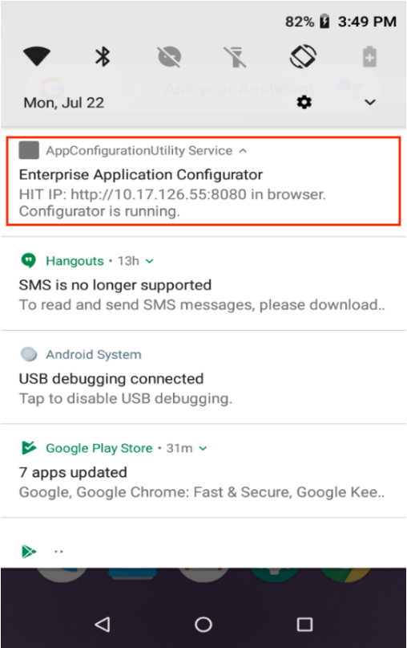
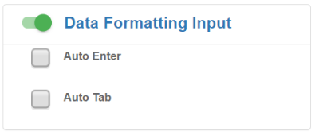

## Overview

Enterprise Application Configurator (EAC) is a companion utility for Enterprise Browser that simplifies [DOM injection](../dominjectionandroid), which can add capabilities to a running EB app without changing the source code. This tool can map EB fields or buttons to Zebra devices such as scanners, printers and keyboards and or can voice-enable fields for spoken input and/or output. 

EAC is a browser-based solution that presents an easy-to-use GUI for creating DIM injection configuration files and does not require changes to the EB app's source code or access to a target’s application server. EAC is designed to help companies that use SAP ITSmobile and similar solutions easily modify legacy apps. 

### Requirements

* Computer running Windows 8 or Windows 10 with Google Chrome installed
* Zebra device that supports Enterprise Browser 
**See [Zebra Support Portal EB page](https://www.zebra.com/us/en/support-downloads/software/developer-tools/enterprise-browser.html)** for supported devices
* EB 2.6 (or later) installed on device
* Computer and device on the same IP subnet
* `AppConfigurationUtility.apk` screen streaming service `([download]()) LINK TO COME `

> **NOTE: EAC does not support apps that employ shortcuts or [multi-session tabs](../multisession)**.  

---

## Step 1 - Install and Set up

#### To set up Enterprise Application Configurator: 

1. Push the `AppConfigurationUtility.apk` file to the device, **launch and tap "START NOW"** to grant permission to capture the screen. 
2. **Add the node below code to the target EB app's** `Config.xml` **file** just _<u>before</u>_ the &lt;Applications&gt; node: 

		:::xml
		<DOMInjectionUtility>				     
			<appConfigEnabled value="1"/>
		</DOMInjectionUtility>

		<Applications>
			<Application>
			...

3. **Push the modified** `Config.xml` **file to the device** in the following location: 
  `/sdcard/Android/data/com.symbol.enterprisebrowser/`  
4. **Launch Enterprise Browser** on the device. 
5. **Pull down the Notification bar on the device** to obtain the IP address for the screen stream: 
 
 _Click image to enlarge; ESC to exit_.
  
6. **In Chrome on the Windows computer, enter the IP address and port number** obtained in Step 5 into a new browser window. 
 **NOTE: Supports only Google Chrome** running on Windows 8 or 10.  
 After a moment, a splash page appears with a section similar to the image below. **Enter the EB app type**:   
 
 _Click image to enlarge; ESC to exit_.
  
7. After a moment, the browser window displays the EB app and configuration options similar to the image below: 
 
 _Click image to enlarge; ESC to exit_.
  

#### The tool is now ready to accept field mappings for the EB app.  

>**IMPORTANT**: The `AppConfigurationUtility.apk` app must be uninstalled to run EB apps in a production environment on that device. 

-----

## Step 2 - Map App to Functions 

DOM injection works by inserting CSS, JavaScript and/or meta tags into a running app, enhancing the app with the functionality contained within the inserted code. EAC converts the field and/or key mappings made through its GUI into the necessary CSS, JavaScript and/or meta tags to be inserted, saving that code in a file. Once that file is pushed to the target device, the desired functionality is available next time the app is launched. 

EAC is ready to use when its two-panel display appears in the workstation's browser similar to the image below. The process begins by clicking on a field in the left-hand app window and assigning it an input or output function on the right. Selections are saved automatically. Clicking the "DOWNLOAD" stores all settings into the file for deployment to the device(s). 

_Click image to enlarge; ESC to exit_.
 

#### To use Enterprise Application Configurator: 

1. In the EB application window, **click on a field or button to be modified**. 
 Input and output options are now available to be selected.  
2. **Select the desired input, output or processing function(s)** to assign to the selected app element. 
 Selections are saved automatically. 
3. **Repeat Steps 1 and 2 until all elements are "trained"** as desired. 
4. **Click the "DOWNLOAD" button** to save the settings to a deployment file called `appconfiguration.txt`. 
 `IMPORTANT:` DO NOT RENAME THIS FILE. 
5. **Push the file to the following location** <u>on a different device</u>: 
 `/sdcard/Android/data/com.symbol.enterprisebrowser/`
6. **Add the code below to the target EB app's** `Config.xml` **file** just _<u>before</u>_ the &lt;Applications&gt; node: 

		:::xml
		<DOMInjectionUtility>				     
			<appConfigEnabled value="2"/> 
		</DOMInjectionUtility>

		<Applications>
			<Application>
			...
7. Test the app and its new functions. 
8. Repeat Steps 1&ndash;7 until the app performs as desired. 

>**IMPORTANT**: The `AppConfigurationUtility.apk` app must be uninstalled to run EB apps in a production environment on that device. 

#### The app and DOM injection enhancements file are now ready for deployment.  

-----

## Step 3 - Set Inputs and Outputs

### Scanner Input

**Mapping a scanner to a field** causes the scanner to become active whenever that field is in focus. Select at least one decoder type; data acquired by the scanner is populated into that field. EAC currently supports the camera scanner and 2D barcode imager with basic configurations and a short list of popular decoder types. **Optionally, use [Data Formatting Input](#dataformatting) to append ENTER or TAB characters** to automatically advance the cursor after the field is populated with acquired data.

#### Supported Parameters: 

**All Decoder -** **activates [all decoders](https://techdocs.zebra.com/datawedge/latest/guide/input/barcode/#decoderselection) supported by the device**; not limited to those listed in the tool. 

**[Decoders] -** activates one or more individual decoders as required for scanning by the app. **<u>At least one decoder must be selected to enable scanning</u>**. 

> **`WARNING:` For optimal scanning performance, Zebra recommends selecting only those decoders required by the app**. 

_Click image to enlarge; ESC to exit_.
 

#### Required setting:

Using a scanner requires the [&lt;usedwforscanning&gt; tag](../configreference/#usedwforscanning) in the EB app's `Config.xml` file to be configured as follows: 

	:::xml
	<usedwforscanning value="0"/>

### Voice Input

**When mapping voice input to a field**, the app listens for spoken input when the field gains focus, converts the spoken input to text, and populates the field with the text. **Optionally, use [Data Formatting Input](#dataformatting) to append ENTER or TAB characters** to automatically advance the cursor after the field is populated with acquired data. 

#### Supported Parameters: 

**Continuous mode -** causes the speech engine to continue gathering spoken input after the device user has momentarily stopped speaking. 

**Language -** sets the language for text-to-speech input and synthesized output. If no language is specified, the TTS engine attempts to match the language to the Locale currently selected in the device. This field accepts any of the predefined [Locale codes](https://techdocs.zebra.com/mx/uimgr/#set-current-locale).  

<!-- HUH? question sent. 
**Note**: Mapping any feature to input field will only work if input type =”text”, “password” .

It will not work for `<textarea />` (whatever that is)
 -->

_Click image to enlarge; ESC to exit_.
 

#### Required setting:

Using voice input requires the [&lt;asrenabled&gt; tag](../configreference/#asrenabled) in the EB app's `Config.xml` file to be configured as follows: 

	:::xml
	<asrenabled value="1"/>

### Keyboard Input
**Mapping a keyboard to a field** invokes that keyboard when the field gains focus. Mappings can be for any keyboard, numerical or emoji keypad or layout available on the device, including custom key layouts created with Zebra's [Enterprise Keyboard Designer](/ekd) tool. The function also can be configured to cause a keyboard to be hidden (disabled), if desired. 

_Click image to enlarge; ESC to exit_.
 

#### Required setting:

Use of the keyboard input setting requires the following: 

* Zebra Enterprise Keyboard must be present on the device and set as the default input device
* A `Layouts.zip` file must be in the `/enterprise/device/settings/ekb/config/` folder on the device

-----

### Voice Output 

**Mapping voice output to a field** causes data in that field to be spoken aloud by the device.  

#### Supported Parameters: 

**Voice text -** words input into this field are spoken to the device user when the field receives focus. For example, if a field were mapped to the scanner for input and to voice output, this prompt might read "This field speaks aloud any data acquired by the scanner." 

**Pitch -** sets the pitch for text-to-speech output in a scalar range with a starting (default) value of 1.0 (normal pitch). Greater values increase the pitch of the synthesized voice, lesser values decrease it. **Float values only**.

**Volume -** sets the volume level for text-to-speech output in a scalar range between 0.0 (off) and 1.0 (full). **Float values only**.

**Rate -** sets the speed for synthesized speech output in a scalar range with a starting (default) value of 1.0 (normal speech rate). A value of 2.0 doubles speed, a value of 0.5 cuts the speed in half. **Float values only**.

**Language -** sets the language for text-to-speech input and synthesized output. If no language is specified, the TTS engine attempts to match the language to the Locale currently selected in the device. This field accepts any of the predefined [locale codes](https://techdocs.zebra.com/mx/uimgr/#set-current-locale). 

_Click image to enlarge; ESC to exit_.
 

#### Required setting:

Use of voice output requires the [&lt;ttsenabled&gt; tag](../configreference/#ttsenabled) in the EB app's `Config.xml` file to be configured as follows: 

	:::xml
	<ttsenabled value="1"/>

### Data Formatting

This parameter allows special characters to be appended to acquired data, generally used for advancing the cursor or submitting data for further processing. For example, selecting "Auto Tab" causes the cursor to move to the next field after acquired data is populated into the current field. 

**Auto Enter -** inserts the ENTER character at the end of acquired data. 

**Auto Tab -** inserts the TAB character at the end of acquired data. 

**`NOTE:` This feature can be selected only when the field is mapped to Scanner Input or Voice Input**.

_Click image to enlarge; ESC to exit_.
 

-----

### Printer Output                      
**Zebra recommends mapping printers only to buttons**. Printer mapping supports printers connected through Bluetooth (via Bluetooth MAC address), Wi-Fi (via IP address) and USB. Regardless of connection method, the printer MUST be connected to the device <u>***before***</u> a printer-mapped button is tapped by the device user. 

_Click image to enlarge; ESC to exit_.
 

## uNdEr ConTRuCtion

IP address must be fed, in case of wifi printer. Then we can send a script variable in 3rd field. Script should be well formed and contains only single quotes(‘) as below.
***Note:  In order to select any button (and prevent the actual work of the button) to map printer, we need to double tap it***.

      '^XA^FO20,20^AD^FD'+document.getElementById('yourId').value+'^XZ'

***Note: Make sure you are not using any double- inverted commas(“) in the tool. For example your id must be with single inverted comma as shown above.
We can observe that, script is a ZPL script (we can form our own. Above snippet is just an example). We can see that middle part of the script is a dynamically getting value from a text area. So, this should be handled as per requirement***.

Note: If button is performing any other task, then while training we need to double click it to prevent its original action, so that we will be able to map printer functionalities on them.

If button is navigating current page to some other page on its click, then in production environment the behavior of this functionality is unknown. Hence, we should prefer using buttons that does not navigates or changes its web page.

-----

So, to use this tool, we need to understand two major things

* For any EB app running on browser, either the
 * The URL is unique (e.g. https://abc.com/contacts) or 
 * URL is not unique but just session ids are getting appended on URLs (e.g. sap URLs).

If URL is unique, we need to select the No training on the tool.

If URL is not unique, we need to Yes(refer image on previous page)

Steps to run the tool:

1.	Run the EnterpriseBrowser on the device and make sure inside Config.xml below code is enabled. If value is other than 1, it will not work.

		:::xml
		<appConfigEnabled value=”1”/>

2.	Select appropriate configuration  type in the desktop tool.
3.	Now you can see the live screen of the tool. Interaction will also be enabled now on the device screen area. But still it will not enable the configurations section on the right.
4.	Next step is to focus on any input field or button , and now it will enable the tool to map that field with zebra capabilities.
5.	Keep on mapping the field as per need and , when done, you can download the configuration file.(appconfiguration.txt) 

## Other Settings

Indicator configuration:

	While using this tool, with configuration <appConfigEnabled value="1"/>, an indicator is shown on the screen in EnterpriseBrowser(Refer above pictures and observe left-top side of the phone screen in the tool). This is just and indicator to show, whether we are in training mode or not.
	      This image can be further configured, like setting its left, top, height and width. We can even change image shown for this indicator.

	As given in below snippet, indicator’s tag must be used with <appConfigEnabled value=”1”/> tag.  If we set appConfigEnabled tag’s value “2”, then EB will run on production mode and, indicator will not be shown irrespective of any values/configuration.

	If <indicatorEnabled> – value=”1”: indicator will be shown
	                                     value=”2”: indicator will not be shown

	If <indicatorLeft> – value=”20”: indicator’s left coordinate will be set to given value (in px) 
	                                     value=””: indicator’s left coordinate will be set to default

	If <indicatorTop> – value=”20”:  indicator’s top coordinate will be set to given value (in px)
	                                     value=””: indicator’s top coordinate will be set to default

	If <indicatorHeight> – value=”50”: indicator’s height will be set to given value (in px)
	                                     value=””: indicator’s height will be set to default

	If <indicatorWidth> – value=”50”: indicator’s width will be set to given value (in px)
	                                     value=””: indicator’s width will be set to default

	 If <indicatorImage> – value=” %PATH%”: indicator’s image will be set from given path 
                                     value=””: indicator’s image will be set to default

    :::xml
	 <DOMInjectionUtility>
	   	<appConfigEnabled value="1"/>
			<indicatorEnabled value="1"/>
			<indicatorLeft value="300"/>
			<indicatorTop value="200"/>
			<indicatorHeight value="60"/>
			<indicatorWidth value="90"/>
	<indicatorImage value="file://%INSTALLDIR%/myimage.png"/>
	 </DOMInjectionUtility> 

-----

## TROUBLESHOOTING

-----
***Note: Before using printer functionality in production, you must pair the printer with device first else, you may see continuous hourglass on the screen***.

-----

_Click image to enlarge; ESC to exit_.
 

If value is other than 1, it will not work.

	<appConfigEnabled value=”1”/>

-----

Important points to Note for the tool uses:

1.	If Printer is mapped to any input field make sure to connect Bluetooth printer on advance to make it work in production.
2.	Make sure that in EnterpriseBrowser’s Config.xml file below tag is enabled:
                          <JSLibraries value="1"/>
3.	for text area we are not support the tool
4.	device screen should change as per device orientation
5.	Downloaded file (.txt file) name should be renamed as "appconfiguration.txt"
6.	“importing feature” is not there. suppose user set some configurations in on field then set some other configurations in other field again if user wants to change previous changes it won't be there.

Note: If any custom layout which is mapped to input field is visible due to being focused, and Enterprisebrowser is sent to background. Later if EB is taken in foreground from recent app or from launcher. In this case, default layout will be visible. From second click onwards, mapping will work as it is.

