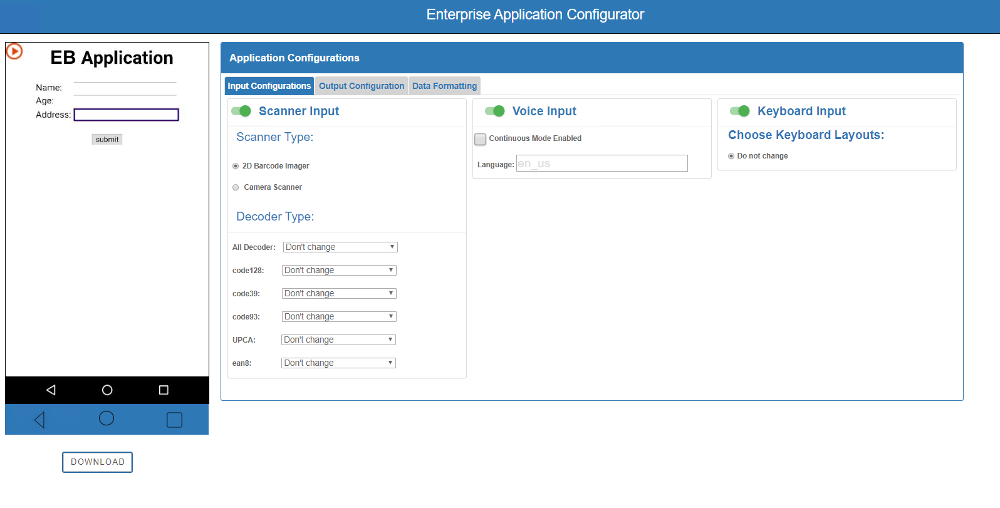
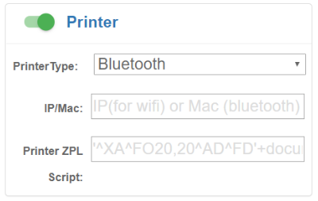

## Overview

### `SHORTEN:` 
Enterprise Application Configurator (EAC) is a companion utility for Enterprise Browser that simplifies the mapping of EB input fields or buttons with Zebra device hardware and value-adds such as scanners, printers, keyboards and voice I/O) through DOM injection. This Windows-based solution implements an easy-to-use GUI and does not require changes to EB application source code or access to a target’s application server. EAC is designed to help companies that use SAP ITS Mobile and similar solutions that limit access to server-side applications. 

EAC runs within Google Chrome on the device (hosted by the `AppConfigurationUtility.apk`) and works in conjunction with the Windows desktop tool to modify EB apps at runtime. Once desired mappings are created and tested, EAC outputs the required config files for deployment to devices, where Enterprise Browser consumes the files and immediately enables the mapped functionalities.

Enterprise Application Configurator supports input from scanner, keyboard and voice, and outputs to voice or printer with custom data formatting capabilities. Requires EB 2.6 or later. 

OLD OLD OLD (use some, add links for others)
Apps running on Enterprise Browser 1.3 and higher support DOM injection, which inserts CSS, JavaScript and/or meta tags into a running app without modifying the underlying app. This permits features, capabilities and even the look and feel of part or all of any app to be modified or customized at runtime **<u>without changing the original source code</u>**. 

This can be useful, for example, to inject EB JavaScript libraries or other business logic into an SAP ITSmobile or other app for which there's no way to edit the source. DOM injection occurs after the page is completely loaded, ensuring that page modifications are applied only after [the DOM](../../../1-8/guide/dominjection/#whatisthedom) is ready for them.

Enabled by default, DOM injection is **activated by the [&lt;CustomDOMElements&gt; tag](../configreference/#dominjection)** of the app's `Config.xml` file. No special licensing is required. 

### Requirements

* Computer running Windows 8 or Windows 10
* Zebra device that supports Enterprise Browser 
**<u>See [Zebra Support Portal EB page](https://www.zebra.com/us/en/support-downloads/software/developer-tools/enterprise-browser.html)</u>** for supported devices.
* EB 2.6 (or later) installed on device
* Computer and device on the same IP subnet

### Installation

1.	AppConfigurationUtility.apk: This a screen streaming utility Service APK. First, we need to install it one the device. It handles all screen mirroring operation on desktop-web browser.
2.	EnterpriseBrowser.apk: This APK supplements the above one. So, we need to install this also. Once installed EnterpriseBrowser.apk, we need to add below code in config.xml (located at /sdcard/Android/data/com.symbol.enterprisebrowser/) and relaunch. 

		:::xml
		<DOMInjectionUtility>				     
			<appConfigEnabled value="1"/>
		</DOMInjectionUtility>
[screenshot]

3.	Once both APKs are installed. Launch AppConfigurationUtility app  and allow the  screen Stream permission. Upon re-launch you will get the IP-address on notification bar. 
4.	Now you need to hit the same IP on the desktop browser (NOTE: make sure device and desktop are connected with the same Wi-Fi network and EnterpriseBrowser application is in running mode). 
***Note: Only Google Chrome browser is supported***.
5.	Once everything above is done correctly you will be able to see below screen on your web browser upon hitting the mention IP with port number
6.	Now you are ready to map zebra values adds by using this tool.
7.	Select one of the options from the radio box (details are in next page) and start the training.
8.	Later you can download the configuration file, after you are done with training.
9.	This configuration file can be pushed on number of devices at the below location to be consumed it by EnterpriseBrowser. (/sdcard/Android/data/com.symbol.enterprisebrowser/).

***Note: This file should not be renamed. It should be exactly `appconfiguration.txt`***.

10.	In order to take this training effect, we need to push below modified tag (value=”2” means production) in config.xml (`<appConfigEnabled value=”2”/>`) and relaunch EnterpriseBrowser application.

Note: `AppconfigurationUtility.apk` must be installed only on device, we are going to use for      training. Once training is completed and configuration file is generated. This must be uninstalled.

`Add link to dom page`. 

To use DOM injection, **ALL of the following must be true**:

* The app being injected is running on Enterprise Browser 1.3 (or higher).
* A `tags` file containing elements to be injected has been created and pushed to the target device.
* The path to the `tags` file is specified in the app's `Config.xml` file (see [Step 2](#step2updateconfigxml)).
* The target device is running Android with the stock WebKit. 

### Supports injection of:

* JavaScript or CSS files stored locally on the device
* JavaScript or CSS files stored on a server 
* Meta tags described in the `tags` file (stored on the device)
* Local files specified using absolute paths or [EB substitution variables](../configreference/#substitutionvariables) (i.e. `%INSTALLDIR%`)

### Supported injection conditions:

* Injects into all navigated pages (using wildcard character)
* Injects into all pages that contain a unique string or HTML element (using `pagecontent` attribute)
* Injects only into specified pages (by URL; server-based pages only)

> **Zebra recommends using substitution variables rather than absolute paths whenever possible**.

-----

DO WE NEED A STEP-BY-STEP? not sure

list from input doc:

### Using the Tool

The basic work of this tool is, to enable zebra values adds like, scanner, printer, voice-input or voice-outputs in a webpage without doing the server-side modification in the page. This tool provides an interactive webpage to add those functionalities on any field on the page.

As we want to achieve this without doing any modification to server-side. We will train elements of the pages using this tool. 

So, to use this tool, we need to understand two major things
●	For any webpage running on browser, either the 
•	URL is unique (e.g. https://abc.com/contacts) or 
•	URL is not unique but just session ids are getting appended on URLs (e.g. sap URLs).
●	So, If URL is unique, we need to select the No training on the tool.
●	If URL is not unique, we need to Yes(refer image on previous page)

_Click image to enlarge; ESC to exit_.
 

_Click image to enlarge; ESC to exit_.
 

_Click image to enlarge; ESC to exit_.
 

_Click image to enlarge; ESC to exit_.
 

_Click image to enlarge; ESC to exit_.
 

_Click image to enlarge; ESC to exit_.
 

_Click image to enlarge; ESC to exit_.
 

_Click image to enlarge; ESC to exit_.
 
