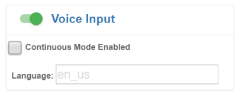
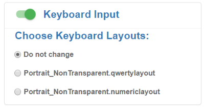

## Overview

**Enterprise Application Configurator (EAC) is a companion utility for Enterprise Browser** that simplifies [DOM injection](../dominjectionandroid), a process that can add capabilities to a running EB app without changing the source code. EAC maps EB fields or buttons to Zebra devices such as scanners, printers and keyboards and can voice-enable fields for spoken input and/or output. 

**DOM injection works by inserting CSS, JavaScript and/or meta tags into a running app**, enhancing the app with the functionality contained within the inserted code. EAC converts the field and/or key mappings made through its GUI into the necessary CSS, JavaScript and/or meta tags to be inserted, saving that code in a file. Once that file is pushed to the target device, the desired functionality is available next time the app is launched. 

**This tool is a browser-based solution** with a point-and-click interface that creates DOM injection configuration files that are ready for deployment. It is designed to help companies that use SAP ITSmobile and similar solutions to easily modify legacy apps without requiring special skills. 

**NOTE: This guide assumes a working knowledge of Enterprise Browser and the process of editing and deploying its** `Config.xml` **files**. 

### Requirements

* **Computer running Windows** 8 or Windows 10 with Google Chrome
* **Zebra device that supports Enterprise Browser** See [supported device list](https://www.zebra.com/us/en/support-downloads/software/developer-tools/enterprise-browser.html)
* **EB 2.6 (or later)** installed on a device
* **Optional: A second Zebra device with EB 2.6 installed** (for easier testing of reconfigured apps)
* **Computer and device(s) on the same IP subnet**
* **App to be reconfigured** (and its `Config.xml` file), installed on device(s)
* `AppConfigurationUtility.apk` device mirroring service ([Download it now](here)) `LINK TO COME`

> **NOTE: This tool does not support apps that employ shortcuts or [multi-session tabs](../multisession)**.

---

## Part 1 - Install and Set up

#### To set up Enterprise Application Configurator: 

1. **Add the first three code lines below to the target EB app's** `Config.xml` **file**, just _<u>before</u>_ the &lt;Applications&gt; node (as shown): 

		:::xml
		<DOMInjectionUtility>				     
			<appConfigEnabled value="1"/>
		</DOMInjectionUtility>

		<Applications>
			<Application>
			...

2. **Push the modified** `Config.xml` **file to the device** in the following location: 
  `/sdcard/Android/data/com.symbol.enterprisebrowser/`  
3. Push the `AppConfigurationUtility.apk` file to the device and launch it. 
 When prompted, **tap "START NOW"** to grant permission to capture the screen. 
4. **Pull down the Notification bar on the device** and note the IP address used by Enterprise Application Configurator: 
 
 _Click image to enlarge; ESC to exit_.
  
5. **Launch Enterprise Browser** on the device. 
6. **In Chrome on the Windows computer, enter the IP address and port number** obtained in Step 4 into a new browser window or tab. 
 **NOTE: This tool <u>supports only Google Chrome</u>** running on Windows 8 or 10.  
 After a moment, a splash page appears with a section similar to the image below.  
 **Enter the EB app type**:  
 
 _Click image to enlarge; ESC to exit_.
  
7. After a moment, the browser window displays the EB app and configuration options similar to the image below: 
 
 _Click image to enlarge; ESC to exit_.
  

#### The tool is now ready to accept field mappings for the EB app.  

>**IMPORTANT**: The `AppConfigurationUtility.apk` app must be uninstalled to run EB apps in a production environment on that device. 

-----

## Part 2 - Map App to Functions 

**EAC is ready to use when its two-panel display appears** in the workstation's browser similar to the image below. If the Windows machine isn't displaying a screen similar to that seen below, please repeat the procedures in [Part 1](#part1installandsetup), above. 

> **NOTE**: EAC input fields support all [HTML Input Tags](https://www.w3schools.com/tags/tag_input.asp) ***EXCEPT*** the &lt;textarea&gt; tag.

**The process begins by clicking on a field in the left-hand app window** and assigning it an input and/or output function on the right. Selections are saved automatically. Clicking the "DOWNLOAD" stores all settings into the file for deployment to the device(s). 

_Click image to enlarge; ESC to exit_.
 

#### To use Enterprise Application Configurator: 

1. In the EB application window, **click on a field or button to be modified**. 
 Input and output options are now available to be selected.
2. **Select the desired input, output or processing function(s)** to assign to the selected app element. 
 Selections are saved automatically. 
3. **Repeat Steps 1 and 2 until all elements are "trained"** as desired.  
 **See [Part 3](#part3setinputsandoutputs)** for configurable parameter details. 
4. **Click the "DOWNLOAD" button** to save the settings to a deployment file called `appconfiguration.txt`. 
 `IMPORTANT:` DO NOT RENAME THIS FILE. 
5. **Push the file to the following location** <u>on a different device</u>: 
 `/sdcard/Android/data/com.symbol.enterprisebrowser/`
6.  **Add the first three code lines below to the target EB app's** `Config.xml` **file**, just _<u>before</u>_ the &lt;Applications&gt; node (as shown): 

		:::xml
		<DOMInjectionUtility>				     
			<appConfigEnabled value="2"/> 
		</DOMInjectionUtility>

		<Applications>
			<Application>
			...
7. Test the app and its new functions. 
8. Repeat Steps 1&ndash;7 until the app performs as desired. 

>**IMPORTANT**: The `AppConfigurationUtility.apk` app must be uninstalled to run EB apps in a production environment on that device. 

#### The DOM injection configuration file is now ready for deployment.  

> `WARNING:` The DOM injection configuration file created by EAC is named `appconfiguration.txt`. **The name of this file must not be changed.** 

-----

## Part 3 - Set Inputs and Outputs

**Note**: As in Enterprise Browser, EAC input fields support all [HTML &lt;input&gt; Tags](https://www.w3schools.com/tags/tag_input.asp) ***EXCEPT*** the &lt;textarea&gt; tag. 

### Scanner Input

**Mapping a scanner to a field** causes the scanner to become active whenever that field is in focus, and data acquired by the scanner is populated into that field. At least one decoder type must be selected. **EAC currently supports the camera scanner and 2D barcode imager** with basic configurations and a short list of popular decoder types. **Optionally, [Data Formatting Input](#dataformatting) also can be used to append the acquired data with ENTER or TAB characters** to automatically execute the action after the field is populated. 

#### Parameters: 

**All Decoder -** **activates [all decoders](https://techdocs.zebra.com/datawedge/latest/guide/input/barcode/#decoderselection) supported by the device**. Not limited to those listed in the tool. 
**Must be set to "Disabled" if using one or more individual decoders**.  

**[Decoders] -** activates one or more individual decoders as required for scanning by the app. **<u>If no decoder is selected, EAC will map the settings currently assigned to the default scanner on the device</u>**.  
**NOTE**: The "All Decoders" parameter must be set to "Disabled" to activate individual decoders. 

> **`WARNING:` For optimal scanning performance, Zebra recommends selecting only those decoders required by the app**.  

_Click image to enlarge; ESC to exit_.
 

#### Required setting:

Using a scanner requires the [&lt;usedwforscanning&gt; tag](../configreference/#usedwforscanning) in the EB app's `Config.xml` file to be configured as follows: 

	:::xml
	<usedwforscanning value="0"/>

### Voice Input

**When mapping voice input to a field**, the app listens for spoken input when the field gains focus, converts the spoken input to text, and populates the field with the text. **Optionally, [Data Formatting Input](#dataformatting) also can be used to append the text with ENTER or TAB characters** to automatically execute the action after the field is populated. 

#### Parameters: 

**Continuous mode -** **When enabled**, the speech engine continues to gather spoken input as long as the field is in focus and displays words as soon as they are decoded. **When disabled**, output begins after spoken input stops. 

**Language -** sets the language for text-to-speech input and synthesized output. If no language is specified, the TTS engine attempts to match the language to the Locale currently selected in the device. This field accepts any of the predefined [Locale codes](https://techdocs.zebra.com/mx/uimgr/#set-current-locale).  

<!-- HUH? question sent. 
**Note**: Mapping any feature to input field will only work if input type =”text”, “password” .

It will not work for `<textarea />` (whatever that is)
 -->

_Click image to enlarge; ESC to exit_.
 

#### Required setting:

Using voice input requires the [&lt;asrenabled&gt; tag](../configreference/#asrenabled) in the EB app's `Config.xml` file to be configured as follows: 

	:::xml
	<asrenabled value="1"/>

### Keyboard Input
**Mapping a keyboard to a field** invokes a custom key layout when the field gains focus. Layouts available for selection include only those created with Zebra's [Enterprise Keyboard Designer](/ekd) tool. The function also can be configured to cause such a key layout to be hidden (disabled), if desired. 

<!-- 4/20/20- per eng- supports only custom layouts in the kb definition file. 
Formerly read: Mappings can be for any keyboard, numerical or emoji keypad or layout available on the device, including custom key layouts created with Zebra's [Enterprise Keyboard Designer](/ekd) tool. The function also can be configured to cause a keyboard to be hidden (disabled), if desired. 
 -->

_Click image to enlarge; ESC to exit_.
 

#### Required setting:

Use of the keyboard input setting requires the following: 

* Zebra Enterprise Keyboard must be present on the device and set as the default input device.
* A valid `Layouts.zip` file must be present in the `/enterprise/device/settings/ekb/config/` folder on the device.

-----

### Voice Output 

**Mapping voice output to a field** causes data in that field to be spoken aloud by the device.  

#### Parameters: 

**Voice text -** words input into this field are spoken to the device user when the field receives focus. For example, if a field were mapped to the scanner for input and to voice output, this prompt might read "This field speaks aloud any data acquired by the scanner." 

**Pitch -** sets the pitch for text-to-speech output in a scalar range with a starting (default) value of 1.0 (normal pitch). Greater values increase the pitch of the synthesized voice, lesser values decrease it. **Accepts float values only**.

**Volume -** sets the volume level for text-to-speech output in a scalar range between 0.0 (off) and 1.0 (full). **Accepts float values only**.

**Rate -** sets the speed for synthesized speech output in a scalar range with a starting (default) value of 1.0 (normal speech rate). A value of 2.0 doubles speed, a value of 0.5 cuts the speed in half. **Accepts float values only**.

**Language -** sets the language for text-to-speech input and synthesized output. If no language is specified, the TTS engine attempts to match the language to the Locale currently selected in the device. This field accepts any of the predefined [Locale codes](https://techdocs.zebra.com/mx/uimgr/#set-current-locale). 

_Click image to enlarge; ESC to exit_.
 

#### Required setting:

Use of voice output requires the [&lt;ttsenabled&gt; tag](../configreference/#ttsenabled) in the EB app's `Config.xml` file to be configured as follows: 

	:::xml
	<ttsenabled value="1"/>

### Data Formatting

**This parameter allows special characters to be appended to acquired data**, generally used for advancing the cursor or submitting acquired data for further processing. For example, selecting "Auto Tab" causes the cursor to move to the next field after acquired data is populated into the current field. 

**Auto Enter -** inserts the ENTER character at the end of acquired data. 

**Auto Tab -** inserts the TAB character at the end of acquired data. 

**`NOTE:` This feature can be selected only when the field is mapped to Scanner Input or Voice Input**.

_Click image to enlarge; ESC to exit_.
 

-----

### Printer Output                      
**Zebra recommends mapping printers only to buttons**. Printer mapping supports printers connected through Bluetooth (via Bluetooth MAC address), Wi-Fi (via IP address) and USB. Regardless of connection method, **the printer MUST be connected to the device <u>*before*</u> a printer-mapped button is tapped by the device user**. 

_Click image to enlarge; ESC to exit_.
 

#### Parameters: 

**Printer -** drop-down for selecting Bluetooth, USB or Wi-Fi printer type. 

**IP/MAC -** used to set the printer's IP address for Wi-Fi a printer or MAC address for Bluetooth, as applicable.

**ZPL Script -** used to enter Zebra Programming Language commands. An example script is shown below. 
 

##### Example ZPL Script:

	:::xml
	'^XA^FO20,20^AD^FD'+document.getElementById('yourId').value+'^XZ'
***The middle section of the sample ZPL script shown above (document.getElementById('yourId')) gets the value from the text field dynamically***.

#####Printer Notes:
* **If mapping a Wi-Fi printer**, the printer's IP address **must** be specified.
* **If mapping a Bluetooth printer**, the printer's Bluetooth MAC address **must** be specified.
* **To add or edit a mapping for a button, <u>double-tap the button to select it</u>**; single-tapping executes the button's function(s).   
* **Zebra recommends against mapping I/O functions to buttons used for navigation**; results are unpredictable. 
* **Scripts must contain only single quotes** (‘) and adhere to all other ZPL guidelines. 
* For complete information, refer to the **[ZPL Programming Guide (.pdf)](https://www.zebra.com/content/dam/zebra/manuals/printers/common/programming/zpl-zbi2-pm-en.pdf)**. 

-----

## Indicator Settings

When EAC is running in "training mode" on the device, an indicator is displayed in the EB application window (see below). The appearance and position of the indicator icon can be controlled by tags within the [&lt;appConfigEnabled value=""/&gt; tag](../configreference/#dominjection) of the app's `Config.xml` file. 

_Click image to enlarge; ESC to exit_.
 

#### Parameters: 

**appConfigEnabled -** controls whether the indicator is On or Off: 
* 1 - Indicator shown, position settings applied
* 2 - Indicator hidden, position settings ignored

**indicatorLeft -** sets horizontal position of the left edge, (in pixels)

**indicatorTop -** sets vertical position of the top edge (in pixels)

**indicatorHeight -** sets indicator height from top to bottom (in pixels)

**indicatorWidth -** sets indicator width from left edge to right edge (in pixels)

**indicatorImage -** used to specify indicator image file path and name on device 

#### Example: 

    :::xml
	 <DOMInjectionUtility>
	   	<appConfigEnabled value="1"/>
			<indicatorEnabled value="1"/>
			<indicatorLeft value="300"/>
			<indicatorTop value="200"/>
			<indicatorHeight value="60"/>
			<indicatorWidth value="90"/>
	<indicatorImage value="file://%INSTALLDIR%/myimage.png"/>
	 </DOMInjectionUtility> 

		<Applications>
			<Application>
			...

-----
<!-- 
## `uNdEr ConsTRuCtion`

## TROUBLESHOOTING

***Note: Before using printer functionality in production, you must pair the printer with device first else, you may see continuous hourglass on the screen***.

-----

_Click image to enlarge; ESC to exit_.
 

If value is other than 1, it will not work.

	<appConfigEnabled value=”1”/>

-----

Important points to Note for the tool uses:

1.	If Printer is mapped to any input field make sure to connect Bluetooth printer on advance to make it work in production.
2.	Make sure that in EnterpriseBrowser’s Config.xml file below tag is enabled:
                          <JSLibraries value="1"/>
3.	for text area we are not support the tool
4.	device screen should change as per device orientation
5.	Downloaded file (.txt file) name should be renamed as "appconfiguration.txt"
6.	“importing feature” is not there. suppose user set some configurations in on field then set some other configurations in other field again if user wants to change previous changes it won't be there.

Note: If any custom layout which is mapped to input field is visible due to being focused, and Enterprisebrowser is sent to background. Later if EB is taken in foreground from recent app or from launcher. In this case, default layout will be visible. From second click onwards, mapping will work as it is.

So, to use this tool, we need to understand two major things

* For any EB app running on browser, either the
 * The URL is unique (e.g. https://abc.com/contacts) or 
 * URL is not unique but just session ids are getting appended on URLs (e.g. sap URLs).

If URL is unique, we need to select the No training on the tool.

If URL is not unique, we need to Yes(refer image on previous page)

-->

