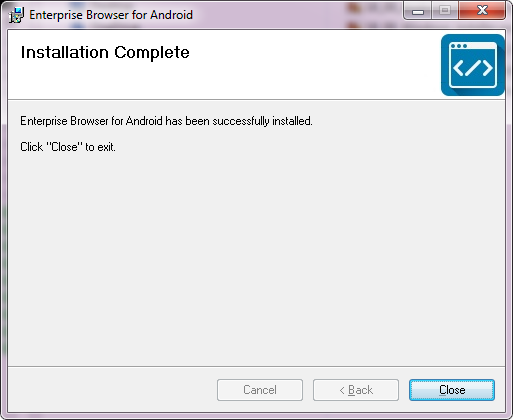
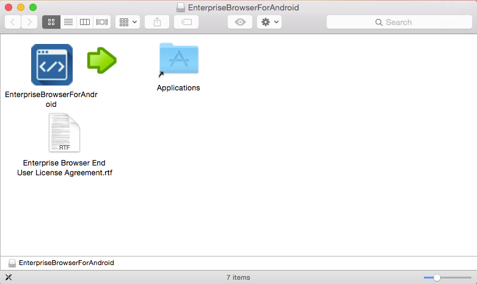
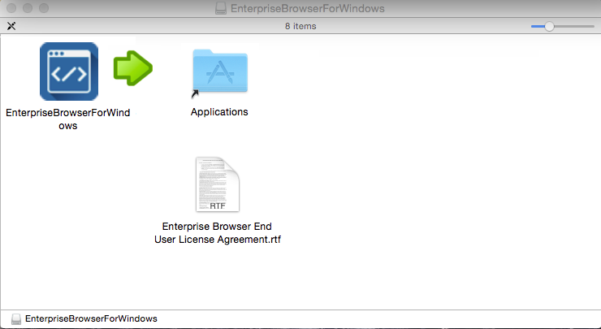
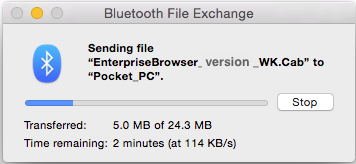
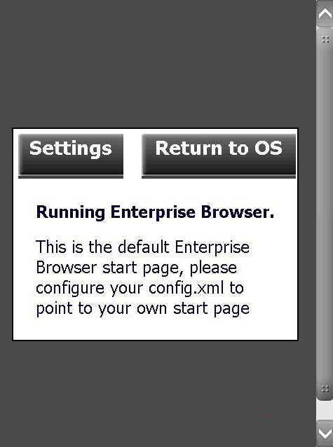
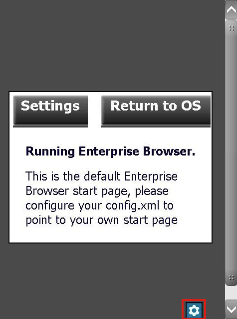
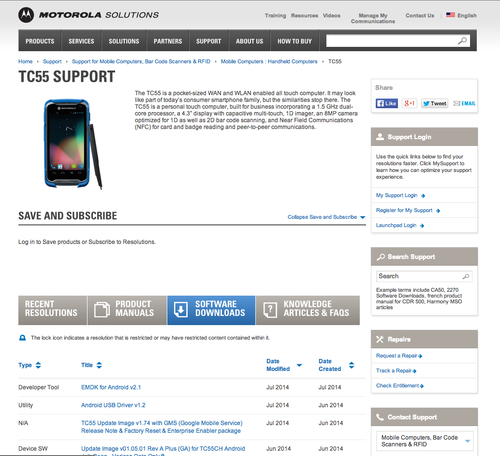

## Overview 
Installing Enterprise Browser on a desktop or laptop system provides all the software necessary to start making Enterprise Browser apps. All that's needed in addition to the software is a connection via Android Debug Bridge (ADB) or Microsoft Mobile Device Center (or ActiveSync on WinXP) to one or more [supported Zebra devices](../about/#mobile) running Android or Windows Mobile/CE. See the Prerequisites section for connection details. 

#### Platform Support
**Windows is required for full Enterprise Browser development**. For Mac OS X users, Enterprise Browser 1.3 and higher can be downloaded as a disk image (.dmg), allowing a subset of administrative functions listed below. 

**Mac OS X Functionality**: 

* Copy EnterpriseBrowser `.apk` files to Android devices
* Copy EnterpriseBrowser `.cab` files to [StageNow](/stagenow/2-3/gettingstarted/) or a mobile device management (MDM) system for mass deployment
* Access the Enterprise Browser [Feature Demo](../featuredemo/) app
* Easily link to EB online help
* Create shortcuts to Android apps using the EB native widget (pushed to the device as part of EB installation). **NOTE: Shortcuts are not supported on devices running Android 8.x Oreo or higher**.  

<!-- * Copy EnterpriseBrowser .cab files to Windows Mobile/CE devices -->

#### Prerequisites
Installing Enterprise Browser and building EB apps requires the following: 

* A computer running Windows XP, 7, 8 or 10
* One or more [supported Zebra devices](https://www.zebra.com/us/en/support-downloads/software/developer-tools/enterprise-browser.html) connected to the computer (as below) 
* USB driver for targeting Zebra devices installed
* Android Debug Bridge (if targeting Android devices)
* Microsoft Mobile Device Center (if targeting Windows Mobile/CE devices)

_**Note: Microsoft Mobile Device Center** replaced ActiveSync starting with Windows Vista. It is usually included with the operating system, but sometimes must be downloaded separately. Installation of Enterprise Browser from Windows XP systems requires ActiveSync_.

#### Removal From Devices
When Enterprise Browser is uninstalled from an Android device using the Android Application Manager, EB and its related components under most circumstances are removed properly. Known exceptions are listed below: 

**Incomplete removal scenarios**:

* **PS20J -** Enterprise Browser is pre-installed and **can only be upgraded/downgraded**; it cannot be removed. 
* **TC55 Jelly Bean -** If Enterprise Browser is installed onto the device's internal memory, files will not be removed by the Uninstall function of App Manager. Installation onto an external SD Card works normally. 
* **MC32 Jelly Bean -** If Enterprise Browser is installed onto the device's internal memory, files will not be removed by the Uninstall function of App Manager. Installation onto an external SD Card works normally. 

> **Zebra recommends that uninstallation be verified for each device scenario** before any process is automated using [StageNow](/stagenow/2-3/gettingstarted/) or an MDM system. 

-----

### Windows Installation
This section describes installation of the "Enterprise Browser for Android" deployment tool on a Windows PC. The installation process is similar for "Enterprise Browser for Windows," which is used to deploy EB to devices running Windows Mobile/CE. 

#### Installation File Paths
The EB installer writes to two folders on the development host system: 

##### Executable files: 
* `C:\Program Files (x86)\Symbol Technologies Inc\Enterprise Browser for Android`

##### JavaScript libraries:
* `C:\EnterpriseBrowserForAndroid\JavaScriptFiles\EnterpriseBrowser`

-----

#### To install "Enterprise Browser for Android" on a Windows PC:

**&#49;. If upgrading, back up any data stored in the `C:\EnterpriseBrowser` directory of the host PC** and save a copy of the Enterprise Browser `Config.xml` settings file (if desired) from the `/Android/data/com.symbol.enterprisebrowser` folder (on the device) to any other location. 

&#50;. Visit the [Enterprise Browser download page](https://www.zebra.com/us/en/support-downloads/software/developer-tools/enterprise-browser.html) and **scroll to find the download for the desired target platform (Android or Windows Mobile/CE)**. About [download package contents](../../download). 

<!-- The corresponding installation packages for Windows and Mac OS X appear:
 * Windows host targeting Android devices
 * Windows host targeting Windows Mobile/CE devices
 * Mac OS X host targeting Android devices
 * Mac OS X host targeting Windows Mobile/CE devices

* For Windows hosts, click on the Windows ".msi" package(s), accept the end-user license agreement and begin the download.
-->

&#51;. **When the download completes**, launch the installer(s) and follow the prompts to install. After installation, a screen appears similar to the image below. **Click "Close" to quit the installer**. 

 

&#52;. In the Windows menu, **select the desired EB "installer"** to launch the EB deployment tool:

The Enterprise Browser deployment tool appears in a window similar to one of the images below (depending on the platform being targeted). 

&#53;. Select one of the available platform runtimes to display its description.  

 

 

 

#### Instructions continue in the [Deployment to Device(s)](#deploymenttodevices) section, below. 

-----

### Mac OS X Installation
1. Visit the [Enterprise Browser download page](https://www.zebra.com/us/en/support-downloads/software/developer-tools/enterprise-browser.html) and click on the desired EB version. The corresponding installation packages for Windows and Mac OS X appear.

 a. Click on the desired Mac OS X `.dmg` package(s).  
 b. Accept the end-user license agreement to begin the download.

2. When the download completes, double-click the `.dmg` file to open it. Depending on the target platform, a window appears similar to the images below: 

3. Drag and drop the Enterprise Browser icon onto the Applications folder (in the direction of the arrow). This copies the Enterprise Browser files and folders into the Application folder on the host Mac, creating a directory structure similar to the one shown in the image below: 

 

**Files in the "Runtimes" folder (red arrows) correspond with those deployed by the Android or Windows Mobile/CE installers for Windows PCs**. These are the same runtimes as those listed on the left side of the ["Installer" screens](../../images/getting-started/setup/18_both_installers.png). 

-----

## Deployment to Device(s)

###From a Windows host
On Windows host systems, communication from the host to target device(s) is handled by the [Android Debug Bridge](http://developer.android.com/tools/help/adb.html) (ADB) for Android devices and by Mobile Device Center (or ActiveSync on WinXP) for Windows Mobile/CE. It also might be necessary to **install an OEM USB driver to make a USB-attached Android device visible to Windows**. If the device isn't visible to Windows, refer to the [Connections section](../setup#connections), below. 

* ADB supports USB connections only
* Mobile Device Center supports USB and Bluetooth connections 

Once a connection has been established, install the Enterprise Browser runtime onto a device:

 

 

1. Select **Start -> Enterprise Browser -> Enterprise Browser Installer** to bring up the EB Installer. A window will appear similar to the image above.  
2. **Select the platform that matches the device, OS and webview being targeted**. Information in the right-hand pane will vary according to the selection.
3. **Click "Deploy" and follow prompts**. A window will appear similar to the image below. 
4. **Restart the device to complete the installation**.

<!-- 

 
 -->

#### Notes

* **For persistent installations on Windows CE** (the lowermost two options on the "Installer" screen above), a cold boot/cleanPS (clean persistent storage) is required to complete the installation.
* Prior to installation, some Windows devices might prompt for the installation location on the device. **Enterprise Browser overrides any selection made here and installs in** `\Program Files\EnterpriseBrowser\`.
* When deploying Enterprise Browser cab file(s) for Windows Mobile/CE, the License Manager cab file is pushed first, followed by Enterprise Browser cab. A screen similar to the image below is displayed: 

**Before clicking "OK" on the PC screen above**, <u>follow any prompts that appear on the device</u>  to complete the Licence Manager installation. 

 

-----

### From a Mac to Android
The preferred deployment method of Enterprise Browser runtimes from a Mac OS host system to Android target devices is with the Android File Transfer utility. **If Android File Transfer is already installed, skip to Step 5**.  

&#49;. Visit the [Android File Transfer page](https://www.android.com/filetransfer/).

&#50;. Download and open the Android File Transfer .dmg file. 

&#51;. Drag the Android File Transfer app into the Applications folder on the host Mac.

&#52;. Plug in the Android target device and unlock the screen. The device file system should automatically appear on the Mac in a window similar to the image below (It's sometimes necessary to launch the app manually.). 

&#53;. Copy the Enterprise Browser runtime for Android to internal storage, which is opened by default. Storage buttons (red arrow) will be shown only if an additional storage card is present in the device.

 

**Note: All connected devices must be unlocked before any file transfers can be performed**. 

&#54;. Using the File Browser app on the device, navigate to and execute the runtime to unpackage its files and directories. 

&#55;.  Restart the device to complete the installation. 

Refer to the [On-device Configuration guide](../OndeviceConfig) for help configuring Enterprise Browser following installation.  

#### Installation of EB runtime for Windows Mobile/CE is now complete. 

-----

### From a Mac to Windows Mobile/CE
The preferred deployment method of Enterprise Browser runtimes from a Mac OS host system to Windows Mobile/CE devices is using Bluetooth. 

&#49;. Set the Windows Mobile/CE device as discoverable in the MotoBTUI app. 

&#50;. Pair the device with the Mac using the Mac's Bluetooth Preferences panel. Enter pairing code and follow additional prompts as necessary. 

&#51;. Right-click the newly paired device and select "Send File to Device..." (as below). 

 

&#52;. A file dialog appears. Navigate to and select the Enterprise Browser runtime to be deployed to the WM/CE device and click Send.   

While the file is in transit, a dialog appears on the Mac similar to the image below: 

 

&#53;. When the transfer is complete, tap "Yes" on the device to save the file.

&#54;. Using the File Explorer app, navigate to and execute the runtime to unpackage its files and directories. 

&#55;. Restart the device to complete the installation. 

**Note: Copy Enterprise Browser Runtimes to internal storage only**.

Refer to the [On-device Configuration guide](../OndeviceConfig) for help configuring Enterprise Browser following installation.  

-----

## Connections
### Android devices

Requirements for using the Enterprise Browser Installer on a Windows system to target an Android device:

* USB drivers for the specific hardware device being targeted
* The Android ADT bundle to make devices visible and to push files 
* A path to `adb.exe` in the host system's environment variable

####STEP 1: Get USB drivers
Visit the [Zebra Support Portal](https://www.zebra.com/us/en/support-downloads/software/drivers/android-usb-driver.html), download and install the latest driver from the list. 

For non-Zebra hardware, visit [Google’s OEM USB Driver page](http://developer.android.com/tools/extras/oem-usb.html) for instructions and links to OEM drivers for the brand of device.

#### STEP 2: Get Android ADT 
Visit the [Android Developer Tools page](http://developer.android.com/sdk/index.html), download and install the Android SDK to match the system (Mac OS X, Linux or Windows 32/64). 

#### STEP 3: Update system path
Add the full path to `adb.exe` to the system path. The EB installer and its utilities use adb to push files to Android devices. Since its location could vary with any given system, the path to adb.exe **must** be available system-wide so that EB can simply execute "abd.exe" rather than repeating the explicit path with every push function. 

To add the platform-tools path to the system's environment variable: 

* Right-click "Computer" and **select -> Properties**
* Select "Advanced System Settings" in the System Properties window
* In the "Advanced" tab, Click the "Environment Variables" button to bring up a window similar to the one below:

 

* In the <u>LOWER</u> window, scroll down to "Path"
* Select Path and click "Edit..." to bring up the path for editing
* Add a semicolon (;) to the end of the line followed by the path to "abd.exe"
* If unsure of the path, the following DOS command will reveal it: 

		:::term
		c:\> dir /s adb.exe 

This command should result in something like this: 

 

* If there's more than one path to adb.exe, enter the one that ends with `\platform-tools`
* The correct string for this example would be `;C:\Users\AppData\Local\Android\sdk\platform-tools` (notice the semicolon separator at the beginning of the line)
* Close the dialog and restart the system 

* To confirm that the path is correct, connect the device and run the following command:  

		:::term
		$ adb devices

If everything is setup correctly, a display like the following will be seen:

 

The system is now ready to deploy Enterprise Browser apps to an Android device.

**NOTE: Shortcuts are not supported on devices running Android 8.x Oreo or higher**.  

-----

### Windows Mobile/CE devices
Upon connecting a Windows Mobile/CE device to a Windows 7 (or higher) PC, the Mobile Device Center application and all necessary drivers are supposed to install automatically and recognize the device. If that doesn't happen immediately, try one or more of the following:   

* Be sure the device is plugged into a _USB 2.0_ port (not USB 3.0)
* Allow Windows to search for updates if prompted after plugging in the device
* If no such prompt appears, go to Device Manager and select Action -> "Scan for hardware changes" When USB drivers are installed correctly, a box like the image below will appear.  
* Restart Windows after any software or driver is installed or updated 

 

> **Note: If Windows doesn't recognize a devices connected to a USB 3.0 port, try connecting it to a USB 2.0 port**.

When a device is properly connected and recognized, the Mobile Device Center application should appear something like this:

 

The system is now ready to deploy Enterprise Browser using the Enterprise Browser installer. 

-----

## Manual Deployment
Enterprise Browser runtimes can be individually pushed to devices from Windows or Mac OS X machines and manually unpackaged on the device. After installing the Enterprise Browser (`.msi` or `.dmg`) executables on the development host as above, perform the steps below as appropriate for the target platform. 

Enterprise Browser also can be mass-deployed using Zebra [StageNow](../../../../stagenow) or a compatible MDM system. [See the Mass Deployment section](#massdeployment). 

**NEW LICENSING PROCESS: Beginning with EB 2.0, licensing of Enterprise Browser has changed. Manual licensing requires use of the License Manager app on the device. <u>Upgrading to EB 2.x requires that all licenses be converted to the new model**</u>. Licensed apps running on EB 1.8 (and older) are unaffected; existing licenses remain valid. See the [Licensing Guide](../licensing) for details. 

-----

#### To manually push an EB app to a device:

**Locate the Enterprise Browser runtime files** on the installation host. This process varies from Windows and Mac OS X and hosts. Both are exaplained below. Note the separate folders for different target platforms.  

#### Windows systems
Go to **Start Menu -> Enterprise Browser -> Resources ->Enterprise Browser Runtimes**. 

 
In Enterprise Browser for Windows, the "Runtimes" folder looks similar to the image below. The runtimes folder of EB for Android (not shown) contains just a single `.apk` file. 

 

-----

#### Mac OS X systems
Open **Applications -> Enterprise Browser for [target platform]-> Runtimes**. The runtimes folder on a Mac looks similar to the image below: 

 

-----

#### The remaining steps apply to Android and Windows Mobile/CE platforms:

&#49;. After locating the desired runtime using the procedures above, **drag-copy the runtime** to the root directory of the device. 

**&#50;. For versions prior to Enterprise Browser 1.5, skip to Step 4**. On Enterprise Browser 1.5 and higher **for Android**, a pre-configured `Config.xml` file (and optionally a `keycodemapping.xml` file) can be copied to the device at `/<internal_mem_root_dir>/EnterpriseBrowser/` at this time (create the directory, if necessary. 

**&#51;. From the device, use a file explorer to locate and execute the runtime**. When Enterprise Browser 1.5 (and higher) for Android is launched for the first time after installation, it performs the following actions on the device:

* Creates the directory `/Android/data/com.symbol.EnterpriseBrowser/`
* Stores the Enterprise Browser executable in the new directory
* Spawns a `Config.xml` file with default settings in the directory
* Checks the `/<internal_mem_root_dir>/EnterpriseBrowser/` directory and copies `Config.xml` and `keycodemapping.xml` files (if present) to the new directory, overwriting any existing file(s) of the same name
* Copies those same config file(s) to `/<internal_mem_root_dir>/EnterpriseBrowser/backup/` and deletes the originals
* Activates the settings of the new config file(s) in `/Android/data/com.symbol.EnterpriseBrowser/`

**&#52;. Reboot the device to complete the installation**. On persistent installations, a cold boot/cleanPS is required to activate the runtime.

> **Note: Directory names are case sensitive**. 

-----

### Update EB Settings
**Applies only to Enterprise Browser 1.5 (and higher) for Android**. After Enterprise Browser is launched for the first time following installation, subsequent launches still check the `/<internal_mem_root_dir>/EnterpriseBrowser/` directory for new versions of the `Config.xml` and/or `keycodemapping.xml` files for processing as described above. 

Therefore, new versions of those settings files should be placed in the `/<internal_mem_root_dir>/EnterpriseBrowser/` directory. The next time Enterprise Browser is restarted, copies of the new settings file(s) will automatically be placed in the appropriate locations for execution and backup, and the original(s) will be deleted. 

-----

## Mass Deployment
The Enterprise Browser runtimes and configuration and licensing files can be deployed to one or more devices using Zebra [StageNow](/stagenow/2-3/gettingstarted/) or an MDM system by using the instructions below. 

#### IMPORTANT NOTES
* **Beginning with EB 2.0, licensing of Enterprise Browser has changed**. Mass deployment requires use of an MDM or Zebra StageNow tools and the [License Manager Setting Type](/stagenow/latest/csp/license). <u>**Upgrading to EB 2.x requires that all licenses be converted to the new model**</u>. Licensed apps running on EB 1.8 (and older) are unaffected; existing licenses remain valid. See the [Licensing Guide](../licensing) for details. 
* **Switching to or from "[GMS Restricted](/mx/appmgr/#mainfunctionality)" mode while an EB app is running can result in unpredictable behavior**. Use the `quit()` method of the [Application API](../../api/application/#quit) before switching into or out of this mode. 

-----

#### To mass-deploy Enterprise Browser: 

**&#49;. Locate the Enterprise Browser runtime files** on the installation host: 

#### Windows systems
Go to **Start Menu -> Enterprise Browser -> Resources ->Enterprise Browser Runtimes**. 

 
On Windows, this brings up a window similar to the image below: 

 

-----

#### Mac OS X systems
Open **Applications -> Enterprise Browser -> Runtimes**. The Runtimes folder on a Mac looks like the image below: 

**&#50;. Copy the desired runtime file to the MDM system**, and configure the system to push the file to the root directory of the device. 

**For versions prior to Enterprise Browser 1.5, skip to Step 4**. 

**On Enterprise Browser 1.5 and higher for Android**, a pre-configured `Config.xml` file (and optionally a `keycodemapping.xml` file) can be copied into the `/<internal_mem_root_dir>/EnterpriseBrowser/` directory on the device at this time (create the directory, if necessary). 

**&#51;. If deploying configuration files (as described above)**: 
 * Copy config file(s) the MDM system for deployment to the device
 * Configure the system to check for the presence of a `/<internal_mem_root_dir>/EnterpriseBrowser/` directory on the device, creating it if necessary

**&#52;. Configure the MDM to execute the runtime**. When Enterprise Browser 1.5 for Android is launched for the first time after installation, it performs the following actions on the device:

* Creates the directory `/Android/data/com.symbol.EnterpriseBrowser/`
* Stores the Enterprise Browser executable in that new directory
* Spawns a `Config.xml` with default settings in the directory
* Checks `/<internal_mem_root_dir>/EnterpriseBrowser/` directory and copies `Config.xml` and `keycodemapping.xml` files (if present) to the new directory, overwriting any existing file(s) of the same name
* Copies those same config file(s) to `/<internal_mem_root_dir>/EnterpriseBrowser/backup/` and deletes the originals
* Activates the settings of the new config file(s) in `/Android/data/com.symbol.EnterpriseBrowser/`

**Note: If deploying config files, it's critical that the MDM be configured to execute Step 3 prior to Step 4. Otherwise, the config files will not be activated by this process**. 

**&#53;. Reboot the device to complete the installation**. On persistent installations, a cold boot/cleanPS is required to activate the runtime.

> **Note: Directory names are case sensitive**. 

### Update EB Settings
**Applies only to Enterprise Browser 1.5 (and higher) for Android**. After Enterprise Browser is launched for the first time following installation, subsequent launches still check the `/<internal_mem_root_dir>/EnterpriseBrowser/` directory for new versions of the `Config.xml` and/or `keycodemapping.xml` files for processing as described above. 

Therefore, new versions of those settings files should be placed in the `/<internal_mem_root_dir>/EnterpriseBrowser/` directory. The next time Enterprise Browser is restarted, copies of the new settings file(s) will automatically be placed in the appropriate locations for execution and backup, and the original(s) will be deleted. 

-----

## Launch Enterprise Browser 
After installation and first launch, an Enterprise Browser app icon will appear **in the all-apps section or "App Drawer" of Android devices** and **in the Main app menu on Windows Mobile/CE**. Versions prior to Enterprise Browser 1.5 launch with default runtime settings as defined in the `Config.xml` file on the device. Enterprise Browser 1.5 and higher can be launched with a pre-configured `Config.xml` file and optionally a pre-configured `keycodemapping.xml` file as well. See the [Config.xml Reference guide](../configreference) for information about configuring the `Config.xml` file.  

With default settings, the startup screen appears similar to the image below: 

Press the "Return to OS" button to skip settings configuration and bring up the operating system. **To display the Settings button again, simply relaunch the Enterprise Browser app**. 

**Press the "Settings" button to edit the on-device `Config.xml` file**. A screen appears like the image below:

###Setting the start page
**To activate an EB app's start page, enter the URL in the Value field of the StartPage parameter**, as highlighted above, but **do not apply the changes yet**. Applying changes immediately will cause the new start page to be displayed next time EB is launched and will remove access to the Settings panel. 

**WARNING: Free-form text fields such as "username" and "password" can accept alpha-numeric characters only. Entering non-text characters (< > \ / " ') in these fields (except in a URL field) will corrupt the `Config.xml` file**. 

If on-device access to runtime settings is desired after setting up the start page (for example, to experiment with various settings before deployment), set the SettingsButtonEnabled parameter to "Enable" (as below). This will cause a Settings button to appear in the UI at all times. Passwords also can be set here, if desired. 

Press "Apply" to update the `Config.xml` file with the new settings. A screen like the one below will be displayed. Restart the app to activate the changes. 

The Settings button, if enabled, appears in the UI like the one in the red box below.

**Note: When the IE engine is used on a Windows CE device**, displaying the Settings button in this way might cause screen distortion when scrolling.

**WARNING: Free-form text fields such as "username" and "password" can accept alpha-numeric characters only. Entering non-text characters (< > \ / " ') in these fields (except in a URL field) will corrupt the `Config.xml` file**. 

The on-device settings panel provides access to just a small subset of Enterprise Browser runtime settings. For access to all settings, please refer to the [On-device Configuration guide](../OndeviceConfig).

<!--## Removing Enterprise Browser

### Windows Mobile
Remove Enterprise Browser by removing the application.

### Windows CE
If you installed the persistent version of Enterprise Browser, it will not be removed after a cold boot. To remove it, you will need to manually remove the folder and copy files that are found in the non-volatile area of memory.

### Android
Use Android Settings applet to remove the Enterprise Browser from the device.-->

<!-- To install the drivers for that device. Usually this is done by simply plugging the device into the machine. Most of the time, the device driver will install automatically and you'll be good to go. If not, you'll need to download the drivers for that device. To get the drivers for your device, you'll need to find the device page on [motorola solutions URL removed. The best way to do this is enter your device's model number into the search bar at the top of the landing page. Once you have found your device, you should see a tab to download software. For instance, the drivers for the TC55 are [here](http://goo.gl/mjrqMM).

The page you want should look something like this:

 

1. The ActiveSync installer will deploy the selected Enterprise Browser runtime files to the device. 
2. If installing one of the persistent runtimes for Windows CE, a cold boot/clean PS will be required after installation.

> **Note**: Prior to installation, some Windows devices might prompt for the installation location on the device. **Enterprise Browser overrides any selection made here; it will always be installed in `\Program Files\EnterpriseBrowser\`**.

-->

