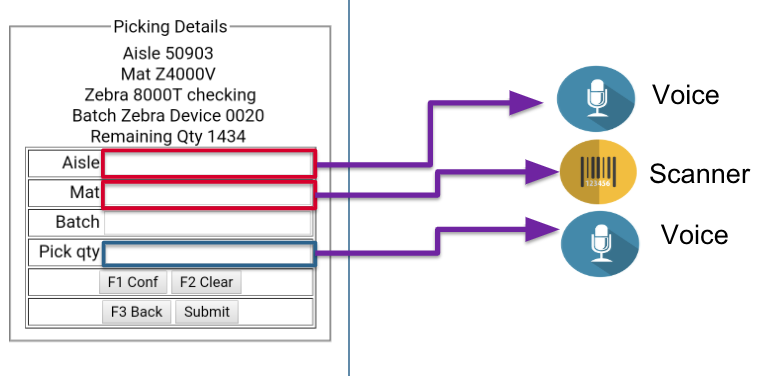

## Overview

Enterprise Browser 2.0 (and higher) supports the ability to process incoming voice commands,  convert the voice input to text and employ the text in an app. Voice input is enabled in an EB app using JavaScript, which can be added to the app directly or by using [Page-based Actions](../pageactions) also introduced with EB 2.0. 

### Requirements

* A Zebra GMS device running Android
* An app running on EB 2.0 (or higher)

#### Interfaces in use: 

* [W3C Web Speech API](https://w3c.github.io/speech-api/) 
* [Automatic Speech Recognition (ASR) APIs](https://developer.android.com/reference/android/speech/SpeechRecognizer)
* [Text-to-speech (TTS) APIs](https://developer.android.com/reference/android/speech/tts/TextToSpeech)
* [Speech package summary](https://developer.android.com/reference/android/speech/package-summary)

-----

### Enable Voice With Page Actions

The easiest way to add voice to an existing EB app is by "injecting" the necessary JavaScript into one or more pages in the running app using Page-based Actions. This allows JavaScript code to be executed by the required pages as determined by a unique string found on the page. For example, if an app contains pages that display text prompting the user to "Speak a Command..." EB can activate voice input on every page that contains that string. 

**To enable voice input using Page Actions**:

&#49;. Create two files using the content shown below: 

#### File 1: `PageAction.xml` 

	:::xml
	<pageActionGroup>
	<pageAction1> 
	        <pageIdentification value=“Speak a Command..." />
	        <Action value="runscript-voiceScript" />
	 </pageAction1>
	</pageActionGroup>
 

#### File 2: `CustomScript.xml`

	:::xml
		<CustomScripts>
			<voiceScript>
		        document.getElementsById('inputId').addEventListener("focus", myFocusFunction, false);
		        function myFocusFunction(){
		               var utter = new SpeechSynthesisUtterance();
			 utter.text = ‘Say  Aisle Number';
		     	 utter.lang = 'en-US';
		     	 utter.rate = 1.0;
		               utter.onend = function(event) {
		                  SpeechRecognizer();
		      	};
		              speechSynthesis.speak(utter);        
		            }
		           function SpeechRecognizer(){
		              var recognition = new SpeechRecognition();
		              recognition.onresult = function(event) {
		              document.activeElement.value = event.results[0][0].transcript;
		               recognition.start();
		            }
		    </voiceScript>
		</CustomScripts>
 

&#50;. Open a page on which to enable voice input, identify a string (i.e. text, HTML element or label) that's **unique to pages requiring voice input** and copy it to the clipboard. 

&#51;. In the `PageAction.xml` file, paste the unique string as the value in the line `<pageIdentification value=“unique string” />` (replacing "unique string" but keeping the quotes). 

&#52;. Also in the `PageAction.xml` file, insert the action value name corresponding to the JavaScript to be executed as the custom action value (i.e. `<Action value=“voiceScript”/>`). 

&#53;. Be sure that the action value specified in the `PageAction.xml` file matches the label specified in the `CustomScript.xml` file, as shown above (i.e. "voiceScript").

&#54;. Push the two files to the EB installation directory on the device: 

`/Android/data/com.symbol.enterprisebrowser`

<!-- required only for DOM injection: &#55;. Specify the path to the `CustomScript.xml` file in the [&lt;CustomDOMElements&gt; tag](../configreference/#customdomelements) in the app's `Config.xml` file. 
 -->
&#55;. Confirm that the app's `Config.xml` file contains the tags and values below: 

	:::xml
	<Configuration>
		...
		<TTS>
	  		<TTSEnabled value="1"/>
		</TTS>
		
		...

		<ASR>
	  		<ASREnabled value="1"/>
		</ASR>
		...
	</Configuration>

#### The app is now voice-enabled. 

-----

## Also See

* **[Page-based Action Guide](../pageactions)**
* **[DOM Injection Guides](../dom)**

<!-- 

 

 

 

in case you can’t find any string unique in the page, you can inspect the page source to identify the same

Steps to Identify the unique string is:
1. In config.xml please enable the debug mode by modifying <DebugModeEnable value="1"/>
2. Make sure the device is connected in debugging mode.
3. Open chrome and navigate to chrome://inspect
4. Now you can see the complete web page source of that html and can identify the unique string in the page.

 -->

