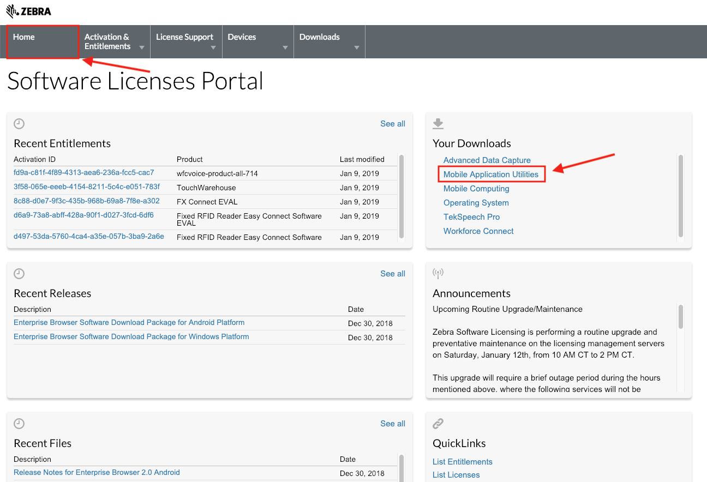
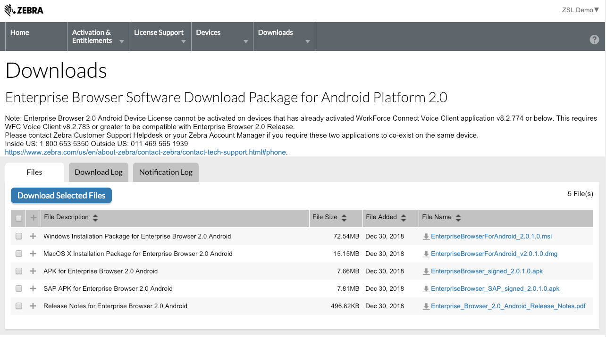

## Download

> **Zebra recommends using the latest release** whenever possible. 

#### To Download Enterprise Browser:

2 **Visit the [Zebra Enterprise Browser download page](https://www.zebra.com/us/en/support-downloads/software/developer-tools/enterprise-browser.html)** and select the desired download(s). 

1. Then **proceed to the [Enterprise Browser Setup page](/enterprise-browser/3-0/guide/setup)** for installation instructions. 

<!-- 7/21/20- Licensing-portal download no longer applies.  

**NOTICE**:   
**Enterprise Browser 2.0 (and later) is now available only through the [Zebra Licensing Server (portal)](https://www.zebra.com/us/en/support-downloads/software-licensing.html)**.

**To download Enterprise Browser**:

1. **Log into the [Zebra Licensing Server](https://www.zebra.com/us/en/support-downloads/software-licensing.html)** using existing partner credentials (registration required)**.
2. If necessary, **click "Home"** to bring up the ZLS Home screen. 
Under "Your Downloads," **click "Mobile Application Utilities**." 

_Click to enlarge_.
 
3. A list of available downloads appears. **Click on the desired platform**. 

_Click to enlarge_.
 
4. A list of available downloads appears. **Use checkmarks to select the desired binaries**. 
Then **click the "Download Selected Files" button**. 

_Click to enlarge_.
 
5. The first time downloading from the Zebra License Server requires the installation of the Akamai NetSession Interface. Follow prompts as necessary to install. **Selected downloads begin automatically** once NetSession is installed. 

_Click to enlarge_.
 
6. **Proceed to the [EB setup guide](../guide/setup)** to deploy Enterprise Browser to devices. 

 -->