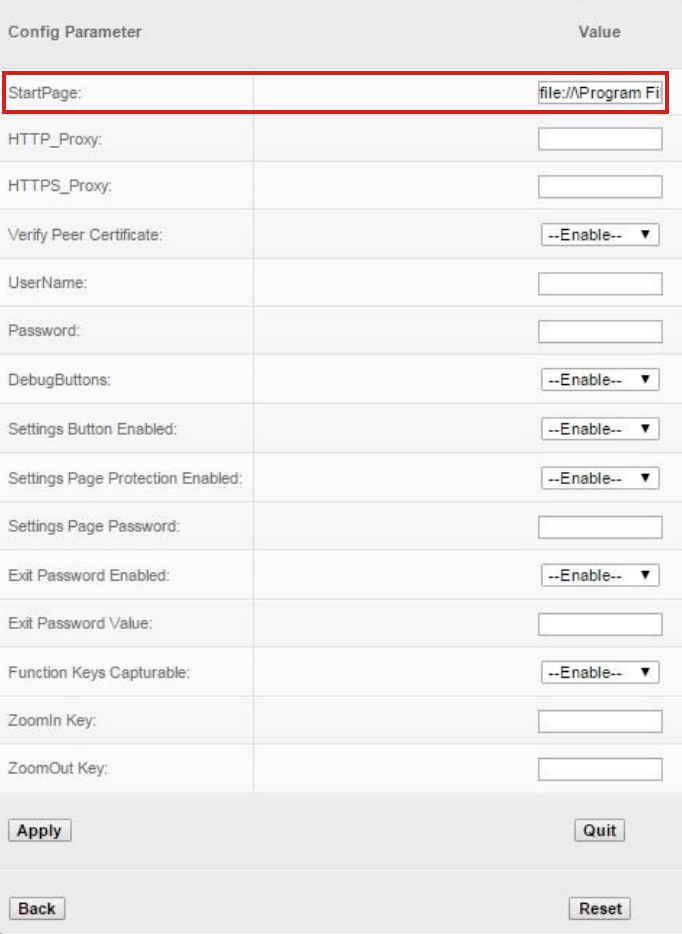
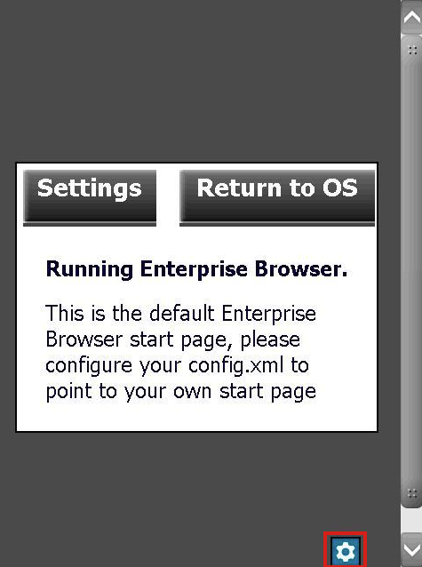

## Overview 
The Enterprise Browser on-device configuration feature permits several key runtime settings contained in the Config.xml file to be edited on-device, _without_ the aid of a PC. Settings in the `Config.xml` file control all runtime behavior of an Enterprise Browser app. The file must reside on the target device for an EB app to launch. 

EB 1.3 and higher apps for Android and Windows Mobile/CE can configure keycapture, zoom in/out, start page and other settings listed below. The settings panel can be secured with a password, can assign an exit password to other EB apps, and can be shown or hidden from the user interface. 

## Using On-Device Config

**WARNING: Free-form text fields (i.e. username and password) can accept alpha-numeric characters only. Entering non-text characters (< > \ / " ') in these fields will corrupt the** `Config.xml` **file**. 

A button for accessing on-device configuration is displayed by default following an initial Enterprise Browser 1.3 installation. Thereafter, it's displayed whenever the EB app is restarted until a different start page is assigned in the Startpage parameter of the `Config.xml`. 

**The first time an Enterprise Browser 1.3 app is launched, a screen like the one below will appear**. 

**Press the "Settings" button to edit the** `Config.xml` **file that's on the device**. This will bring up a screen like the one below. 

Pressing the "Return to OS" button will skip settings configuration and bring up the operating system. To display the Settings button again, simply relaunch the Enterprise Browser app. 

**To activate your EB app's start page, enter the URL in the Value field of the StartPage parameter**, as highlighted above, but **do not apply the changes yet**.

Applying changes immediately will display its intended start page and remove access to the Settings panel the next time the app is launched. If access to settings is still desired, you must enable it with the SettingsButtonEnable paramter.

**Set the SettingsButtonEnabled parameter to 'Enabled'** as in the screen below. This will cause a Settings button to appear in the UI at all times. Notice also in the screen that the field that follows enables a password to be applied to the Settings panel, if desired. 

**Press 'Apply' to update the** `Config.xml` **file with the new settings**. A screen like the one below will be displayed. Restart the app to activate the changes. 

Next time the app launches, a Settings button will appear in the UI like the one in the red box below.

**Note: When the IE engine is used on a Windows CE device, this feature might cause screen distortion when scrolling**.  

## Action Buttons

The on-device settings panel presents four buttons at the bottom of the Settings panel. Here's now they behave. 
         
* **<u>Apply</u> updates the `Config.xml`** with new values entered in the Value fields.    

* **<u>Quit</u> exits the app without saving**. Unsaved changes will be lost. If ExitPasswordEnabled parameter is Enabled, the Quit button also will cause a password prompt to appear. 

* **<u>Back</u> navigates to the previous page** with no prompt. Unsaved changes will be lost. 

* **<u>Reset</u> will revert all values to their factory defaults** as described in the [Config.xml reference guide](../configreference). 

## Configurable Settings
Below is the list of settings that can be configured on-device for an EB 1.3 app. For the descriptions and instructions for configuring the full set of runbtime configuration parameters please see the [Config.xml reference guide](../configreference).

**WARNING: Free-form text fields (i.e. username and password) can accept alpha-numeric characters only. Entering non-text characters (< > \ / " ') in these fields will corrupt the** `Config.xml` **file**.  

### Debugbuttons
When enabled, presents a set of controls useful for development and debugging purposes. **Note: When using this feature with the IE engine on a CE device, screen distortion may be noticed when scrolling**.

### HTTP_Proxy
Specifies the URL and port number for the HTTP proxy. Leave this field blank if no proxy is to be used. **Applies only to WM/CE devices with the Zebra WebKit engine or Android with the stock webkit**. When Internet Explorer is used, proxy settings are picked up from Windows connection manager.

### HTTPS_Proxy 
Specifies the URL and port number for the HTTPS proxy. Leave this field blank if no proxy is to be used. **Applies only to WM/CE devices with the Zebra WebKit engine or Android with the stock webkit**. For otherwise configured WM/CE devices, use HTTP_Proxy. 

### VerifyPeerCertificate
Controls whether server certificates will be verified against the internal certificates. Enabled by default. Useful for debugging, a value of 0 (disabled) is equivalent to automatically clicking ‘OK’ on a web browser’s dialog when requesting approval for an untrusted certificate. It is strongly recommended that this feature be enabled for deployment.

### Username
Specifies the username to be provided automatically when Enterprise Browser is instructed to navigate to a page that requires basic or digest HTTP authentication. If this setting is absent, a login prompt will be displayed with a username of (""). In most cases, Enterprise Browser will permit one incorrect entry of credentials before presenting the HTTP 401 Unauthorized page. When used with IE engine, will permit multiple incorrect entries. Applies to Android and WM/CE.

**Important: Use alpha-numeric characters only**. 

### Password
Specifies the password to be provided automatically when Enterprise Browser is instructed to navigate to any page that requires basic or digest HTTP authentication. If this setting is absent, a login prompt will be displayed with a password of (""). In most cases, Enterprise Browser will permit one incorrect entry of credentials before presenting the HTTP 401 Unauthorized page. When used with IE engine, will permit multiple incorrect entries. **Applies to Android and WM/CE**.

**Important: Use alpha-numeric characters only**. 

### ExitPasswordEnabled
When enabled, prompts for a password when quitting an Enterprise Browser app. Password is stored using the ExitPasswordValue tag. Disabled by default.

### ExitPasswordValue
Contains the password for quitting Enterprise Browser when function is enabled using the ExitPasswordEnabled tag. Can be edited only when ExitPasswordEnabled tag is set to '1' and cannot be left empty. **Applies to Android and WM/CE**.

**Important: Use alpha-numeric characters only**. 

### SettingsButtonEnabled
When enabled, places a settings button at the bottom right corner of all screens that routes to the settings page. **Note: When using this feature with the IE engine on a CE device, screen distortion may be noticed when scrolling**.

### SettingsPageProtectionEnabled
When enabled, prompts for a password before allowing access to the Settings page. Password is stored using the SettingsPagePassword tag. **Default password** = "admin" if none is entered.

### SettingsPagePassword
Contains the password for accessing the Settings page when password function is enabled using the SettingsPageProtectionEnabled tag. Can be edited only when SettingsPageProtectionEnabled tag is set to "1" and cannot be left empty. **Default password** = "admin" if password is enabled and no password is entered.

### FunctionKeysCapturable
Determines behavior of Function keys on Windows Mobile/CE and Android devices. When enabled, device Function keys are capturable using the Key Capture API. When disabled, keys revert to the device’s default behavior. This setting is not specific to an application. When enabled, settings are applied globally to the device. Refer to the EnableFunctionKey_X tag and complete documentation for more information about the interaction between the FunctionKeysCapturable and EnableFunctionKey_X parameters.

### ZoomInKey
Controls zoom-IN behavior for application text using function key(s) configured with the EnableFunctionKey_X parameter. This setting will not be applied if the parameter is missing, left blank or contains an invalid key code. Note: The function keys used for Zoom IN or Zoom OUT operation will not be accessible via the current and previous Key Capture APIs. Applies only to WM/CE with IE or Zebra Webkit. Other requirements are detailed in the Remarks section at the bottom of this guide. Read more.

### ZoomOutKey
Controls zoom-OUT behavior for application text using function key(s) configured with the EnableFunctionKey_X parameter. This setting will not be applied if the parameter is missing or left blank or contains an invalid key code. Note: The function keys used for Zoom IN or Zoom OUT operation will not be accessible via the current and previous Key Capture APIs. Applies only to WM/CE with IE or Zebra Webkit. Other requirements are detailed in the Remarks section at the bottom of this guide.Read more.

### StartPage 
Defines the start page of the Enterprise Browser application displayed at launch. A device-resident file is recommended to avoid connectivity issues on startup. **StartPage entry must be a fully qualified local path using** `file://` **or URL using** `http://`. For URLs, accepts UTF-8 characters only. Case sensitive. 

## Notes

* On-device configuration is supported on Android with the stock webkit and on Windows Mobile/CE platforms with the Zebra webkit or IE engine. 

* Settings edited on the device take effect the next time Enterprise Browser is launched. 

* Configuring the full set of [runtime settings in the Config.xml](../configreference) still requires a computer. 

* To simplify PC-based set up of `Config.xml` files, please refer to the [Config Editor utility](../ConfigEditor) for Windows desktops than can edit and deploy `Config.xml` files from a single panel.

* Free-form text fields (i.e. username and password) can accept alpha-numeric characters only. Entering non-text characters (< > \ / " ') in these fields may corrupt the `Config.xml` file. 

