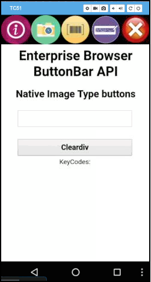

#### [What's new in v3.0](#newinv30)

## Overview
Enterprise Browser is a powerful, industrial browser that provides everything needed to quickly build device apps for **barcode scanning, signature capture, payment processing, printing** and most other enterprise applications for a long list of [supported Zebra devices](#supporteddevices) running Android and Windows Mobile/CE. EB includes a runtime environment inside which a company's application logic can be executed and controlled using HTML5 and CSS3 for presentation and JavaScript to access EB APIs for scanners, cameras, card readers and other device peripherals. 

<iframe width="560" height="315" src="https://www.youtube.com/embed/4RMP9wSL1nY?list=PLce6-npz5dKcUY98npViY6QbuL3yhAXCx" frameborder="0" allowfullscreen></iframe>
 

The base [EB installation](../setup) includes all necessary components to allow a Windows development host to easily build device apps and set [runtime settings](../configreference) for local or mass-deployment using [Zebra StageNow](../../../../stagenow) or a mobile device management (MDM) system. **If migrating from another platform**, Enterprise Browser also can run apps built for PocketBrowser, RhoElements and the RhoMobile Shared Runtime, making it an ideal path for moving apps to a newer UI, device or platform. For more information about API crossover, see the [API Compatibility matrix](../compatibility). 

**Note: Zebra recommends avoiding the use of the JavaScript Alert function on any Enterprise Browser page**. Use of the syntax `window.alert("some alert message")` or `alert("some other message")` can result in unpredictable behavior when such code is used in Enterprise Browser apps.  

-----

## New in v3.0

#### `OCTOBER, 2020 UPDATE:`

##### Enterprise Browser 3.0.6.0 for Android devices

**EB 3.0.6.0 is now able to apply and activate licenses** for itself and the MDNA bundle in a single step. 

**The [Config Editor](../ConfigEditor) desktop utility now supports the use of spaces in a path name**. This can be helpful, for example, when the path name contains a Windows system variable (i.e. “%USERPROFILE%) that includes a space (i.e. “John Smith”).  

#### New/Updated APIs

* **The [Device API](../../api/device/)** can now enable and disable the Android Navigation Bar on the device, which contains the BACK, HOME and RECENT soft keys.
* **The [WebView API](../../api/webview/)** can now enable and disable zoom, which allows the user to “pinch zoom” in and out of an image or web page using the two-finger gesture. 
* **The [Database API](../../api/Database/) has been restored**. In response to customer requests, apps running on EB 3.0.6.0 (and later) can now access low-level APIs for an on-device SQLite database.  

----

### New Features in 3.0

#### Term-based Licensing
* Enterprise Browser 3.0 and later now supports term-based (subscription) licensing with one-, three- and five-year terms available for purchase. A 90-day trial term also is available (a 30-day evaluation term comes preinstalled with every EB 3.0 download). [More info](../licensing/#iiaccesslicensingsystem).  
* **Perpetual licenses remain in effect**. Read more [about perpetual licenses](../licensing/#iiaccesslicensingsystem).
* **Perpetual and evaluation licenses currently in place for EB 2.x can be applied to EB 3.x** when installed.
* **The Zebra PS20** includes Enterprise Browser 2.x preinstalled with a license that never expires.  
* **Upgrading to Enterprise Browser 3.0 on the PS20** requires purchase of a new EB license. To upgrade, EB 3.x must be downloaded and installed separately and an EB 2.x or 3.x license applied.

<!-- 8/7/20- Removed until CC implementation
#### Common Criteria
Some Zebra devices are compatible with Common Criteria for IT Security Evaluation, a standard for certifying the security of computing devices and systems. When in the so-called "CC state" of heightened security, Zebra mobile and touch computers are prevented from access certain features, including the ability to read from or write to external storage. [Learn more](/cc). 
-->

### Device Support

Support for the following devices has been added: 

* **Zebra devices running Android 10**
* **Zebra PS20 running Android 9.x Pie and Android 10** 

**See the [full list of supported devices](https://www.zebra.com/us/en/support-downloads/software/developer-tools/enterprise-browser.html)**.

----- 

## Version History

## Added in v2.6

### New Features/Guides 

* **The all-new [Enterprise App Configurator](../eac) utility simplifies [DOM injection](../dominjectionandroid)** with a point-and-click interface and requires no coding or manual config-file creation. DOM injection adds capabilities to a running EB app without changing the source code. 
* **Updated [Licensing Guide](../licensing)** now contains instructions for making license keys persist on a device and links to Zebra's newest License Server Administrator guides for Linux and Windows. 
* **Now automatically releases scanner resources when Android app for EB goes to the background**.
* **[Changes in DataWedge tag behavior](../configref/#usedwforscanning)** in the `Config.xml` offer improved integration with DataWedge for concurrent scanning.
* Barcode configuration now persists after onPause, onResume cycles

### New/Updated APIs

**[Device API](../../api/device/#sendkeykeycode) now supports sendKey events**.

**NOTE**: The FlashMode "On" setting in the [Camera API](../../api/camera) is **NOT SUPPORTED** on devices running Android 10. 

### End of Support

* **No longer supports devices running Android 7.x Nougat** (except WT6000)

### Device Support

No new devices were added with this release. 

**See the [full list of supported devices](https://www.zebra.com/us/en/support-downloads/software/developer-tools/enterprise-browser.html)**.

----- 

### Added in v2.5

#### End of Support

* **The Database API is no longer supported in EB 2.5**. Calls to this API will result in error. 
* **The** `remove()` **method of the NativeTabbar API is no longer supported**.  
* **Support ends for devices running Android 6.x Marshmallow, 5.x Lollipop or 4.x KitKat**  

* **Support for Unique Device Identification (UDI) barcodes is deprecated**. GS1, HIBCC and ICCBBA barcode standards will no longer be advanced in the Barcode API, and will be discontinued when Android 10 Q support begins. 

#### Device Support

##### Mobile Devices

**<u>Android 9.x Pie</u>** newly supported devices: 

* **PS20**
* **TC52**
* **TC72**

**<u>Android 8.x Oreo</u>** newly supported devices: 

* **EC30**
* **ET51**
* **ET56**
* **L10**
* **VC83**

##### Scanners
* **RS5100** connected to devices running Android 7.x Nougat and higher 
* **SE4750DPW** connected to devices running Android 7.x Nougat and higher 
* **SE4770** connected to MC33xx devices running Android 8.x Oreo and higher

##### Accessories
External Vibrator Cable (CBL-NGWT- HDVBAP-01) 

**<u>Visit the [Zebra Support Portal EB page](https://www.zebra.com/us/en/support-downloads/software/developer-tools/enterprise-browser.html)</u>** for the full list of supported devices.

-----

#### New Features/Guides

##### New for All Apps
* **Supports [Pinned Shortcuts](../configreference/#shortcutcreation) on Android 8.x Oreo and later**. 
* **A new [Multi-session Guide](../multisession)** describes the all-new process for deploying multiple EB apps as browser tabs using Pinned Shortcuts or an XML file. Multi-session support allows EB to run multiple apps at the same time, each with different `Config.xml` files and configuration settings. 
* **The [&lt;ShowLicenseConfirmation&gt; tag](../configreference/#showlicenseconfirmation) is now supported on Android** devices (formerly Windows Mobile/CE-only), which toggles display of the “Licensed to…” dialog at launch. 
* **Supports [meta tag filtering](../configreference/#metatagfiltering) on Android targets**, which permits one or more meta tags or sets of meta tag properties to be allowed ("WhiteListed") or blocked ("BlackListing" tag) from use by an EB app. This feature can be useful when **migrating EB apps from Windows Mobile to Android** by blocking meta tags or meta-tag properties not supported on Android devices.
* **A new [&lt;DisableTTSduringNavigation&gt; tag](../configreference/#disablettsduringnavigation)** allows the text-to-speech engine to be temporarily disabled while EB switches or navigates pages. 
* The new TTS disablement feature is configurable using the **new [&lt;DelayforTTS&gt; tag](../configreference/#delayfortts)**.
* **A new [&lt;DisableASRduringNavigation&gt; tag](../configreference/#disableasrduringnavigation)** allows the Android Speech Recognition engine to be temporarily disabled while EB switches or navigates pages. 

##### New for SAP Apps

* **Supports [custom CSS files](../sapandroid/#customcssfile) for SAP apps running on Android targets**, allowing modification of certain styles within the SAP app at runtime.
* **Supports a [Keyboard Type parameter](../sapandroid/#configurationparameters)**, which allows SAP apps to select a keyboard, button bar, custom Enterprise Keyboard layout or default IME. 

-----

#### New/Enhanced APIs
**<u>A new [SerialComm API](../../api/serialcomm)</u>** extends Enterprise Browser to allow apps to communicate with serial devices for: 
* Read operations
* Write operations
* Setting serial port parameters such as speed, parity, data bits, etc.  

**<u>An updated [Barcode API](../../api/barcode)</u>** adds the following new properties:
* barcodeCount 
* instantReporting 
* SceneDetectionQualifier  
* dotCode 
 * dotCodeInverse 
 * dotCodeMirror
* gridmatrix
 * gridmatrixinverse
 * gridmatrixmirror
* i2of5febraban 
* gs1qrcode 
* gs1datamatrix 
* decodeScreenNotification 
* decodeScreenNotificationTime 
* decodeScreenTranslucencyLevel 
* zoom 
* signatureImageBitsPerPixel 
* signatureImageFormat 
* illuminationBrightness 
* aimType
 * PRESENTATION

----- 

### Added in v2.0

> **NOTICE**: Android 8.x Oreo has changed the way application shortcuts are implemented. Therefore, <u>**app shortcuts are no longer supported on devices running Android Oreo and higher**</u>. Documentation relating to shortcuts remains visible for devices running earlier versions of Android. 

#### `NOVEMBER 2019 UPDATE:`

**The Database API is deprecated in EB 2.0 and is no longer being advanced**. Support for the Database API will end with the release of EB 2.5. 

#### Device Support 

EB 2.0 now supports the following mobile computing devices and operating systems: 

* **MC33X** Android Oreo
* **PS20J** Android Oreo
* **TC20** Android Nougat, Oreo
* **TC25** Android Nougat, Oreo
* **TC51** Android Oreo 
* **TC51 Healthcare** Android Oreo 
* **TC52** Android Oreo
* **TC56** Android Oreo 
* **TC57** Android Oreo
* **TC57 Healthcare** Android Oreo
* **TC70X** Android Oreo 
* **TC75X** Android Oreo 
* **TC72** Android Oreo
* **TC77** Android Oreo
* **VC80X** Android Oreo 
* **WT6000** Android Nougat

#### `MARCH 2019 UPDATE:`

Enterprise Browser 2.0.1 (and later) adds support for the following devices:  

* **MC9300**
* **TC8300**
* **CC600** 
* **CC6000**

#### Scanner Support
EB 2.0 is now supported for use with the following scanners when connected to Zebra devices and operating systems listed:

**Handheld Scanner Support**
* **DS2278** support added for use with Android Nougat devices
* **LI3678** support added for use with Android Nougat devices

See all [supported Zebra devices](https://www.zebra.com/us/en/support-downloads/software/developer-tools/enterprise-browser.html). 

#### New Features

* **Now supports [Hardware Key Remapping](../keycapture/#mappinghardwarekeys) -** to allow hardware keys of Zebra devices to be remapped to perform predefined actions or execute JavaScript code blocks residing on the device or on a server. 
* Android apps running on **EB 2.0 (and higher) can use [substitution variables](../configreference/#substitutionvariables)** to simplify file-path coding.
* **Now supports [page-based actions](../pageactions)**, which can execute JavaScript code and/or predefined commands based on the contents of a page. In some instances, this feature can be used as a substitute for DOM injection with similar effect. 
* **An enhanced SAP support bundle** includes ready-to-use config files for SAP ITSmobile apps, simplifying device set-up for SAP customers. SAP config files can be modified for specific use cases. **SAP-specific features**:
 * UI auto-customization via ViewPort
 * SAP button height adjustment
 * Ready-to-use function key layouts
 * Transparent keyboards for WT6000
 * Button keyboard show/hide feature mapped to hardware key
 * Ready to use with DataWedge scanning 
 * Ready-to-use indicator buttons
 * Hardware keys remapped to quit, back, zoom in, zoom out actions
 * Orientation can be locked in portrait or landscape modes
 * Option to hide the system/nav bar (HOME, BACK and RECENT buttons)
* Now supports **Voice Input and Output** controllable using the following new `Config.xml` file tags: 
 * **[&lt;TTSEnabled&gt;](../configreference#ttsenabled) -** Controls whether text-to-speech capabilities are enabled in the app. 
 * **[&lt;TTSVolume&gt;](../configreference#ttsvolume) -** Used to set the volume level for text-to-speech output.
 * **[&lt;TTSPitch&gt;](../configreference#ttspitch) -** Used to set the pitch for text-to-speech output. 
 * **[&lt;TTSRate&gt;](../configreference#ttsrate) -** Used to set the speed for synthesized speech output.
 * **[&lt;TTSLanguage&gt;](../configreference#ttslanguage) -** Used to set the language for text-to-speech input and synthesized output. 
 * **[&lt;TTSEnginePreference&gt;](../configreference#ttsenginepreference) -** Allows a third-party speech recognition engine to be selected if an engine other than the Google TTS engine is desired. 
 * **[&lt;TTSEngine&gt;](../configreference#ttsengine) -** Used to specify the package name when a TTS engine other than Google TTS (`com.google.android.tts`) is used.
 * **[&lt;asrenabled&gt;](../configreference#asrenabled) -** Controls whether Android Speech Recognition (ASR) features are enabled in an app. 
 * **[&lt;asrpackagename&gt;](../configreference#asrpackagenameasrclassname) -** Used to specify the package name of a third-party ASR engine is one other than Google ASR (default) used. 
 * **[&lt;asrclassname&gt;](../configreference#asrpackagenameasrclassname) -** Used to specify the class name of a third-party ASR engine is one other than Google ASR (default) used. 
 * **[&lt;asrpreferoffline&gt;](../configreference#asrpreferoffline) -** Controls whether voice recognition service can be provided without an internet connection. 
 * **[&lt;audionotificationenabled&gt;](../configreference#audionotificationenabled) -** Controls whether a beep sound is played to indicate the device is ready to accept voice input. 
 * **[&lt;asrpartialmodeenabled&gt;](../configreference#asrpartialmodeenabled) -** Controls whether the speech engine displays recognized words in real time or all at once when speaking ends. 
 * **[&lt;asrlanguage&gt;](../configreference#asrlanguage) -** Used to set the language for speech recognition input.

#### New/Enhanced APIs

The following new methods, properties and/or callbacks were added to Android APIs:

**The [Barcode API](../../api/barcode)** includes these enhancements: 
* **New AimType properties**:
 * barcodeCount
 * characterSetSelection
 * autoCharacterSetFailureOption
 * triggerType
 * aimType: AIMTYPE_PRESS_AND_SUSTAIN
 * scanMode: MULTI_BARCODE
* **New AimType methods**:
 * setautoCharacterSetPreference()
 * getautoCharacterSetPreference() 

**The [RFID API](../../api/re2x/rfid)** adds many new methods and properties and now supports the following RFID readers:
* RFD8500
* RFD2000
* MC3300 long- and mid-range RFID reader

**A new [Bluetooth API](../../api/bluetooth)** allows Enterprise Browser apps to connect with disconnect from Bluetooth printers and scanners and to read from and write to them as applicable.

**Enhancements to the [WebView API](../../api/webview)** include: 
* **New Method**:
 * captureWebPageScreen() 
* **New Properties**:
 * useWideViewPort 
 * loadWithOverviewMode 
* **Other configuration parameters**:
 * &lt;ClearApplicationCacheOnLaunch &gt;
 * &lt;ClearApplicationCacheOnExit &gt;
 * &lt;DeleteCookiesOnLaunch &gt;
 * &lt;VerifyClientCertificate&gt;
 * &lt;DisplayZoomControls&gt;

**New layouts for the [ButtonBarLayout API](../../api/re2x/ButtonBar)**

#### New/Updated Features/Guides

* **An updated [Licensing Guide](../licensing)** describes the all-new processes for licensing EB apps on a device and across an organization. 
* **New [Backward Compatibility Guide](../backward)** explains the minor adjustments required to avoid rendering issues and other problems when moving older apps to EB 2.0. 
* **New [DataWedge Intents User Guide](../dwintents)** covers programmatic control of DataWedge from within an EB app.   
* **New [Page-based Actions Guide](../pageactions)** defines a new set of actions that can execute JavaScript code or predefined commands whenever certain conditions are found on a page. 
* A new **[Voice Input/Output Guide](../voice)** describes how to use Page-based actions to enable voice input in an app. 
* **Enhanced [Key Remapping Guide](../keycapture/#mappinghardwarekeys)** describes how to map hardware keys on Zebra devices running Android. 
* **Enhanced SAP support** includes SAP applications running Warehouse Management or Extended Warehouse Management apps as well as apps built with SAP’s UI5 SDKs and Fiori UX tools.
* **Enhanced [ButtonBar Guide](../buttonbar)** documents these new features:  
 * **Unicode support**, with special keys and characters from other languages in Basic Multilingual Plane.
 * **New config parameters**: 
 	* &lt;ResizeOnButtonbar&gt;
 	* &lt;ButtonBarMaxHeight&gt;
 * **New Button XML tags**: 
 	* &lt;buttonTextColor&gt;
 	* &lt;buttonTextStyle&gt;
 	* &lt;buttonFontSize&gt;
 	* &lt;buttonColor&gt; - Sets the color for individual buttons.
 	* &lt;buttonColorPressed&gt;
 	* &lt;buttonTransparency&gt;
 * **New Properties**:
 	* Show or Hide the layout using layout name
 	* buttonBarLayout enable/disable

<!-- 
Buttonbar Designer Utility:
A new desktop tool (now in BETA) provides graphical UI for creating and modifying buttonbar layouts in the device.
For more information, see the ButtonBar Usage Guide.
-->

* **Now supports [ViewPort](../configreference/#viewport) configuration parameters** for better screen fitting, including:
 * &lt;UseWideViewPort&gt;
 * &lt;ViewPortWidth&gt;
 * &lt;ViewPortInitialScale&gt;

* A new [&lt;LockOrientation&gt; configuration tag](../configreference/#lockorientation) automatically fits UI elements of EB apps. 

* **Enhancements for [SAP apps](../sapandroid)** include new configuration tags for automatically adjusting UI elements in SAP ITSmobile apps for better auto-fitting:
 * &lt;SapButtonHeight&gt;
 * &lt;SapButtonFontSize &gt;
 * &lt;MobileEditDisabledWidth&gt;
 * &lt;SapForceFitToScreen&gt;

* **[DOM injection](../dom)** has been simplified and made more powerful with:
 * Page-based Actions, which allow page contents to determine DOM injection.
 * Support for EB substitution variables to simplify file-path coding.

-----

### Added in v1.8

#### Device Support 
EB 1.8 now supports the following mobile computing devices and operating systems: 

* **CC5000-10** Android Lollipop
* **MC33X** Android Nougat
* **MC55X** Windows Embedded Handheld 6.5
* **MC55X Healthcare** Windows Embedded Handheld 6.5
* **TC51** Android Nougat
* **TC51 Healthcare** Android Nougat
* **TC56** Android Nougat
* **TC70X** Android Nougat
* **TC75X** Android Nougat
* **VC80X** Android Nougat

#### Scanner Support
EB 1.8 is now supported for use with the following scanners when connected to the Zebra devices and operating systems listed:

* **DS3678 Ultra-Rugged Scanner** 
	* Running Android 7.0 (Nougat) on:
 		* MC33X
 		* TC51
 		* TC51-HC
 		* TC56
 		* TC70X
 		* TC75X
 		* VC80X

See all [supported Zebra devices](https://www.zebra.com/us/en/support-downloads/software/developer-tools/enterprise-browser.html). 

-----

#### Updated Installation SKUs

**Enterprise Browser 1.8 (and higher) no longer downloads as a single SKU** for targeting devices running Android and/or Windows Mobile/CE. Separate downloads are now required for each target platform and each host platform. 

See the [EB download page](../../download) for more information. 

-----

#### Updated Guides

* **[SAP ITSmobile Usage Guide](../sap) -** Now offers a new UserAgent section and enhanced Function Key Mapping information. 
* **[Migration Overview](../migration) -** Lists all options for migrating to Enterprise Browser from other platforms or solutions. 
* **[Shortcut Utility Guide](../ShortcutCreator) -** Updated to reflect separate utilities for targeting Android and Windows Mobile/CE. 

-----

#### New Config.xml tags

* **[&lt;DisableHardwareAcceleration&gt;](../configreference#disablehardwareacceleration) -** Optionally disables hardware acceleration at WebView level within an Enterprise Browser app. 
* **[&lt;ClientCertificate&gt;](../configreference#clientcertificate) -** Optionally allows the alias name of a client certificate to be specified. **Applies only to devices running Android Lollipop and higher**. 
* **[&lt;DisableAllIME&gt;](../configreference#disableallime) -** Controls whether to use the input method editors (IMEs) in the Enterprise Browser app. **Applies to Android devices running Lollipop and higher.** 
* **[&lt;HideSystemBar&gt;](../configreference#hidesystembar) -** Controls whether the System bar (also known as the Navigation bar, which contains HOME, BACK and RECENT buttons) is displayed within the Enterprise Browser app. **Applies only to the Zebra MC18 devices running Android Lollipop and higher or other devices with MX 7.1/OSX 6.2 and higher**. 
* **Enterprise Browser version info is now captured in the** `Config.xml` **file**. On startup, EB apps compare and log information about possible mismatches between the `Config.xml` in use and the version of EB installed on the device. [More info](../configreference#eb_versiontag). 

#### Enhanced Config.xml tags

* **[&lt;setHomeKeyDisable&gt;](../configreference#sethomekeydisable) -** Now supported on all Android devices with MX 4.3/OSX 1.0 and higher; no longer limited to Lollipop.
* **[&lt;setStatusBarDisable&gt;](../configreference#setstatusbardisable) -** Now supported on all Android devices with MX 5.1/OSX 5.1 and higher; no longer limited to Lollipop.
* **[&lt;setBackKeyDisable&gt;](../configreference#setbackkeydisable) -** Now supported on all Android devices; no longer limited to Lollipop.
* **[&lt;setVolumeButtonDisable&gt;](../configreference#setvolumebuttondisable) -** Now supported on all Android devices; no longer limited to Lollipop.
* **[&lt;setRecentAppDisable&gt;](../configreference#setrecentappdisable) -** Now supported on all Android devices; no longer limited to Lollipop.
* **[&lt;DomStorageEnabled&gt;](../configreference#domstorageenabled) -** New "enabled" default setting helps preserve Enterprise Browser app data.

-----

#### API Enhancements

The following new methods, properties and/or callbacks were added to Android APIs:

* **[System API](../../api/system)** - Added `deviceHostName` property.
* **[SignalIndicators API](../../api/signalindicators)** - Added `deviceHostName` callback parameter to `wlanStatus` method. 
* **[Signal API](../../api/re2x/signal)** - Added `deviceHostName` parameter added to `signalEvent` method. 
* **[Barcode API](../../api/barcode)** - Added Multi-barcode UDI support, including the following new callback parameters and properties added to the `enable` method (applicable on Android with EMDK version 6.6 and higher):
	* **Callbacks**:
 		* isUDIData
 		* label
 		* UDITokenizedData
	* **Properties**:
		* scanMode
		* enableGS1
		* enableHIBCC
		* enableICCBBA
		* adaptiveScanning
		* aimingPattern
		* connectionIdleTime
		* codeIdType
		* disconnectOnExit
		* gs1LimitedSecurityLevel
		* hanXin
		* hanXinInverse
		* mailMark
		* pairAfterScannerReboot
		* upcEanCouponReport

**[ButtonBar API family](../../api/re2x/ButtonBar)** - Now contains 40 new ButtonBar APIs.

**[EzNFC API](../../api/EzNFC)**
* The following new callback parameters have been added to the `enableRead` method:
 * Callback Parameter - TagManufacturerName
 * Callback Parameter - TagTechnologies
 * Callback Parameter - ATQA
 * Callback Parameter - SAK
 * Callback Parameter - ATS
* The default value of the `proximitySensorType` property has been changed from 22 to 65538 for Android Lollipop and higher

-----

#### ButtonBar Enhancements
The following enhancements to existing custom on-screen buttons and keyboard features for Android have been added:

* Custom On-screen Buttons/Keyboard Usage Guide
* ButtonBar XML Guide - New ButtonBar and Button-Specific parameters have been introduced.
* ButtonBar parameters
 * barTextColor
 * barTextStyle
 * barGapBtwnButtons
* Button-specific parameters
 * buttonSecondaryText
 * buttonActionClick
 * buttonActionLongClick
 * buttonActionDown
 * buttonActionUp
 * buttonClickable
 * buttonPreview
 * buttonHapticfeedback
 * buttonHapticfeedbackduration
 * delay

**[ButtonBar API family](../../api/re2x/ButtonBar)** - Now contains 40 new ButtonBar APIs.

-----

### Added in v1.7

#### ButtonBar API
A new Android-only ButtonBar API permits a series of custom buttons or keys to be displayed on the screen and configured to launch an app, execute a JavaScript snippet or perform other operations available to the device. 

 

**Related links**:

* [Custom Button guide](../customize)
* [Button XML file parameter](../configreference/#buttonxmlfile) in `Config.xml` reference
* [ButtonBar API](../../api/re2x/ButtonBar)
* [Other new and updated APIs](#neworupdatedapis)

-----

#### Device Support

EB 1.7 now supports the following **new devices** (shown in **bold**) and/or existing devices running Android 5.0 Lollipop and Android 6.0 Marshmallow: 

* **TC51HC (HealthCare) Android Marshmallow**
* **TC56 Android Marshmallow**
* **DS3678 Ultra Rugged Scanner** (when used with Android TC51/TC51HC Marshmallow)
* **CBL-NGWT-HDVBAP-01 External Vibrator** (when used with WT6000 Lollipop)
* ET50 Android Marshmallow
* ET55 Android Marshmallow
* MC32 Android Lollipop
* TC75X Android Marshmallow
* RS5000 Ring Scanner (when used with WT6000 Lollipop)
* RS6000 Ring Scanner when used with: 
 * TC51 Marshmallow
 * TC51HC Marshmallow
 * TC8000 Lollipop

[See all supported devices](https://www.zebra.com/us/en/support-downloads/software/developer-tools/enterprise-browser.html)

-----

#### WebView Control
Enterprise Browser 1.7 now permits many features of the Android WebView to be controlled through the `Config.xml` file, helping to simplify access to device- and web-related security capabilities and user-experience features. EB 1.7 also increases the methods and properties provided in the [WebView API](../../api/webview). 

> **These tags apply only to devices running KitKat and higher**. 

#### New WebView Config tags:

* **[&lt;LayoutLeft&gt;](../configreference#webviewlayout) -** Optionally sets the horizontal start position of an EB app
* **[&lt;LayoutTop&gt;](../configreference#webviewlayout) -** Optionally sets the vertical start position of an EB app
* **[&lt;LayoutWidth&gt;](../configreference#webviewlayout) -** Optionally sets the width (not to exceed device screen width) 
* **[&lt;LayoutHeight&gt;](../configreference#webviewlayout) -** Optionally sets the height (not to exceed device screen height)

#### Other new UI-related tags

* **[&lt;customxmlfile&gt;](../configreference#customxmlfile) -** specifies the location of the `CustomScript.xml`, an optional file containing custom JavaScript snippets to be called by custom on-screen buttons or other app functions.  

* **[&lt;JSLibraries&gt;](../configreference#jslibraries) -** can be used to inject JavaScript API libraries (`ebapi-modules.js` and `elements.js`) into the DOM of every HTML page when it's not otherwise possible or convenient to edit the source. 

-----

#### New Substitution Variables
The following new substitution variables are now supported by Enterprise Browser for use in Config.xml parameters: 

* **%PRIMARYDIR% -** resolves to the root directory of internal device storage (i.e. `/storage/sdcard0`)
* **%SECONDARYDIR% -** resolves to the root directory of external storage (i.e. `/storage/sdcard1`)
* **%PERSISTCONFDIR% -** resolves to a directory that persists after an Enterprise Reset of the device (i.e. `/enterprise/device/enterprisebrowser`)

For details, see the [Config.xml Reference](../configreference/#substitutionvariables). 

-----

#### Web Security Features
* **[&lt;ApplicationCacheEnabled&gt;](../configreference#applicationcacheenabled) -** allows an HTML5 app to be stored locally for off-line operation, improved speed and reduced server load.
* **[&lt;ApplicationCacheOnExit&gt;](../configreference#applicationcacheonexitdeprecated) -** controls whether to erase a cached HTML5 app upon exiting it. 
* **[&lt;SetCacheMode&gt;](../configreference#setcachemode) -** controls rules for loading pages from cache vs. loading from the server.
* **[&lt;DeleteCacheOnExit&gt;](../configreference#deletecacheonexit) -** controls whether to erase contents of the browser cache when exiting an app.
* **[&lt;DomStorageEnabled&gt;](../configreference#domstorageenabled) -** controls whether application data is stored locally using HTML5 Web Storage.
* **[&lt;DatabaseEnabled&gt;](../configreference#databaseenabled) -** controls whether to enable the WebSQL database.
* **[&lt;GeoLocationEnabled&gt;](../configreference#geolocationenabled) -** controls whether location data from the device can be consumed by the EB app.
* **[&lt;JavascriptEnabled&gt;](../configreference#javascriptenabled) -** permits JavaScript code execution within an EB app to be toggled on and off.
* **[&lt;SaveFormData&gt;](../configreference#saveformdata) -** determines whether an app will retain data entered by a user into forms, checkboxes and other input elements.
* **[&lt;BlockNetworkImage&gt;](../configreference#blocknetworkimage) -** prevents the app from loading images over a network while allowing non-image resources to load.
* **[&lt;BlockNetworkLoads&gt;](../configreference#blocknetworkloads) -** prevents the app from loading all network resources, including images.
* **[&lt;ClearWebData&gt;](../configreference#clearwebdata) -** determines whether WebView data stored by the EB app will be retained when app returns to the foreground after the device HOME key is pressed.
* **[&lt;NavigateToHomePage&gt;](../configreference#navigatetohomepage) -** causes an EB app to display its Start Page when the app returns to the foreground.
* **[&lt;MixedContentMode&gt;](../configreference#mixedcontentmode) -** security feature that can prevent loading of content from insecure sites.
* **[&lt;WebFilteringEnabled&gt;](../configreference#webfilteringenabled) -** controls whether web sites will be filtered by the addresses specified in the related tags (below). 
* **[&lt;WhiteListingUrls&gt;](../configreference#whitelistingurls) -** explicitly allows one or more websites to be visited by an app.
* **[&lt;BlackListingUrls&gt;](../configreference#blacklistingurls) -** explicitly blocks one or more websites. 
* **[&lt;DeleteCookiesOnExit&gt;](../configreference#deletecookiesonexit) -** automatically erases cookies stored by Enterprise Browser when exiting. 

##### Additional Web-related Features
* **[&lt;BackgroundColor&gt;](../configreference#backgroundcolor) -** controls the color of the screen in areas apart from those of the app (if not already set by HTML).
* **[&lt;WebPageCapture&gt;](../configreference#webpagecapture) -** diagnostic tool captures screenshots and source files for all app screens. 

##### Device Security Features (for kiosk mode--Lollipop and higher only)
* **[&lt;setHomeKeyDisable&gt;](../configreference#sethomekeydisable) -** prevents the HOME key (or capacitive button) on the device from exiting the current app. 
* **[&lt;setStatusBarDisable&gt;](../configreference#setstatusbardisable) -** prevents the status bar from being displayed (either automatically or by dragging down from the top of the screen). 
* **[&lt;setBackKeyDisable&gt;](../configreference#setbackkeydisable) -** disables the BACK key (or capacitive button), which could otherwise exit the current app and invoke the previously active app or Launcher screen. 
* **[&lt;setVolumeButtonDisable&gt;](../configreference#setvolumebuttondisable) -** prevents the user from controlling the speaker volume using device hardware keys. 
* **[&lt;setRecentAppDisable&gt;](../configreference#setrecentappdisable) -** prevents display of the Recent Apps list, which could otherwise allow the user exit the current app by selecting one from the "recents" list. 

----

#### New or Updated APIs

* An **updated [WebView API](../../api/webview)** provides programmatic control over the Android WebView using new **clearApplicationCache, clearCache, clearHistory, clearCookies, resizeWebviewLayout and resetWebviewLayout** methods, and **blockNetworkImage, blockNetworkLoads and contentHeight** properties.  
* An **updated [Device API](../../api/device) -** adds a **reboot** method for Android. 
* An **updated [SIP API](../../api/Sip) -** adds **disableAIIIME** and **resetToDefault** methods for Android. 
* An **updated [RemoteNotification API](../../api/remotenotification) -** introduces a **cancelNotification** method and **isLEDSupported, isBeepSupported and isVibrateSupported** properties for Android. 
* An **updated [Barcode API](../../api/barcode) -** gives Android devices new **resetToDefault** and **isParamSupported** methods and properties for **aimType, timesAimDuration, sameSymbolTimeout, differentSymbolTimeout, picklistEx, decodeLEDtime, decodeLEDFeedback, decodeLEDFeedbackMode, OneDQuietZoneLevel** and **PoorQualityDecideZoneLevel**.

-----

#### New or Updated Guides

* A **new [Web Page Capture guide](../capture)** covers diagnostic features introduced in EB 1.7 that can capture screenshots and source code files for all app pages. 

* The **new [Customization guide](../customize)** shows how to customize the on-screen buttons on a device and how to include custom JavaScript snippets for use by the buttons or apps.

* An **updated [Security Overview guide](../security)** includes the new security-related `Config.xml`-file tags.  

-----

### Added in v1.6

#### Android Jelly Bean - End of Support
Enterprise Browser 1.6 and higher will no longer support devices running Android Jelly Bean. For Jelly Bean support, please use [Enterprise Browser 1.5](../../../../enterprise-browser/1-5/guide/about) or lower.

#### Device Support
EB 1.6 now supports the following new devices and/or existing devices running Android 5.0 Lollipop and Android 6.0 Marshmallow: 

* **ET50** with Android Lollipop
* **ET55** with Android Lollipop
* **MC18** with Android Lollipop
* **MC40** with Android Lollipop
* **TC51** with Android Marshmallow
* **TC75** with Android Marshmallow
* **TC8000** with Android Lollipop

[See all supported devices](https://www.zebra.com/us/en/support-downloads/software/developer-tools/enterprise-browser.html)

This release also adds a range of additional new features for all supported Android devices.

#### New or Updated APIs

* **New [Enterprise Keyboard API](../../api/ekb) -** provides programmatic access to Zebra's software keyboard and some of its settings (**applies only to Android devices with EKB 1.2 and higher**). 

* **Updated [Barcode API](../../api/barcode) -** now includes **decodeSound**, **decodeVolume**, **decodeFrequency** and **decodeDuration** properties for Android (formerly available only for Windows Mobile/CE). 

* **Updated [Scanner API](../../api/re2x/scanner) -** adds KitKat support for the **connectionListenerEvent**. 

* **Updated [Sensor API](../../api/sensor) -** implements a **proximitySensorType** property to **set** the value of proximity sensor type or **get** its current value.

##### Ring Scanner Support

* **RS6000 Ring Scanner** is now supported on TC75x devices running Android Marshmallow.

#### Enterprise Browser Kiosk Mode

* **New [Enterprise Browser Lockdown Option](../ehs) -** integrates with Zebra [Enterprise Home Screen](../../../../ehs) (EHS) to provide an easily configurable lock-down feature for any Enterprise Browser app, preventing access to device settings and other apps installed on the device.

#### New Tags for Android
The following Enterprise Browser configuration tags are now supported on Android (formerly Windows-only).

* **[&lt;ScanDecodeWav&gt;](../configreference#scandecodewav) -** allows specification of a .wav or .ogg file to be played when a scanned barcode is successfully decoded.

* **[&lt;DecodeVolume&gt;](../configreference#decodevolume) -** controls the volume of the device beeper when a barcode is scanned.

* **[&lt;DecodeFrequency&gt;](../configreference#decodefrequency) -** controls the frequency of the device beeper when a barcode is successfully decoded.

* **[&lt;DecodeDuration&gt;](../configreference#decodeduration) -** controls the duration (in milliseconds) of the device beeper sound when a barcode is scanned.

#### New or Updated Guides

* **New [Security Guide](../security) -** explains Enterprise Browser's numerous security features and provides links to their individual guides or guide sections.

* **Updated [DataWedge Usage Guide](../datawedge) -** adds detailed steps for enabling and disabling DataWedge based on the version installed on the device.

##### Android Jelly Bean Deprecated
Enterprise Browser 1.6 and higher will no longer support devices running Android Jelly Bean. For Jelly Bean support, please use [Enterprise Browser 1.5](../../../../enterprise-browser/1-5/guide/about) or lower versions for Android Jelly Bean device support.

-----

#### Key EB Features

* **A development toolkit for mobile cross-platform enterprise apps**. Supports all enterprise devices: mobile computers, tablets, kiosks, wearables and vehicle-mounted devices. Supports multiple operating systems: Android, Windows Embedded Handheld and Windows Mobile/CE.
* **Build apps using HTML5, CSS and JavaScript**. Use web skills to create great-looking applications. Based on open source and standard technologies, not proprietary toolkits. Access to the world's largest developer community.
* **Common APIs across all enterprise devices**. Single code base; does not require different APIs for different OSes to create a true write-once, run-anywhere apps with a consistent UI. Easily access native device hardware with JavaScript APIs
* **Backward-compatible with PocketBrowser and RhoElements**. Compatible with legacy PocketBrowser APIs, enabling a clear path forward for legacy apps. EMML (Meta Tag) support extended to Android. Compatible with legacy RhoElements JavaScript APIs, enabling a clear path forward for "RhoElements Shared Runtime" users. 
* **Unparalleled access to device capabilities**. Access all device features, including bar code scanning, signature capture, printing, RFID and more. 
* **Thin client architecture**. Simplifies device deployment and management by enabling instant application updates on devices; ensures version consistency. 
* **Offers operating system "lock out"**. Hides access to distractions, such as web-browsing and games; simplifies user interface and eliminates risk of unauthorized changes to device settings. Password-protect settings screen and prevent any app from exiting. 
* **Full-screen display**. Maximizes available display space for a richer, more effective user interface; hides command bar and Start menu. 
* **Extensive logging capability**. Flexibility to easily capture logging information, reducing management and support effort. 

#### Key EB Benefits

* **Reduces application and development costs** and eliminates the need to develop, manage and maintain multiple versions of an application to support different types of devices and operating systems; provides highly cost effective support for a mixed-OS environment.
* **Protects the business from OS market uncertainty**. Devices and platforms can continue to churn without impacting the business. These OS-agnostic applications work on Symbol, Motorola and Zebra Technologies platforms of yesterday (MPA2), today and tomorrow.
* **Reduces end-user training costs**. Enterprise Browser app development is incredibly intuitive for developers skilled in HTML5, CSS and JavaScript.
* **Leverage every feature on every device and attached peripheral**. Easily design rich applications that take advantage of all the available features on a device and its attached peripherals, including barcode scanners, RFID tag readers and payment processing devices.
* **Create consumer-style apps for business** Without OS constraints to impact app design, a graphical user interface can be created that is every bit as engaging, intuitive and interactive as today's consumer applications. Provides complete control of application behavior on different devices. With automatic screen resizing, apps can look, feel and behave identically on all devices, or display new features or expand the presentation of existing features to take advantage of larger screens.
* **Faster time to market**. A simplified application development approach allows for shorter time to market than ever before.

-----

## Supported Devices

#### Device support tables have been moved to the [EB download page](https://www.zebra.com/us/en/support-downloads/software/developer-tools/enterprise-browser.html) on the Zebra Support Portal. 

