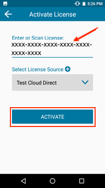
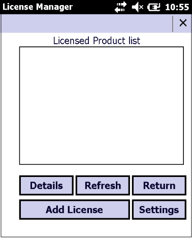
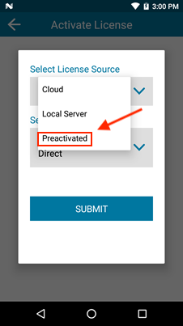
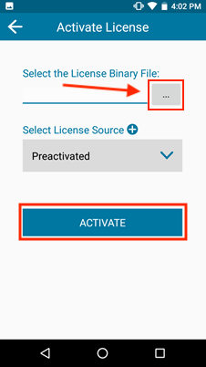

## Overview 

Commercial deployment to devices requires an End-User License (**also known as an "Activation ID"** or AID) issued by Zebra Technologies for each device. Licenses are available for one-, three- and five-year terms, a 90-day trial period, or for perpetual usage. All license types permit an unlimited number of Enterprise Browser-based apps to run on each licensed device. This guide explains the process of obtaining an Enterprise Browser license for commercial use and applying the license(s) to individual devices or as part of a mass-deployment. A given license key can be activated on any number of devices up to the total quantity of licenses purchased, as explained below. 

-----

### Important Licensing Information

* **Enterprise Browser 3.0 and later supports term-based (subscription) licensing</u>** with one-, three- and five-year terms available for purchase. A 90-day trial term also is available (a 30-day evaluation term comes preinstalled with every EB 3.0 download).
* **An “unlicensed software” reminder appears on devices every four hours** beginning one month before the end of all non-evaluation terms. After expiration, the prompt appears every five minutes until an EB license is applied.
* **Perpetual licenses remain in effect**. Read more [about perpetual licenses](#iiaccesslicensingsystem).
* **The Zebra PS20** includes Enterprise Browser 2.x preinstalled with a license that never expires.  
* **Upgrading to Enterprise Browser 3.0 on the PS20** requires purchase of a new license. To upgrade, EB 3.x must be downloaded and installed separately and an EB 2.x or 3.x license purchased and applied.
* **<u>Upgrading from EB 1.x to EB 2.0 (or higher) requires licenses on all devices to be converted to the new licensing model</u>**.  **Need help with license migration? See [License Migration FAQs](https://www.zebra.com/us/en/support-downloads/knowledge-articles/evm/EB1-x-and-EB2-x-FAQ-transition-common-questions.html)**. 
* **Only Android and Windows CE7 devices support cloud-based license deployment**.
* **Windows CE6, Windows Embedded Handheld 6.5 and Windows Mobile devices** can be licensed through a company's own Linux or Windows server or through use of a binary license file downloaded from the licensing portal.
* **Licensed apps running on EB 1.8** (and older) are unaffected; existing licenses remain valid.

> Also see the [Zebra Licensing Portal](https://www.zebra.com/us/en/support-downloads/software-licensing.html) for more information.  
> **NOTE: Date formats vary** between the **License Manager app (MM/DD/YY)** and **EB user interface (DD/MM/YYYY)**. 

-----

### Requirements
***ALL THREE*** of the following are required to activate EB license(s):   

1. **One or more license keys** (aka Activation IDs) purchased for EB 2.0 (or higher) software
2. **One or more supported Zebra device(s) with the correct License Manager app** installed: 
 &nbsp;&nbsp;&nbsp;**Android**: License Manager 3.1.1 or higher (pre-installed on supported devices) 
 &nbsp;&nbsp;&nbsp;**Windows MobileCE**: License Manager 1.0 or higher (included with EB installer) 
3. **One of the following server connections**:  
 &nbsp;&nbsp;&nbsp;**An internet connection** for online activation (Android and/or CE7 <u>only</u>) **OR** 
 &nbsp;&nbsp;&nbsp;**Linux or Windows server** (for off-line activation of any supported device) 

**NOTE**: Only Android and Windows CE7 devices support license deployment from a cloud-based server. Windows CE6, Windows Embedded Handheld 6.5 and Windows Mobile devices must be licensed from an on-premise Linux or Windows server or through use of a binary license file downloaded from the licensing portal.

#### Common Criteria
Some Zebra devices are compatible with Common Criteria for IT Security Evaluation, a standard for certifying the security of computing devices and systems. When in the so-called "CC state" of heightened security, such **Zebra mobile and touch computers are blocked from use of external storage** and other features. [Learn more](/cc).

-----

## I. Contact a Reseller 
The first step in obtaining a license is to engage with Zebra or a Zebra reseller. 

**&#49;. [Visit Zebra's Enterprise Browser Product Page](https://www.zebra.com/us/en/products/software/mobile-computers/mobile-app-utilities/enterprise-browser.html)**  and select one of the methods for contacting Zebra directly or engaging with a reseller or partner. 

**&#50;. Alternatively, select one of the following Zebra resources**: 

* **[Find a Zebra Partner](https://www.zebra.com/us/en/partners/find-a-zebra-partner.html) -** form for submitting an inquiry via the web
* **[How to Select a Channel Partner](https://www.zebra.com/us/en/partners/find-a-zebra-partner/selecting-the-right-channel-partner.html) -** explains the types of partners that engage with Zebra and some of their technologies and specialties
* **[Partner Interaction Center](https://www.zebra.com/us/en/partners/partner-interaction-center.html) -** info for contacting Zebra's existing global partner network
* **[Zebra Corporate Numbers and Links](https://www.zebra.com/us/en/about-zebra/contact-zebra.html) -** broken down by global region
* **[Global Marketing Contact Center](https://www.zebra.com/us/en/about-zebra/contact-zebra/marketing-contact-center.html) -** broken down by global region and country

-----

## II. Access Licensing System
After a licensing agreement is purchased from Zebra or a Zebra reseller, an email is sent to the licensing company's representative containing user credentials for accessing the Zebra Enterprise Software Licensing system. 

#### Visit the [Zebra licensing support page](https://www.zebra.com/us/en/support-downloads/software-licensing.html), register and log into the portal to: 

* **Order licenses**
* **Check status** of existing orders
* **Assign licenses** to devices or deployments
* **View inventory and assignments** of current licenses 

#### Available License Types

* **Perpetual License** (never expires)
* **Trail License** (90-day evaluation period)
* **Term-based License**:
 * **5-year** term
 * **3-year** term
 * **1-year** term

* **NOTE: An “unlicensed software” reminder appears on devices every four hours** beginning one month before the end of all non-evaluation terms. After expiration, the prompt appears every five minutes until an EB license is applied. A 30-day term is included with every EB download. 

#### About Perpetual Licenses

* Upgrades to EB 3.x are provided at no charge for all EB 2.x perpetual licenses covered under an Active Zebra OneCare™ Software Maintenance Agreement.
* The same Activation ID (license key) can be used for EB 2.x or EB 3.x (For EB 3.0, a new `.apk` must be deployed).
* Customers not under maintenance can purchase Zebra OneCare™ for their EB 2.x licenses and access EB 3.x software at no extra charge. 
* Customers purchasing a maintenance agreement for their perpetual EB 2.x license get access to the EB 3.x perpetual license through the Zebra Software Library portal.

#### Common Criteria
Some Zebra devices are compatible with Common Criteria for IT Security Evaluation, a standard for certifying the security of computing devices and systems. When in the so-called "CC state" of heightened security, such **Zebra mobile and touch computers are blocked from use of external storage** and other features. [Learn more](/cc).

-----

## III. Manually Assign License
This section describes the process for activating a license on a single device running Android. To manually activate a license on a device running Windows Moblie/CE, see the [Windows Mobile/CE section](#windowsmobilecedevices). To remotely activate multiple licenses for an entire organization, see the [Mass Deployment section](#massdeployment) of this guide. 

#### License Source Types
* **Cloud-based server** (internet connection required)
* **Local server** (on customer premises)
<!-- available only under special circumstances
* **Pre-activated** (binary file pushed to device) 
 -->

#### Connectivity Options
* **Production Cloud Direct -** License Manager maps automatically to web-based Zebra Licensing Server to activate licenses; no server configuration required.
* **Production Cloud Through Proxy -** License Manager maps automatically to web-based Zebra Licensing Server through customer's on-premise proxy server. Requires configuration of proxy server settings. 
* Custom Cloud - **Reserved for future use**. <!-- If a custom or relay server is used to manage licensing, a unique URL and server name can be added as a separate license source to appear in future source lists.   -->
* Test Cloud Direct - **For Zebra internal use only**.
* Test Cloud Through Proxy - **For Zebra internal use only**.

#### BEFORE BEGINNING
* **Confirm that the clock is set correctly on the device to ensure proper license-application behavior**. 
* **License-key barcodes are not provided by Zebra**; they can be created by the licensee to ease the activation process. Keys also can be typed in manually. 
<!-- * License sources added using this process are subsequently available for selection in the "Select License Source" drop down list.
 -->

#### To activate a device license:  

1. Locate and **launch the License Manager** app:

_Click image to enlarge; ESC to exit._
 
2. On launch, License Manager displays active licenses (if any).  
**Tap the floating action button**:

 _Click image to enlarge; ESC to exit._
 
3. When the Activation screen appears: 
 1. **Enter the license key (Activation ID)**: 
 
 _Click image to enlarge; ESC to exit._
  
 2. **Tap "Select License Source"**and select desired options. 
 3. **Tap SUBMIT** button.  
 If prompted to set device clock, **Tap "Continue."** The "Activation" screen reappears: 

_Click image to enlarge; ESC to exit._
 
4. **Tap Activate**.  

_Click image to enlarge; ESC to exit._
 

Successful license activation is indicated by a screen similar to the image below: 

_Click image to enlarge; ESC to exit._
 

#### The Android device is now licensed to use Enterprise Browser 2.x or later. 

-----

### Windows Mobile/CE Devices
Zebra provides License Manager apps for its devices running Android and Windows Mobile/CE. **License Manager 1.0 (or higher) is required for licensing Windows Mobile/CE devices**, and is included with the Microsoft Installer (MSI) file (when installing from Windows) and as a `.CAB` file when installing from macOS. 

> `IMPORTANT:` **Zebra recommends using StageNow to generate XML files** required for this process. [Download StageNow](https://www.zebra.com/us/en/support-downloads/software/utilities/stagenow.html), a free desktop tool for Windows. 

#### To activate a license on a device running Windows Mobile/CE: 

1. **Push the XML file** required for license activation to the device. 
2. Locate and launch License Manager on the device.  
Current licenses on the device (if any) are shown along with a series of buttons: 

_Click image to enlarge; ESC to exit._
**Details -** displays information about selected license. 
**Refresh -** contacts the licensing server to renew a device license following the purchase of a license renewal. 
**Button functions**: 
**Return -** relinquishes the selected license.  
**Add License -** begins the license activation process. 
**Settings -** displays the License Manager Settings panel. 
3. **Tap "Add License"** button. "About License Manager" screen appears. 
**Tap "License Source"** button.   

_Click image to enlarge; ESC to exit._
 
4. **Select "Production Cloud Direct"** from the server list. 

_Click image to enlarge; ESC to exit._
**Details -** displays information about the selected licensing server. 
**Delete -** removes a user-defined licensing server (none shown).  
5. **Using an EMM system, launch License Manager with command line arguments** similar to those shown. This example was tested using SOTI Mobi control. 

		:::xml
		// for XML file in root directory of device: 
		start "\Program Files\LicenseManager\LicenseManager.exe" activate license.xml

		// for XML file in a specific License Manager folder on device:  
		start "\Program Files\LicenseManager\LicenseManager.exe" activate \Program Files\LicenseManager\license.xml 
 

6. Following the operation, a `Result.xml` file is placed in the same location as the source XML file. 

#### Example
The following XML file selects the cloud-based Zebra Licensing Server as the license source.  

	:::xml
	<wap-provisioningdoc>
		<characteristic type="LicenseMgr" version="8.1" >
			<parm name="LicenseChoice" value="zebra"/>
		<characteristic type="LicenseZebra">
			<parm name="LicenseActionZebra" value="activate"/>
		<characteristic type="NewLicenseZebra">
		<characteristic type="LicenseSourceURL">
			<parm name="LicenseSource" value="Zebra Cloud"/>
			<parm name="LicenseCloudURL" value="2"/>
		</characteristic>
			<parm name="ActivationID" value="0e62-2e66-53ec-4619-86bb-5246-ce58-24d5"/>
			<parm name="ActivationQuantity" value="1"/>
		</characteristic>
		</characteristic>
		</characteristic>
	</wap-provisioningdoc>

<!-- 
#### Activation Using Shortcuts
An EMM system admin deploy use a Windows Mobile/CE shortcut (`.lnk`) file to launch License Manager and activate a license on a device. This can help simplify mass deployment of licenses across an enterprise. 

Shortcuts can be created (using License Manager command line arguments) and pushed to the `WINDOWS/Start Menu`. The License Manager shortcut appears after rebooting the device. Launching License Manager from the shortcut also can execute License Manager with given command line arguments. An example of this process is shown below. 

**To interact with a license server using a shortcut**: 

1. Create an activation XML file called `license.xml`. 
2. Push `license.xml` to the root directory of the device.
3. Create a shortcut called `test.lnk` using the content below: 

		:::xml
		71#"\Program Files\LicenseManager\LicenseManager.exe" activate license.xml
 
Above content says to create a shortcut of LicenseManger.exe and to pass below command line arguments

activate license.xml

Push the test.lnk file to WINDOWS/Start Menu
Reboot the device to see the licensemanager shortcut
Launch the shortcut to execute the command line argument and see the result.xml at root directory.

 -->
-----

## Off-line Licensing
License Manager provides a Local License Server option, enabling organizations to employ an on-premise server to distribute licenses to devices without access to the internet. This option requires software installed on a company's own IP-based Linux or Windows server in advance of license distribution to devices. 

> **For more information, including hardware requirements and setup instructions, download the appropriate Local License Server Administration Guide from the [Zebra License Management support portal page](https://www.zebra.com/us/en/support-downloads/software-licensing.html)**.   **Also see the [License Manager User Guide](https://www.zebra.com/content/dam/zebra_new_ia/en-us/manuals/mobile-computers/miscellaneous/license-manager-ug-en.pdf)**.

#### `IMPORTANT PERSISTENCE NOTES:` 
* **To use StageNow to persist license keys on the device following an Enterprise Reset**:
 * **All License Manager and Persist Manager steps MUST be stored in a <u>SINGLE PROFILE</u>**.
 * **WLAN settings MUST be configured BEFORE license activation steps** in the Profile.
 * **Keys MUST be stored in the** `/enterprise/usr` **folder** on the device.

-----

### From a Local Server

#### Before Beginning

* **Install and configure Local License Server** according to the [relevant admin guide](https://www.zebra.com/us/en/support-downloads/software-licensing.html).
* **Acquire a `.BIN` file containing licenses** (Activation IDs) from Zebra License Server for all devices to be licensed.
* Ensure target devices are connected to the Local Licensing Server.

#### To install licenses from a local server:

1. In the Licensing app, **select Local Server** from the License Source drop-down.  
A screen appears as below:

_Click image to enlarge; ESC to exit._
 
2. **Enter the server URL, provide a name and tap SUBMIT**.   
3. **Enter or scan the license key for the device**.  
Then **Tap Activate**. 

_Click image to enlarge; ESC to exit._
 

#### Successful license activation is indicated by a screen similar to the image below:

 
 _Click image to enlarge; ESC to exit._
 

-----

### From Preactivated License Keys

#### `IMPORTANT RESTRICTIONS:`
* **Preactivated licenses are valid only on the day they are generated**.
* If multiple preactivated licenses are generated, **they must be applied in the same order as generated**.
* Preactivated licenses must be applied before all other license actions.
* **If combining the application of Activation IDs and preactivated licenses** in the same configuration Profile, **preactivated licenses must be applied first**.

#### Before Beginning
* **Acquire a `.BIN` file containing licenses** (Activation IDs) from Zebra License Server for all devices to be licensed.

#### To install licenses from preactivated keys 

1. Push preactivated license keys (as `.BIN` files) to device(s). 
2. In the Licensing app, **select Preactivated** from the License Source drop-down.  

_Click image to enlarge; ESC to exit._
 
2. **Navigate to the file on the device, select it and tap ACTIVATE**.   

_Click image to enlarge; ESC to exit._
 
3. Confirm successful license activation by a screen similar to the image below: 

_Click image to enlarge; ESC to exit._
 

#### The device is now licensed to use Enterprise Browser. 

-----

## Mass Deployment 

Mass-deployment of Enterprise Browser device licenses requires use of an Enterprise Mobility Management (EMM) system and/or Zebra StageNow tools and its [License Manager Setting Type](https://techdocs.zebra.com/stagenow/latest/csp/license/).

#### `IMPORTANT NOTES:`
* **The procedures described below include only those for deploying and activating licenses for EB 2.0 (or later)**. They **DO NOT** include the purchase process for license activation IDs nor configuration of the network and device clock settings, which are required to download the app and properly apply the license(s).
* **To set license keys to remain on the device following an Enterprise Reset**, keys MUST be stored in the `/enterprise/usr` folder on the device and <u>in a single Profile</u> activated using License Manager and preserved using [Persist Manager](/mx/persistmgr).

### Prerequisites

* Profiles for correctly configuring device clock and network settings
* Software License key(s) (aka Activation IDs)
* All necessary EB 2.x application (binary) files

> **Zebra recommends testing any new Profile on a working device before general deployment**.

-----

#### To create the licensing portion of a StageNow Profile:

1. **Launch StageNow and select “Create new Profile"** from the left-hand pane.  
The "Select a Wizard" dialog box appears.
2. **Select MX version to match device**, click "Xpert Mode" and click the "Create" button.
3. **Enter a Profile name and click "Start"** button.
4. **Single-click LicenseMgr** (scroll down if necessary); then **click "Update"** button. 
5. **Under "License action type:" select “Perform Zebra license action.”** Additional options appear: 

_Click image to enlarge; ESC to exit_.
 
6. **Set the parameters as required** to activate the license: 
 **a. For cloud-based licensing**:  
 	**Zebra recommends this option for the best device visibility from the licensing portal**: 
	* **Zebra license action**: Activate AID -> select "Use one of the Zebra Licensing cloud options" 
	* **Cloud Source**: "Use the Zebra licensing Production Cloud"  
	* Enter the AID and quantity. **Select "Continue"** 

 **b. For local (on-premise) licensing**: 
 	**Best for fire-walled networks or those lacking internet access**:  
	* **Zebra license action**: Activate AID -> select "Use a local license server option" 
	* **Enter the URL, friendly name, AID and quantity** 
	* **Select Continue**  
7. **To persist license key(s)** on the device following an Enterprise Reset:  
 **a. Download(†) and save key(s) as `.BIN` file(s) to** `/enterprise/usr` folder on the device 
 **b. <u>From a single Profile</u>**: 
     * **Activate key(s) using License Manager** (licensing method="reference a preactivated license file already on the mobile device") 
     * **Preserve settings using [Persist Manager](/mx/persistmgr)** 

8. **Complete Profile creation and scan the staging barcode**
9. **Confirm that the Profile successfully licensed the device**:  
 a. **Launch the License Manager app** on the device; activated license should be visible 
 b. **Alternatively, launch EB 2.0 on the device** and view licensing status on splash screen  
 c. **Quantity of available licenses visible on the licensing portal should decrease** by the number of licenses deployed. A list of device IDs also is visible there 

**(†)** To download a License key as a `.BIN` file from the Zebra Licensing Portal, select "Download Capability Response" from the Device Action menu. Each `.BIN` file contains a license for a specific device.

Also see [related guides](#relatedguides). 

-----

## License Transfer
Enterprise Browser supports the transfer of licenses from one device to another if the device licenses were originally activated using a cloud-based or local licensing server. This is done by returning the activated license(s) to the pool (using License Action "Return") and activating them on new device(s).

See the [License Manager section](https://techdocs.zebra.com/stagenow/latest/csp/license/) of Zebra's StageNow tool for details.

-----

## Logging

**On Android devices**, License Manager activities are captured in adb and RXLogger log files. 

**On Windows Mobile/CE devices**, License Manager activities are written to `LM_Log.txt` in the app's install directory. 

-----

## Notes and FAQ

The following notes are derived from frequently asked questions about device licensing and apply to most licensing scenarios. 

* **Licenses erased by a [Factory Reset](/mx/powermgr/#enterprisereset) can be reissued <u>to the same device(s) using the same StageNow Profile</u>** and the same License Source (i.e. cloud-based or local server). 
* **When ordering additional unit entitlements for an existing site license, include the Activation ID** with the order to ensure that the same EMM policy can be used for the additional devices.
* **The fastest way to deploy a trial license on a device** is by using the License Manager app and the [manual license assignment](#iiimanuallyassignlicense) procedures above.
* **Device licenses can be activated using**: 
 * StageNow and the [License Mgr CSP](https://techdocs.zebra.com/stagenow/latest/csp/license/)
 * OEMConfig tool, part of Zebra's EMM Toolkit (available to authorized partners only)

-----

## Related Guides

* **[Zebra StageNow](/stagenow)** | A free Windows app for remote device staging, licensing and mass deployment 
* **[Zebra License Manager User Guide](https://www.zebra.com/content/dam/zebra_new_ia/en-us/manuals/mobile-computers/miscellaneous/license-manager-ug-en.pdf)** | Guide to a free Android app for manually licensing devices
* **[Zebra.com Licensing Page](https://www.zebra.com/us/en/support-downloads/software-licensing.html)**| Additional user manuals, how-to videos and relevant links
* **[Enterprise Browser Setup Guide](../setup/)** | Help with initial setup, connecting to devices and pushing files
