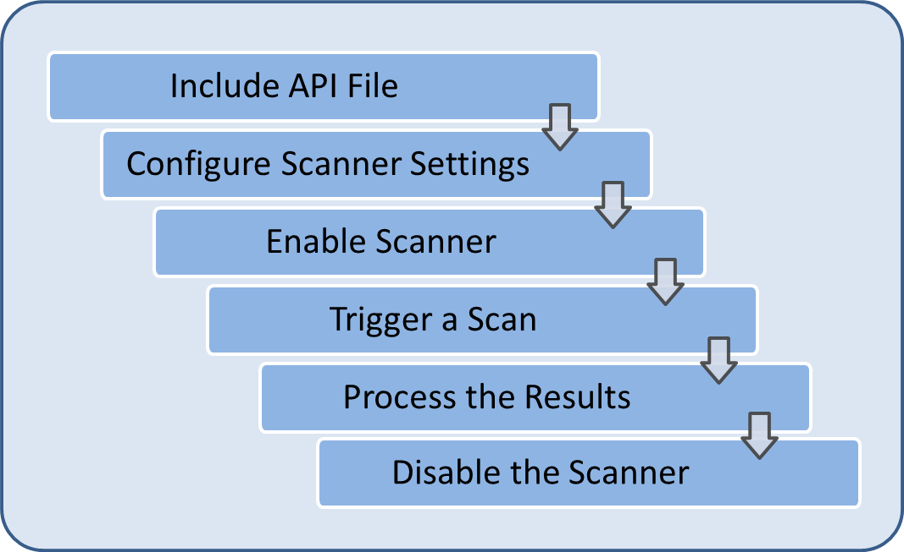
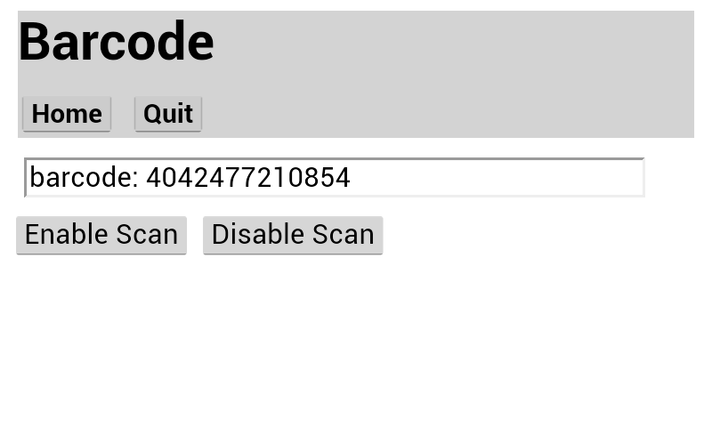
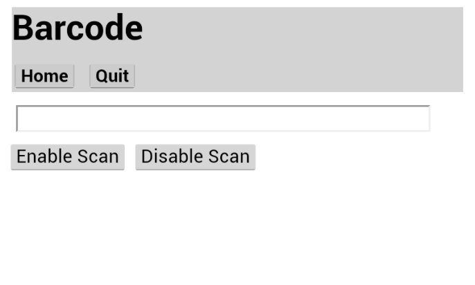
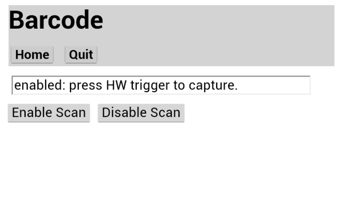
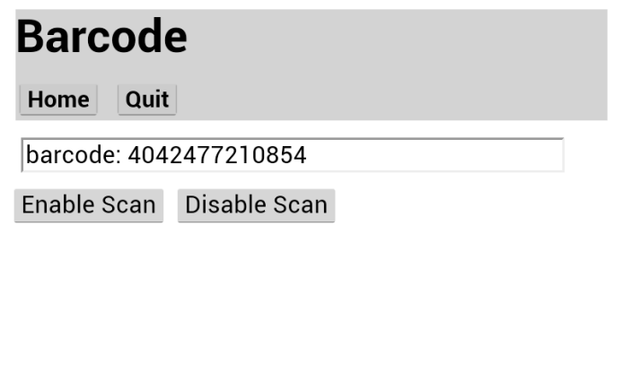
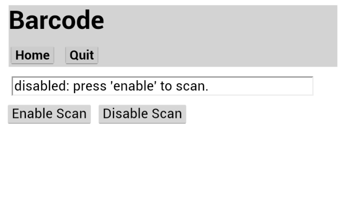

This tutorial covers the use of the Enterprise Browser Barcode API.

##Prerequisites

The following are required to complete this tutorial:

* A background in HTML, CSS and JavaScript coding
* Enterprise Browser installed on a development PC 
* A Zebra mobile device and USB cable
* Enterprise Browser installed on the Zebra device 

##Coding for the Barcode API

Enterprise Browser includes an API for scanning barcodes. The steps shown below are typical for code that uses this API. The following tutorial will walk through creating a working barcode example application using these steps. 

The resulting application will look like this:

##Creating the App

The following HTML template will be used as a starting point for this tutorial. It includes the following features:

* Home button that returns the user to an Enterprise Browser index page 
* Quit button that exits Enterprise Browser
* Styling to size components in an appropriate manner for use on a device

HTML Starter Template:

	:::html
	<HTML>
		<HEAD>
			
		</HEAD>
		<BODY>
			<h1>Barcode
			<button onclick="window.location.href='./index.html'">Home</button>
			<button onclick="EB.Application.quit();">Quit</button>
			</h1>
			

			

		</BODY>
	
	</HTML>

###STEP 1: Create the application file

* **Create a directory** on your development machine for application files.
* **Create a file named `barcode.html`** in your application directory and open it in a text editor. Make sure the app isn't adding an invisible '.txt' extension. 
* **Copy and paste the contents of the starter template above into the file** and save it.

###STEP 2: Add input field and control buttons.
* **Add an input field to the `content div` section** of the `barcode.html` file you just created: 

Sample HTML:

	:::html
	<input id="scanData" type=text >

Next we'll add two buttons: one to enable scanning and another to disable scanning. We'll append these two lines of code in a later step. For now: 

* **Add two input buttons immediately after the input field**: 

Sample HTML:

	:::html
	<input type=button value="Enable Scan">
	<input type=button value="Disable Scan">        

###STEP 3: Include the API JavaScript file

The Barcode API requires the Enterprise Browser API JavaScript file. 

* **Copy the `ebapi-modules.js` file** from **C:\EnterpriseBrowser\JavaScriptFiles\EnterpriseBrowser** to your application directory. 

To include this JavaScript file in your app, 
 
* **Add the following to `barcode.html`** as the first line in the HEAD section: 

Sample HTML:

	:::html
	

###STEP 4: Configure scanner settings and enable scanner
* **Add the method`fnScanEnable()` to the SCRIPT section** that appears **between the end BODY tag and the end HTML tag**: 

Sample JavaScript:

	:::JavaScript
	function fnScanEnable() { 
 	 	EB.Barcode.enable({allDecoders:true},fnBarcodeScanned); 
  		document.getElementById('scanData').value 
  	 = "enabled: press HW trigger to capture.";   
	}
        
In this method, two parameters are being passed to the `enable()` method. The first parameter is a hash including settings for the scanner. The second is a callback function that will be executed when data has been successfully captured. The second line of code displays a message notifying the user that the device is ready to scan. 

###STEP 5: Trigger a scan

In the demo app, **scans will be triggered by pressing the device's hardware trigger button**. If desired, **it's also possible to trigger scans from an on-screen button by setting up the button to call the `EB.Barcode.start()` method**.

For more information about using this method, please refer to the [Enterprise Browser Barcode API documentation](../../api/barcode).

###STEP 6: Process the results
* **Add the method`fnBarcodeScanned()` at the end of the SCRIPT section** to process scan results:

Sample JavaScript: 

	:::JavaScript
	function fnBarcodeScanned(jsonObject) {
 	 console.log("Barcode Scanned:{" + JSON.stringify(jsonObject) + "}");
 	 document.getElementById('scanData').value = "barcode: " + jsonObject.data;
	}

`fnBarcodeScanned()` is a callback function we passed to `enable()`in the previous method. The JSON object passed to the function contains data captured during the scan. A `console.log()` statement is used to show the JSON object's contents for testing purposes. The last line takes the data attribute from the object and displays it in a text input field.

###STEP 7: Disable the scanner
* **Add the method `fnScanDisable()` to the SCRIPT section**:

Sample JavaScript:

	:::JavaScript
	function fnScanDisable() { 
  	EB.Barcode.disable(); 
  	document.getElementById('scanData').value = "disabled: press 'enable' to scan.";  
	}

The `EB.Barcode.disable()` method on the first line shuts down the scanner and prevents additional data captures. The second line displays a message for the user. 

###STEP 8: Hook JavaScript method to buttons

Now that the JavaScript functions have been created, we can hook them to the control buttons.  

* **In `barcode.html`, append `onClick` handler code to the input button tags** we created earlier (or simply replace the buttons created earlier with the function-appended button code below): 

Sample HTML:

	:::HTML
	<input type=button value="Enable Scan" onClick="fnScanEnable();">
	<input type=button value="Disable Scan" onClick="fnScanDisable();">         

###STEP 9: Copy files to the device

To test the application, you need to copy the application files to the device and set the StartPage setting in the Enterprise Browser `config.xml` file. Android- and Windows-based devices use different methods for transferring files. Please see the documentation for your device for specific instructions on copying files. 

In general, here's what is required:

1. **Create a directory on your device** for the Barcode application. Make sure the directory is in an unrestricted location to avoid any permissions issues when Enterprise Browser tries to open the files. We'll place our sample app's files in the device's root directory and show you how to modify the `config.xml` file accordingly. 
2. **Copy the `barcode.html` and any JavaScript API files** you have included to the directory you created on the device. 
3. **Copy the `config.xml` file to a suitable location on the development machine** from the Enterprise Browser install directory on the device and open it in a text editor. 
4. **Update the StartPage setting in `config.xml` to point to the location on the device** where you placed `barcode.html` and save the changes. 
5. **Copy the `config.xml` file back to its original location on the device**. 

Sample `config.xml` showing path to Android app in root directory: 

	:::HTML
		<General>
			<Name value="Barcode"/>
			<StartPage value="file:///barcode.html" name="Barcode"/>
			<UseRegularExpressions value="1"/>
		</General>

##STEP 10: Testing the app

* **Tap the Enterprise Browser icon on the device**. If the device is not yet licensed for Enterprise Browser, you will see the following screen:

* **Click on the cancel button** in the upper right hand corner of the screen to dismiss the message and open the Barcode app. If you turn the device sideways it should look like this:

* **Click on the Enable Scan button**.

* **Press the device's hardware trigger button**, point the device at a barcode and wait until you hear a beep signaling that the code has been captured. You should see the barcode number displayed in the input field. 

* **Click the Disable Scan button**. Then try pressing the device's hardware trigger again. This time the device should not scan. 

###Conclusion

This completes the Enterprise Browser Barcode API tutorial. For more information on the Barcode API, please refer to the [Enterprise Browser Barcode API documentation](../../api/barcode). 

