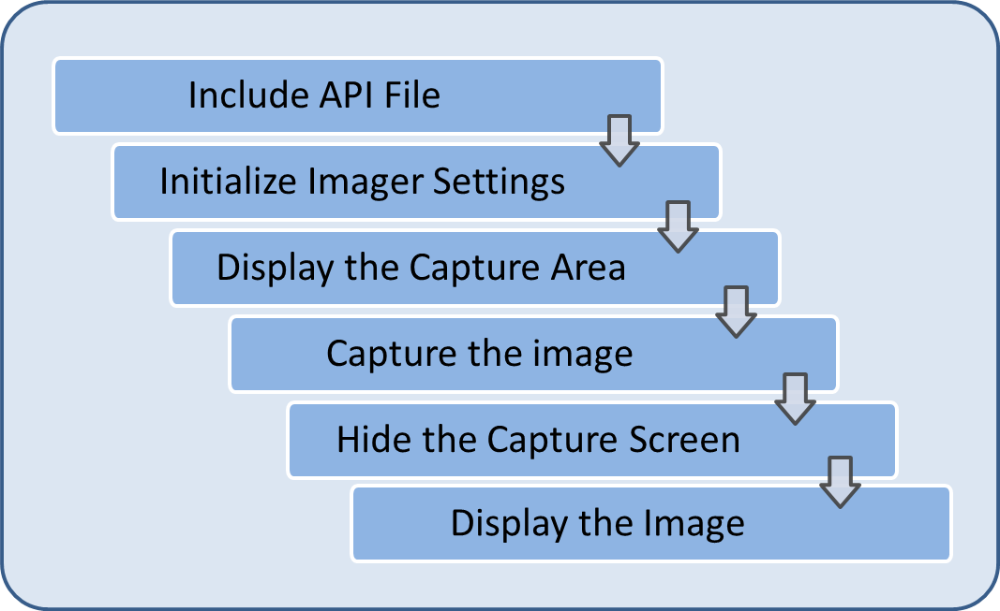
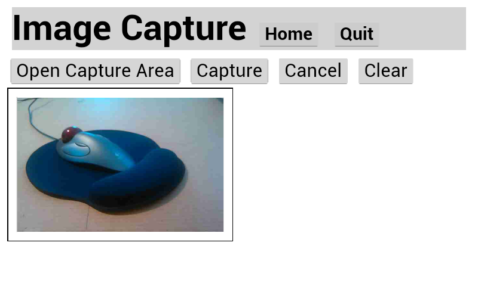
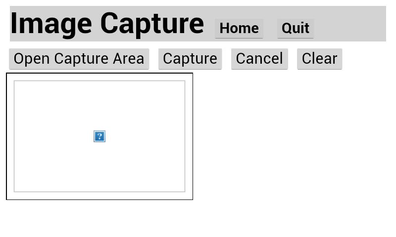



This tutorial covers the use of the Enterprise Browser Imager API for capturing images using a device's camera hardware.

##Prerequisites

The following are required to complete this tutorial:

* A background in HTML, CSS and JavaScript coding
* Enterprise Browser installed on a development PC
* A Zebra mobile device and USB cable
* Enterprise Browser installed on the Zebra device

##Coding for the Imager API

Enterprise Browser includes an API for capturing images using a device's on board camera hardware. The steps shown below are typical for code that uses this API. 

The following tutorial will walk through creating a working example application using these steps. 

The resulting example application will look like this:

##Creating the App

The following HTML template will be used as a starting point for this tutorial. It includes the following features:

* Home button that returns the user to the Enterprise Browser start page 
* Quit button that exits Enterprise Browser
* Styling to size components in an appropriate manner for use on a device

HTML Starter Template:

    :::HTML
    <HTML>
        <HEAD>
            
            
        </HEAD>
        <BODY>
            <h1>Image Capture
            <button onclick="window.location.href='./index.html'">Home</button>
            <button onclick="EB.Application.quit();">Quit</button>
            </h1>
            

            
 
            

            

        </BODY>
    
    </HTML>

###STEP 1: Create the application file
* **Create a directory** on your development machine for application files. 
* **Copy the `ebapi-modules.js` file** from C:\EnterpriseBrowser\JavaScriptFiles\EnterpriseBrowser to your application directory. The Quit button relies on code in this JavaScript file. 
* **Create a file named `imgcap.html`** in your application directory and open it in a text editor.
* **Copy the contents of the starter template above** into the file and save it.

###STEP 2: Add image display area and control buttons
* **Add four input buttons to the `controls div`** of `imgcap.html`. 

The first button will be used to activate the image capture area. The others will be used to cancel the capture, capture an image and clear a currently displayed image.

Sample HTML:

    :::HTML
    <input type=button value="Open Capture Area">
    <input type=button value="Capture">
    <input type=button value="Cancel">
    <input type=button value="Clear">

* **Add an img element to the `content div`** that can be used to display captured images. 

Sample HTML:

    :::HTML
    

   
###STEP 3: Include the API JavaScript file
* **Copy the `elements.js` file** from C:\EnterpriseBrowser\JavaScriptFiles\BackwardCompatibility to your application directory. The Imager API requires this JavaScript file. 
 
* **Add the following to `imgcap.html`** as the first line in the HEAD section. 

Sample HTML:

    :::HTML
    

###STEP 4: Initialize capture settings and display capture area

* **Add the method `fnImgCaptureEnable()` (without the line numbers)** to the SCRIPT section, which is between the end BODY tag and the end HTML tag.  

Sample JavaScript: 

    :::JavaScript
     1. function fnImgCaptureEnable(){
     2.   imager.top = 155;
     3.   imager.left = 25;
     4.   imager.width = 350;
     5.   imager.height = 240;
     6.   imager.imagerCaptureEvent = 'onImageCapture(%json)';
     7.   keyCapture.triggerEvent = 'fnImgCapture()';       
     8.   imager.enable(); 
     9. }

Lines 2&ndash;6 set the on-screen location of the displayed image capture area. Line 6 sets a callback function that will be called after an image capture is triggered. Line 7 maps the hardware trigger on the device to a function used to execute the image capture. And line 8 calls the `enable()` function, which displays the image capture area. **DO NOT include the line numbers in your app**. 

###STEP 5: Capture the image

* **Add the method `fnImgCapture()`** at the end of the SCRIPT section:

Sample JavaScript: 

    :::JavaScript
    function fnImgCapture() { 
        imager.capture(); 
        console.log("imager.capture() has been called");
    }

This method will be called when the user clicks on the Capture button or uses the device's hardware trigger button. The `capture()` method will trigger the API to save the current image and use that data to execute the previously set callback function.

###STEP 6: Hide the capture screen
After displaying the image capture area, there may be situations in which the user decides not to take a picture. In such cases, the `fnImgCaptureDisable()` method is used to cancel the image capture and un-map the hardware trigger button.

* **Add the method `fnImgCaptureDisable()`** at the end of the SCRIPT section:

Sample JavaScript: 

    :::JavaScrtpt
    function fnImgCaptureDisable() { 
      imager.disable();
      keyCapture.triggerEvent = ''; 
    }

###STEP 7: Display the image
* **Add the method `fnImgCaptureDisable()`** at the end of the SCRIPT section:

Sample JavaScript:

    :::JavaScript
    function onImageCapture(capData){
      console.log(capData);
      document.getElementById("imgdata").src = capData.imageData;
      fnImgCaptureDisable();
    }

This method takes the image that has been passed as data in the `capData` JSON object and assigns it to the src attribute of the img display element which displays the image on-screen. 

###STEP 8: Add a method to clear the displayed image
* For convenience, we will **add a method to clear the displayed image** at the end of the SCRIPT section:

Sample JavaScript: 

    :::JavaScript
    function fnClearImage() { 
        document.getElementById("content").innerHTML = "";
        console.log("image cleared");
    }

###STEP 9: Hook JavaScript methods to buttons
Now that the JavaScript functions have been created, we can hook them to the control buttons. 

* **In `imgcap.html`, append `onClick` handler code to the input button tags** we created earlier (or **simply replace the buttons created earlier with the function-appended button code below**): 

Sample JavaScript: 

    :::JavaScript
    <input type=button value="Open Capture Area" onClick="fnImgCaptureEnable()" >
    <input type=button value="Capture" onClick="fnImgCapture()" >
    <input type=button value="Cancel" onClick="fnImgCaptureDisable()" >
    <input type=button value="Clear"   onClick="fnClearImage()" >

### STEP 10: Copy files to the device

To test the application, you need to copy the application files to the device and set the StartPage setting in the Enterprise Browser `config.xml` file. Android- and Windows-based devices use different methods for transferring files. Please see the documentation for your device for specific instructions on copying files. 

In general, here's what is required:

1. **Create a directory on your device** for the Imager application. Make sure the directory is in an unrestricted location to avoid any permissions issues when Enterprise Browser tries to open the files. We'll place our sample app's files in the device's root directory and show you how to modify the `config.xml` file accordingly. 
2. **Copy the `imager.html` and any JavaScript API files** you have included to the directory you created on the device. 
3. **Copy the `config.xml` file to a suitable location on the development machine** from the Enterprise Browser install directory on the device and open it in a text editor. 
4. **Update the StartPage setting in `config.xml` to point to the location on the device** where you placed `imager.html` and save the changes. 
5. **Copy the `config.xml` file back to its original location on the device**.  

Sample `config.xml` showing path to Android app in root directory: 

    :::HTML
        <General>
            <Name value="Imager"/>
            <StartPage value="file:///imager.html" name="Imager"/>
            <UseRegularExpressions value="1"/>
        </General>

###STEP 11: Testing the App
* **Tap the Enterprise Browser icon** on the device. If the device is not yet licensed for Enterprise Browser you will see the following screen:

* **Click on the cancel button** in the upper right hand corner of the screen to dismiss the message and open the Image Capture app. If you turn the device sideways it should look like this:

* **Click on the Open Capture Area button** to open the capture area. As you move the device around you will see the image change to whatever the device is pointing at. 

* **Focus on the desired image and click on the Capture button**. The image is now fixed and will not change as you move the device around. 
    

* **Click the Clear button** and then click the Open Capture Area button again to open the capture area. Once you see that the area is active click on the Cancel button to cancel the capture. The image on the screen will be removed and the image display area will be empty again.

###Conclusion

This completes the Enterprise Browser Imager API tutorial. For more information on the Imager API, please refer to the [Enterprise Browser Imager API documentation](../../api/Imager).

