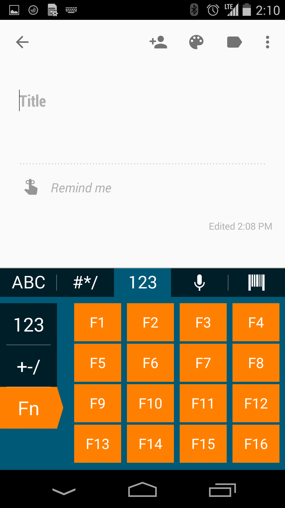

## Overview
Enterprise Keyboard is a alternative keyboard for Android devices with specialized capabilities designed specifically for the workplace. In addition to the features of stock Android keyboard, Enterprise Keyboard has the ability to add industry-specific dictionaries, user-programmable function keys, switch quickly between languages and collect and input scanned data directly into an application.  

Some of the Enterprise Keyboard's specialized capabilities include:  

A row of tabs along the top of Enterprise Keyboard simplifies switching between input modes:

 

The <b>Language tab</b> instantly switched among the installed languages:  

 

The <b>Numerical tab</b> provides sub-tabs for symbols and custom function keys: 

 

<b>Programmable function keys</b> can mimic the hardware keyboards found on some Zebra devices. 

 

The <b>Barcode tab</b> permits scanned data to be collected and input precisely where and when it's needed:

 

[Download Enterprise Keyboard](../../download)

## Supported Devices
This version of Enterprise Keyboard has been approved for use with the Zebra Android devices listed below. It also works on non-Zebra many devices running Android Jelly Bean, KitKat and Lollipop. 

<table class="MsoNormalTable" style="" id="table2" border="1" cellpadding="3" cellspacing="0">
<tbody>

<tr>
<td style="width: 200pt;" width="250">

<b>Device</b>

</td>
<td style="width: 140px;">

<b>
    Android name</b>

</td>
<td style="width: 140px;">

<b>
    Android version</b>

</td>
</tr>

<tr bgcolor="#ccffcc" >
<td style="width: 118.35pt;"  width="250">

ET1 

</td>
<td style="width: 96px;" >

    Jelly Bean

</td>
<td style="width: 96px;" >

4.1

</td>
</tr>

<tr>
<td style="width: 118.35pt;" width="158">

MC40

</td>
<td style="width: 96px;">

Jelly Bean

</td>
<td style="width: 96px;">

4.1

</td>
</tr>

<tr>
<td style="width: 118.35pt;" width="158">

MC40

</td>
<td style="width: 96px;">

KitKat

</td>
<td style="width: 96px;">

4.4

</td>
</tr>

<tr bgcolor="#ccffcc" >
<td style="width: 118.35pt;"  width="158">

TC55

</td>
<td style="width: 96px;" >

    Jelly Bean
</td>
<td style="width: 96px;" >

4.1

</td>

</tr>
<tr bgcolor="#ccffcc" >
<td style="width: 118.35pt;"  width="158">

TC55

</td>
<td style="width: 96px;" >

    KitKat

</td>
<td style="width: 96px;" >

4.4

</td>
</tr>

<tr>
<td style="width: 118.35pt;"  width="158">

MC67

</td>
<td style="width: 96px;" >

    Jelly Bean

</td>
<td style="width: 96px;" >

4.1

</td>
</tr>

<tr bgcolor="#ccffcc" >
<td style="width: 118.35pt;"  width="158">

MC32

</td>
<td style="width: 96px;" >

    Jelly Bean

</td>
<td style="width: 96px;" >

4.1

</td>
</tr>

<tr>
<td style="width: 118.35pt;"  width="158">

TC70

</td>
<td style="width: 96px;" >

    KitKat

</td>
<td style="width: 96px;" >

4.4.2

</td>
</tr>

<tr >
<td style="width: 118.35pt;"  width="158">

TC70

</td>
<td style="width: 96px;" >

    KitKat

</td>
<td style="width: 96px;" >

4.4.3

</td>
</tr>

<tr bgcolor="#ccffcc" >
<td style="width: 118.35pt;"  width="158">

TC75

</td>
<td style="width: 96px;" >

    KitKat

</td>
<td style="width: 96px;" >

4.4

</td>
</tr>

<tr>
<td style="width: 118.35pt;"  width="158">

MC18

</td>
<td style="width: 96px;" >

KitKat

</td>
<td style="width: 96px;" >

    4.4

</td>
</tr>

<tr bgcolor="#ccffcc" >
<td style="width: 118.35pt;"  width="158">

MC92

</td>
<td style="width: 96px;" >

KitKat

</td>
<td style="width: 96px;" >

    4.4

</td>
</tr>

<tr >
<td style="width: 118.35pt;"  width="158">

TC8000

</td>
<td style="width: 96px;" >

KitKat

</td>
<td style="width: 96px;" >

    4.4

</td>
</tr>
</tbody>
</table>

## What's New

New features in Enterprise Keybord 1.0:

* This is version 1.0--the whole thing is new!!  
