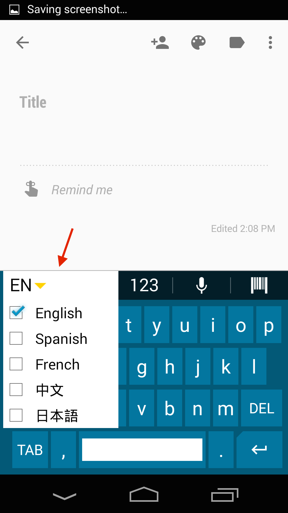

## Overview
Enterprise Keyboard is a soft input device that's designed to provide the most productive means possible of inputting data into Zebra devices. Building on the stock Android keyboard, Enterprise Keyboard adds programmable keys, switches quickly between languages and key layouts, and has the ability to scan data directly into an application. Zebra's keyboard also makes use of the Android Personal Dictionary for spelling suggestions and corrections, and permits customers and partners to populate the device with industry-specific terms to help improve the speed and accuracy of keyboard input. <!-- A Personal dictionary can be populated and mass-deployed through Zebra's Mobility Extensions (MX) and [StageNow](/stagenow/2-2/about/) tools. [Learn more](../settings#personaldictionary).-->

<iframe width="560" height="315" src="https://www.youtube.com/embed/dPzyDFMcJzI" frameborder="0" allowfullscreen></iframe>

This version of Enterprise Keyboard includes the following languages: 

* English (UK)
* English (US) 
* French
* German
* Italian
* Spanish
* Russian

### Unique features  
The Enterprise Keyboard offers the following unique capabilities to help improve input speed and accuracy:  

<b>Switch layouts with taps or swipes</b> across the keypad:  

_The Tab bar automatically hides away when spelling suggestions appear, maximizing screen space for applications_. 
 

<b>Scan directly with the Barcode tab</b> to collect data where and when it's needed:

 

<b>Input long-press characters with a finger-flick</b> of the main key:

 

<!--
The <b>Language tab</b> quickly selects languages to include:  

 
-->

<b>Quickly page through selected languages</b> using the "globe" key:  

 

<!--
The <b>Numerical tab provides sub-tabs</b> for symbol key and custom function key layouts: 

 
-->

<b>Design custom key layouts easily</b> with five remappable keys: 

_Shown here with the EMOJI key (top) and other default key assignments_. 
 

<b>View the keyboard indoors or out</b> thanks to a specially designed color scheme: 
 
_Enterprise Keyboard_:

_Stock Android keyboard_:

 

## How to Get It

Enterprise Keyboard is preinstalled on Zebra devices running Android 5.0 Lollipop and available as an OS patch for Zebra MC40, TC70 and TC75 devices running Android 4.4 KitKat. 

* For help configuring EKB on a Lollipop device, see [Enterprise Keyboard Manager](../../../../mx/enterprisekeyboardmgr).

* Download the MC40/TC70/TC75 OS patch at the [Enterprise Keyboard download page](https://portal.motorolasolutions.com/Support/US-EN/Resolution?solutionId=102423&redirectForm=search&searchQuery=%3FsearchType%3Dsimple%26searchTerm%3DEnterprise%20Keyboard). 

* For more information, please [contact a Zebra representative or partner](https://www.zebra.com/us/en/about-zebra/contact-zebra.html). 
