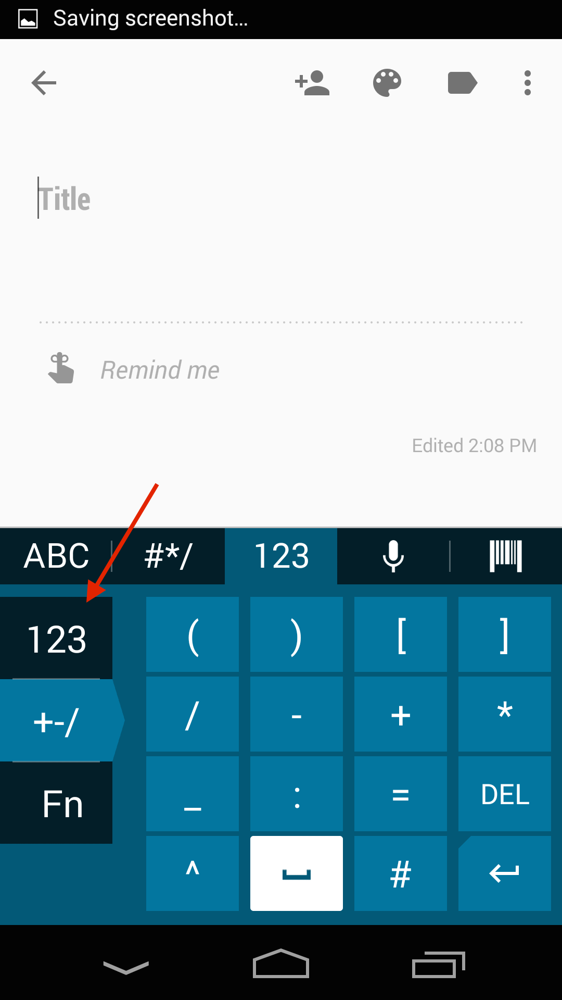

## Overview
Enterprise Keyboard is designed to provide Zebra customers and partners with the most productive means possible of inputting data into Zebra devices. Building on the stock Android keyboard, Enterprise Keyboard adds programmable keys, switches quickly between languages and has the ability to scan and collect scanned data directly into an application. 

Enterprise Keyboard also makes use of Android's Personal dictionary for spelling suggestions and corrections, permitting customers and partners to populate the device with industry-specific terms to help improve speed and accuracy of keyboard input. Zebra allows for mass deployment the Personal dictionary through its Mobility Extensions (MX) and [StageNow](/stagenow/2-2/about/) tools. 

### Specialized capabilities  

A row of tabs along the top of Enterprise Keyboard simplifies switching between input modes:

 

The <b>Language tab</b> for quickly switching among the installed languages:  

 

The <b>Numerical tab provides sub-tabs</b> for symbol key and custom function key layouts: 

 

<b>Programmable function keys</b> can mimic the hardware keyboards found on some Zebra devices (to be released in a future edition). 

 

The <b>Barcode tab</b> permits scanned data to be collected and input precisely where and when it's needed:

 

## Supported Devices
This version of Enterprise Keyboard has been approved for use with the Zebra Android devices listed below. It also works on non-Zebra many devices running Android  KitKat and Lollipop. 

FROM BERNAKE:
We tested on MC40, TC55, TC70, Frenzy and TC8000
@Nader, implied support of derivative products based on the representative products
KitKat and Lollipop

<table class="MsoNormalTable" style="" id="table2" border="1" cellpadding="3" cellspacing="0">
<tbody>

<tr>
<td style="width: 200pt;" width="250">

<b>Device</b>

</td>
<td style="width: 140px;">

<b>
    Android name</b>

</td>
<td style="width: 140px;">

<b>
    Android version</b>

</td>
</tr>

<tr>
<td style="width: 118.35pt;" width="158">

MC40

</td>
<td style="width: 96px;">

KitKat

</td>
<td style="width: 96px;">

4.4

</td>
</tr>

</tr>
<tr bgcolor="#ccffcc" >
<td style="width: 118.35pt;"  width="158">

TC55

</td>
<td style="width: 96px;" >

    KitKat

</td>
<td style="width: 96px;" >

4.4

</td>
</tr>

<tr>
<td style="width: 118.35pt;"  width="158">

TC70

</td>
<td style="width: 96px;" >

    KitKat

</td>
<td style="width: 96px;" >

4.4.2

</td>
</tr>

<tr >
<td style="width: 118.35pt;"  width="158">

TC70

</td>
<td style="width: 96px;" >

    KitKat

</td>
<td style="width: 96px;" >

4.4.3

</td>
</tr>

<tr bgcolor="#ccffcc" >
<td style="width: 118.35pt;"  width="158">

TC75

</td>
<td style="width: 96px;" >

    KitKat

</td>
<td style="width: 96px;" >

4.4

</td>
</tr>

<tr>
<td style="width: 118.35pt;"  width="158">

WT-6000

</td>
<td style="width: 96px;" >

KitKat

</td>
<td style="width: 96px;" >

    4.4

</td>
</tr>

<tr >
<td style="width: 118.35pt;"  width="158">

TC8000

</td>
<td style="width: 96px;" >

KitKat

</td>
<td style="width: 96px;" >

    4.4

</td>
</tr>
</tbody>
</table>

## How to Get It

Enterprise Keyboard will be included in the operating system with every new Zebra device beginning in Q2 2016. 

It also will be available as an OS patch for KitKat devices at a later date. 

