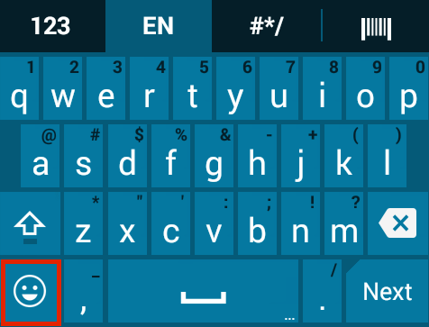

## Overview
Enterprise Keyboard is designed to provide the most productive means possible of inputting data into Zebra devices. Building on the stock Android keyboard, Enterprise Keyboard adds programmable keys, switches quickly between languages and has the ability to scan data directly into an application. 

Enterprise Keyboard also makes use of Android's Personal dictionary for spelling suggestions and corrections, permitting customers and partners to populate the device with industry-specific terms to help improve speed and accuracy of keyboard input. A populated Personal dictionary can be mass-deployed through Zebra's Mobility Extensions (MX) and [StageNow](/stagenow/2-2/about/) tools. [Learn more](../settings#personaldictionary).

This version of Enterprise Keyboard includes the following languages: 

* English (UK)
* English (US) 
* French
* Italian
* German
* Spanish
* Russian

### Unique features  
The Enterprise Keyboard offers the following unique capabilities to help improve speed and accuracy of input:  

<b>Taps or swipes</b> can be used to switch between key-layout tabs:  

 

The <b>Barcode tab</b> permits scanned data to be collected precisely where and when it's needed:

 

<b>Finger-flicks</b> can be used to input the characters (black) otherwise accessed using a long-press:

 

<!--
The <b>Language tab</b> quickly selects languages to include:  

 
-->

When more than one language is selected in the Preferences panel, the <b>Globe icon</b> appears for quickly switching between languages:  

 

<!--
The <b>Numerical tab provides sub-tabs</b> for symbol key and custom function key layouts: 

 
-->

<b>Five remappable keys</b> can be configured to easily create custom key layouts: 

_Shown here with the Emoji key (top) and other default key assignments_. 
 

<b>A specially designed color scheme</b> permits easy viewing indoors and out: 
 
_Enterprise Keyboard_:

_Stock Android keyboard_:

 

<!--
## Supported Devices
This version of Enterprise Keyboard has been approved for use with the Zebra Android devices listed below. It also works on non-Zebra many devices running Android  KitKat and Lollipop. 

FROM BERNAKE:
We tested on MC40, TC55, TC70, Frenzy and TC8000
@Nader, implied support of derivative products based on the representative products
KitKat and Lollipop

<table class="MsoNormalTable" style="" id="table2" border="1" cellpadding="3" cellspacing="0">
<tbody>

<tr>
<td style="width: 200pt;" width="250">

<b>Device</b>

</td>
<td style="width: 140px;">

<b>
    Android name</b>

</td>
<td style="width: 140px;">

<b>
    Android version</b>

</td>
</tr>

<tr>
<td style="width: 118.35pt;" width="158">

MC40

</td>
<td style="width: 96px;">

KitKat

</td>
<td style="width: 96px;">

4.4

</td>
</tr>

</tr>
<tr bgcolor="#ccffcc" >
<td style="width: 118.35pt;"  width="158">

TC55

</td>
<td style="width: 96px;" >

    KitKat

</td>
<td style="width: 96px;" >

4.4

</td>
</tr>

<tr>
<td style="width: 118.35pt;"  width="158">

TC70

</td>
<td style="width: 96px;" >

    KitKat

</td>
<td style="width: 96px;" >

4.4.2

</td>
</tr>

<tr >
<td style="width: 118.35pt;"  width="158">

TC70

</td>
<td style="width: 96px;" >

    KitKat

</td>
<td style="width: 96px;" >

4.4.3

</td>
</tr>

<tr bgcolor="#ccffcc" >
<td style="width: 118.35pt;"  width="158">

TC75

</td>
<td style="width: 96px;" >

    KitKat

</td>
<td style="width: 96px;" >

4.4

</td>
</tr>

<tr>
<td style="width: 118.35pt;"  width="158">

WT-6000

</td>
<td style="width: 96px;" >

KitKat

</td>
<td style="width: 96px;" >

    4.4

</td>
</tr>

<tr >
<td style="width: 118.35pt;"  width="158">

TC8000

</td>
<td style="width: 96px;" >

KitKat

</td>
<td style="width: 96px;" >

    4.4

</td>
</tr>
</tbody>
</table>
-->

## How to Get It

Enterprise Keyboard will be included with Zebra Lollipop devices beginning in Q2 2016. 

It will be available as an OS patch for KitKat devices at a later date. 