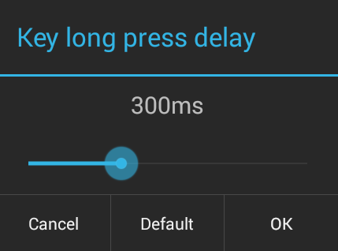

## Overview

Enterprise Keyboard is designed to provide Zebra customers and partners with the most productive means possible of inputting data into Zebra devices. Building on the stock Android keyboard, Enterprise Keyboard adds industry-specific dictionaries, programmable keys, quick switching between languages and the ability to scan and collect scanned data directly into an application. 

numerical
language
medical
industrial
custom 

specialized terms

## Customizing Keyboard Settings

Enterprise Keyboard Settings are accessed through the Android Settings panel: 

&#49;. <b>Open the Settings panel</b> on the device:

 

&#50;. <b>Tap Language and input</b>:

 

&#51;. <b>Tap the Enterprise Keyboard Settings button</b>:

 

&#53;. <b>Tap the setting(s) to change</b>:

------

### Languages
By default, Enterprise Keyboard uses the language selected in the 'Language and input' part of the Android Settings panel: 

To switch from the system-selected language to a language pack provided with Enterprise Keyboard: 

&#49;. <b>Tap on Languages</b> in the Enterprise Keyboard Preferences panel: 

This version of Enterprise Keyboard includes Dutch, English (US and UK), French, Italian, German, Spanish and Russian. 
 

&#50;. <b>Uncheck Use system language</b>. 

 

With Use system language preference unchecked, language packs become available for selection. 

&#51;. <b>Tap one or more languages</b> to select them: 

 

Selected languages will appear in the language  menu in the Enterprise Keyboard: 

 

------

### Preferences
The Preferences section controls keypress feedback and other productivity aids. 

Set preferences as desired. 
 

<b>Auto-capitalization</b> automatically capitalizes the first word of each sentence following a period. 

<b>Double-space period</b> automatically inserts a period and space when double-tapping the spacebar. 

<b>Vibration on keypress</b> sets the device to vibrate when a key is pressed. Duration is configurable in the [Advanced settings](#advanced) section. 

<b>Sound on keypress</b> plays a sound when a key is pressed. Volume is configurable in the [Advanced settings](#advanced) section.

<b>Popup on keypress</b> displays a pop-up of the key being pressed. A delay can be added in the [Advanced settings](#advanced) section.

------

### Text Correction
This is where it gets interesting. 

Text Correction controls

Use this format to define these: 

<b>Block offensive words</b> automatically capitalizes the first word of each sentence following a period. 

<b>Auto-correction</b> USES THE SHORTCUTS YOU CREATED? (what is meant by "spacebar and punctuation automatically correct mistyped words")

<b>Show correction suggestions</b> displays suggested words while typing (like google does?). 

<b>Personalized suggestions</b> TAKES YOUR SHORTCUTS? or learns or populates over time? 

<b>Suggest Contact names</b> automatically gets your contacts into the act. 

<b>Next-word suggestions</b> looks at the previous word and take a guess at what might come next. 

Personal dictionary

 

Add words to the person dictionary. Words must be added one at a time. 

 

Enter word (or phrase?) 

An optional shortcut can be entered that will substitute for the word when typed. For example, "sw" can be the shortcut for "software." 

 

Are these the language packs? (looks like the same list as the supported languages)

------

### Advanced 
The Advanced panel controls the duration of keypress feedback if that feedback is enabled in the Preferences panel. The image below shows sound feedback disabled (by default):  

Tap on a setting to bring up a panel for adjusting that setting: 

<b>Key Popup dismiss delay</b> controls whether to delay when dismissing the key popup. 

 

<b>Keypress vibration duration</b> sets the length of time (from 0 to 100ms) the device will vibrate to indicate that a key was pressed (default = 0ms). 

 

<b>Keypress sound volume</b> controls the loudness (from 0 to 100) of the sound that coincides with a keypress (default = System setting). 

 

<b>Key long press delay</b> sets the time (from 100 to 700ms) a key must be held down before being considered a long-press (default = 300ms).

 

------

### Remapping Keys
Enterprise Keyboard designates five keys as user-programmable. These are in addition to the 16 programmable Function keys invoked by the Function key sub-tab in the Numerical keypad. 

The remapping panel shows the current character and Unicode mappings for each key. The image below shows default settings, including the Alpha P1 key mapped to display the EMOJI panel. 

To remap a key, bring up the Remapping panel and <b>tap on the key to be remapped</b>:

 

<b>Specify a Unicode value or alternative character</b> to associate with that key and tap OK. 

 

------

Refer to the OTHER PARTS ODF THIS GUIDE 

[Advanced Features Guide](../features) for information about Kiosk Mode, Secure Mode, Lockdown State and other special EHS features and behaviors. 

5. Enterprise Keyboard main icon created and added to the project.

3. Showing the Scan tab is now a configurable option in the CSP.

7. Added Swipe left/right to navigate between keyboard layouts.

8. Established Zebra color scheme as well as fine tuning various keyboard layouts (visual and keys presented).

9. Added Keyboard metrics for usage statistics via the Zebra Analytics engine (USER ACCESSIBLE?).

10. Addressed issues with the use of the Personal dictionary and short-cuts.

11. Scanning layout programmatically hidden/visible based on version of DCP (Data Capture Plus) installed for compatibility support.

12. Missing keyboard preferences available via the settings UI have been added to the CSP for completeness.

15. Words added to the personal dictionary with a defined shortcut now appear in the suggestions bar when the shortcut is typed.

24. Key remapping available on four keys in the numeric keyboard layout.
16. The remappable keys available in the numeric layout now set to the following defaults; P1= “/”, P2=”:”, P3=”#”, P4=”$”

17. Custom dictionary mass deployable. Not available for Voalte initial release (5-Feb-16)

19. Gesture parameters removed from keyboard settings as gesturing is not supported.

20. “Prototype” watermark included on QWERTY spacebar to indicate keyboard is not intended for production use.

22. Proper layout presented based on input field type.

23. Barcode scanning layout (tab) added. Not available for Voalte initial release (5-Feb-16)

25. “Flick” feature added to select alternate character on keyboard.

26. Long press behavior reestablished to be consistent with Google keyboard.

27. Mass deployable keyboard settings feature added. Not available for Voalte initial release (5-Feb-16)

Dictionary words are displayed when associated shortcut word is typed.

Key layouts
QWERTY
Numeric
Symbol
Phone
Emoji
Scan

Accessing alternate keys
Press
Shift-press
Long-press
Flick

Languages available today
English
UK-English
French
German
Italian
Spanish
Dutch
Russian
Selectable via long press on spacebar (language or keyboard?)
Toggle between multi-languages “world” button

Key-press feedback
Haptic on keypress (system setting)
Sound on keypress (system setting)
Visual color change on selected key
Key preview above selected key

Correction
Auto-capitalization enable/disable
Show correction suggestions –enable/disable
Personalized suggestions (learned) – enable/disable
Next word suggestion – enable/disable
Personal dictionary – add/delete words

Unique to Zebra: 
Scan key

Layout switching
Integrated tab for layout switching
Swipe left-right for layout switching
Preservation of shift-lock when switching layouts
Automatic based on field type

Provisioning: 
General preferences and settings via CSP
Personal dictionary add/delete words via CSP

Input methods
Touch
Flick
Voice (GMS-enabled devices only)
Scanner

<b>Note</b>: Following installation, the default keyboard selector can be invoked directly by long-pressing the spacebar from the Android or Zebra keyboards.

Known Limitations
Shift lock inadvertently locks after performing a shift lock, typing one letter, switching to another layout to enter some characters; returning to the QWERTY layout and engaging the Shift lock again.  With the intent of typing only a single capitalized letter the Shift lock remains engaged.
