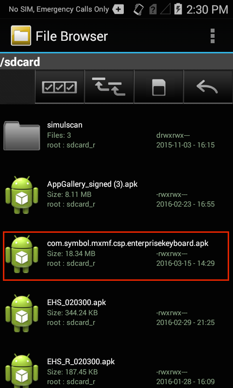
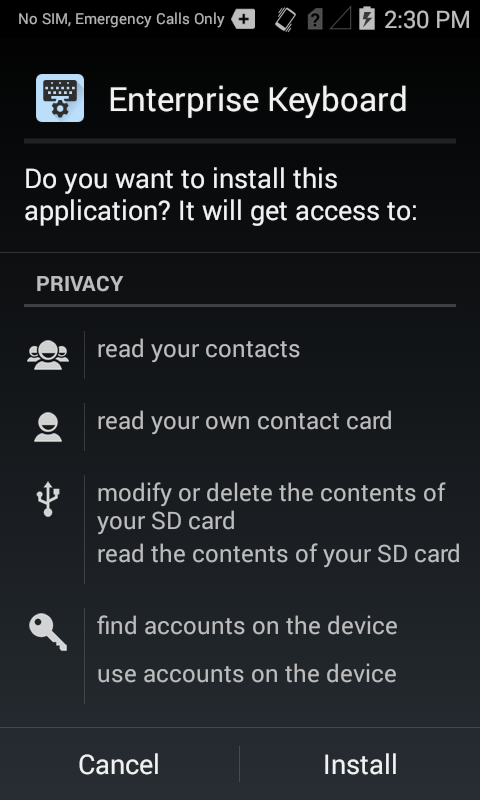
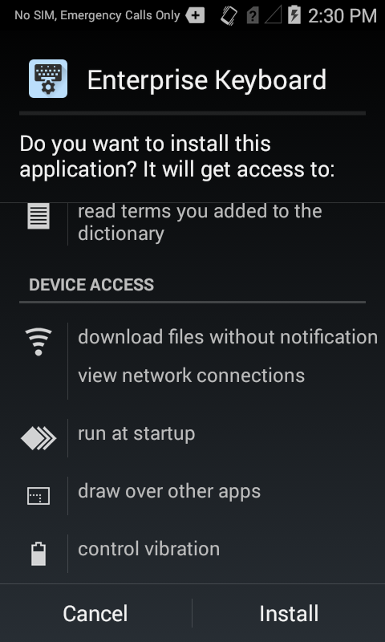
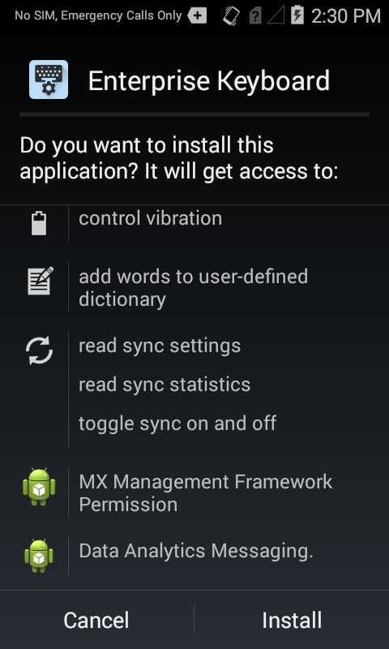
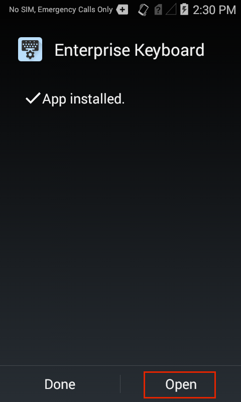
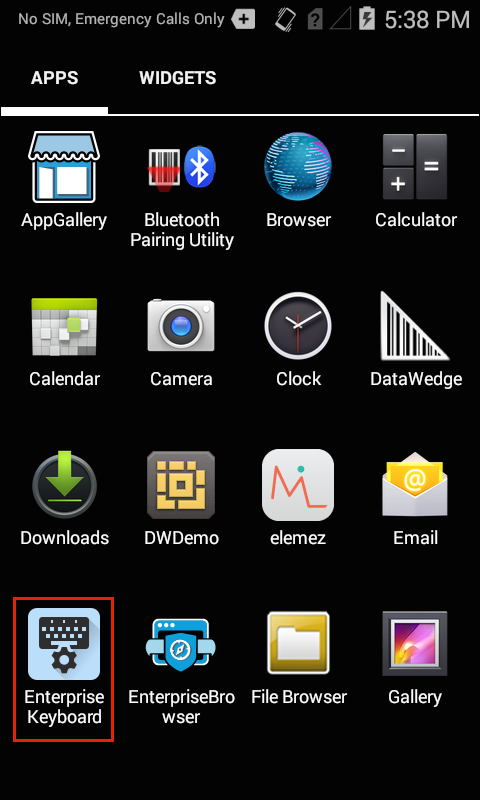
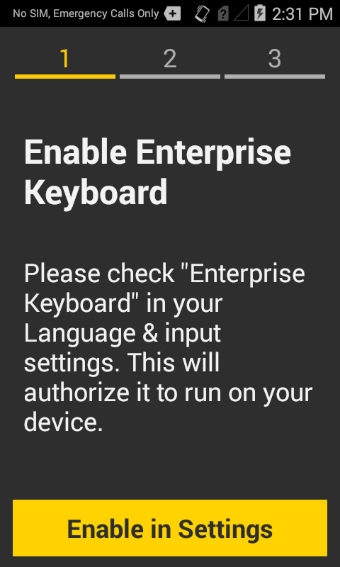
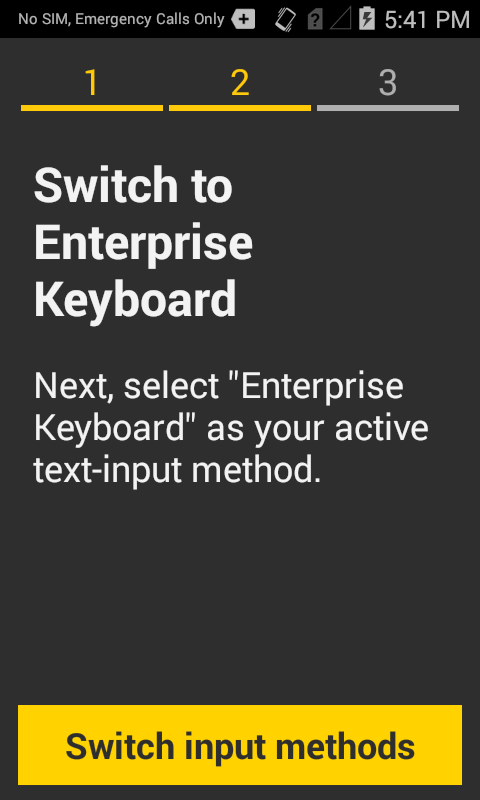

## Overview
Enterprise Keyboard is delivered as an APK andinstalls in much the same way as other Android apps. Its settings can be configured locally or remotely using a mobile device management (MDM) system. EKB also can be set up programmatically through Zebra's [EMDK](/emdk-for-android/4-0/guide/about) or remotely using [StageNow](/stagenow/2-2/about/) tools and [App Manager](/mx/#app-manager) service.

It's delivered as an APK, blah blah blah. 

## Manual Installation

These instructions apply to direct installation (from a computer to a single device) using the installer APK (`FILE_NAME_TBD.apk`). If installing from an MDM, please refer to the [Automated Installation section](#automatedinstallation) below. 

To install Enterprise Keyboard manually: 
&#49;. <b>Connect the device</b> via USB to a PC or Mac.

&#50;. <b>Copy the </b>`FILE_NAME_TBD.apk` <b>file</b> from the PC to any writable device folder.

&#51;. On the device, <b>launch File Browser</b> from the App Drawer:

 

&#52;. <b>Locate and launch</b> `FILE_NAME_TBD.apk`:

 

&#53;. <b>Tap Install</b> after reading the privacy warnings: 

 

After installation, a wizard semi-automates the steps for activating EKB. 

In the Android Settings panel:
1. <b>Open Language and input</b> 
2. Place a <b>check next to 'Enterprise Keyboard'</b> to enable it on the device
3. <b>Select Enterprise Keyboard</b> as the active input device
4. <b>Select a language</b> if other than English (default)

The activation wizard looks like this: 
&#54;. <b>Tap Open</b> to launch the setup wizard.

If 'Done' was accidentally selected instead of 'Open,' launch 'Enterprise Keyboard' from the App Drawer (shown below) to launch the setup wizard the first time after installation. Subsequent launches of the app from the app drawer opens the EKB Settings panel.

 

&#55;. <b>Tap 'Get started' </b> to dismiss the splash screen and start the setup wizard. 

 

&#56;. <b>Tap 'Enable in Settings'</b> to bring up the 'Language and input' panel:

 

&#57;. <b>Check Enterprise Keyboard</b> to enable it on the device. Uncheck other input devices to disable them on the device, if desired. 

&#49;&#48;. <b>Tap the BACK button</b> to bring up the next wizard screen:

...or <b>tap 'Default'</b> in the Language and input panel.  

&#49;&#49;. <b>Tap Enterprise Keyboard</b> to make it the default keyboard. 

  

&#49;&#50;<B>Tap the HOME key</b> to exit the Settings panel.  
 
Enterprise Keyboard setup is complete. 

