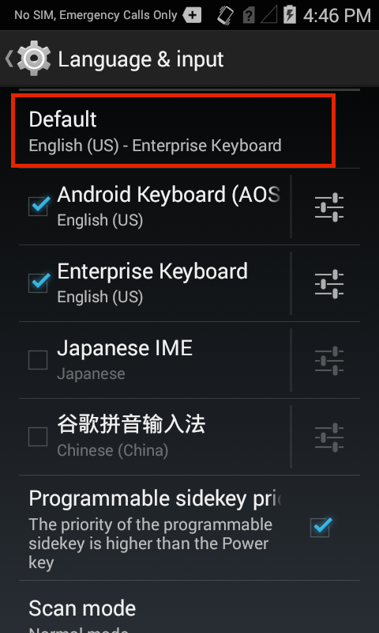

## Overview
The Zebra Enterprise Keyboard is delivered as part of the operating system on Zebra Android devices. To make it available to users, it must be activated and optionally can be set as the default input method, if desired. This guide covers activation of Enterprise Keyboard and the steps for setting it as the default input device. 

Activation and configuration can be done in one of three ways: 

* Manually at the device (covered here)
* Programmatically through [EMDK for Android](/emdk-for-android/4-0/guide/about) development tools 
* Remotely:
    * Using [StageNow](/stagenow/2-2/about/) and the [UI Manager](/mx/uimgr#setdefaultinputmethod) service 
    * Through a company's own mobile device management (MDM) system (if supported by that system) 

## Manual Configuration
The section covers direct activation of Enterprise Keyboard on a single device. If using one of the remote methods referenced above to activate and configure multiple managed devices, please refer to the [Automated Installation section](#automatedinstallation) later in this guide. 

To activate Enterprise Keyboard on a device: 

&#49;. On the device, <b>launch File Browser</b> from the App Drawer:

 

&#50;. <b>Locate and launch</b> `com.symbol.msmf.csp.enterprisekeyboard.apk`:

 

&#51;. <b>Tap Install</b> after reading the privacy warnings: 

 

&#52;. <b>Tap Open</b> to launch the configuration wizard, which  semi-automates the steps for activating Enterprise Keyboard. 

 

<b>Note</b>: If "Done" was accidentally selected instead of "Open," <b>repeat Step 2</b> above, and proceed. 

A configuration wizard splash screen should appear. <b>Tap 'Get started' </b> to dismiss the splash screen and start the wizard: 

 

&#53;. <b>Tap 'Enable in Settings'</b> to bring up the 'Language and input' panel. 

 

&#54;. In the Language and input panel, <b>place a check in Enterprise Keyboard</b> to enable it on the device. Uncheck other input devices to disable them, if desired.

  

&#55;. <b>Tap the BACK button</b> to bring up the next wizard screen. Then <b>tap 'Switch input methods'</b> to continue:

 

&#56;. <b>Tap Enterprise Keyboard</b> to make it the default keyboard: 

&#57;. <B>Tap the HOME key</b> to exit the Settings panel.  

Enterprise Keyboard setup is now complete. 

### Change Settings
Following installation, Enterprise Keyboard settings can be changed through the Android Settings panel. 

To change Enterprise Keyboard settings:

&#49;. <b>Open the Settings panel</b> on the device:

 

&#50;. <b>Tap Language and input</b>:

 

&#51;. <b>Tap Default</b> to set the default input device:

<b>Note</b>: The default input device also can be selected by long-pressing the spacebar whenever the Android or Zebra keyboard is visible.
 

&#52;. <b>Tap the Enterprise Keyboard Settings button</b> to change settings:

 

&#53;. On the Enterprise Keyboard Preferences panel, <b>tap the setting(s) that require change</b>:

For further information about Enterprise Keyboard settings, please refer to the [Customize section](../settings). 

### Automated Installation
Enterprise Keyboard can be configured remotely on multiple managed devices using Zebra's [StageNow](/stagenow/2-2/about/) tools and the [UI Manager](/mx/uimgr#setdefaultinputmethod) service or an organization's own MDM system. Configuration also can be handled programmatically through Zebra's [EMDK for Android](/emdk-for-android/4-0/guide/about) software development kit. 

In the Android Settings panel:
1. <b>Open Language and input</b> 
2. Add a check for <b>'Enterprise Keyboard'</b> to enable it on the device
3. <b>Select Enterprise Keyboard</b> as the default input device
4. <b>Select a language</b> if other than English (default)

Please refer to the respective tool of choice for more information. 

## Uninstallation
<b>Warning: This action will remove the Enterprise Keyboard app and all associated data, including custom dictionaries, if any</b>. 

### Manual Uninstallation
To remove Enterprise Keyboard, simply use the Android App Manager to <b>uninstall Enterprise Keyboard</b>. 

&#49;. <b>Tap Apps</b> to bring up the Android App Manager: 

 

&#50;. Locate and <b>Tap EHS Installer</b>:

 

&#51;. <b>Tap the Uninstall button</b>:

 

&#52;. <b>Click OK</b> to confirm:

 

Manual uninstallation of Enterprise Keyboard is complete. 

### Automated Uninstallation
Enterprise Keyboard can be uninstalled from multiple managed devices using an organization's own MDM server in the same way as other Android apps. Alternatively, remote unstallation can be accomplished through Zebra's [EMDK](/emdk-for-android/4-0/guide/about) or [StageNow](/stagenow/2-2/about/) tools using the [App Manager](/mx/#app-manager) service. 

