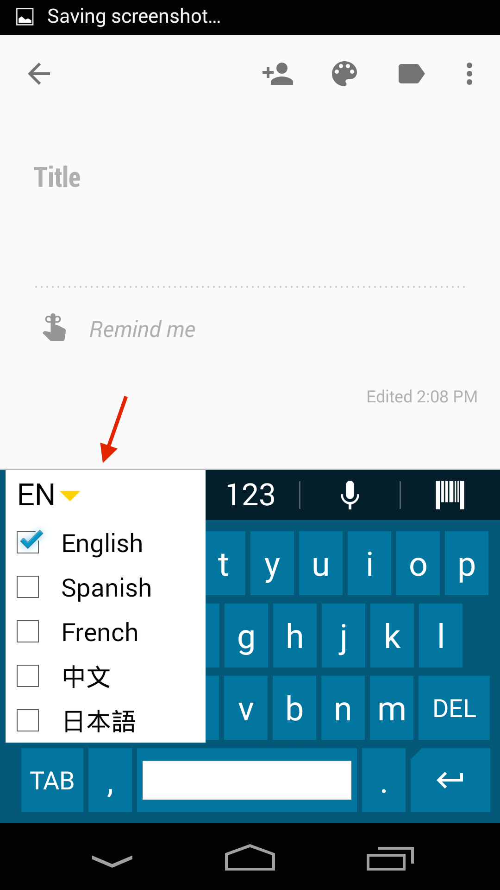
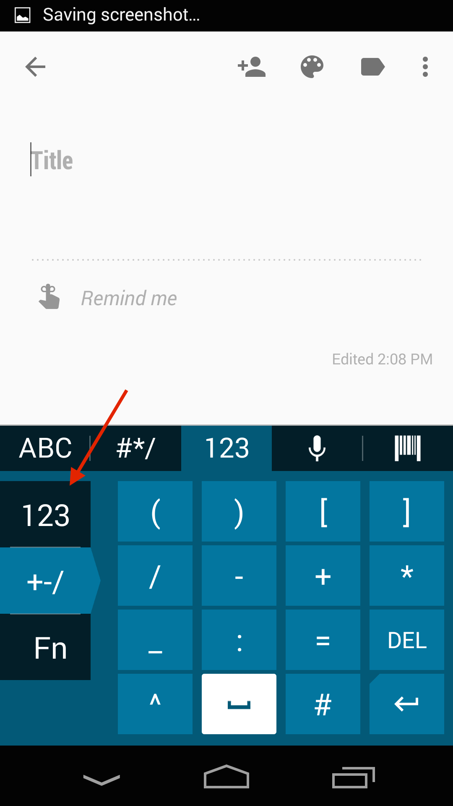

## Overview
Enterprise Keyboard is a soft input device that's designed to provide the most productive means possible of inputting data into Zebra devices. Building on the stock Android keyboard, Enterprise Keyboard adds programmable keys, switches quickly between languages and key layouts, and has the ability to scan data directly into an application. 

<iframe width="560" height="315" src="https://www.youtube.com/embed/dPzyDFMcJzI" frameborder="0" allowfullscreen></iframe>

Enterprise Keyboard 1.1 (and higher) can be activated and configured manually on the device or remotely using [StageNow](../../../../) and the [UI Manager](/mx/uimgr/) service or through a company's own mobile device management (MDM) system (if supported by that system). 

Zebra's keyboard also makes use of the Android Personal Dictionary for spelling suggestions and corrections, and permits customers and partners to populate the device with industry-specific terms to help improve the speed and accuracy of keyboard input. A Personal dictionary can be populated and mass-deployed through Zebra's Mobility Extensions [(MX)](../../../../mx) and [StageNow](../../../../) tools. 

Learn more [about Personal Dictionary](../settings#personaldictionary).

This version of Enterprise Keyboard includes the following languages: 

* English (UK)
* English (US) 
* French
* German
* Italian
* Spanish
* Russian

### Unique features  
The Enterprise Keyboard offers the following unique capabilities to help improve input speed and accuracy:  

<b>Switch layouts with taps or swipes</b> across the keypad:  

_The Tab bar automatically hides away when spelling suggestions appear, maximizing screen space for applications_. 
 

<b>Scan directly with the Barcode tab</b> to collect data where and when it's needed:

 

<b>Input long-press characters with a finger-flick</b> of the main key:

 

<!--
The <b>Language tab</b> quickly selects languages to include:  

 
-->

<b>Quickly page through selected languages</b> using the "globe" key:  

 

<!--
The <b>Numerical tab provides sub-tabs</b> for symbol key and custom function key layouts: 

 
-->

<b>Design custom key layouts easily</b> with five remappable keys: 

_Shown here with the EMOJI key (top) and other default key assignments_. 
 

<b>View the keyboard indoors or out</b> thanks to a specially designed color scheme: 
 
_Enterprise Keyboard_:

_Stock Android keyboard_:

 

<!--
## Supported Devices
This version of Enterprise Keyboard has been approved for use with the Zebra Android devices listed below. It also works on non-Zebra many devices running Android  KitKat and Lollipop. 

FROM BERNAKE:
We tested on MC40, TC55, TC70, Frenzy and TC8000
@Nader, implied support of derivative products based on the representative products
KitKat and Lollipop

<table class="MsoNormalTable" style="" id="table2" border="1" cellpadding="3" cellspacing="0">
<tbody>

<tr>
<td style="width: 200pt;" width="250">

<b>Device</b>

</td>
<td style="width: 140px;">

<b>
    Android name</b>

</td>
<td style="width: 140px;">

<b>
    Android version</b>

</td>
</tr>

<tr>
<td style="width: 118.35pt;" width="158">

MC40

</td>
<td style="width: 96px;">

KitKat

</td>
<td style="width: 96px;">

4.4

</td>
</tr>

</tr>
<tr bgcolor="#ccffcc" >
<td style="width: 118.35pt;"  width="158">

TC55

</td>
<td style="width: 96px;" >

    KitKat

</td>
<td style="width: 96px;" >

4.4

</td>
</tr>

<tr>
<td style="width: 118.35pt;"  width="158">

TC70

</td>
<td style="width: 96px;" >

    KitKat

</td>
<td style="width: 96px;" >

4.4.2

</td>
</tr>

<tr >
<td style="width: 118.35pt;"  width="158">

TC70

</td>
<td style="width: 96px;" >

    KitKat

</td>
<td style="width: 96px;" >

4.4.3

</td>
</tr>

<tr bgcolor="#ccffcc" >
<td style="width: 118.35pt;"  width="158">

TC75

</td>
<td style="width: 96px;" >

    KitKat

</td>
<td style="width: 96px;" >

4.4

</td>
</tr>

<tr>
<td style="width: 118.35pt;"  width="158">

WT-6000

</td>
<td style="width: 96px;" >

KitKat

</td>
<td style="width: 96px;" >

    4.4

</td>
</tr>

<tr >
<td style="width: 118.35pt;"  width="158">

TC8000

</td>
<td style="width: 96px;" >

KitKat

</td>
<td style="width: 96px;" >

    4.4

</td>
</tr>
</tbody>
</table>
-->

## How to Get It

**Enterprise Keyboard 1.1 cannot be downloaded separately**. It's available only as a preinstalled component on some Zebra devices running Android 5.x (Lollipop). 

* For information about remotely configuring EKB on a Lollipop device, see [Enterprise Keyboard Manager](../../../../mx/enterprisekeyboardmgr).

* For more information, please [contact a Zebra representative or partner](https://www.zebra.com/us/en/about-zebra/contact-zebra.html). 
