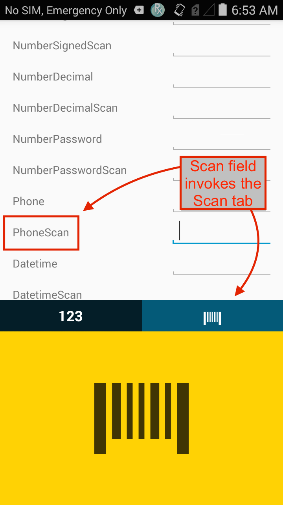
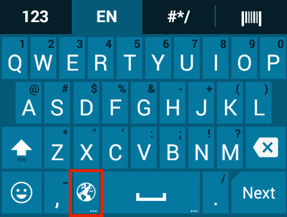

## Overview
Enterprise Keyboard is a soft input device that's designed to provide the most productive means possible of inputting data into Zebra devices. Building on the stock Android keyboard, Enterprise Keyboard adds programmable keys, switches quickly between languages and key layouts, and has the ability to scan data directly into an application. 

<iframe width="560" height="315" src="https://www.youtube.com/embed/dPzyDFMcJzI" frameborder="0" allowfullscreen></iframe>

Enterprise Keyboard (1.1 and higher) can be configured in the following ways: 

* **Manually** on the device
* **Programmatically** through [EMDK for Android](../../../../emdk-for-android) development tools
* **Remotely** using [StageNow](../../../../) and the [UI Manager](/mx/uimgr/) service
* Remotely through a company's own mobile device management (MDM) system (if supported by that system)

Zebra's keyboard also makes use of the Android Personal Dictionary for spelling suggestions and corrections, and permits customers and partners to populate the device with industry-specific terms to help improve the speed and accuracy of keyboard input. A Personal dictionary can be populated and mass-deployed through Zebra's Mobility Extensions [(MX)](../../../../mx) and [StageNow](../../../../) tools. 

Learn more [about Personal Dictionary](../settings#personaldictionary).

This version of Enterprise Keyboard includes the following languages: 

* English (UK)
* English (US) 
* French
* German
* Italian
* Spanish
* Russian

### New in v1.2

<b>A Calculator Mode</b> arranges numerical keys for input with financial apps: 

 

<b>A Telephone Mode</b> arranges numerical keys like a phone:  
 
 

<b>New portrait layouts cater to tablets and wearables</b> such as the ET50/ET55 and WT6000:  

 

 

<b>A Flick Enable/Disable switch</b> simplifies control of this time-saving input feature:  
 
 

<b>Supports [dynamic selection](../settings/#dynamicinputmethod) of text- and scan-tab focus</b> to match the desired input:  
 
 
 
 

### Unique features  
All versions of Enterprise Keyboard offer these other unique capabilities to help improve the speed and accuracy of input:  

<b>Switch layouts with taps or swipes</b> across the keypad:  

_The Tab bar automatically hides away when spelling suggestions appear, maximizing screen space for applications_. 
 

<b>Scan directly with the Barcode tab</b> to collect data where and when it's needed:

 

<b>Input long-press characters with a finger-flick</b> of the main key:

 

<!--
The <b>Language tab</b> quickly selects languages to include:  

 
-->

<b>Quickly page through selected languages</b> using the "globe" key:  

 

<!--
The <b>Numerical tab provides sub-tabs</b> for symbol key and custom function key layouts: 

 
-->

<b>Design custom key layouts easily</b> with five remappable keys: 

_Shown here with the EMOJI key (top) and other default key assignments_. 
 

<b>View the keyboard indoors or out</b> thanks to a specially designed color scheme: 
 
_Enterprise Keyboard_:

_Stock Android keyboard_:

 

## How to Get It

Enterprise Keyboard 1.2 comes preinstalled on some Zebra devices and can be downloaded for others. See [Download page](../../download) for details. 

For more information, please [contact a Zebra representative or partner](https://www.zebra.com/us/en/about-zebra/contact-zebra.html). 
