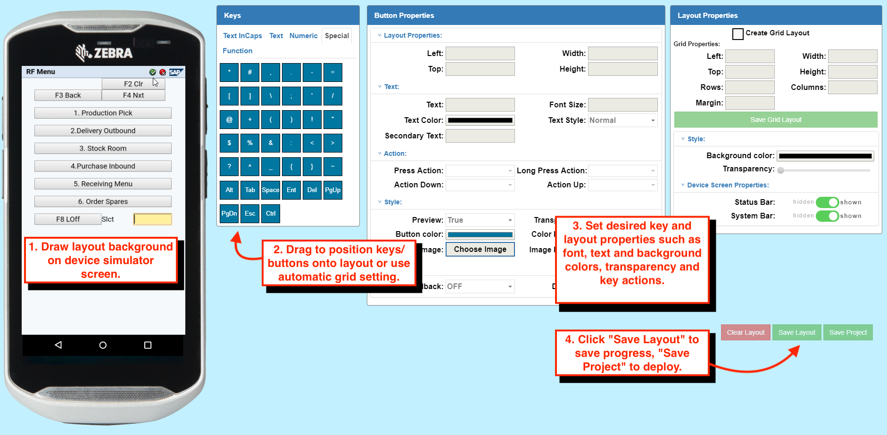
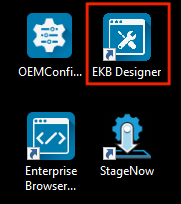
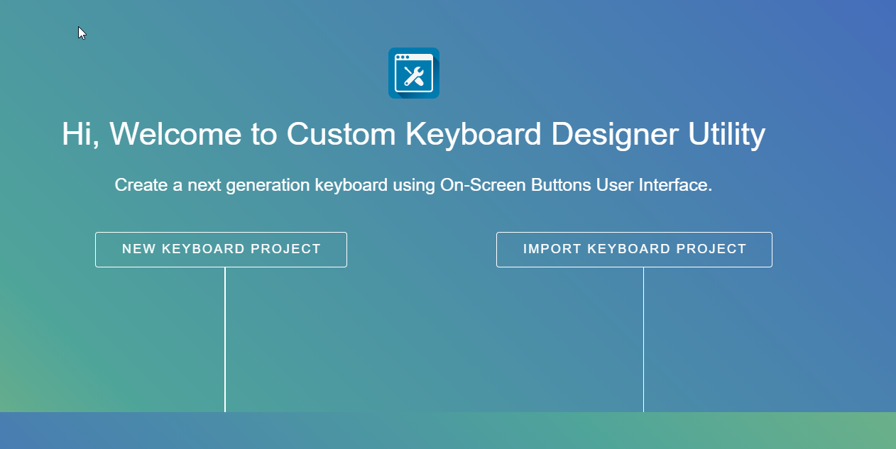
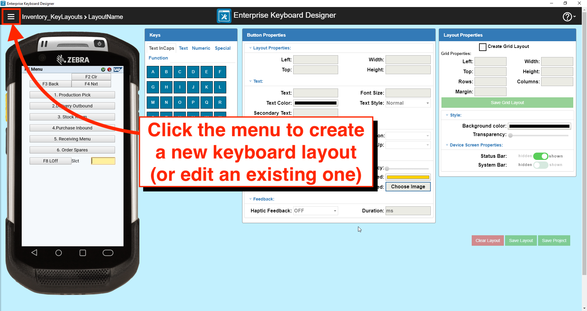
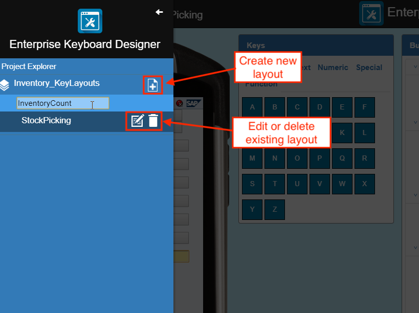
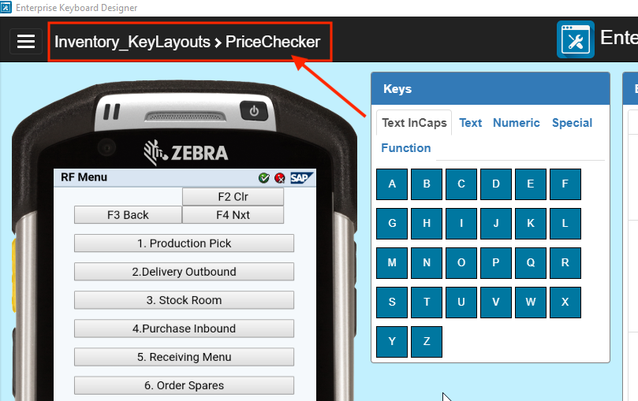
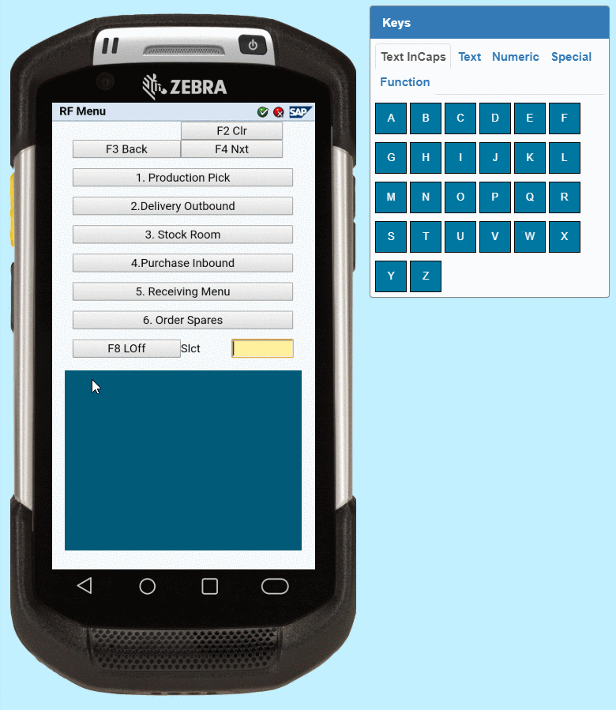
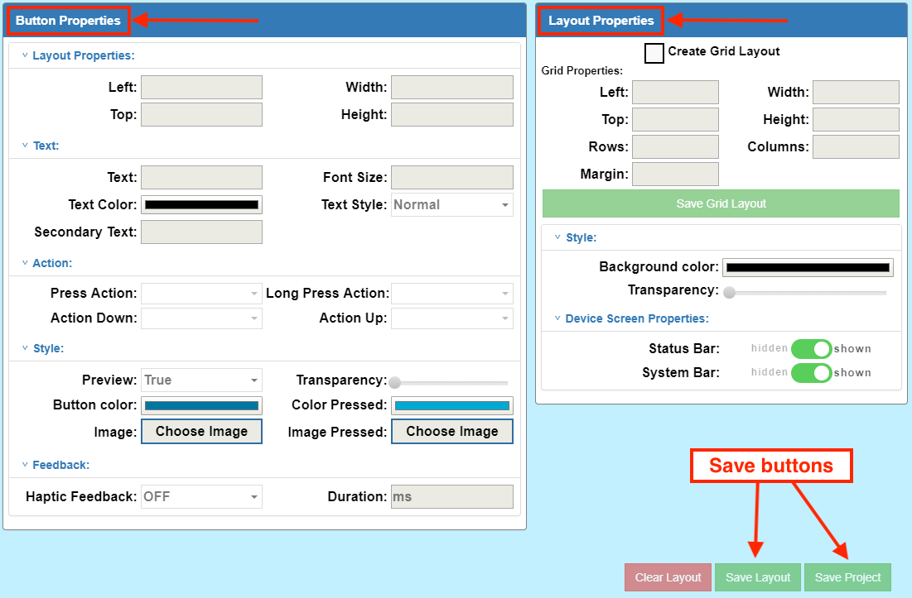
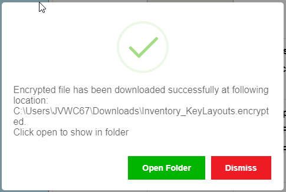

## Overview

The Enterprise Keyboard Designer (EKD) is a powerful key-layout editor for Windows 7, 8 and 10. It provides a graphical interface for creating and modifying custom key layouts for Enterprise Keyboard, Zebra's replacement for the stock Android keyboard designed specifically for the workplace. 

An unlimited number of custom key layouts can be created, deployed to devices and called by customer apps (through Android intents) as needed to match specific types of input. Zebra Enterprise Keyboard (EKB) must be installed to make use of custom EKD layouts. EKB is preinstalled on many Zebra devices and available as a side-load for others. 

*EKD features a simple drag-and-drop UI with device simulator to allow quick creation of purpose-built key layouts  configured for specific key actions that can be modified for different devices and screen resolutions.  Click image to enlarge, ESC to exit*.

### `IMPORTANT - PLEASE READ`
* **Zebra Enterprise Keyboard MUST be installed on the device and selected as the default input source** to use custom layouts created with EKD. 
* **<u>Only one keyboard or custom key layout can be displayed on the device screen at a time</u>**. When a custom key layout is displayed, all other keyboards are hidden, including any Enterprise Keyboard layout. 
* **Layouts made with EKD must be called by an app using intents** to be displayed (see [Intent APIs section](#intentapis)).
* **Apps on the device can access <u>only a single EKD project file</u>**, but multiple layouts can be saved in that single project file and called independently through intents.  
* EKD projects are saved and deployed as encrypted files that can be decrypted on the device only by **DataWedge, Enterprise Browser and Enterprise Keyboard** and applications running on a Zebra Android device. 
* Layout files can be imported into Enterprise Keyboard Designer and modified or supplemented with additional keys and/or layouts. 
* **Zebra recommends resetting to the default input device when quitting an app that uses EKB**. 
* In this guide, the terms “button” and “key” are used interchangeably. 

-----

## Installation
EKD is installed in the same was as any Windows application. 

1. Download the “`CustomKeyboardDesignerUtility.exe`” onto the target Windows system. 
2. Double-click `.exe` file to run the installer.
3. Enterprise Keyboard Designer launches automatically after installation.

-----

## Using EKD

Each Enterprise Keyboard Designer project contains one or more key layouts, which are defined as any grouping of keys. Layouts are created using “drag and drop” or the “grid layout” option and are saved as a single encrypted file. The project name becomes the file name, with “`.encrypted`” as the file extension (i.e. “`myTC75Layout.encrypted`”). 

-----

### I. Create a Project

1. Launch the Enterprise Keyboard Designer utility: 
 
  
2. **Click the “NEW KEYBOARD PROJECT”** button:
 
  
2. **Enter a project name and click “Submit”** or press ENTER:
 
  
3. Select a target device from the drop-down and click the “Confirm” button:  
 
  

**When the project name is displayed in the upper-left corner of the main designer screen as below, EKD is ready to create custom layouts**.

> **Note**: Once a project is created, its target device and other project-level settings cannot be changed.

<!-- 
For a demo of the steps above, see the "createProject.mp4” video.
 -->

-----

### II. Create Layout(s)

1. From the main designer screen, **click the menu button** in the upper-left corner:  
 
 _Click image to enlarge, ESC to exit_.
  
2. **Click the [+] icon to create a new layout** or select an existing layout to edit:  
 
 _Click image to enlarge, ESC to exit_.
  
3. **Select the device orientation** and click the “Confirm” button:
 
 _Click image to enlarge, ESC to exit_.
  
4. **Enter a layout name and press ENTER**. **`NOTE:`** Layout names within a project must be unique and contain only alpha-numeric characters.  The name of the current layout appears in the upper-left corner of the screen: 
 
 _Click image to enlarge, ESC to exit_.
  
5. With the mouse pointer on the simulated device screen, **drag to create a layout background** in approximately the desired position on the simulator: 
 
 _Click image to enlarge, ESC to exit_.
  
6. **Drag the layout on the device screen** to reposition and resize as needed:  
 
 _Click image to enlarge, ESC to exit_.
  
7. **Drag the desired key(s) from the key panel** (at right) to the layout, dragging to reposition as needed:
 
 _Click image to enlarge, ESC to exit_.
  
8. Click on the layout and/or key(s) to **modify properties using the [Button and Layout Properties](#buttonandlayoutproperties) panels**: 
 
 _Click image to enlarge, ESC to exit_.
  
9. **Click "Save Layout" button** often to preserve settings.
10. **Repeat Steps 8 and 9** until the layout appears as desired. 
11. **Click "Save Project" to create a project file for deployment**.

> Data for custom layout(s) and key-value assignment(s) is stored in the keyboard definition file, a single encrypted file on the development host computer. To deploy, simply push this file to the desired mobile device(s) and activate custom layouts through application intents. Layouts are available immediately upon deployment.  Instructions follow below. 

### Using Grid Layout
The Grid Layout option permits button Layouts to be created more quickly and with more precision than the drag-and-drop method. When a Grid is initially created, it is automatically placed with its left and bottom edges flush with the left and bottom edges of the simulator.  

1. Create or open a Layout to edit (if not already open). 
2. Check the “Create Grid Layout” checkbox. This enables parameters to be entered in the Grid Properties input fields shown below. Configure the values as required (in pixels or count, as applicable). Changes are immediately visible in the Layout. 

-----

-----

### III. Deploy Layout(s)

**To push a keyboard definition file**:

1. **Locate the keyboard definition file** (i.e. “`layoutProjectName.encrypted`") on the development host computer.  
 By default, the files are saved in the download directory of the current user:  
 `c:\Users\userName\Downloads\layoutProjectName.encrypted` 
 **NOTE**: When clicking EKD's "Save Project" button, the default folder is shown similar to the image below: 
 
 _Click image to enlarge, ESC to exit_.
  
2. In the Settings panel on the device, set Enterprise Keyboard as a default IME.
3. Push definition file to the device folder: 
 `/enterprise/device/settings/ekb/config/`

**Custom keyboard layouts are available on the device immediately upon file deployment**. 

-----

## Button and Layout Properties

Grid Properties:

**Left -** Layout offset (in pixels) from the left edge of the screen.

**Top -** Layout offset (in pixels) from the top edge of the screen.

**Width -** Overall width (in pixels) of the Layout.

**Height -** Overall height (in pixels) of the Layout.

**Rows -** Number of rows in the Layout, divided equally across the specified Height.

**Columns -** Number of columns in the Layout, divided equally across the specified Width. 

**Margin -** Distance (in pixels) between Grid boxes, each of which stores one Button.

3. Click on “Save Grid Layout” button (in the Layout Properties panel) to store changes to the Layout.
4. Configure Button Properties and functions as required (see below).  
5. Configure Layout Properties as required (see below).
<b>Switch layouts with taps or swipes</b> across the keypad:  

<!-- 
_The Tab bar can be set to automatically hide away, maximizing screen space for applications_. 

 
-->

**Notes**: 
* Layout drag and resize features are disabled when using Grid Layout. 
* Button drag and resize features are enabled only after saving the Grid Layout clicking the “Save Grid Layout” button, in the Layout Properties panel.

### Configure Layout Properties
Layout Properties can be configured when using drag-and-drop or Grid Layout functions. 

#### Layout Properties

**Background Color -** Specifies the color of the Key Layout. Changes appear in the Layout immediately after clicking OK in the color picker. 

**Transparency -** Used to select of the transparency from 0 (opaque) to 100 (fully transparent) of the Key Layout Background using a slider. Changes appear immediately.

### Simulator Properties

**Status Bar -** Used to show/hide the Status bar on the device simulator screen. The Layout “top” coordinate changes based on this setting, which depends on status bar setting configured at the application level. Must be hidden for full-screen applications.

**System Bar -** Used to show/hide the System bar on the device simulator screen. The Layout “top” coordinate changes based on this setting, which depends on System bar setting configured at the application level. Must be hidden for full-screen applications. 

### Configure Button Properties

If the Layout was created using drag and drop, a key must be selected from the key panel and dropped into the Layout. Double-click the key to change its default button settings.

If the Layout was created using Grid Layout, double-click on any key (I.e. a box in the Grid) to configure its properties.

The currently selected key is indicated by a red border, and input fields for its Button Properties are enabled. The following key properties can be configured; changes appear immediately on the selected button.

#### Position Properties

**Left -** Layout offset (in pixels) from the left edge of the screen. 

**Top -** Layout offset (in pixels) from the top edge of the screen.

**Width -** Specifies the width (in pixels) of the selected button.

**Height -** Specifies the height (in pixels) of the selected button.

#### Text Properties

**Text -** Specifies the Button label (displayed text) for the selected Button. Applies only if an image is NOT selected.

**Font Size -** Specifies the font size (in points) of the Button label text for the selected Button. 

**TextColor -** Specifies the color of the Button label text for the selected button. 

**TextStyle –** Specifies the style of the Button label text for the selected button. Drop-down values: Normal, Bold, BoldItalic, Italic. 

**SecondaryText -** Specifies the secondary Button label displayed in the upper-right corner of the selected button. Indicates the key’s output or Action when long-pressed. Applies only if an image is NOT specified.

**Notes**: 
* The text input field accepts all characters, including Chinese.
* All key-label text (including secondary text) is ignored if a key image is specified.
* The number and size of characters in the button text and secondary text fields should correspond to the key size to avoid automatic changes to the size.

### Action Properties

**PressAction -** Defines the action taken when the selected Button is pressed and released. Accepts a predefined command string only (see below). Overridden by ActionDown property. 

**LongPressAction –** Defines the action taken when the selected Button is long-pressed. Accepts a predefined command string only (see below). Overridden by ActionUp property. 

**ActionDown -** Defines the action to be taken immediately upon Button press (before it is released). Accepts a predefined command string only (see below). Overrides PressAction property. 

**ActionUp -** Defines the action to be taken when the selected key is released (after being pressed). Accepts a predefined command string only (see below). Overrides Long Press Action property.

### Predefined command strings
**Perform KeyEvent action -** Used to generate a particular KeyEvent or output as a character. Specify the key and value in key-value format from among the standard Android KeyEvent values. The KeyEvent for a key can be captured inside JavaScript onKeyDown events and output the value, if associated. It should be written in the format below. 

**Note**: Command strings are case sensitive. 

* To capture a lower-case "a" the action should be “key-29”
* To capture an upper-case "A" the action should be “keyincaps-29”
* To capture a Unicode, the action should be “uc-003C”

<b>Switch layouts with taps or swipes</b> across the keypad:  

Action to Switch Layout - Use the key-value pairs below to switch to a specific layout when using Zebra Enterprise Keyboard.

Predefined commands:

**switch-abc -** switches to the default “abc” (alphabetic) layout

**switch-123 -** switches to the “123” (numeric) layout

**switch-scan -** switches to the “scan” (scanning button) layout

**switch-&#35;&#42;&#47; -** switches to the “&#35;&#42;&#47;” (symbolic) layout

**switch- [LayoutName] -** switches to the named custom layout

##### Notes 	
* The Layout names shown above (“abc”, “123”, “scan” and “&#35;&#42;&#47;”) are reserved for default Enterprise Keyboard layouts and cannot be used as custom Layout names. Switching Layouts is supported on Enterprise Keyboard only.
* The following reserved names must not be used in Model Input fields (PressAction, LongPressAction, etc.) or in KeyEvents: 
 * Scantrigger
 * deviceInfo
 * calculator
 * switch-abc
 * switch-123
 * switch-&#35;&#42;&#47;
 * switch-scan
 * customLayout
 * key-keyincaps
* While the key action can be configured to execute a command, Enterprise Keyboard currently supports only the “scantrigger” action command, which scans a barcode using DataWedge.
* The Enterprise Browser ButtonBar API accepts several predefined commands as button actions. Refer to the Enterprise Browser TechDocs for more information. 

##### Style properties
**Preview -** Used to expose the value of a key when pressed. The key value is previewed only if the preview value is set to “true” (default for all keys).

**Transparency -** Used to specify the transparency for the selected key from 0 (opaque) to 100 (fully transparent). Changes appear on the device simulator immediately. 

**Button Color -** Used to specify the color of the selected key. Changes appear on the device simulator immediately. 

**ColorPressed -** Used to specify the color of the selected key when the key is pressed. Changes appear on the device simulator when the key is pressed. 

**Image -** Used to specify an image to fill the space of the selected key. After selection, the image appears immediately on the device simulator. When the Layout is saved, selected image(s) are embedded within the “.encripted” file. Supports .jpg and .png image file formats. 

**ImagePressed -** Used to specify an image to be displayed when the button is pressed. After selection, the image appears on the device simulator when the button is pressed. When the Layout is saved, selected image(s) are embedded within the “.encripted” file. Supports .jpg and .png image file formats.

##### Feedback properties

**HapticFeedback -** Used to control whether the device vibrates when the selected button is clicked. Set the value to “true” to vibrate (default = false).
**Duration -** Used to specify the duration (in ms) of vibration when the “Haptic Feedback” property is set to true (default = 40 ms). 

##### Additional Features

**Drag -** The key position is changeable by dragging the key within the key layout/background.

**Resize -** The key width and height are resizable by dragging the right and bottom corners (respectively) within the key layout/background.

**ArrowUp -** The top position of the selected key is changeable by pressing up arrow on the host computer’s keyboard.

**ArrowDown -** The top position of the selected key is changeable by pressing the down arrow on host computer’s keyboard.

**ArrowLeft -** The left position of the selected key is changeable by pressing the left arrow on the host computer's keyboard.

**ArrowRight -** The left position of the selected key is changeable by pressing the right arrow on the host computer’s keyboard. 

**To Delete a Key**:

1. Open the Layout that contains the key to be deleted. 
2. Select the key to be deleted. 
3. Press the “Delete” key on the host computer’s keyboard. 
4. Click “Yes” on the confirmation dialog to delete. 

**To Clear a layout**: 
1. Open the Layout to be cleared. 
2. Click the red “Clear Layout” button. 
3. Click “Yes” to confirm the deletion of all Layout elements. 

### Save Layout

To save the current layout data, click the “Save Layout” button. No confirmation dialog appears. 

### Save Project
To save the current keyboard Layout project, click the “Save Project” button. A dialog appears indicating the location of the saved “.encrypted” file. 
Take note of the save directory for later reference. 

-----
### Usage Notes
* **The Enterprise Keyboard Designer <u>must be used only in full screen mode**</u>. Resizing the Enterprise Keyboard Designer application window after starting a Project can result in unpredictable behavior. 
* **The number of allowable characters in a button label field is dependent on width of the key**. To avoid automatic key resizing, button label should not exceed available width. 
* **The font size used for a button label is dependent on the size of the key being labelled**. To avoid automatic key resizing, select a point size appropriate for the size of the button.
* **The secondary text button label field is dependent on the width of the key**. To avoid automatic key resizing, the secondary button label should not exceed available width.
* **Zebra recommends that button image size not exceed 100 KB**. Larger images are supported but might impact performance of the layout. 
* The following reserved names must not be used in Model Input fields (PressAction, LongPressAction, etc.) or in KeyEvents: 
 * Scantrigger
 * deviceInfo
 * calculator
 * switch-abc
 * switch-123
 * switch-&#35;&#42;&#47;
 * switch-scan
 * customLayout
 * key-keyincaps
 

### Known Issues
When switching layouts, a thin white line is sometimes shown at the bottom or sides of the background key layout in the device simulator, but has no effect on the simulated display.

-----

## Import Keyboard Project
Keyboard projects created earlier can be modified for use on different devices, adapted for different screen sizes and features or for any reason. 

**To import a project**: 

1. On the Enterprise Keyboard Designer’s launch screen, click the “IMPORT KEYBOARD PROJECT” button. 
2. Navigate to and double-click the project (“.encrypted” file) to import.
3. Select the target device using the drop-down menu and click the “Confirm” button. 
4. Select the device orientation and click the “Confirm” button.
5. When the Project name is seen at top-left corner, the workspace is ready for use.
6. Click on the menu button and select a Layout to edit.
7. When the Layout name is seen in the top-left corner (after the Project name) and layout keys are visible in the device simulator, the Layout is ready to be edited.

-----
