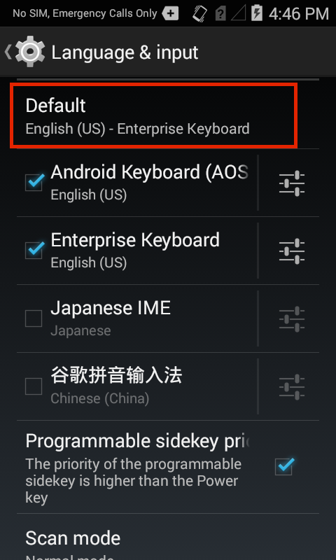

## Overview
The setup process for Enterprise Keyboard can vary by device, and activation is sometimes necessary to make it available to users. Zebra's keyboard also can be set as the default input method, if desired. This section of the guide covers manual activation of Enterprise Keyboard and the steps required for setting it as the default input device. 

For advanced settings, such as language selection and scan-tab configuration, please see the [Customize section](../settings). 
<!-- 
See the [EKB 1.6 download page](../../download) for a list of supported devices. 

 -->

Enterprise Keyboard 1.1 (and higher) can be activated and configured: 

* Manually at the device
* Remotely:
    * Using [StageNow](../../../../) and the [UI Manager](/mx/uimgr/) service 
    * Through a company's own mobile device management (MDM) system (if supported by that system) 

-----

## Multi-user Mode

Enterprise Keyboard 2.0 (and higher) supports Primary and Secondary Users **on devices built with Zebra's SDM660 platform (including PS20, TC52, TC57, TC72 and TC77) running Android 8.x Oreo**. Primary Users can make changes to EKB settings and create Secondary Users on the device. Secondary Users cannot change EKB settings or create additional users. 

**To create a Secondary User**: 
_(applies only to devices running Android 8.x Oreo)_

1. Sign into a device as a Primary User. 
2. **Open the Settings panel** on the device. 
3. Tap **Users & accounts -> Users -> Add user -> Add a new user**. 
4. Follow prompts to complete the process. 
 

 
_EKB Settings are "greyed out" for Secondary Users_. 
 

**To switch users**

1. **Open the Settings panel** on the device. 
2. Tap **Users & accounts -> Users**. A list of device User names appears. 
3. **Tap on the desired User name** to switch to that User. 

> **Supported only on SDM660-platform devices running Android 8.x Oreo**. 

-----

## Manual Activation
The section covers direct activation of Enterprise Keyboard on a single device. If using one of the remote methods referenced above to activate and configure multiple managed devices, please see the [Automated Activation section](#automatedactivation) later in this guide. 

<b>To quickly determine whether Enterprise Keyboard has been activated</b>: 

&#49;. Bring up the Android keyboard and long-press the spacebar. 

&#50;. If "Enterprise Keyboard" appears in a screen like the one below, tap its radio button (arrow) to set it as the default input device:

 

If the Enterprise Keyboard does not appear, proceed to the steps below. 

#####Activate Enterprise Keyboard: 

&#49;. <b>Open the Settings panel</b> on the device:

 

&#50;. Scroll to and <b>tap the "Language and input" control</b>:

 

&#51;. <b>Place a check next to "Enterprise Keyboard"</b> to enable it on the device. Uncheck other input devices to disable them, if desired. If Enterprise Keyboard was included with the device by default (and not downloaded as an OS patch), this step might not be necessary. 

  

&#52;. <b>Tap "Default"</b> to set the default input device:

&#53;. <b>Tap the Enterprise Keyboard radio button</b> to set it as default input device:

<b>Note</b>: This panel also can be invoked by long-pressing the spacebar whenever the Android or Zebra keyboard is visible.
 

&#54;. <B>Tap the HOME key</b> to exit the Settings panel.  

Enterprise Keyboard is now ready to use with default settings. 

------

### Change Settings
Following installation, Enterprise Keyboard settings can be changed through the Android Settings panel. 

#####Change Enterprise Keyboard settings:

&#49;. <b>Open the Settings panel</b> on the device:

 

&#50;. <b>Tap the "Language and input" control</b>:

 

&#51;. <b>Tap the Enterprise Keyboard Settings button</b> to change settings:

 

&#52;. On the Enterprise Keyboard Preferences panel, <b>tap the setting(s) that require change</b>:

See the [Customize section](../settings) for more information about Enterprise Keyboard settings. 

------

## Automated Activation
Enterprise Keyboard 1.1 (and higher) can be configured remotely on multiple managed devices using Zebra's [StageNow](../../../../) tools and the [UI Manager](/mx/uimgr/) service or an organization's own MDM system.  

Actions to be executed on the Android Settings panel:
1. <b>Open Language and input</b> 
2. Add a check for <b>"Enterprise Keyboard"</b> to enable it on the device
3. <b>Select Enterprise Keyboard</b> as the default input device
4. <b>Select a language</b> (if other than the system default)

### Set as Default Input Device
Whether using the UI Manager service through Zebra's StageNow or EMDK tools, or if deploying Enterprise Keyboard from a company's own MDM, it is necessary to specify Enterprise Keyboard's package and class names to select it as the default keyboard on the device. 

The required package and class names are shown as the values below, wrapped by the coding necessary for using one of Zebra's tools: 

		:::xml  
		<parm name="InputMethodPackageName" value="com.symbol.mxmf.csp.enterprisekeyboard"/>
		<parm name="InputMethodClassName" value="com.android.inputmethod.latin.LatinIME"/>

For additional information about usage and syntax, please refer to respective documentation.

-----

## Manual Deactivation

Enterprise Keyboard cannot be removed if it was included with the device operating system. However, it can be deactivated by reversing the activation process described in the Activation section. The steps below describe how to deactivate Enterprise Keyboard using the Android Settings panel. 

<b>Warning: This action renders Enterprise Keyboard inaccessible, including its scanning and other capabilities</b>. 

**Deactivate Enterprise Keyboard on a device**: 

&#49;. <b>Open the Settings panel</b> on the device:

 

&#50;. Scroll to and <b>tap the "Language and input" control</b>:

 

&#51;. <b>Remove the check next to "Enterprise Keyboard"</b> to disable it on the device. If the Android keyboard is the only other input device, it automatically becomes the default input device and cannot be disabled. 

  

Manual deactivation of Enterprise Keyboard is complete. 

-----

## Automated Deactivation
Enterprise Keyboard 1.1 (and higher) can be deactivated on multiple managed devices using an organization's own MDM server in the same way as other Android apps. Alternatively, remote uninstallation can be accomplished through Zebra's [EMDK](/../../../../) or [StageNow](../../../../) tools using the [App Manager](/mx/appmgr) service. 
