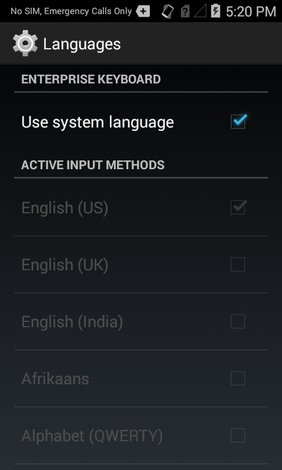
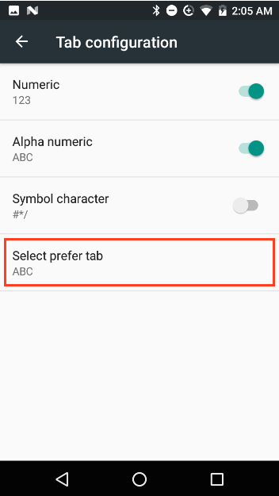
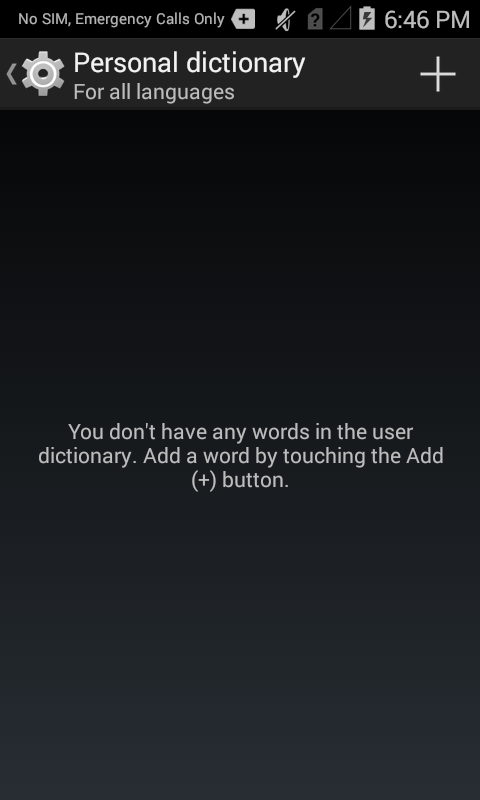
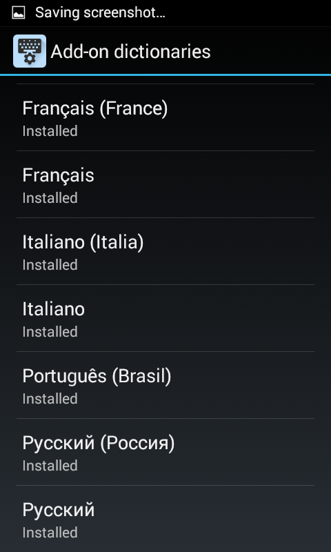
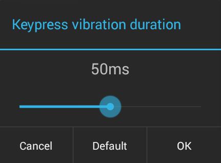
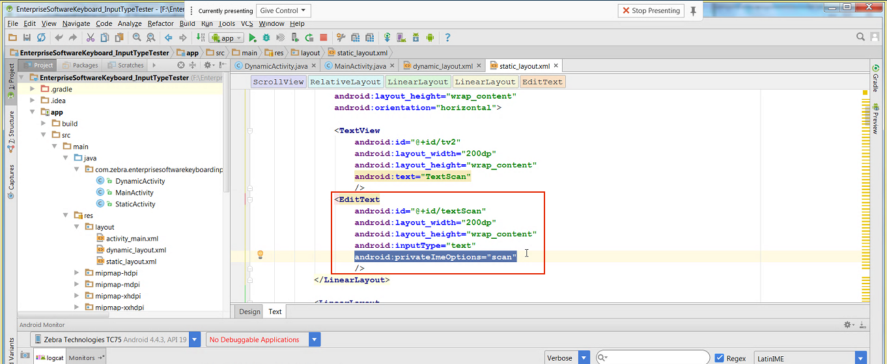

## Overview

Enterprise Keyboard (EKB) is an enhanced and customizable version of the stock Android keyboard that provides a more effective means of inputting data into Zebra devices. 

#### Primary EKB Benefits
* [Quick switching between languages](#languages)
* [Barcode scanning](#preferences) directly from the keyboard for data collection 
* [Programmable keys](#remappingkeys) for performing specific tasks 
* [Finger-flicks](#preferences) for typing long-press characters
* [Swipe-to-switch](#preferences) key layouts 
* Populate Android's [Personal Dictionary](#personaldictionary) with custom terms and abbreviations

#### Change Log

* `ADDED in v3.4:` "Canned Text" feature allows assignment of lists of [predefined text responses](#textcorrection) to keys
* `ADDED in v3.4:` Set a custom layout as the [default keyboard](#preferences) on the device
* `ADDED in v3.6:` Program a key to repeat any keyCode when long-pressed
* `ADDED in v3.6:` Combine multiple keyCodes, presses or Actions into a single key-press Action.

#### Also See 

* [Customizing Keyboard Settings](#customizingkeyboardsettings) | Section of this guide with further details 
* [Dynamically Switching Keyboards](https://developer.zebra.com/blog/dynamically-switching-keyboards-zebra-android-devices) | Implementation details and sample code by Zebra engineering

-----

### Custom Key Layouts

EKB 3.2 (and higher) supports the use of custom key layouts created with [Enterprise Keyboard Designer](/ekd) (EKB Designer or EKD), a free GUI tool for Windows-based systems that provides control over fonts, images, key codes, layout transparency and many other layout properties. As many as 20 custom layouts (see below) can be deployed to devices and **displayed programmatically using Android intents or DataWedge 7.4.44 (or higher)** when specific input situations arise. 

_Sample layouts made with Enterprise Keyboard Designer. Click image to enlarge, ESC to exit_.
 

> To learn more, [go to the Enterprise Keyboard Designer Guide](/ekd).

-----

## Customizing Keyboard Settings

#### This Section Covers: 

* Assignment of [keyboard languages](#languages)
* Setting keyboard [preferences](#preferences)
* [Text correction settings](#textcorrection)
* Long key-press and other [advanced settings](#advanced)
* [Remapping programmable keys](#remappingkeys)

#### Other Sections in This Guide:

* [Using EKB with DataWedge](#datawedge)
* [Changing key layouts programmatically](#dynamicinputmethod)
* [Navigation using TAB keys](#tabkeynavigation)
* [Scanner control](#scannercontrol)

> **NOTE:** Screen contents and colors vary by Android version.   

-----

Enterprise Keyboard Settings are accessed through the Android Settings panel: 

&#49;. <b>Open the Settings panel</b> on the device:

 

&#50;. <b>Tap the "Language and input" control</b>:

 

&#51;. <b>Tap the Enterprise Keyboard Settings button</b>:

 

&#53;. <b>Tap the setting(s) to be changed</b>:

------

### Languages
By default, Enterprise Keyboard uses the language selected in the "Language and input" part of the Android Settings panel: 

#####Switch from system-selected language to one provided with Enterprise Keyboard: 

&#49;. <b>Tap on "Languages"</b> in the Enterprise Keyboard Preferences panel: 

This version of Enterprise Keyboard includes the following languages: 

* English (UK)
* English (US) 
* French
* Italian
* German
* Spanish
* Russian

&#50;. <b>Uncheck "Use system language" checkbox</b>: 

 

With the "Use system language" preference unchecked, language packs become available for selection. 

&#51;. <b>Tap one or more languages</b> to select them: 

 

<!--
Selected languages will appear in the language  menu in the Enterprise Keyboard: 

 
-->

------

### Preferences
The Preferences section controls keypress feedback, default layout and tab selections, and other aids to productivity. **NOTE: Enterprise Keyboard Designer 1.4 (and later) allows a custom keyboard layout to be selected as the default** in the device, to appear whenever an input field receives focus (**requires EKB 3.4 or later**). See the [EKD User Guide](http://techdocs.zebra.com/ekd/latest/guide/usage/#iicreatelayouts) for more information. 

**Default settings are shown here**:  

 

##### Set preferences as desired: 

<b><u>Auto-capitalization</u></b> automatically capitalizes the first word of each sentence following a period. 

<b><u>Double-space period</u></b> automatically inserts a period and space after double-tapping the spacebar. 

<b><u>Vibration on keypress</u></b> sets the device to vibrate when a key is pressed (seen only on devices that support vibration). Duration configurable in [Advanced settings](#advanced). 

<b><u>Sound on keypress</u></b> plays a sound when a key is pressed. Volume is configurable in [Advanced settings](#advanced).

<b><u>Popup on keypress</u></b> displays a pop-up of the key being pressed (not applicable to keys 0&ndash;9 on the numeric layout). <!--A delay can be added in [Advanced settings](#advanced).-->

<b><u>Voice input key</u></b> displays a key for allowing Enterprise Keyboard to accept spoken input using the device microphone (on GMS-enabled devices only).  
**NOTE**: Google Voice typing must be enabled to use this key (see **Language and input > On-screen keyboard** panel). 

<b><u>Show scan tab</u></b> displays a tab for switching to the scanner to collect barcode data. Scanning in Enterprise Keyboard requires [the DataWedge service](#datawedge) to be enabled on the device. 

<b><u>Flick</u></b> enables the alternate (long-press) character of a key to be input by "flicking" the key. **Not supported on VC80x or VC83x devices**.

<b><u>Numeric (Telephone)</u></b> layout appears when the numeric keypad is in focus. When disabled, the Calculator layout is used. 

<!-- 

 
 -->
 
##### On devices with MX 7.1 and higher only: 
<b><u>Navigation</u></b> controls the means of navigating between keyboard layouts. "<b>Tabs</b>" mode permits switching layouts by swiping across a layout (to bring up the adjacent one) or tapping directly on the desired layout tab. The tab bar is visible at all times except when spelling corrections (if enabled) are being displayed. "<b>Keys</b>" mode permits keys to be used for switching layouts. Such keys are typically in the lower-left corner of the layout. **See important layout notes below**.

<!-- 

 
 -->
<b><u>Tab configuration</u></b> allows a user or administrator to enable or disable the numeric, alphanumeric, symbol and/or scan key-layout tab(s), hiding them from view and preventing display of the corresponding layout. <!-- **EKB will not permit all four tabs to be disabled at the same time**. -->

<b><u>Select prefer tab</u></b> causes the selected tab to appear whenever EKB is invoked. This option is controlled from within the Tab configuration panel (shown below). 

 

**Tab Bar Notes**:

<!-- Navigation mode set to Keys, voice input key and show correction suggestions are enabled, then tab bar will always be visible except for some input texts like numeric, email, sip, websites etc.,
 -->
* When Navigation mode is set to "Keys" and voice input key and show correction suggestions are enabled, the tab bar is always visible (does not auto-hide) except when inputting numeric, email, SIP, websites etc.
* If either the tab bar or the suggestion bar are enabled, both will appear.
* The tab bar will not appear if the Next Word Suggestions bar and the Voice Input Key are both disabled.
* On GMS devices, if voice is enabled and the next-word suggestions feature is disabled, a blank suggestion bar will appear over the tab bar when words are being suggested.
* If the `TYPE_TEXT_FLAG_NO_SUGGESTIONS` input type is enabled, neither the tab bar nor the suggestion bar will appear. [More about Android input types](https://developer.android.com/reference/android/text/InputType.html).
* Enabling the Symbol tab disables remapping of the Numeric P3 key.
* Enabling the Alphanumeric tab disables remapping of the Numeric P4 and Symbol P1 keys.
* Enabling the Numeric tab disables remapping of the Alphanumeric P1 key.
* Navigation and Tab configuration features are supported only on devices with MX 7.1 and higher.
* A custom key layout made with Enterprise Keyboard Designer 1.4 (or later) can be selected as the default whenever an input field receives focus (**requires EKB 3.4 or later**). [More info](http://techdocs.zebra.com/ekd/latest/guide/usage/#iicreatelayouts).

------

### Text Correction
Text Correction controls automatic corrections to typed text based the predefined parameters explained below. This functionality is provided by the Personal Dictionary, which also permits lists of custom or industry-specific terms and shortcuts (abbreviations) to be loaded into a device and presented as substitution suggestions along with those of the selected language(s). 

**NOTE**: Enterprise Keyboard 3.4 (and later) supports "Canned text," which presents a list of predefined textual phrases when a key is pressed. This can help simplify, quicken and standardize responses to common questions or situations. See the [Enterprise Keyboard Designer user guide](http://techdocs.zebra.com/ekd/latest/guide/usage/#cannedtext) to learn more. 

 

##### Set preferences as desired: 

<b><u>Block offensive words</u></b> prevents display of spelling suggestions that might be deemed offensive or insensitive as determined by external standards of decency.

<b><u>Auto-correction</u></b> automatically replaces misspelled words with those found in the Add-on and Personal dictionaries (see below). Replacements are executed by pressing the spacebar. 

<b><u>Show correction suggestions</u></b> displays suggested words while typing but does not replace them when the spacebar is pressed unless Auto-correction is also enabled.

<b><u>Personalized suggestions</u></b> learns from communications and typed data to improve suggestions.

<b><u>Suggest Contact names</u></b> automatically displays contacts from the contact list when typing names. 

<b><u>Next-word suggestions</u></b> looks at the word prior to the one being typed and displays words that might come next. This is sometimes referred to as "predictive text."

-----

#### Personal Dictionary
The Personal Dictionary can be used to store industry-specific terms and their abbreviations to help improve the speed and accuracy of keyboard input. For example, if configured for a medical device, the acronym "gerd" could be added as a shortcut and replaced with "gastroesophageal reflux disease" whenever it was typed.

 

<b>Notes</b>:

* Terms can be added to the Personal Dictionary one at a time or in bulk.
* For bulk loading, see StageNow's [Personal Dictionary Manager](http://techdocs.zebra.com/stagenow/latest/csp/personaldictionary/). 
* There is no set limit on the length of terms and phrases that can be entered into the Personal Dictionary.
* When displayed, longer terms and phrases might be injected with an ellipsis (...) in the correction bar. 
* Spelling corrections do not appear with all field types.  
* For mass deployment, the Personal Dictionary must be populated beforehand using Zebra's [StageNow](http://techdocs.zebra.com/stagenow) tool. 
* Personal Dictionary does not support display of contact names. 

#####Add a term to the Personal Dictionary: 

&#49;. <b>Tap "Personal dictionary"</b> in the Text correction Preference panel: 

 

&#50;. <b>Tap the language</b> with which to associate the personal term(s). Select "For all languages" to display Personal Dictionary terms with every language pack:  

 

&#51;. <b>Tap the plus sign (+)</b> to define a new word or phrase: 

 

&#51;. <b>Enter the word or phrase</b> (and shortcut, if desired), then <b>tap the gear icon to save</b>. 

 

&#52;. <b>Repeat Steps 3 and 4</b> until all terms are added. <b> Words and/or phrases must be added one at a time</b>. After each term is added, the terms list is displayed: 

 

When a shortcut is typed as input, its associated term will appear in a list of spelling corrections: 

Press the spacebar to accept the highlighted word (which in this case is "Gerd") or tap the desired word or phrase to insert it. 
 

**Note**: To maximize screen space for apps, the spelling Correction Bar shares space with the keypad Navigation Tab bar. The nav bar fades out temporarily when corrections are displayed.

> For bulk loading, see [Personal Dictionary Manager](http://techdocs.zebra.com/stagenow/latest/csp/personaldictionary/). 

#####Edit or delete a term: 

&#49;. Bring up the terms list and <b>tap the term</b>  to be edited:

 

&#50;. <b>Edit the term</b> or tap the trashcan icon to delete: 

 

#### Add-on dictionaries
Add-on dictionaries contain predefined word corrections for each language installed on the device. <!--As Enterprise Keyboard is used, it stores new words and patterns of frequently used words and phrases so that its word suggestions can improve over time.Those words and patterns are appended to the Add-on dictionaries according to language in use by the keyboard at the time the pattern was identified. -->From this panel, user actions are limited to viewing the list of installed Add-on dictionaries and deleting/reinstalling them. No further actions are permitted. 

<!--

-->
------

### Advanced 
The Advanced panel allows the setting of keypress feedback parameters for feedback types that are enabled in the Preferences panel. The image below shows sound feedback disabled (by default):  

 

Tap on a setting to bring up a panel for adjusting that setting: 
<!--
<b>Key Popup dismiss delay</b> controls whether to delay when dismissing the key popup. 

 -->

<b>Keypress vibration duration</b> sets the length of time (from 0 to 100ms) the device will vibrate to indicate that a key was pressed (default = 0ms). 

 

<b>Keypress sound volume</b> controls the loudness (from 0 to 100) of the sound that coincides with a keypress (default = System setting). 

 

<b>Key long press delay</b> sets the time (from 100 to 700ms) a key must be held down before being considered a long-press (default = 300ms).

 

------

### Remapping Keys
Enterprise Keyboard designates certain keys as user-programmable: one in the alphanumeric layout, four in the numerical layout and one in the symbol key layout. The Remapping panel shows the current character and Unicode mappings for each key. The images below show default settings, including the alphanumeric and symbol P1 keys mapped to the EMOJI panel. 

_One key can be remapped in the alphanumeric layout_.
  

_Four keys can be remapped in the numerical layout_. 
 

_One key can be remapped in the symbol layout_. 
 

_The Remapping panel showing current settings of remappable keys; tap to edit_. 

 

#####To remap a key: 

&#49;. Tap EKB app > Remapping and <b>tap on the key to be remapped</b>:

 

&#50;. <b>Specify a Unicode value or type an alternative character</b> to associate with that key:  

 

&#51;. <b>Tap "OK"</b> to store the setting. Changes take effect immediately. 

------

## DataWedge
The scan tab in Enterprise Keyboard uses scanning services provided by [DataWedge](http://techdocs.zebra.com/datawedge), Zebra's data acquisition and delivery tool that's included on every Zebra device. <b>DataWedge must be enabled on the device for the Scan tab to be operational</b>. 

 

**To enable DataWedge on a device** (or confirm that it's enabled): 

&#49;. On the device, locate and <b>tap the DataWedge icon</b>: 

 

&#50;. From the DataWedge Profiles screen, tap the "hamburger" menu (see arrow), then <b>Tap "Settings"</b> on the menu: 

 

&#51;. The DataWedge Settings panel appears. Confirm that the <b>"DataWedge enabled"</b> box is checked. 

 

**Important**: See the [Scanner Control](#scannercontrol) section, below. 

For more information about scanning with Enterprise Keyboard, see [Enterprise Keyboard Setup](../setup). 

Also refer to the [DataWedge User Guide](http://techdocs.zebra.com/datawedge) for complete documentation.

------

## Dynamic Input Method 
**_This feature applies to native apps only_**. 

Enterprise Keyboard (1.2 and higher) supports programmatic access to the Input Method Editor (IME), which can dynamically change the input method depending on the selected field. For example, when the cursor enters a field intended for barcode data, the scan tab can be automatically invoked and the device scanner used to populate the field. The keyboard returns when the cursor lands on a text field, and so on. 

**To set the input method as static**: 

* Include the line `android:privateImeOptions="scan"` in the &lt;EditText&gt; field of the `StaticLayout.xml` file as shown below: 

_The EditText parameter of the StaticLayout.xml file, in Android Studio. Click image to enlarge, ESC to exit_.
 

**To set the input method as dynamic**: 

* Call the `setPrivateImeOptions()` method with “scan” as the parameter, as below: 
	* `editTextTest.setPrivateImeOptions("scan")`

**_This feature applies to native apps only_**. 

------

## Tab-key Navigation
The Tab key is designed to move the cursor or UI focus from one text field or UI component to the next. On apps that are unaware of this context, the Enterprise Keyboard Tab key might input spaces instead of moving the cursor. For HTML apps, Zebra recommends using the Tab key to navigate from field to field. For help with native-app navigation, please refer to Android developer docs for information about [Android Tab-key navigation](https://developer.android.com/training/keyboard-input/navigation.html).

------

## Scanner Control
It's important to note that **control of a device's barcode scanning hardware is exclusive**. When an application that uses the scanner is active (such as one made with EMDK that uses the Barcode API), DataWedge (and hence the Enterprise Keyboard scan tab) will not operate. Likewise, when an app such as Enterprise Keyboard controls the scanning hardware, other apps are prevented from doing so. It is therefore important to understand how to take control of a device's scanner hardware and if necessary, release it to other apps when scanning is complete. For more information, see the section on [Disabling DataWedge](http://techdocs.zebra.com/datawedge/latest/guide/settings/#disabledatawedge) in the [DataWedge User Guide](http://techdocs.zebra.com/datawedge). 

-----

## Also See

* [Dynamically Switching Keyboards](https://developer.zebra.com/blog/dynamically-switching-keyboards-zebra-android-devices) | Implementation details and sample code by Zebra engineering
* [Exploring the Enterprise Keyboard API](https://developer.zebra.com/blog/exploring-enterprise-keyboard-api) | Working with EKD-made Custom Layouts by Zebra engineering
