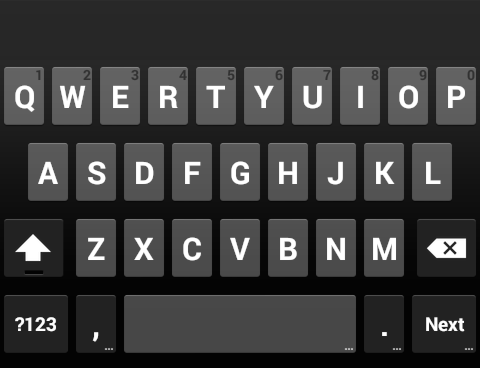
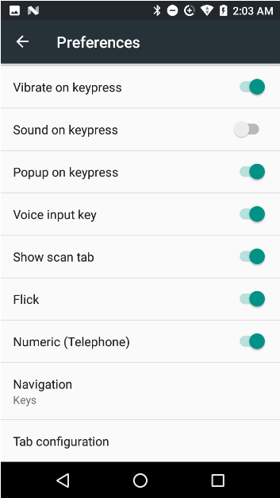

#### [See what's new in EKB 3.9](#newinv39)

## Overview
Enterprise Keyboard (EKB) is a soft input device that's designed to provide the most productive means possible of inputting data into Zebra devices. Building on the stock Android keyboard, Enterprise Keyboard provides programmable keys, can switch quickly between languages and key layouts, and has the ability to scan barcode data directly into an application using any of the device's scanners. 

<iframe width="560" height="315" src="https://www.youtube.com/embed/dPzyDFMcJzI" frameborder="0" allowfullscreen></iframe>

Enterprise Keyboard (1.1 and higher) can be configured in the following ways: 

* **Manually** on the device
* **Remotely** using [StageNow](../../../../stagenow) and the [UI Manager](http://techdocs.zebra.com/stagenow/latest/csp/ui) service
* Remotely through a company's own enterprise mobility management (EMM) system (if supported by that system)

-----

**Enterprise Keyboard makes use of the Android Personal Dictionary for spelling corrections and shortcut substitutions**, and permits the dictionary to be easily populated with industry-specific terms to help improve the speed and accuracy of keyboard input. A custom dictionary can be populated in bulk and mass-deployed through Zebra's Mobility Extensions [(MX)](../../../../mx) and [StageNow](../../../../stagenow) tools. 

This version of Enterprise Keyboard includes the following languages: 

* English (UK)
* English (US) 
* French
* German
* Italian
* Spanish
* Russian

#### Learn more about:
* [Text correction features](../settings#textcorrection)
* The "Loadable" [Personal Dictionary](/mx/personaldictionarymgr)

-----

## New in v3.9

### New Features 

* **New RepeatKeys feature** causes a specified keyCode to be repeated when long-pressing the key. 
* **New Macros feature** can combine multiple keyCodes, presses or Actions into a single key-press Action. 

* **Enterprise Keyboard Designer now includes [predeveloped sample layouts](https://techdocs.zebra.com/ekd/latest/samples/)**, which can be downloaded and deployed immediately or customized to suit the needs of an enterprise.

>**NOTE: New features in EKB 3.9 must be implemented using Enterprise Keyboard Designer 1.9 or later**.
> For more information about new EKB 3.9 features, please refer to the [Enterprise Keyboard Designer usage guide](http://techdocs.zebra.com/ekd/latest/guide/usage). 

### MDNA Enterprise License 
**Beginning with EKB 3.9, an MDNA Enterprise license is required** to use Enterprise Keyboard on Zebra Professional-series devices, including the TC21 and TC26. These devices arrive with a non-functional EKB “dummy” client, which must be replaced with the functional EKB v3.9 (or later) client after [purchasing a Zebra MDNA Enterprise license](/licensing/process). When unlicensed, EKB displays a “license required” prompt (see below) whenever app focus comes to a text input box, but is otherwise **fully functional**. 

**Learn more [about MDNA licensing](/licensing)**.<!--  <i class="fa fa-external-link" aria-hidden="true"></i> -->

_Click image to enlarge, ESC to exit_. 
 

### Device Support

* **Now supports Zebra devices running Android 10**
* **Beginning with v3.9, EKB no longer supports devices running Android 7.x Nougat**. 
* **Android Multi-user mode is no longer supported**. [More info](../setup/#multiusermode). 

Please see the **[supported device list](https://www.zebra.com/us/en/support-downloads/software/productivity-apps/enterprise-keyboard.html)** for more information. 

-----

## Unique EKB features  
All versions of Enterprise Keyboard offer these other unique capabilities to help improve the speed and accuracy of input:  

<b>Switch layouts with taps or swipes</b> across the keypad:  

_The Tab bar can be set to automatically hide away, maximizing screen space for applications_. 
 

<b>Scan directly with the Barcode tab</b> to collect data where and when it's needed:

_The scan tab displays a scanner button for in-app data acquisition from barcode(s)_.
 

<b>Input long-press characters with a finger-flick</b> of the main key:

_High-contrast key colors are visible in all lighting conditions_. 
 

<!--
The <b>Language tab</b> quickly selects languages to include:  

 
-->

<b>Quickly page through selected languages</b> using the "globe" key:  

 

<!--
The <b>Numerical tab provides sub-tabs</b> for symbol key and custom function key layouts: 

 
-->

<b>Design custom key layouts easily</b> with six (6) remappable keys: 

_Shown here with the EMOJI key (upper two layouts) and other default key assignments_. 
 

<b>View the keyboard indoors or out</b> thanks to a specially designed color scheme: 
 
_Enterprise Keyboard_:

_Stock Android keyboard_:

 

-----

## Version History

### Added in v3.4

#### New Features 

* **Enterprise Keyboard can now display Canned text responses** in a drop-down list as specified in Enterprise Keyboard Designer 1.4 (or later). When selected from the list, the Canned response is sent to the focused input field as if typed in manually. See the [Enterprise Keyboard Designer user guide](http://techdocs.zebra.com/ekd/latest/guide/usage/#cannedtext) to learn more.

* **A keyboard layout created in Enterprise Keyboard Designer 1.4 (or later) can be set as the default layout** for the device, and to automatically appear whenever an input field receives focus.  

> For more information about these new EKB 3.4 features, please refer to the [Enterprise Keyboard Designer user guide](http://techdocs.zebra.com/ekd/latest/guide/usage). 

#### New Tutorials

* [Dynamically Switching Keyboards](https://developer.zebra.com/blog/dynamically-switching-keyboards-zebra-android-devices) | Implementation details and sample code by Zebra engineering
* [Exploring the Enterprise Keyboard API](https://developer.zebra.com/blog/exploring-enterprise-keyboard-api) | Working with EKD-made Layouts by Zebra engineering

#### Supported Devices

No devices were added to or removed from the **[supported device list](https://www.zebra.com/us/en/support-downloads/software/productivity-apps/enterprise-keyboard.html)**. 

-----

### Added in v3.2

#### New Features 

* **Can be loaded as a user app** onto any supported device.  
* **Supports custom key layouts** created with [Enterprise Keyboard Designer](/ekd), Zebra's all-new desktop tool for Windows. 
* **New [EKB API guide](../apis)** details the usage of custom key layouts. 
* **Now supports devices running Android 9.2 Pie**.
* **No longer supports devices running Android 6.x Marshmallow, 5.x Lollipop, 4.x KitKat**. 

#### Supported Devices

Support added for the following Zebra devices: 

* **Running Android 9.x Pie**: 
 * **PS20**  
 * **TC52**
 * **TC72**
* **Running Android 8.x Oreo**: 
 * **EC30**
 * **L10**

-----

### Added in v2.2

#### New Features 

**Two remappable keys have been added** to the fixed keyboard layout, which now provides a total of six remappable keys.

#### Supported Devices

<u>EKB 2.2 now comes pre-installed</u> on the following additional Zebra **devices running Android 8.x Oreo**: 

* **VC8300**

-----

### Added in v2.1

#### Supported Devices

<u>EKB 2.1 comes pre-installed</u> on the following Zebra **devices running Android 8.x Oreo**: 

* **CC605**
* **CC610**
* **MC93**
* **TC8200**

-----

### Added in v2.0

#### Supported Devices

<u>EKB 2.0 comes pre-installed</u> on the following Zebra **devices running Android 8.x Oreo**: 

* **MC33**
* **PS20**
* **TC51**
* **TC51 Healthcare**
* **TC52**
* **TC56**
* **TC56 Healthcare**
* **TC57**
* **TC70x**
* **TC72**
* **TC75x**
* **TC77**
* **VC80x**

See all [supported Zebra devices](../../download). 

#### Added Features

* **Escape key support -** allows the ESC key to be remapped to an ASCII or Unicode character or to an EMOJI symbol or to function normally. [About key remapping](../settings/#remappingkeys).
* **[Multi-user Mode](../setup/#multiusermode) -** supports deployment of Primary and Secondary Users, the latter of which are blocked from making EKB settings changes on the device. **Supported only on SDM660-platform devices running Android 8.x Oreo**.

-----

### Changes in v1.9

##### Behavior Corrections:

* Auto-capitalization now works properly after navigating away from the alpha keyboard prior to typing.
* Keyboard pop-ups no longer disappear when swiping from alpha to symbol layouts and back. 

-----

### Added in v1.8

**NOTICE**: Enterprise Keyboard comes preinstalled on Zebra devices running Android 7.x Nougat and higher. For supported pre-Nougat devices, EKB is added as a LifeGuard patch. See [download page](../../download) for more information. 

#### Supported Devices
EKB 1.8 adds support for (and comes preinstalled on) the following devices: 

* **WT6000 N**

#### Added Features 

* The **Symbol Key P1 can be remapped** to an ASCII or Unicode character or to an EMOJI symbol.
* The **Text Correction suggestion bar remains visible** whenever [voice input key](../settings/#preferences) is enabled, even if no corrections are suggested.
* If voice input is disabled, correction suggestions (if enabled) appear only when typing.

#### Discontinued Features

* **Personalized suggestion and Next Word suggestion** features have been removed  ([Text Correction suggestion](../settings/#textcorrection) and other Personal Dictionary features are unaffected). 

-----

### Added in v1.7

**Enterprise Keyboard 1.7 comes pre-installed on Zebra devices running Android 7.x Nougat and higher**. 

#### Supported Devices

EKB 1.7 is certified on the following Zebra devices running Android 7.x Nougat:

 * **MC33**
 * **TC51**
 * **TC51 Healthcare**
 * **TC56**
 * **TC56 Healthcare**
 * **TC70x**
 * **TC75x**
 * **VC80x**

For more information and device options, see the [download page](../../download).

-----

### Added in v1.6

New settings in the [Preferences panel](../settings/#preferences): 

* <b><u>Navigation</u></b> controls the means of navigating between keyboard layouts. "<b>Tabs</b>" mode permits switching layouts by swiping across a layout (to bring up the adjacent one) or tapping directly on the desired layout tab. The tab bar is visible at all times except when word corrections (if enabled) are being displayed. "<b>Keys</b>" mode permits keys to be used for switching layouts. Such keys are typically in the lower-left corner of the layout.

* <b><u>Tab configuration</u></b> allows a user or administrator to enable or disable the numeric, alphanumeric, symbol and/or scan key-layout tab(s), hiding them from view and preventing display of the corresponding layout.

* <b><u>Select prefer tab</u></b> causes the selected tab to appear whenever EKB is invoked. 

**_Navigation and Tab configuration features are supported only on devices with MX 7.1 and higher_**.

See the [EKB 1.6 download page](../../download) for a list of supported devices.  

-----

### Added in v1.5

**New device support**: 
* **MC40 KK**
* **TC55 KK**
* **TC75x KK, L, M**
* **TC8000 L**
* **WT6000 L**

-----

### Added in v1.4

The downloadable soft keyboard was certified for use on the following Zebra devices running Android 6.x Marshmallow: 

* **ET50**
* **ET55**
* **TC51**
* **TC56**
* **TC70x**
* **TC75x**

Support for MX 6.3 and the "Loadable" [Personal Dictionary](../../../../mx/personaldictionarymgr), which can be bulk-loaded from a file of custom terms. 

-----

### Added in v1.3

Support for the Zebra ET50 and ET55 tablet devices running Android. 

See the [EKB 1.3 download page](../../../1-3/download) for a complete list of supported devices. 

-----

### Added in v1.2

<b>A Calculator Mode</b> arranges numerical keys for input with financial apps: 

 

<b>A Telephone Mode</b> arranges numerical keys like a phone:  
 
 

<b>New portrait layouts cater to tablets and wearables</b> such as the ET50/ET55 and WT6000:  

 

 

<b>A Flick Enable/Disable switch</b> simplifies control of this time-saving input feature:  
 
 

<b>Supports [dynamic selection](../settings/#dynamicinputmethod) of text- and scan-tab focus</b> to match the desired input:  
 
 
 
 

-----

## How to Get It

Enterprise Keyboard comes pre-installed on supported Zebra devices. 

For more information, see the [download page](../../download) or [contact a Zebra representative or partner](https://www.zebra.com/us/en/about-zebra/contact-zebra.html). 
