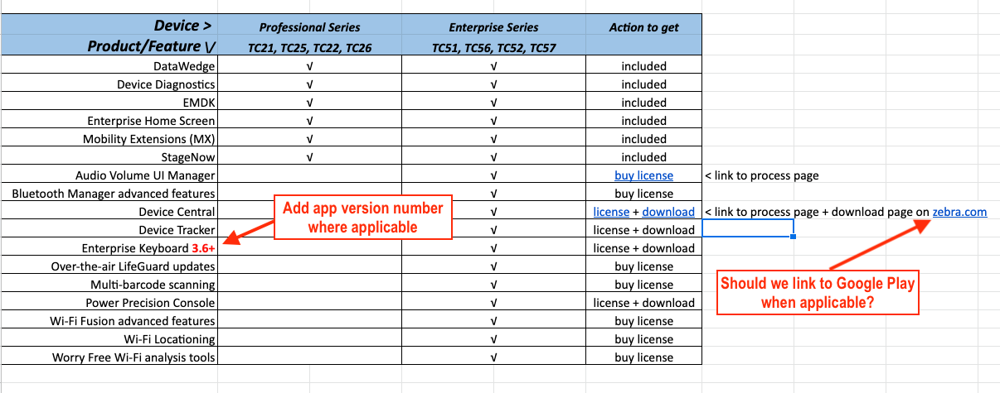

## Overview

Zebra uses Flexera. 

_Click image to enlarge; ESC to exit_. 
 

-----

## MDNA Professional and MDNA Enterprise 
The table below shows features and software components included with Zebra Professional series and Enterprise series devices and the actions required to add Enterprise features to Professional devices.  

<table class="faceliftCenter" style="width:100%" border="1" padding="5px">
<tbody>
  <tr bgcolor="#dce8ef">
    <th>Product/Feature</th>
    <th>Professional Series TC21/TC25, TC22/TC26</th>
    <th>Enterprise Series TC51/TC56, TC52/TC57</th>
    <th>Actions(s) Required to Upgrade</th>
  </tr>

  <tr>
  <td><a href="/datawedge">DataWedge</a></td>
  <td>√</td>
  <td>√</td>
  <td>N/A</td>
  </tr>

  <tr>
  <td><a href="/ddt">Device Diagnostics</a></td>
  <td>√</td>
  <td>√</td>
  <td>N/A</td>
  </tr>

  <tr>
  <td><a href="/emdk-for-android">EMDK for Android</a> <a href="/emdk-for-xamarin">EMDK for Xamarin</a></td>
  <td>√</td>
  <td>√</td>
  <td>N/A</td>
  </tr>

  <tr>
  <td><a href="/ehs">Enterprise Home Screen</a></td>
  <td>√</td>
  <td>√</td>
  <td>N/A</td>  </tr>

  <tr>
  <td><a href="/mx">Mobility Extensions (MX)</a></td>
  <td>√</td>
  <td>√</td>
  <td>N/A</td>  </tr>

  <tr>
  <td><a href="/stagenow">StageNow</a></td>
  <td>√</td>
  <td>√</td>
  <td>N/A</td>
  </tr>

  <tr>
  <td>Audio Volume UI Manager</td>
  <td></td>
  <td>√</td>
  <td><a href="../process">Buy MDNA Enterprise license</a></td>
  </tr>

  <tr>
  <td><a href="#advanced_features">Bluetooth Manager advanced features</a></td>
  <td></td>
  <td>√</td>
  <td><a href="../process">Buy MDNA Enterprise license</a></td>
  </tr>

  <tr>
  <td><a href="/devicecentral">Device Central</a></td>
  <td></td>
  <td>√</td>
  <td><a href="../process">Buy MDNA Enterprise license</a> Download latest client app</td>
  </tr>

  <tr>
  <td><a href="/devicetracker">Device Tracker</a></td>
  <td></td>
  <td>√</td>
  <td><a href="../process">Buy MDNA Enterprise license</a> <a href="https://www.zebra.com/us/en/support-downloads/software/productivity-apps/device-tracker.html">Download latest client app</a></td>
  </tr>
  <tr>
  <td><a href="/ekb">Enterprise Keyboard 3.6+</a></td>
  <td></td>
  <td>√</td>
  <td><a href="../process">Buy MDNA Enterprise license</a> <a href="https://www.zebra.com/us/en/support-downloads/software/productivity-apps/enterprise-keyboard.html">Download latest client app</a></td>
  </tr>
  
  <tr>
  <td>Over-the-air LifeGuard updates</td>
  <td></td>
  <td>√</td>
  <td><a href="../process">Buy MDNA Enterprise license</a></td>
  </tr>

  <tr>
  <td>Multi-barcode scanning</td>
  <td></td>
  <td>√</td>
  <td><a href="../process">Buy MDNA Enterprise license</a></td>
  </tr>

  <tr>
  <td><a href="/ppc">PowerPrecision Console</a></td>
  <td></td>
  <td>√</td>
  <td><a href="../process">Buy MDNA Enterprise license</a> <a href="https://www.zebra.com/us/en/support-downloads/software/productivity-apps/power-precision-console.html">Download latest client app</a></td>
  </tr>

  <tr>
  <td><a href="#advanced_features">Wi-Fi Fusion advanced features</a></td>
  <td></td>
  <td>√</td>
  <td><a href="../process">Buy MDNA Enterprise license</a></td>
  </tr>

  <tr>
  <td>Wi-Fi Locationing</td>
  <td></td>
  <td>√</td>
  <td><a href="../process">Buy MDNA Enterprise license</a></td>
  </tr>

  <tr>
  <td><a href="/mx/worryfreewifimgr">Worry Free Wi-Fi</a></td>
  <td></td>
  <td>√</td>
  <td><a href="../process">Buy MDNA Enterprise license</a></td>
  </tr>
</table>

-----

 

### [AudioVolUIMgr](/mx/audiovoluimgr)
(click title above for full CSP details)
* All Zebra Volume Control parameters

### [BluetoothMgr](/mx/bluetoothmgr)
(click title above for full CSP details)

* AllowDiscoverability
* AllowPairing
* AllowSilentPairing
* SilentPairingAction

### [Wi-Fi](/mx/wifi) 
(click title above for full CSP details)

* 2.4GHzChannels
* 5.0GHzChannels
* 802.11v
* 802.11w
* Authentication (LEAP option)
* Authentication (EAP-FAST-GTC option)
* AutoTimeConfig
* BandPreference
* CallAdmissionControl
* CaptivePortalDetection
* CCKM_Config
* EnableRestrictedSettingsUI
* Gratuitous_ARP
* Hotspot
* Hotspot24GHz
* Hotspot5GHz
* PasswordClearPEAPGTC
* PasswordEncryptedPEAPGTC
* PasswordProtectEncryption
* SubNetRoam
* UseHotspotOptions
* WMM-PS (PowerSave Option 4)

### [WorryFreeWiFi](/mx/worryfreewifimgr) 
(click title above for full CSP details)

* All parameters

<!-- 
menu:
  items:
    - title: About
      url: /oemconfig/9-3/about
    - title: Process
      url: /oemconfig/9-3/process
    - title: FAQs
      url: /oemconfig/9-3/faq
    - title: Managed Configurations
      url: /oemconfig/9-3/mc
    - icon: fa fa-search
      url: /oemconfig/9-3/search -->