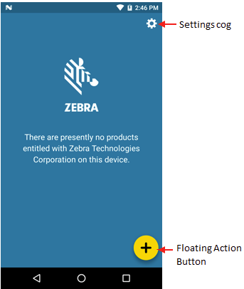
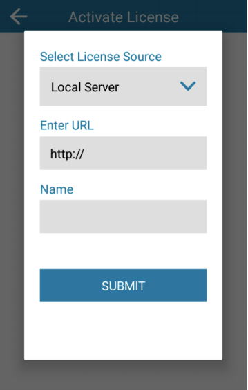

## Overview 
This guide explains the process of obtaining a [Zebra Mobility DNA Enterprise](https://www.zebra.com/us/en/products/software/mobile-computers/mobility-dna.html) license for commercial use, applying the license manually to individual devices and mass-deploying licenses using Zebra StageNow and an Enterprise Mobile Management (EMM) System.

> **Not yet ready to buy**? [Request an evaluation license](#evaluationlicense). 
> **Not sure which product or feature is needed**? [Request an evaluation license](../about/#mdnacomponentsandfeatures).

-----

### Requirements
License activation requires ***ALL THREE*** of the following:   

1. **One or more license keys** (aka Activation IDs) purchased for the target device(s) and/or app(s) 
2. **One or more supported Zebra device(s) with the correct License Manager app** installed: 
 &nbsp;&nbsp;&nbsp;&#8226; **Android**: License Manager 3.1.1 or later (pre-installed on supported devices) 
 &nbsp;&nbsp;&nbsp;&#8226; **Windows Mobile/CE**: License Manager 1.0 or later (included with Zebra-app installers) 
3. **Devices must be connected to one of the following**:  
 &nbsp;&nbsp;&nbsp;&#8226; **Zebra's internet-based license server** for online activation  **OR** 
 &nbsp;&nbsp;&nbsp;&#8226; **A company's own Linux or Windows server** (for off-line activation of any supported device) 

-----

## I. Contact a Reseller 
Zebra licenses are obtained through Zebra resellers or in some cases directly from Zebra. **To begin, select an option**: 

* **[Find a Zebra Partner](https://www.zebra.com/us/en/partners/find-a-zebra-partner.html) -** form for submitting an inquiry via the web
* **[How to Select a Channel Partner](https://www.zebra.com/us/en/partners/find-a-zebra-partner/selecting-the-right-channel-partner.html) -** explains the types of partners that engage with Zebra and some of their technologies and specialties
* **[Partner Interaction Center](https://www.zebra.com/us/en/partners/partner-interaction-center.html) -** info for contacting Zebra's existing global partner network
* **[Zebra Corporate Numbers and Links](https://www.zebra.com/us/en/about-zebra/contact-zebra.html) -** broken down by global region
* **[Global Marketing Contact Center](https://www.zebra.com/us/en/about-zebra/contact-zebra/marketing-contact-center.html) -** broken down by global region and country

-----

## II. Access Licensing System
After a licensing agreement is purchased from Zebra or a Zebra reseller and a customer representative is designated, **an email is sent to the representative containing user credentials** for accessing the Zebra Enterprise Software Licensing system. 

##### After licensing credentials are received:
* **Visit the [Zebra licensing support page](https://www.zebra.com/us/en/support-downloads/software-licensing.html)**, register and log into the portal. 
 **This allows the customer to:** 
  * Place order(s) for licenses
  * Check the status of existing orders
  * Assign licenses to devices or deployments
  * View current license inventory and assignments
  * Purchase and download license key `.BIN` files with Activation IDs for [off-line licensing](#offlinelicensing) 
<!-- https://zebra-licensing.flexnetoperations.com/flexnet/operationsportal/logon.do -->

-----

## III. Manually Assign License

This section **applies only to manual license activation on a single device running Android**. 

**See the [Mass Deployment section](#massdeployment)** of this guide to remotely activate multiple licenses for an entire organization. 

### License Source Types
* **Cloud-based server** (internet connection required)
* **Local server** (on customer premises)
<!-- available only under special circumstances
* **Pre-activated** (binary file pushed to device) 
 -->

### Connectivity Options
* **Production Cloud Direct -** License Manager maps automatically to web-based Zebra Licensing Server to activate licenses; no server configuration required.
* **Production Cloud Through Proxy -** License Manager maps automatically to web-based Zebra Licensing Server through customer's on-premise proxy server. Requires configuration of proxy server settings. 
* Custom Cloud - **Reserved for future use**. <!-- If a custom or relay server is used to manage licensing, a unique URL and server name can be added as a separate license source to appear in future source lists.   -->
* Test Cloud Direct - **For Zebra internal use only**.
* Test Cloud Through Proxy - **For Zebra internal use only**.

### BEFORE BEGINNING
* **Confirm that the clock is set correctly on the device to ensure proper application of license(s)**. 
* **Create license-key barcodes (if desired) using any barcode generator tool**. License-key barcodes ease the activation process; they are not provided by Zebra. Keys also can be typed in manually. 
* **Ensure devices are connected to the required licensing server**. 
<!-- * License sources added using this process are subsequently available for selection in the "Select License Source" drop down list.
 -->

-----

#####To activate a device license:  

> `NOTE:` **The Zebra Enterprise Browser app is used as an example**. 

1. Locate and **launch the License Manager** app:

 
2. On launch, License Manager displays active licenses (if any).  
**Tap the floating action button**:

 
3. When the "Activate License" screen appears: 
 1. **Enter or scan the license key (Activation ID)**: 
 
  
 2. **Tap "Select License Source"** and select desired options. 
 3. **Tap SUBMIT** button.  
 If prompted to set device clock, **Tap "Continue"** to invoke the "Activation" screen again: 

 
4. **Tap Activate**.  

 
 Successful license activation is indicated by a screen similar to the image below: 
 
  

#### The Android device is now licensed to use the app or features(s). 

-----

## Off-line Licensing
License Manager provides a Local License Server option, enabling organizations to employ an on-premise server to distribute licenses to devices that do not have access to the internet. **This option requires software installed on a company's own IP-based Linux or Windows server** in advance of license distribution to devices. 

> **For more information, including hardware requirements and setup instructions, download the appropriate Local License Server Administration Guide from the [Zebra License Management support portal page](https://www.zebra.com/us/en/support-downloads/software-licensing.html)**. 

### BEFORE BEGINNING
* **Install and configure Local License Server**
* **Acquire a `.BIN` file containing licenses (Activation IDs) from Zebra License Server** for each 1000 devices to be licensed **`<< CONFIRMATION NEEDED on 1000-device max.`**
* **Ensure devices are connected to the local licensing server**. 

#####To License a Device from a Local Server: 

**Note**: The Zebra Enterprise Browser app is used as an example. 

1. In the License Manager app, **tap Local Server** from the License Source drop-down.  
A screen appears as below.

 
2. **Enter the server URL, provide a name and tap SUBMIT**.   
3. **Enter or scan the license key for the device**.  
 Then **Tap Activate**. 
 
  
 **Successful license activation is indicated by a screen similar to the image below**: 
 
  

#### The device is now licensed to use the app or feature(s). 

-----

## Mass Deployment 

Mass-deployment of MDNA Enterprise licenses requires use of an Enterprise Mobility Management (EMM) system and/or Zebra StageNow tools and its [License Manager Setting Type](https://techdocs.zebra.com/stagenow/latest/csp/license).

#### `IMPORTANT NOTES:`
* **The procedures described below include only those for deploying and activating licenses for Zebra apps and features on the device(s)**. They **DO NOT** include the purchase process for license activation IDs nor configuration of the network and device clock settings, which are required to download the app and properly apply the license(s).
* **To set license keys to remain on the device following an Enterprise Reset**: 
 * All license activation steps must be stored <u>in a single Profile</u>, activated using License Manager and preserved using [Persist Manager](/mx/persistmgr).   
 * WLAN settings MUST be configured BEFORE license activation steps in the Profile. 
 * Keys MUST be stored in the `/enterprise/usr` folder on the device. 

### Prerequisites

* [StageNow Profiles](https://techdocs.zebra.com/stagenow/latest/stagingprofiles/) for correctly configuring device clock and network settings
* Software License key(s) (aka Activation IDs, AIDs)

> **`CAUTION:` Zebra strongly recommends testing any new StageNow Profile on a working device before general deployment**.

-----

### Create StageNow Profile

#####To create the licensing portion of a StageNow Profile:

&#49;. **Launch StageNow and select “Create new Profile"** from the left-hand pane of the Home screen.  
The "Select a Wizard" dialog box appears. 
&#50;. **Select MX version** to match device(s), **click "Xpert Mode"** and **click "Create"** button. 
&#51;. **Enter a Profile name and click "Start"** button. 
&#52;. **Single-click LicenseMgr** (scroll down if necessary to display it); then **click "Update"** button.  
&#53;. **Under "License action type:" select “Perform Zebra license action.”**  
Additional options appear: 

_Click image to enlarge_.
 
&#54;. **Set the parameters as required** to activate the license: 
* **For cloud-based licensing**:  
 * **Zebra recommends this option for the best device visibility from the licensing portal**: 
 * **Zebra license action**: Activate AID -> select "Use one of the Zebra Licensing cloud options" 
 * **Cloud Source**: "Use the Zebra licensing Production Cloud."  
 * Enter the AID and quantity.  
 * **Click "Continue" button**. 
* **For local (on-premise) licensing**: 
 * **Best for fire-walled networks or those lacking internet access**:  
 * **Zebra license action**: Activate AID -> select "Use a local license server option" 
 * **Enter the URL, friendly name, AID and quantity**.
 * **Click "Continue" button**. 

&#55;. **To persist license key(s)** on the device following an Enterprise Reset:  
* **a. Download(†) and save key(s) as `.BIN` file(s) to** `/enterprise/usr` folder on the device. 
* **b. <u>From a single Profile</u>**: 
 * **Configure WLAN settings** using Wi-Fi CSP. 
 * **Activate key(s) using License Manager** (licensing method="reference a preactivated license file already on the mobile device"). 
 * **Preserve settings using [Persist Manager](/mx/persistmgr).**

&#56;. **Complete Profile creation and scan the staging barcode.**

&#57;. **Confirm that the Profile successfully licensed the device**:  
 * a. **Launch the License Manager app** on the device; activated license should be visible. 
 * b. **Quantity of available licenses visible on the licensing portal should decrease** by the number of licenses deployed. A list of device IDs also is visible there. 

**(†)** To download a License key as a `.BIN` file from the Zebra Licensing Portal, select "Download Capability Response" from the Device Action menu. Each `.BIN` file contains license(s) for specific device(s).

> **`CAUTION:` Zebra strongly recommends testing any new Profile on a working device before general deployment**.

Also see [related guides](#relatedguides). 

-----

## Evaluation License
Zebra offers time-limited trial licenses to allow companies to evaluate the performance of Zebra solutions in their environment. 

* **Customers, partners and distributors**: Request through a Zebra account manager or sales engineer
* **Zebra account managers and sales engineers**: Submit requests using [SFDC forms](https://zebra.lightning.force.com/lightning/page/home)
* **Zebra engineers and other Zebra employees and contractors**: Submit a request in the Zebra [ServiceNOW](https://zebra.service-now.com/com.glideapp.servicecatalog_cat_item_view.do?v=1&sysparm_id=a6a5c8a60f322700df9ce64be1050e35) portal

-----

## License Transfer
The Zebra MDNA Enterprise licensing system supports the transfer of licenses from one device to another if the device licenses were originally activated using a cloud-based or local licensing server. This is done by returning the activated license(s) to the pool (using License Action "Return") and activating them on new device(s).

See the [License Manager section](https://techdocs.zebra.com/stagenow/latest/csp/license) of Zebra's StageNow tool for details.

-----

## Logging

License Manager activities are captured by [Zebra RXLogger](/rxlogger) and Android logcat. 

-----

## See Also

* **[Frequently Asked Questions](../faq)** | Common licensing issues and how to resolve them 
* **[Zebra StageNow](/stagenow)** | A free Windows app for remote-device staging, licensing and mass deployment 
* **[Zebra.com Licensing Page](https://www.zebra.com/us/en/support-downloads/software-licensing.html)** | Additional user manuals, how-to videos and relevant links

<!-- 6/1/20- is this relevant anymore? 
* **[Zebra licensing system documentation page](https://softwarelicensing.zebra.com/documentation/index.html)** | Additional licensing info and sample screens
 -->
-----

<!-- 

_Click image to enlarge; ESC to exit_. 
 

 -->