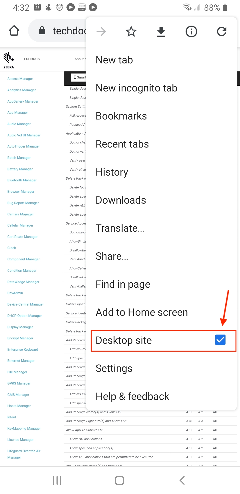

<!-- layout: mx-filter.html-->

## Overview
TechDocs was developed primarily for display on desktop and laptop systems with standard-sized monitors. When displayed on a mobile device screen, TechDocs pages might appear distorted or contain overlapping elements. 

### How to Fix

Some mobile browsers provide a "view site as desktop" feature. While this usually fixes rendering problems, a smaller portion of the screen is displayed and zooming is required. 

_"Desktop site" checkbox in Google Chrome for Android_.
 

-----
