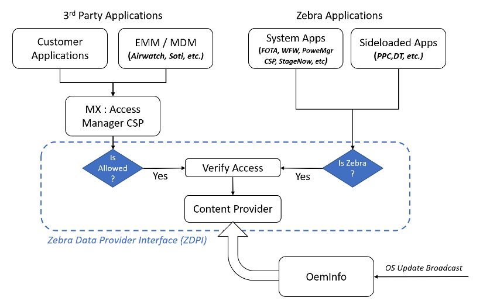

## Overview

Zebra OEMinfo is a service included with Zebra devices running Android 10 (and later) that provides a set of APIs through which apps can publish information about a Zebra device's capabilities and settings and allow other apps can acquire that data through the same interfaces.

_Click image to enlarge_. 
 

Using the [OEMinfo Content Provider Framework](../faq/oeminfocontentproviderframework), OEMinfo  allows apps to acquire some or all of the information about a given Zebra device though a single set of publicly defined specifications rather than having to use separate proprietry interfaces and methods. A data set can contain proprietary or non-proprietary information, and can be limited to “designated receivers” or open to all. 

### Scope and Audience

This guide covers the methodologies for Data Consumer apps to read content from the [OEMinfo Content Provider Framework](../faq/oeminfocontentproviderframework), describes the major components of the software architecture, and details the interactions between them. It is intended for software developers and other technical users designing apps that need to acquire information from the Zebra devices on which they run.

-----

## Also See

* **[FAQ](../faq)** | Frequently asked questions about OEMinfo
* **[Content Provider Basics](https://developer.android.com/guide/topics/providers/content-provider-basics.html)**
**[Content Observer](https://developer.android.com/reference/android/database/ContentObserver.html)**