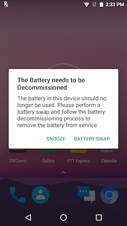
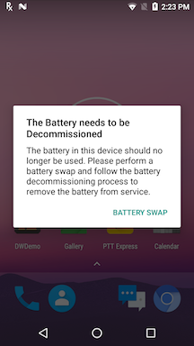

###Overview
The Admin can monitor battery status in the Admin View to check for any batteries that are nearing end-of-life (EOL) or at EOL based on the state-of-health (SOH). Select one or more batteries in poor health and send customizable messages to the device end-user, instructing them to prepare to swap their current battery with a new one. If the user is in the middle of a task, the message will appear in the foreground blocking the user from continued operation. The EOL messages can be sent either immediately, at a scheduled time or appear on the device with a snooze option. The snooze option informs the end-user that the poor health battery needs to be swapped out soon and allows the user to complete their task prior to taking action. Once the user accepts the EOL message, the battery can be decommissioned. A notification is sent to the end-user requesting for the battery to be swapped out. The device is inaccessible at that time, preventing any further use until the decommissioned battery is removed and replaced with a healthy battery. 

##Perform EOL
Send an EOL request to the end-user to prepare for battery decommission:
1. In the [Admin View](../admin) click on **Active** tab.
2. Select the battery/batteries to send the EOL request.

	
	_Figure 1. Battery Actions_

3. The Action button appears at the top left. Tap on the Action button and select "Perform EOL".
4. The "Perform EOL" screen appears with the following options:
	* **Message to Display** - Create customized content for end-user notification messages informing them to prepare for a battery swap to decommission the poor health battery from service.  
	* **Allow user to snooze** – Provide an opportunity for end-users to snooze (continue using the device temporarily) instead of immediately initiating the decommission process. When the device is in snooze mode, the admin dashboard provides an indication in the Status column. For example, “User Snoozed [2/5]” is displayed in the Status column, indicating the user has snoozed “2” times out of maximum “5” times. The maximum snooze count is set in the Client Settings tab from the [Admin View](../admin).  
	* **Scheduled** – Select the date to schedule the EOL message to be sent. The message is sent at 12 am on the specified date. 
 
 Trigger events for EOL messages are defined in the **Client Settings** tab in the [Admin View](../config). The EOL message is not received on the device until one of the enabled trigger events takes place. 
4. Select the desired options and tap Send.
5. Tap OK in the confirmation message.
6. The Admin View displays "EOL Request Sent" in the Status column of the battery.
7. The EOL request is displayed on the device. 

	
	_Figure 2. Device EOL Request_

8. The user has the option to snooze (if configured by the admin) or initiate the battery swap. If “Battery Swap” is tapped, the decommission process is initiated. _See Manually Decommission section_. If the user taps “Snooze”, then the snooze duration can be selected: 1 hour, 4 hours, 8 hours, 24 hours. The same message reappears after the elapsed snooze time until the maximum snooze count is reached, at which time the Snooze optionis no longer available.
9. Accept the EOL request by tapping "Battery Swap" to start the decommission process.
10. The Admin View displays "EOL Request Accepted" in the Status column of the battery. The battery is removed from the **Active** tab and moved to the **Decommissioned** tab on the Admin View.
The battery can now be decommissioned. _Continue to step x in Decommission Battery section below._ 

> When sending an EOL request, the web server does not refresh automatically.  A manual browser refresh is required to display the change in status. 

##Cancel EOL
The EOL request can be cancelled with the following steps:
1. In the [Admin View](../admin) click on **Active** tab.
2. Select the battery/batteries to cancel the EOL request. 
3. Accept the confirmation message.
4. The Action button appears at the top left. Tap on the Action button and select "Cancel EOL Request".
5. The battery status in the Admin View displays "In service - active".

###Decommission Battery
Decommission the battery to swap batteries and remove the poor health battery from service. To manually decommission the battery:

1. In the [Admin View](../admin) click on **Active** tab.
2. Select the battery/batteries to to decommission.
3. The Action button appears at the top left. Tap on the Action button.
4. Select "Decommission Battery". A confirmation message appears to decommission the selected battery/batteries. 
5. When confirmed, a message appears in the Admin View indicating the battery has been decommissioned. The battery is removed from the **Active** tab and moved to the **Decommissioned** tab on the Admin View. 
6. When the EOL Alert event is triggered (as configured in the **Client Settings** tab) the device end-user receives a message notification indicating that the battery needs to be decommissioned. 

_Figure 3. Decommission Battery_

The user cannot access the device until the steps are followed to swap out the battery to decommissioned. 
7. Tap “Battery Swap”. The Battery Swap Mode application appears.

_Figure 4. Battery Swap_

8. Tap Swap Battery. Follow the procedure as instructed to replace the poor health battery with a healthy battery without loss of information. 
9. After swapping the battery, press the power button to turn the device back on. 
10. Manually take the decommissioned battery out of service and remove it from inventory.

###Undo Decommission
If a battery is decommissioned prematurely or mistakenly, it can be placed back into commission.
1. In the **Decommission** tab in the [Admin View](../admin), select a battery to undo decommission.  
2. Click the Action button.  
3. Click Undo Decommission. 
4. The battery is moved to the **Active** tab with status "In service - active".

 

-----

## See Also

* [About PowerPrecision Console](../about)
* [PowerPrecision Console Install & Setup](../setup)
* [Admin View](../admin)
* [Battery Management](../mgmt)
* [EOL Management](../eol)
* [Configuration](../config)