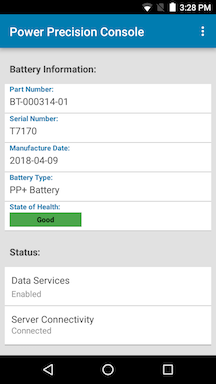

## Overview

PowerPrecision Console server can be downloaded and installed on a Windows-based server or desktop. The PowerPrecision Console client is installed and setup on the supported Zebra mobile computers.  After server installation, further network setup is required to allow communication between the server and devices via DNS and firewall configurations for connectivity over specified HTTPS ports, with default ports 8080 and 8443.

> See [System Requirements](../about/#systemrequirements)

##Server Install & Setup
Instructions for server installation and setup:

1. **Server Installation.** 
	Double-click on the .EXE and follow the steps to complete installation.

2. **DNS (Domain Name Server) Setup**

	The PPC server runs in a domain, for example name.company.com.  To run PPC, an entry in the DNS server is required to add the server IP address.  The DNS server and PPC server are required to be on the same network.  Contact your local IT Administrator to configure this mapping. 

3. **Server Certificate**

	After install, it is required to create an SSL certificate (.pfx) for the installed server. Once generated, copy this certificate in the following default locations: 
	   * \Program Files (x86)\Zebra Technologies\PowerPrecision Console\Release\Server\WebUI 
	   * \Program Files (x86)\Zebra Technologies\PowerPrecision Console\Release\Server\PowerPrecisionConsoleServer 
	We recommend to use an SSL Tool (such as [ssltools.com](http://ssltools.com/)) to aid in diagnostics and validate the certificate chain.

4. **Server Configuration**

	From default folder “\Program Files (x86)\Zebra Technologies\Power Precision Console\Release\Server\WebUI”, open the .env file.  Set the following variables: 

		SERVER=”https://localhost:8080/ppcdata" 
		PORT=”8080” 

	For SERVER, “localhost” may be replaced with the appropriate server IP address or machine name. 
	For PORT, this value may be changed to the appropriate desired value. 

	In default folder “\Program Files (x86)\Zebra Technologies\Power Precision Console\Release\Server\PowerPrecisionConsoleServer\config”, open “application.properties.”  Set the following values:  

		server.dns=<DNS server> 
		server.idDesc=<store location string> 
		server.port=8080 

		# SSL certificates 
		server.ssl.key-store: <ssl_certificate.pfx> 
		server.ssl.keyStoreType: PKCS12 
		#server.ssl.key-store-password: 

	Replace all values in the angled brackets <> to the desired value or string.  Remove the hashtag to uncomment out the password line if a password is required.  Enter in the appropriate password.

	Note: If port 8080 is not available on the server, any other available port can be used in replacement.  Some network policies might block incoming and outgoing ports - it is required to open the configured ports in the network firewall as described in the next section “Open inbound/outbound ports on the firewall” 

5. **Open inbound/outbound ports on the firewall**
	The appropriate ports need to be opened for inbound/outbound network traffic flow through the firewall for communication between the server and devices.   

	* Inbound ports: Open the port specified in the .env file, by default TCP ports 8080 and 8443. 
	* Outbound ports: open notification port as specified in .env file, by default TCP port 8080.

	Running the PPC Server Software. Open the supported browser.  Enter the server URL: https://[server]:8443/ppcui  

	Where [server] is replaced with the designated server name.

	Default login credentials are: 

	* User: SAdmin 
	* Password: admin 

##Client Install & Setup
Instructions to install and setup PPC on the Zebra device.

**Automated Install:** An EMM (Enterprise Mobility Management) or Zebra's [StageNow](/stagenow/latest/about) solution can be used for app deployment and provisioning.

**Manual Install:** 
1. Copy the .APK file from the default folder (\Program Files (x86)\Zebra Technologies\PowerPrecision Console\Release\Client) to the device. 
The subfolders (M, N, O) are based on Android versions Marshmallow, Nougat, and Oreo.  Select the appropriate version based on the Android flavor installed on the device. 
2. Launch the .APK to install.   
3. When prompted, enable the “Apps that can draw over other apps” permission. 
4. Launch PowerPrecision Console app.

5. Tap the hamburger menu at the top right, then tap Settings. 
6. Tap Server URL.  

7. Enter in the server URL.  Tap the back button to return to the main screen.
8. Tap the sync icon.  The device shows connectivity to the server.  

##Configuration
The following are configuration options:
* **PowerPrecision Battery Support** - Steps required to support PowerPrecision batteries:
 1.  On the PPC Server, open the .env file (by default in folder: \Program Files\Zebra Technologies\PowerPrecision Console\Release\Server\WebUI). Change the property **PP_BATTERY_SUPPORT = "false"** to **PP_BATTERY_SUPPORT = "true"**.
 2. Open application.properties file (by default in folder: \Program Files\Zebra Technologies\PowerPrecision Console\Release\Server\PowerPrecisionConsoleServer\config). Change the property **pp.battery.support=false** to **property pp.battery.support=true**.
 3. Restart the server.
 4. Uncheck all SOH filters in the dashboard.

* **Threshold Value in PPC and Battery Manager** - Battery Manager is a built-in application with the “Percentage decommission threshold” set to 80% by default. This is the same default value for “End of Life Threshold” on PPC. To avoid multiple warning notifications being sent to the end-user with the same message when the battery reaches the percent threshold, we recommend the admin to set the “Percentage Decommission Threshold” value in Battery Manager to 5% less than the “End of Life Threshold” value set on the PPC server. This can be accomplished using an EMM such as [StageNow](/stagenow/latest/about) or Zebra's [Battery Manager CSP](/mx/batterymgr). 

 
-----

## See Also

* [About PowerPrecision Console](../about)
* [Using PowerPrecision Console](../usage)
