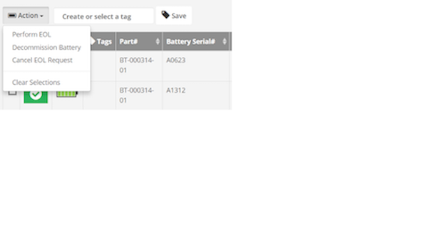

This section provides information on the use of PowerPrecision Console (PPC) on the server and client.

## PPC Server

PowerPrecision Console server is a centralized dashboard displaying an inventory of deployed Zebra device batteries with color-coded battery health indicators based on SOH.  It tracks state-of-health (SOH), state-of-charge (SOC), tags, part number, serial number, manufacturing date, device model, device serial number, IP address, last known status, and last update (elapsed time since the last update was received).

**Navigation and customization view of the centralized dashboard.** The PPC Client app sends regular battery updates to the PPC Server, which automatically categorizes the batteries into “good” (green), “nearing end-of-life” (amber) and “end-of-life” (red) SOH categories based on the thresholds defined. A quick snapshot of battery SOH for all deployed batteries is available at the top right.  SOH filtering is available to quickly view individual or multiple SOH categories of deployed batteries to identify the batteries that are nearing EOL or need to be decommissioned. The columns on the dashboard can be sorted by tapping the double triangle to the right of the column name.  A tabbed menu is displayed at the top of the dashboard providing access to other views and functionality: Active, Decommissioned, Add Battery, Server Settings, Client Settings.  A search can be conducted based on battery or device information. 

Further customize the dashboard by selecting the categories to filter in the view:

**Centralized control to segregate batteries in poor health.** In the Active tab, click on any battery for complete battery information including battery analytics history, status, IP address, date of manufacture, serial number and more. Choose one or more batteries in poor health and send customizable “end-of-life” (EOL) messages to the device end-user, instructing them to prepare to swap their battery in poor health with a new one.  These EOL messages can be customized to be sent either immediately, scheduled or appear on the device with a snooze option informing the end-user that the battery is out of commission and needs to be swapped out and disposed of. Once the EOL process is complete, the battery can be decommissioned.  During battery decommission, a notification is sent to the end-user requesting for the decommissioned battery to be swapped out.  The device is inaccessible at that time, preventing any further device use until the decommissioned battery is removed and replaced with a healthy battery.  

In the Active tab, select a battery in the dashboard by clicking on the checkbox at the left of the SOH indicator.  

The Action button appears.

Tap on the Action button.

The sections below describe the actions listed.

###Perform EOL
When selected, sends an EOL request to the end-user notifying that the battery is nearing EOL and preparations should be made to prepare for battery decommission. If the user is in the middle of a task, the message will appear in the foreground blocking the user from continued operation. 
	* **Message to Display** - Creates customized content for end-user notification message. 
	* **Allow user to snooze** – Provides an opportunity for end-users to snooze (continue using the device temporarily) instead of immeidately initiating the decommission process. When the device is in snooze mode, the admin dashboard provides an indication in the Status column. For example, “User Snoozed [2/5]” is displayed in the Status column, indicating the user has snoozed “2” times out of maximum “5” times.   
    * **Scheduled** – select the date to schedule the EOL message to be sent.  The message is sent at 12 am on the specified date, taking into consideration that server activity is typically minimal at this time. 
The trigger events for EOL are defined in the **Client Settings** tab. _See **Client Settings** section._ When an EOL request is sent to the user, the dashboard displays “EOL Request Sent” in the Status column. When the user accepts the EOL request, the status changes to “EOL Request Accepted”. When the "EOL 

When the snooze iterations have completed or the user has accepted the battery swap, the battery can be decommissioned.  _See Decommission Battery section._

> When sending an EOL request, the web server does not refresh automatically.  A manual browser refresh is required to display the change in status. 

###Decommission Battery
When selected, displays a confirmation message to the admin to decommission the selected battery/batteries. When confirmed, a message appears in the dashboard indicating the battery has been decommissioned. The battery is removed from the **Active** tab and moved to the **Decommissioned** tab on the dashboard. When the EOL Alert event is triggered (as configured in the **Client Settings** on the dashboard), the device end-user receives a message notification indicating that the battery needs to be decommissioned. _See Decommission Battery in the **PPC Client** section discussing device behavior._ 

###Cancel EOL Request
When selected, displays a confirmation message to the admin to confirm the action to cancel the EOL request for the selected battery/batteries. A message displays indicating the batteries are activated and the batter status displays as "In service - active" in the dashboard.

###Recommission Battery
If a battery is decommissioned prematurely, it can be placed back into commission.  In the **Decommission** tab in the dashboard, select a battery to decommission. Click the Action button.  Click Undo Decommission. 

###Client Settings
In the dashboard, navigate to the **Client Settings** tab.

These are global settings to configure PPC behavior.

* **State of Health Thresholds** 
	* **Automatic EOL** – When enabled, the EOL request is automatically sent when the battery reaches the specified **End of Life Threshold**.    
	* **Threshold values** - Specifies the threshold values for each color-coded SOH battery state in the dashboard. By default the thresholds are:
	  * End of Life Thresdhold: 80
	  * Warning Threshold: 85
	These default thresholds correlate to the color-coded SOH as follows: 
	  * Green – up to approximately 85% battery life capacity remaining  
	  * Amber – up to approximately 80% battery life capacity remaining 
	  * Red – less than approximately 80% battery life capacity remaining 
	The percentage measured is an approximate measurement of the capacity of remaining battery life based on various electrical measurements. These default thresholds serve as a guideline – the values can be adjusted to individual circumstances, for example depending on battery performance of the workforce in different shifts. 

* **Data Collection Triggers** - Determines what device information is collected and when to send to the server. Select the desired events to trigger data collection on the device and the amount of time elapsed in between each trigger event.  When an event is triggered, it is logged in the device history. The minimal time period that can be selected is 1 hour. 

* **EOL Alerts** - When enabled, sends an EOL alert notifying the user to prepare for battery decommissioning based on the time trigger options: Show Alert On Next Boot, Show Alert On Next Battery Swap, Show Alert At [specified time]. 
	* **Max Snooze Count** – specify the maximum number of times to snooze until decommissioning is required 
	* **Show Alert On Next Boot** – display the EOL message upon next device boot 
	* **Show Alert On Next Battery Swap** – display the EOL message upon next battery swap 
	* **Show Alert At** – specify a daily time to display the EOL message  

###Tag Batteries
Battery tags provide the capability to identify and group batteries for organization purposes based on a common name.  This name can be based on location, function, or any desired form of identification. 

**Add Tag** – adds or appends a tag to any pre-existing list of tags for each battery
1. Select battery/batteries to tag. 
2. In the tag field next to the Tag Actions button, enter text to use as the tag name. 
3. Click Actions button with tag icon. 
4. Click Add. 
5. Click OK in the confirmation message. 
The selected batteries are now tagged with the designated text, displayed in the Tags column on the dashboard.

**Override Tag** - removes and pre-existing tags and replaces them with the new tag 
1. Select batteries to tag. 
2. Enter text to use as tag in the tag field next to the Tag Actions button. 
3. Click Actions button with tag icon. 
4. Click Override. 
5. Click OK in the confirmation message. 
The selected batteries are now tagged only with the designated text, displayed in the Tags column on the dashboard. 

**Delete Tag** - deletes the specified tag 
1. Select batteries to remove the tag. 
2. Enter name of tag to remove in the tag field next to the Tag Actions button. 
3. Click Actions button with tag icon. 
4. Click Override. 
5. Click OK in the confirmation message. 
The specified tag is removed from the battery/batteries on the dashboard.

###Manually Add Battery
Use the Add Battery tab to manually add a battery. This is useful in situations where network connectivity prevents the battery from registering with the server.  Once the battery can be registered, the record will updated with the battery SOC. 

###Generate Reports
In the dashboard, click on the Export Data icon on the top right.  Select CSV to download all data in .csv file format.  

(screen)

###Manage Users
Create additional users to access the server.

###Server Settings
In the dashboard, click on the **Server Settings** tab.  

The server address (either by IP address or machine name) and server port are displayed. The store location can be edited to aid in location identification. 

##PPC Client

PowerPrecision Console client is an app for Zebra mobile computers that collects SOC, SOH, and other information from the device battery, uploads the data to the PPC server for processing, and can display battery condition notifications to the device user to take action to decommission the battery when needed.

###Battery EOL
When the battery is nearing EOL, the admin can send the EOL request to the user notifying that preparations need to be taken to decommission the battery. 

The user has the option to snooze (if configured by the admin) or initiate the battery swap. If “Battery Swap” is tapped, the decommission process is initiated. See Battery Decommissioning section. If the user taps “Snooze”, then the snooze duration can be selected: 1 hour, 4 hours, 8 hours, 24 hours. 

After the selected time elapses, the EOL message and snooze duration selection appear again and the process is repeated if snooze is tapped until the maximum snooze limit is reached, at which time the end-user can no longer snooze the device.  The maximum limit is set in the **Client Settings** tab. If the “Allow to snooze” option is not selected, the end-user is forced to swap batteries immediately. 

###Decommission Battery
When the battery is ready to be decommissioned, the admin can take action to initiate the process and notify the user by displaying the EOL request on the device.  _See Decommission Battery in the **PPC Server** section._ 

When the decommission message is displayed, the user cannot access the device until the steps are followed to swap out the decommissioned battery. Tap “Battery Swap” button to begin the process. The Battery Swap Mode application appears. 

Tap Swap Battery. Follow the procedure as instructed to replace the battery without loss of information. After swapping the battery, press the power button to turn the device back on. Manually take the decommissioned battery out of service and remove it from inventory. 

##Configuration

**Threshold Value in PPC and Battery Manager** - Battery Manager is a built-in application with the “Percentage decommission threshold” set to 80% by default.  This is the same default value for “End of Life Threshold” on PPC. To avoid multiple warning notifications being sent to the end-user with the same message when the battery reaches the percent threshold, we recommend the admin to set the “Percentage Decommission Threshold” value in Battery Manager to 5% less than the “End of Life Threshold” value set on the PPC server. This can be accomplished using an EMM such as [StageNow](/stagenow/latest/about) or Zebra's [Battery Manager CSP](/mx/batterymgr). 

 
-----

## See Also

* [About PowerPrecision Console](../about)
* [PowerPrecision Console Install & Setup](../setup)