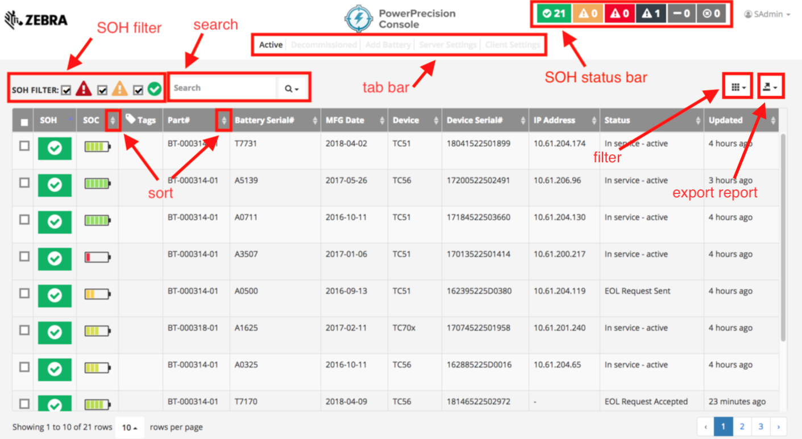
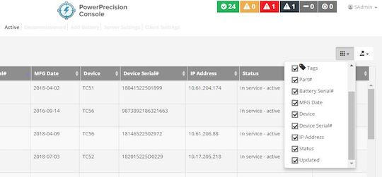
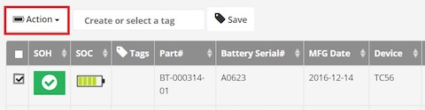
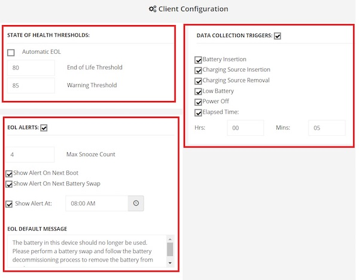
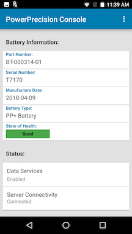

This section provides information on the use of PowerPrecision Console (PPC) on the server and client.

## PPC Server

PowerPrecision Console server is a centralized dashboard displaying an inventory of deployed Zebra device batteries with color-coded health indicators based on state-of-health (SOH). It tracks SOH, state-of-charge (SOC), tags, part number, serial number, manufacturing date, device model, device serial number, IP address, last known status, and last update (elapsed time since the last update was received).

_Figure 1. PPC dashboard_

**Navigation and customization of the centralized dashboard.** The PPC Client sends regular battery updates to the PPC Server, which automatically categorizes the batteries into “good” (green), “nearing end-of-life” (amber) and “end-of-life” (red) SOH categories based on the thresholds defined. The SOH status bar at the top right shows a quick snapshot of battery SOH for all deployed batteries. SOH filtering is available to quickly view individual or multiple SOH categories of deployed batteries to identify the batteries that are nearing EOL or need to be decommissioned. The columns on the dashboard can be sorted by tapping the double triangle to the right of the column name. A tabbed menu is displayed at the top of the dashboard providing access to other views: Active, Decommissioned, Add Battery, Server Settings, and Client Settings. A search can be conducted based on battery or device information. Further customize the dashboard by selecting the categories to filter in the view.

<!--

_Figure 2. Conduct a search_
 
  
Further customize the dashboard by selecting the categories to filter in the view:
 

_Figure 3. Filter dashboard display_
-->
**Centralized control to segregate batteries in poor health.** In the **Active** tab, click on any battery for complete battery information including battery analytics history, status, IP address, date of manufacture, serial number and more. Choose one or more batteries in poor health and send customizable EOL messages to the device end-user, instructing them to prepare to swap their current battery with a new one. These EOL messages can be sent either immediately, at a scheduled time or appear on the device with a snooze option. The snooze option informs the end-user that the poor health battery needs to be swapped out soon and allows the user to complete their task prior to taking action. Once the user accepts the EOL message, the battery can be decommissioned. A notification is sent to the end-user requesting for the battery to be swapped out. The device is inaccessible at that time, preventing any further use until the decommissioned battery is removed and replaced with a healthy battery. 

<!--

_Figure 4. Battery history_ 

In the **Active** tab, select a battery in the dashboard by clicking on the checkbox at the left of the SOH indicator.  

_Figure 4. Select battery_

The Action button appears.

_Figure 5. Action button_

Tap on the Action button.

_Figure 6. Action menu_  -->

To take action on the device when a battery is nearing EOL or at EOL:
1. In the **Active** tab from the dashboard, tick the checkbox at the left of the SOH indicator for the select battery. 
2. The Action button appears. Tap on the Action button.
3. The Action menu displays: 
   * Perform EOL
   * Decommission Battery
   * Cancel EOL Request

The following sections describe admin actions, including those listed in the Action menu.

###Perform EOL
When selected, sends an EOL request to the end-user notifying that the battery is nearing EOL and preparations are required for battery decommission. If the user is in the middle of a task, the message will appear in the foreground blocking the user from continued operation. 
 
	* **Message to Display** - Create customized content for end-user notification message. 
 
	* **Allow user to snooze** – Provide an opportunity for end-users to snooze (continue using the device temporarily) instead of immediately initiating the decommission process. When the device is in snooze mode, the admin dashboard provides an indication in the Status column. For example, “User Snoozed [2/5]” is displayed in the Status column, indicating the user has snoozed “2” times out of maximum “5” times. 
 
	* **Scheduled** – Select the date to schedule the EOL message to be sent. The message is sent at 12 am on the specified date. 
 
Trigger events for EOL message sending are defined in the **Client Settings** tab. _See **Client Settings** section for more details._ The EOL message is not received on the device until one of the enabled trigger events takes place. When an EOL request is sent to the user, the dashboard displays “EOL Request Sent” in the Status column. When the user accepts the EOL request, the status changes to “EOL Request Accepted”. 

When the maximum snooze limit is reached or the user has accepted the EOL message by tapping "Battery Swap", the battery can be decommissioned.   _See Decommission Battery section._

> When sending an EOL request, the web server does not refresh automatically.  A manual browser refresh is required to display the change in status. 

###Decommission Battery
When selected in the admin actions, displays a confirmation message to decommission the selected battery/batteries. When confirmed, a message appears in the dashboard indicating the battery has been decommissioned. The battery is removed from the **Active** tab and moved to the **Decommissioned** tab on the dashboard. When the EOL Alert event is triggered (as configured in the **Client Settings** tab) the device end-user receives a message notification indicating that the battery needs to be decommissioned. _See Decommission Battery in the **PPC Client** section discussing device behavior._ 

<!--

_Figure 7. Decommissioned tab_
-->

###Cancel EOL Request
When selected, displays a message to the admin to confirming the action to cancel the EOL request for the selected battery/batteries. Then a message displays indicating the battery is activated and the battery status displays as "In service - active" in the dashboard.

###Recommission Battery
If a battery is decommissioned prematurely, it can be placed back into commission.
1. In the **Decommission** tab in the dashboard, select a battery to recommission. 
2. Click the Action button.  
3. Click Undo Decommission. 

<!--

_Figure 8. Recommission battery_
-->

###Client Settings
In the dashboard, navigate to the **Client Settings** tab.

_Figure 2. Client Settings tab_

These are global settings to configure PPC behavior.

* **State of Health Thresholds** 
 * **Automatic EOL** – When enabled, the EOL request is automatically sent to the PPC client when the battery reaches the specified **End of Life Threshold** values.    
 * **Threshold values** - Specifies the threshold values for each color-coded SOH battery state in the dashboard. By default the thresholds are:
	  * End of Life Thresdhold: 80
	  * Warning Threshold: 85 
 
These default thresholds correlate to the color-coded SOH as follows: 
  
 	**Green** – up to approximately 85% battery life capacity remaining  
 	**Amber** – up to approximately 80% battery life capacity remaining 
 
	**Red** – less than approximately 80% battery life capacity remaining 
 
SOH uses various electrical parameters related to monitoring, tracking and estimating the battery deterioration rate to calculate the gauge for SOH. Given the nature of the battery manufacturing industry where individual battery cells inherently behave differently in each manufactured battery, SOH is only an approximate measurement. The default thresholds serve as a guideline based on historical data from our customers, but there is no "one value fits all". We encourage the SOH threshold values to be adjusted based on various factors in battery performance from customer experience in different shifts, locations and environments.

* **Data Collection Triggers** - Determines what device information is collected and when to send the information to the server. Select the desired events to trigger data collection on the device and the amount of time elapsed in between each trigger event. When an event is triggered, it is logged in the device history. The minimal time period that can be selected is 1 hour. 

* **EOL Alerts** - When enabled, sends an EOL alert notifying the user to prepare for battery decommissioning based on the time trigger options: Show Alert On Next Boot, Show Alert On Next Battery Swap, Show Alert At [specified time]. 
 
	**Max Snooze Count** – specify the maximum number of times to snooze until decommissioning is required
 
	**Show Alert On Next Boot** – display the EOL message upon next device boot
 
	**Show Alert On Next Battery Swap** – display the EOL message upon next battery swap
 
	**Show Alert At** – specify a daily time to display the EOL message  
 

###Tag Batteries
Battery tags provide the capability to identify and group batteries for organizational purposes based on a common name.  This name can be any desired form of identification such as location, department or job function. 

_Figure 3. Tag battery_

**Add Tag** – add or append a tag to any pre-existing list of tags for each battery
1. Select the battery/batteries to tag. Click on the checkbox next to the battery/batteries or click on the checkbox in the table header to select all listed batteries on the page. The "create or select a tag" text field and Save tag button appears.
2. Enter tag name in the text field. Press Enter key.
3. Click Save button with tag icon. 
4. Click Add. 
5. Click OK in the confirmation message. 
The selected batteries are now tagged with the designated text, displayed in the Tags column on the dashboard.

**Override Tag** - remove any pre-existing tag(s) and replace with the new tag 
1. Select the battery/batteries to tag. Click on the checkbox next to the battery/batteries or click on the checkbox in the table header to select all listed batteries on the page. The "create or select a tag" text field and Save tag button appears.
2. Enter tag name in the text field. Press Enter key.
3. Click Save button with tag icon. 
4. Click Override. 
5. Click OK in the confirmation message. 
The selected batteries are now tagged only with the designated text, displayed in the Tags column on the dashboard. 

**Delete Tag** - delete the specified tag 
1. Select the battery/batteries to tag. Click on the checkbox next to the battery/batteries or click on the checkbox in the table header to select all listed batteries on the page. The "create or select a tag" text field and Save tag button appears.
2. Enter name of tag to delete in the text field. Press Enter key.
3. Click Save button with tag icon. 
4. Click Delete. 
5. Click OK in the confirmation message. 
The specified tag is removed from the battery/batteries on the dashboard.

**Search Tag** - search for batteries with the specified tag name
1. Click on the tag search field to the top left of the dashboard.  Make sure that no batteries are selected on the page.
2. Enter name to search in the text field. Press Enter key.
The search results are displayed.

Note: When the checkbox in the table header is ticked, it selects all batteries listed in the page. Expand the "rows per page" at the left below the dashboard to display more battieries.

###Add Battery Manually
Use the **Add Battery** tab to manually add a battery. This is useful in situations where network connectivity prevents the battery from registering with the server.  Once the battery can be registered, the record will updated with the battery SOC. 

###Generate Reports
In the dashboard, click on the Export Data icon on the top right.  Select CSV to download all data in .csv file format.  

<!--

_Figure 11. Client Settings tab_
-->

###Manage Users
Create additional users to access the server. After logging in as the administrator, click on the admin name at the top right and select Manage Users.  

<!--

_Figure 12. Manage Users_
-->

To add a user:
1. Click on the Action button.
2. Select Add User.
3. Enter in the required fields.  Select the Access Type: User, Manager, or Admin.
4. Click Save.
5. Click OK when the confirmation mesasage appears.

###Server Settings
In the dashboard, click on the **Server Settings** tab. The server address is displayed. The store location can be edited to enter in location identification. 

##PPC Client

PowerPrecision Console client is an app for Zebra mobile computers that collects SOC, SOH, and other information from the device battery. Data is uploaded to the PPC server for processing and battery condition notifications are displayed to the device user to take action in preparations to decommission the battery when needed.

_Figure 4. PPC Client_

###Battery EOL
When the battery is nearing EOL, the admin can send the EOL request to the user notifying that preparations need to be taken to decommission the battery. 

_Figure 5. Device EOL request_

The user has the option to snooze (if configured by the admin) or initiate the battery swap. If “Battery Swap” is tapped, the decommission process is initiated. See Battery Decommissioning section. If the user taps “Snooze”, then the snooze duration can be selected: 1 hour, 4 hours, 8 hours, 24 hours. 

After the selected time elapses, the EOL message and snooze duration selection appear again and the process is repeated if snooze is repeatedly tapped. Once the maximum snooze limit is reached, the end-user can no longer snooze the device. The maximum limit is set in the **Client Settings** tab. If the “Allow to snooze” option is not selected, the end-user is forced to swap batteries immediately. 

###Decommission Battery
When the battery is ready to be decommissioned, the admin can take action to initiate the process and notify the user by displaying the EOL request on the device. _See Decommission Battery in the **PPC Server** section._ 

_Figure 6. Device decommission_

When the decommission message is displayed, the user cannot access the device until the steps are followed to swap out the decommissioned battery. Tap “Battery Swap” button to begin the process. The Battery Swap Mode application appears. 

_Figure 7. Battery swap_

Tap Swap Battery. Follow the procedure as instructed to replace the battery without loss of information. After swapping the battery, press the power button to turn the device back on. Manually take the decommissioned battery out of service and remove it from inventory. 

 

-----

## See Also

* [About PowerPrecision Console](../about)
* [PowerPrecision Console Install & Setup](../setup)