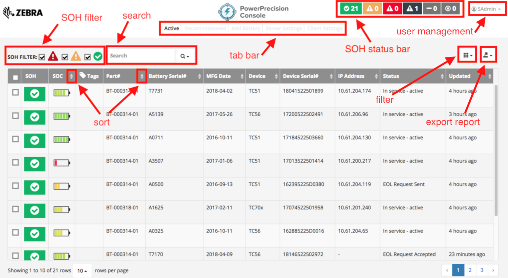

## Overview
This section discusses the use of Admin View in PowerPrecision Console (PPC), providing a centralized view for the administrator to monitor battery inventory.

## Using the Console

PowerPrecision Console server is a centralized dashboard displaying an inventory of deployed Zebra device batteries with color-coded health indicators based on state-of-health (SOH). It tracks SOH, state-of-charge (SOC), tags, battery part number, battery serial number, battery manufacture date, device model, device serial number, device IP address, last known status, and last update (elapsed time since the last update was received).

_Figure 1. Admin View_

The PPC Client sends regular battery updates to the PPC Server, which automatically categorizes the batteries into “good” (green), “nearing end-of-life” (amber) and “end-of-life” (red) SOH categories based on the thresholds defined. The SOH status bar at the top right shows a quick snapshot of battery SOH for all deployed batteries with the total count of the battery in each SOH category (green, amber, red). The black icon with the hazard sign to the right of the SOH categories designate the number of batteries that have been decommissioned. The remaining two icons designate the number of devices that have the Zebra Data Services disabled and the number of devices that do not support SOH (PowerPrecision batteries). SOH filtering is available to quickly view individual or multiple SOH categories of deployed batteries to identify the batteries that are nearing EOL or need to be decommissioned. 

The columns on the dashboard can be sorted by tapping the double triangle to the right of the column name. A tabbed menu is displayed at the top of the dashboard providing access to other views: Active, Decommissioned, Add Battery, Server Settings, and Client Settings. Further customize the dashboard by selecting the categories to filter in the view.

##Search
A search can be conducted based on battery or device information. After entering in the text to search in the search field, tap on the magnifying glass to the right of the text field and select the search category: part number, battery serial number, manufacturing date, device model, device serial number, IP address, status. A search can be conducted in the **Active** tab or **Decommissioned** tab.

##Organize Batteries
Battery tags provide the capability to identify and group batteries for organizational purposes based on a common tag name.  This name can be any desired form of identification such as location, department or job function. 

_Figure 2. Tag battery_

**Add Tag** – add or append a tag to any pre-existing list of tags for each battery
1. Select the battery/batteries to tag. Click on the checkbox next to the battery/batteries or click on the checkbox in the table header to select all listed batteries on the page. The "create or select a tag" text field and Save tag button appears.
2. Enter tag name in the text field. Press Enter key.
3. Click Save button with tag icon. 
4. Click Add. 
5. Click OK in the confirmation message. 
The selected batteries are now tagged with the designated text, displayed in the Tags column on the dashboard.

**Override Tag** - remove any pre-existing tag(s) and replace with the new tag 
1. Select the battery/batteries to tag. Click on the checkbox next to the battery/batteries or click on the checkbox in the table header to select all listed batteries on the page. The "create or select a tag" text field and Save tag button appears.
2. Enter tag name in the text field. Press Enter key.
3. Click Save button with tag icon. 
4. Click Override. 
5. Click OK in the confirmation message. 
The selected batteries are now tagged only with the designated text, displayed in the Tags column on the dashboard. 

**Delete Tag** - delete the specified tag 
1. Select the battery/batteries to tag. Click on the checkbox next to the battery/batteries or click on the checkbox in the table header to select all listed batteries on the page. The "create or select a tag" text field and Save tag button appears.
2. Enter name of tag to delete in the text field. Press Enter key.
3. Click Save button with tag icon. 
4. Click Delete. 
5. Click OK in the confirmation message. 
The specified tag is removed from the battery/batteries on the dashboard.

**Search Tag** - search for batteries with the specified tag name
1. Click on the tag search field to the top left of the dashboard.  Make sure that no batteries are selected on the page.
2. Enter name to search in the text field. Press Enter key.
The search results are displayed.

Note: When the checkbox in the table header is ticked, it selects all batteries listed in the page. At the bottom left of the dashboard, select the "rows per page" drop-down and choose the value to increase the number of batteries displayed in the dashboard.

 

-----

## See Also

* [About PowerPrecision Console](../about)
* [PowerPrecision Console Install & Setup](../setup)
* [Battery Management](../mgmt)
* [EOL Management](../eol)
* [Configuration](../config)
* [Troubleshooting & FAQ](../troubleshooting)