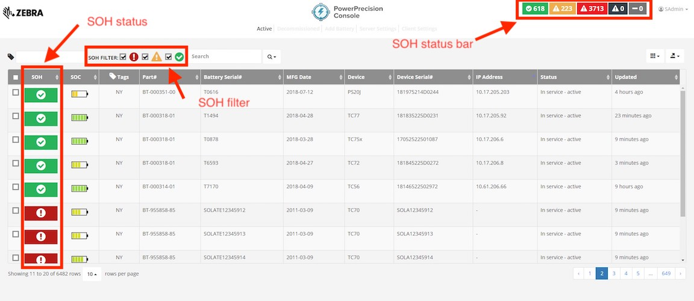
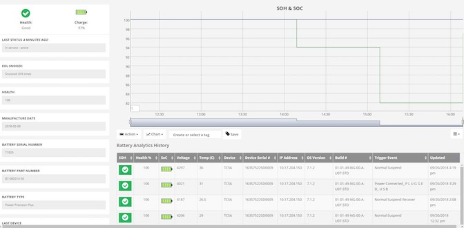

## Overview
Maintaining a pool of batteries with optimal performance is important for smooth operational productivity. This section discusses how to maintain optimal battery health on Zebra devices with PowerPrecision Console (PPC).

## What is SOH?
SOH (state-of-health) is the measurement of battery health capacity, or how well it holds its charge, relative to when it was new. It uses various electrical parameters as data points and advanced intelligence from the PowerPrecision Plus batteries to calculate the value. A low SOH means that it has a quicker battery capacity deterioration rate, which can result to fewer hours of productivity use between charges. [Client Settings](../admin/#clientconfiguration) from the Admin View provide default thresholds to serve as a guideline based on historical data from our customers, but there is no "one value fits all". Based on the majority of our customers, we found that a default EOL (end-of-life) threshold of 80 and a warning threshold of 85 are typically good initial values to use as a guide. We encourage the SOH threshold values to be adjusted based on various factors in battery performance seen from customer experience in different scenarios such as different shifts, locations and environments.

_Figure 1. SOH_

## Battery Enrollment
Once the PPC Client is installed on the device and [configured with the server URL](../setup/#clientinstall&setup), it automatically enrolls the battery to the server. Batteries send data to the server based on the time interval and data trigger events selected in the Data Collection Triggers section from the Admin View [Client Settings](../config) tab. The [Admin View](../admin) automatically categorizes the batteries into “good” (green), “nearing end-of-life” (amber) and “end-of-life” (red) SOH categories based on the SOH thresholds defined in the Client Settings. When decommissioned, the batteries are displayed in black in the SOH status bar at the top of the Admin View.

##Manually Add Batteries
In the [Admin View](../admin), use the **Add Battery** tab to manually add a battery. This can be useful to add extra batteries that have no corresponding device or in situations where lack of network connectivity prevents the battery from registering with the server. Once the battery can be registered, the record will be updated with the battery.  
Note: Batteries cannot be manually removed once added. 

##Power Precision Batteries
PowerPrecision batteries provide limited battery information compared to PowerPrecision+ batteries, particularly with the lack of SOH. Instead, Charge Cycles serve as a form of battery health metric for PowerPrecision batteries. They are not displayed by default in the Admin View. Steps required to display PowerPrecision batteries:
 1.  On the PPC Server, open the .env file (by default in folder: \PowerPrecision Console\Release\Server\WebUI). Change the property 
  
**PP_BATTERY_SUPPORT = "false"**
  
 to 
  
**PP_BATTERY_SUPPORT = "true"**
 2. Open application.properties file (by default in folder: \PowerPrecision Console\Release\Server\PowerPrecisionConsoleServer\config). Change the property 		 
**pp.battery.support=false**
  
 to 
  
**property pp.battery.support=true**
 3. Restart the server.
 4. PowerPrecision batteries are displayed in the Admin View with the "Charge Cycles" field populated. All SOH filters are required to be unchecked to view PowerPrecision batteries.  

Note: PowerPrecision+ batteries do not report Charge Cycle information.

##Battery History
View battery history by navigating to the **Active** tab from the [Admin View](../admin) and clicking on any battery listed. Complete battery information and history (within one month) is displayed such as SOH, SOC, battery voltage, battery temperature, battery type, EOL snooze, trigger event, last updated and more. The chart displays SOH and SOC over time. It may be customized to display only SOH or SOC, or both.

_Figure 2. Battery History_

##Export Report
A report of all battery data can be generated for inventory tracking and replenishment. To export a report of all data, in the [Admin View](../admin/#exportreport) click on the Export Data icon on the top right.  Select CSV to download all data in .csv file format.  

 

-----

## See Also

* [About PowerPrecision Console](../about)
* [PowerPrecision Console Install & Setup](../setup)
* [Admin View](../admin)
* [EOL Management](../eol)
* [Configuration](../config)
* [Troubleshooting & FAQ](../troubleshooting)