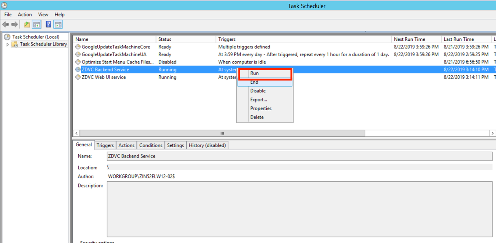
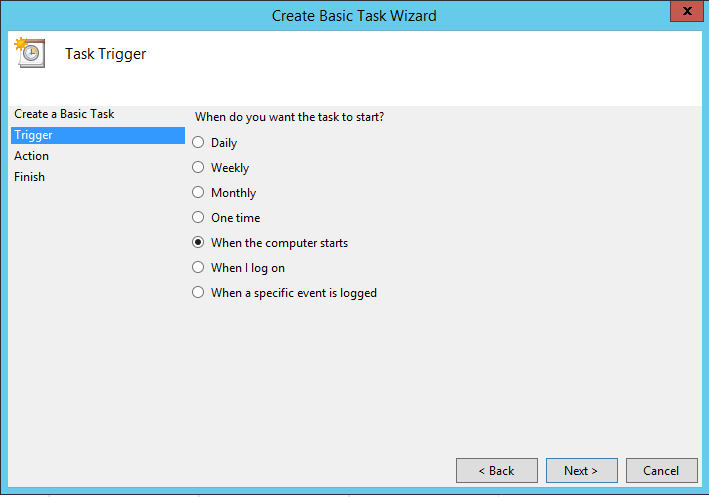
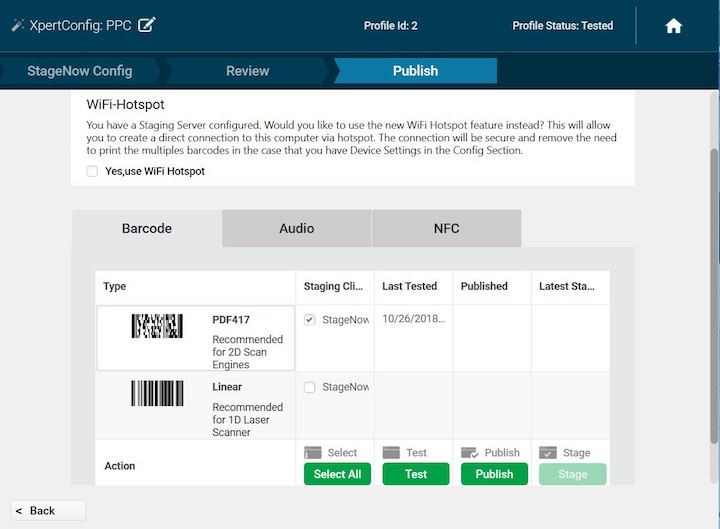

## Overview

As part of Zebra DNA Visibility Console (ZDVC) starting with PowerPrecision Console (PPC) v2.0, PPC runs on a supported Windows-based server. PPC client runs on supported [Zebra devices](../about#devicerequirements). This section provides system requirements and instructions for install and setup for the solution.

Solution components:
* **ZDVC server** - consists of a suite of solutions including [Device Tracker](/devicetracker/latest/guide/about) and PPC. PPC monitors battery health, state of charge, battery status, and other information from deployed devices. 
* **Web portal** - centralized dashboard for monitoring device presence, device tracking, battery status, and trigger actions based on battery depletion.
* **PPC client** - reports battery and device information to server

Before installing, ensure to prepare additional steps for system setup - consult your local IT department for assistance:
 * **Install SSL certificate** (procured by a signed Certificate Authority) - configured on server for secure HTTPS communication
 * **Open specific incoming and outgoing ports** - for server communication through the firewall, based on ports specified during server installation
 * **Add DNS (Domain Name Server) Entry** - an entry is added to the DNS to map the server IP address to the domain 

<b>Important:</b> An SSL Certificate is required from a third-party certificate authority (CA), such as Verisign or Thawte. Any self-signed certificate or one issued by a non third-party CA will not work. The .pfx certificate must contain the complete certificate chain, including intermediate certificates.

##System Requirements
This section provides the server and device requirements. PPC supports a maximum of 10,000 devices and 20,000 batteries per installation based on the hardware requirements.

###Server Requirements
1. Windows Operating Systems supported:
   * Windows® Server 2012, 64-bit processor
   * Windows® Server 2016, 64-bit processor

2. Browsers supported (connect over https):  
   * Chrome Browser version 63 or higher
   * Internet Explorer 11
   * Microsoft Edge for Windows 10
   * Safari for Mac version 9 or higher

3. Software Required (included in server installation):
   * Java runtime
   * Node.js version 6.11
   * PostgreSQL 9.6.3-3 or higher
   * PowerPrecision Console software (server and client) 

4. Network Access Requirements:
   * If required, open incoming and outgoing ports for communication between server and mobile devices through the server firewall. The default ports used are: 
        * Backend Server: Data Port 8080 for PPC client to register and upload battery data 
        * Web Portal: UI Port 8443 for accessing PPC web portal  
   * If required, perform DNS setup to add server IP address to the DNS server. 

5. Internet Access Required: Internet access is needed to download npm package dependencies.

6. Hardware Requirements:
   * Minimum CPU cores: 16
     * Minimum memory (RAM): 64 GB
         * Minimum available hard drive space: 500 GB

###Device Requirements
See [Device Requirements](../about/#devicerequirements).

##Server Install & Setup
For existing PPC installations, uninstall PPC and ensure all PPC folders are removed. Then proceed to a new ZDVC Server installation.

For new installations, download ZDVC Server from [Zebra Support and Downloads](https://www.zebra.com/us/en/support-downloads/software/productivity-apps/power-precision-console.html). Install ZDVC server on the supported system that meets the specified requirements. After server installation, further network and certificate setup is required to allow communication between the server and devices via DNS and firewall. Instructions for server installation and setup:

###Server Prerequisites
The following are the prerequisites required for the server:  
1. **DNS (Domain Name Server) Setup.** ZDVC server runs in a domain, for example _company.com_. An entry with the server hostname and corresponding IP address is required in the DNS server for name resolution. The DNS server and ZDVC server are required to be on the same network. Contact your local IT Administrator to configure the domain to IP address mapping. 

2. **SSL Certificate.** ZDVC requires an SSL certificate for secure communications. The certificate must be in .pfx format and set with a password. See [Server Certificate](./#servercertificate) section for details.

3. **Open Inbound/Outbound Ports on the Firewall.** The appropriate ports are required to be opened for inbound/outbound network traffic flow through the firewall for communication between the server and devices. The UI and Backend Server ports are specified during server install. The method to open the ports depends on the firewall software used by the network administrator. 

	* Backend Server (data) Port: inbound (e.g. port 8080)  
	* Web Portal (UI) Port: inbound and outbound (e.g. port 8443)
 

###Server Certificate 
An SSL certificate is needed for secure connections. Generate the CSR (Certificate Signing Request) with private key and submit it to the trusted CA. The CA issues the SSL Certificate signed with the public key (in .p7b format). Use this issued certificate to generate the SSL certificate with the private key. The final, complete SSL certificate contains the server certificate, any intermediate certificates, the public key and private key. The procedure to accomplish this is separated into two sections below:
* **Procure server certificate** (.p7b format) with public key 
* **Generate complete SSL certificate** (.pfx format) with both public and private keys 

If the server certificate with public key already exists, skip to the second section _Generate complete SSL Certificate_. If the complete SSL certificate already exists, skip to section _Server Installation_.   
**Procure server certificate:** Create a private key and generate the CSR. Submit the CSR to the CA for signing. The server certificate issued should be in .p7b format.
1. Download and install the SSL toolkit [OpenSSL](https://www.openssl.org/source/) for Windows. Follow the instructions stated to download the file based on your Windows configuration. 
2. Add a new "openSSL" environment variable to the Windows system and set the value to the location where openSSL is installed (e.g. "C:\Program Files\OpenSSL-Win64\bin\"). 
3. Create a folder named "ServerCert".  Open the command prompt to this folder path. 
4. Create a private key. It prompts to enter the passphrase - _make note of this passphrase_, which is used in PPC. Run the command:   
&nbsp;&nbsp;&nbsp;&nbsp;&nbsp;`openSSL genrsa -des3 -out ppcdemo.key 2048` 
where "ppcdemo.key" can be replaced with a custom file name.
5. Create a CSR based on the new private key. Run the command: 
&nbsp;&nbsp;&nbsp;&nbsp;&nbsp;`openSSL req key ppcdemo.key -new -out ppcdemo.csr` 
where "ppcdemo.key" (same file name as in step 4) and "ppcdemo.csr" (new file created) can be replaced with custom file names. 
It prompts to enter the private key password (created in step 5). Enter in the required fields when prompted (the information entered must match that registered with the CA):
   * **Country Name** - Enter the two-letter code without punctuation for country, for example: US or CA.
   * **State or Province** - Enter the full state or province name without abbreviation, for example: California.
   * **Locality or City** - Enter the city or town name without abbreviation, for example: Berkeley or Saint Louis.
   * **Organization Name** - Enter the company. If the company or department contains a special character such as "&" or "@", the symbol must be spelled out or omitted in order to enroll successfully. 
   * **Organizational Unit Name** - Enter the name of the department or organization unit making the request. This is optional, to skip, press Enter on the keyboard.
   * **Common Name** - Enter the fully qualified host name, for example: "hostname.company.com". _This is the same name to be used in the Server Installation in step 5 for the Domain name._
   * **Email Address** - Enter the contact email address. 
When prompted for the challenge password, it is not required - _do not supply one_. 
6. Submit the CSR created to the CA. They will supply a certificate in .p7b format, e.g. ssl_certificate.p7b.

**Generate complete SSL Certificate:** Zebra requires the certificate be procured in .p7b format and combined with the private key (.key file) to generate the SSL certificate in .pfx file format. If the certificate is in a different format, use an SSL certificate converter tool to convert to the proper format.   
1. Create an ssl_certificate.cer file with the command: 
&nbsp;&nbsp;&nbsp;&nbsp;&nbsp;`openssl pkcs7 -print_certs -in ssl_certificate.p7b -out ssl_certificate.cer` 
where "ssl_certificate.p7b" is the certificate issued by the CA.
2. Create SSL certificate "ssl_certificate.pfx" with command (using the private key password created from step 4 in the previous section):   
&nbsp;&nbsp;&nbsp;&nbsp;&nbsp;`openssl pkcs12 -export -in ssl_certificate.cer -inkey ppcdemo.key -out ssl_certificate.pfx` 
where "ppcdemo.key" is the private key generated from step 4 in the previous section and "ssl_certificate.cer" is the file generated from the previous step 1.
3. Import the SSL certificate on the server. Double-click the certificate on the local computer and follow the Certificate Import wizard.
4. Use SSL certificate "ssl_certificate.pfx" and the private key password for PPC server installation and setup in the sections that follow.

<!--
Procedure to procure the server certificate, if needed:
1. **Intermediate Root Certificate Generation and CSR (Certificate Signing Request) Signing from CA.** Procedure to generate a CSR to send to a CA for signing, configuring a custom intermediate root certificate for SSL:  
A. Download [OpenSSL](https://www.openssl.org/source/) for Windows. Follow the instructions stated to download the file based on your Windows configuration. 
B. Install the downloaded OpenSSL EXE/MSI. 
C. Add a new "openSSL" environment variable to the Windows system and set the value to the location where openSSL is installed (e.g. "C:\Program Files\OpenSSL-Win64\bin\"). 
D. Create a folder named "CSR_Request".  Open the command prompt to this folder path. 
E. Run the following command to generate a private key and CSR file:  
&nbsp;&nbsp;&nbsp;&nbsp;&nbsp;`openSSL req -newkey rsa:2048 -nodes -keyout zdvc_private_key.key -out zdvc_cert_sign_req.csr` 
 Where "zdvc_cert_sign_req.csr" and "zdvc_private_key.key" can be replaced with custom file names. 
F. Enter in the required fields when prompted:

   * **Country Name** - Enter the two-letter code without punctuation for country, for example: US or CA.
   * **State or Province** - Enter the full state or province name without abbreviation, for example: California.
   * **Locality or City** - Enter the city or town name without abbreviation, for example: Berkeley or Saint Louis.
   * **Company** - Enter the company. If the company or department contains a special characteres such as "&" or "@" the symbol must be spelled out or omitted in order to enroll successfully. 
   * **Organizational Unit** - Enter the name of the department or organization unit making the request. This is optional, to skip, press Enter on the keyboard.
   * **Common Name** - Enter the Host and Domain Name, following the same format as these examplese: "www.zebra.com" or "zebra.com". **Note:** Symantec certificates can only be used on web servers using the Common Name specified during enrollment. For example, a certificate for the domain "zebra.com" will receive a warning if accessing a site named "www.zebra.com" or "secure.zebra.com" since "www.zebra.com" and "secure.zebra.com" are different from "zebra.com."  

 G. Enter the challenge password when prompted. _This is the password needed when generating the certificate in .pfx format._ 
 H. A .csr file is created in the "CSR_Request" folder. Submit this file to the CA to have it signed.  
 I. Obtain the certificate bundle from the CA in .pkcs format and certificate in .p7b format (which includes the public key).

2. **Generate SSL Certificate.** An SSL certificate is required for secured connections based on the intermediate root certificate from step 2. Zebra recommends the certificate to be procured in .p7b format and the certificate private key to be a .key file. If the certificates are in different format, use a SSL certificate converter tool to convert to the proper format.   
A. Create an empty directory named "generated_certs" to contain the .pfx certificate. 
B. Copy the following certificate files to "generated_certs" folder: primary certificate (e.g. "ssl_certificate.p7b"), private key (e.g. "zdvc_private_key.key"), and intermediate CA certificate (e.g. "IntermediateCA.cer").  _The intermediate CA certificate is optional - use if required in the certificate chain._   
C. Open a command prompt. Execute the following command to generate "ssl_certificate.cer": 
&nbsp;&nbsp;&nbsp;&nbsp;&nbsp;`openssl pkcs7 -print_certs -in ssl_certificate.p7b -out ssl_certificate.cer`
 
D. At the command prompt, execute the following command: 
&nbsp;&nbsp;&nbsp;&nbsp;&nbsp;`openssl pkcs12 -export -in ssl_certificate.cer -inkey zdvc_private_key.key -out ssl_certificate.pfx -certfile IntermediateCA.cer`
	 
	Where "-certfile IntermediateCA.cer" is optional.
 
E. When prompted, enter the certificate password to export "ssl_certificate.pfx". This is the challenge password specified in step 2.G. above. 
F. Copy the SSL certificate "ssl_certificate.pfx" with domain name “name.company.com” to a designated folder.
 
-->

###Server Installation
ZDVC Server Installation steps for a new installation:  
1. Double-click on the .EXE to launch the installer.
2. At the initial window, click **Next.**

_Figure 1. Installation - initial screen_
3. Accept the license agreement. Click **Next.**

_Figure 2. Installation - EULA_
4. Accept the default folder or browse to the destination folder. Click Next.

_Figure 3. Installation - destination location_
5. Enter in the server configurations, then click **Next:**
   * **Domain** - fully qualified domain name (FQDN) which consists of the hostname and domain name, e.g. "hostname.company.com"
   * **Server Certificate Path** - location of server certificate (.pfx file)
   * **Server Certificate Password** - password for server certificate
   * **UI port** - designated UI port, can default to 8443
   * **Backend Server Port** - designated server port, can default to 8080

_Figure 4. Installation - server configuration_
6. Set the server authentication and login credentials, then click **Next:**
   * Super admin and database password
   * Server auth key
   * Server auth password
 
**Important**: Use of the following special characters is not supported for the "Server auth key" and "Server auth password":  
&nbsp; &nbsp; &nbsp; &nbsp; &nbsp; &lt; (less than)  
&nbsp; &nbsp; &nbsp; &nbsp; &nbsp; &gt; (greater than)  
&nbsp; &nbsp; &nbsp; &nbsp; &nbsp; &#38; (ampersand)  
&nbsp; &nbsp; &nbsp; &nbsp; &nbsp; &#39; (single quote)  
&nbsp; &nbsp; &nbsp; &nbsp; &nbsp; &#34; (double quote)  

_Figure 5. Installation - server authentication and credentials_
7. Review settings. Click **Next.** Third party applications (such as Postgres and Node.js) will be installed if it does not pre-exist in the system.

_Figure 6. Installation - review settings_
8. Installation complete. Click **Finish.**

_Figure 7. Installation - complete_
9. Perform one of the following to run the server:  
A. Reboot the server. The ZDVC server services automatically start as scheduled tasks. 
B. Manually start the **ZDVC Backend Server** and **ZDVC WebUI Server** scheduled tasks to run the services. Open **Task Scheduler** in **Administrative Tools.** For each scheduled task, right-click on the task and select **Run** from the menu.

_Figure 8. Run ZDVC service_

###Server Upgrade
ZDVC Server can be upgraded from a previous existing ZDVC installation. Prior to upgrading, the ZDVC services must be stopped. Procedure to upgrade:
1. Follow steps to [stop the application server.](./#stopapplicationserver) 
2. Run the new installer.
3. Click **Yes** when prompted to upgrade.
4. At the initial window, click **Next** to proceed with the upgrade.
5. Once installation completes, click **Finish.**

###Server Downgrade
To downgrade the server, uninstall the previous version, terminate the ZDVC server processes and install the older server version. Procedure to downgrade:
1. Uninstall ZDVC server.
2. Terminate the active processes running on specified ports by using one of the following methods: 
A. Reboot the system. 
B. Run the following commands from the command prompt to find the process ID and terminate the specific process ID:
 
&nbsp; &nbsp; &nbsp; &nbsp; &nbsp;`netstat -aon | find /i "8080"` 
&nbsp; &nbsp; &nbsp; &nbsp; &nbsp;`taskkill /pid 1234 /f` 
 
Where "8080" represents the specific backend server port number specified during install and "1234" represents the process ID returned from the first command. Repeat these steps for the Web UI port.
3. Run the installer for the older server version. Follow the prompts to complete installation.

###Server Setup
Steps for ZDVC server setup after installation:  
1. **Run ZDVC Server Software.** Start the server services either manually or by rebooting the server after install. Refer to the last step in the [Server Installation](#serverinstallation) section. 
2. **View the web portal.** Open a supported browser. Enter the default server URL: `https://hostname.company.com:8443/zdvc`, where "hostname.company.com:8443" is replaced with the appropriate hostname, domain and port number.
3. **Select app to launch.** As part of ZDVC, the server consists of multiple solution offerings. Select "PowerPrecision Console" then enter the login credentials to login. The default user name is "SAdmin". The password is the super admin and database password entered during server installation.
4. **Server certificate validation.** Use an SSL Tool (such as [ssltools.com](http://ssltools.com/)) to aid in diagnostics and validate the certificate chain. 
A. Open [ssltools.com](http://ssltools.com/) in the browser. 
B. Enter the Web UI URL, for example `https://hostname.company.com:8443/zdvc` 
C. Click the Scan button. A successful result returns green checks for each step. _See Figure 1 below._  
D. Enter the backend URL for your server, for example `https://hostname.company.com:8080/zdvc`  
E. Click the Scan button. A successful result returns green checks for each step:

_Figure 9. SSLTools.com results_

###Stop Application Server
To stop the application server, stop the **ZDVC Backend Service** and **ZDVC Web UI Service** from **Task Scheduler** in **Administrative Tools.** Right-click on the service and select **End.**

_Figure 10. End ZDVC service_

<!-- SERVER UPGRADE
**Note:** Server upgrade is not applicable to PowerPrecision Console Server 1.0 installations.
-->

<!--
###Post-Server Setup
To meet certain customer requirement needs, for example for PowerPrecision Console to run without a logged in user or PPC to run on server startup, this can be accomplished by having PPC run as a scheduled task using the following procedure.  Two scheduled tasks are needed, one for the backend and one for the WebUI: 
1. Open **Task Scheduler** in **Administrative Tools.** 

_Figure 9. Task Scheduler main screen_
2. Click **Create Basic Task** in the Actions menu to the right. Enter a name for the task, such as “Zebra ZDVC Backend." 

_Figure 10. Create Backend Task_
3. Click **Next.** Select the desired time to trigger the task, for example “When the computer starts” to run on startup.

_Figure 11. Task Trigger_
4. Click **Next.** Select **Start a program**.

_Figure 12. Task Action_
5. Click **Next.** Browse to the backend RunBackendServer.bat file (file path by default `C:\Program Files (x86)\Zebra Technologies\ZDVC\BackendServer\RunBackendServer.bat`). Enter the folder path for the **Start in** field - even though it indicates it is optional, it is required for this to work.

_Figure 13. Task Program_
6. Click **Next.**

_Figure 14. Complete Task creation_
7. Click **Finish.** After authentication, the new task is listed in the Active Tasks list.

_Figure 15. Task list_
8. Repeat above steps for the WebUI batch file RunWebUI.bat (file path by default: `C:\Program Files (x86)\Zebra Technologies\ZDVC\WebUI\RunWebUI.bat`).  Screens specific to WebUI:

_Figure 16. Create WebUI Task_

_Figure 17. Task WebUI Program_

_Figure 18. Complete WebUI Task_
9. Both tasks created are listed in the Active Tasks list.

_Figure 19. Select Task Trigger_
10.	Double-click on one of the schedule tasks created. The specific task is displayed.

_Figure 20. Task Details_
11.	Tap **Properties** in the right panel. In the **Security options** section select “Run whether user is logged on or not”.

_Figure 21. Task Properties_
12.	Click **OK.**
13.	Repeat steps 10–12 for the other scheduled task.
14.	Click **Run** in the right menu (same screen as in step 11). 

This allows PPC to run each time the server restarts regardless of the user logged in.
-->
##Client Install & Setup
Install PPC client on the supported Zebra devices to register the device, upload device battery data and display end-of-life (EOL) battery alerts. The device must be connected to the same network as the server. The server address must be configured on the PPC client to communicate with the PPC Server. PPC client install and setup can be accomplished either manually or remotely with Zebra [StageNow](/stagenow/latest/about) or an EMM (Enterprise Mobility Management).

###Client Installation
Steps for manual client installation:
1. Download PPC Client from [Zebra Support and Downloads](https://www.zebra.com/us/en/support-downloads/software/productivity-apps/power-precision-console.html). Extract the files and folders.
2. Install PowerPrecisionConsole.apk. 
   * For Android Marshmallow and Nougat devices, install the .APK located in folder `PPCClient\Client\M_N`.
   * For Android Oreo and Pie devices, install the .APK located in folder `PPCClient\Client\O_P`.
3. When prompted, enable the “Apps that can draw over other apps” overlay permission. 
4. Installation is complete.
5. Open PPC client app. 
6. A message displays requesting for permission: "Allow PowerPrecision Console to make and manage phone calls?" Accept the permission to allow the device to register to the server with the device serial number. 
7. PPC client app is opened. A PPC notification message is displayed in the device notifications drawer. This notification cannot be dismissed, indicating that PPC is running in the background. 

_Figure 11. PPC client notification_  

###Client Configuration
After client installation, configure the server address, port, server auth username (if applicable) and server auth password either manually or remotely. For information on using CSP for remote configuration deployment, refer to [MX documentation](/mx/overview).

####Manual Configuration
Steps for manual configuration:
1. Open PowerPrecision Console Client.
2. If prompted, enable the “Apps that can draw over other apps” overlay permission. 
3. Tap the hamburger menu at the top right, then tap Settings. 
4. Enter in the settings based on the PPC version:  
**For PPC v2.0 or higher:**  
 A. Tap **Server URL**. Enter in the server URL, for example: `hostname.company.com:8080/zdvc/ppc`
 
Where "hostname.company.com:8080" is replaced with the appropriate hostname, domain name and port number. _The URL must **not** contain "https://"._  
 B. Tap **Server Auth UserName**. Enter in the user name specified during server installation.  
 C. Tap **Server Auth Password**. Enter in the password specified during server installation.   
**For PPC v1.0:**  
 A. Tap **Server URL**. Enter in the server URL, for example: `hostname.company.com:8080/zdvc/ppc`
 
 Where "hostname.company.com:8080" is replaced with the appropriate hostname, domain name and port number. _The URL must **not** contain "https://"._   
5. Tap **OK** to save the changes and return to the main screen.
PPC Client registers with the server and uploads battery data.

####Remote Configuration
For remote configuration using StageNow or an EMM (using XML or Managed Config), install PPCClientMgr.apk located in `PPCClient\PluginCSP`. After PPC client and PPCClientMgr app installation, follow these steps to create StageNow profiles to remotely configure the client:
1. Start PPC client 
2. Configure PPC settings with CSP

Detailed procedures for each follow in the sections below.

When using StageNow or any EMM system for remote configuration, use of the following special characters is not supported (for example, when setting the password):  
&nbsp; &nbsp; &nbsp; &nbsp; &nbsp; &lt; (less than)  
&nbsp; &nbsp; &nbsp; &nbsp; &nbsp; &gt; (greater than)  
&nbsp; &nbsp; &nbsp; &nbsp; &nbsp; &#38; (ampersand)  
&nbsp; &nbsp; &nbsp; &nbsp; &nbsp; &#39; (single quote)  
&nbsp; &nbsp; &nbsp; &nbsp; &nbsp; &#34; (double quote)  

**Important Notes:**
* Use of a StageNow profile which combines installation and configuration into a single profile is not supported. Two separate profiles need to be created: 
&nbsp; &nbsp; &nbsp; &nbsp; &nbsp; 1. Install PPC client and PPCClientMgr app. Start the PPC client activity. 
&nbsp; &nbsp; &nbsp; &nbsp; &nbsp; 2. Configure PPC settings.
* When PPCClientMgr app is opened, a notification message is displayed in the device notifications drawer. This indicates that PPCClientMgr is running in the background. 

_Figure 12. PPC client notification_  

**Steps to create StageNow profile to launch PPC client app (which starts PPCClientMgr.apk for remote configuration deployment),**  with the option of deployment through Enterprise Mobile Management (EMM):

1. Open [StageNow](https://www.zebra.com/us/en/support-downloads/software/utilities/stagenow.html) on a PC. 
2. In the StageNow home screen, click “Create New Profile” from the left menu.   
3. Ensure the proper MX version is selected at the top drop-down selector. This should match the StageNow client version on the device. Select “XpertMode" from the table. Click Create. 

_Figure 13. Profile wizard_  
4. Enter the profile name. Click Start. 
5. Scroll down and click the plus (+) sign next to “Intent”. This adds to the Config tab on the right side. Click Add. 

_Figure 14. Add Setting_  
6. Enter the following information:
   * **Action:** StartActivty
   * **Android Action Name:** android.intent.action.MAIN
   * **Package Name:** com.zebra.ppcclient
   * **Class Name:** com.zebra.ppcclient.activity.MainActivity  
Click Continue.

_Figure 15. Configure Setting_  
7. Click “Complete Profile."  
8. In the Publish section, select the desired barcode type. Click Test. 

_Figure 16. Generate StageNow barcode_  
9. A window opens with the generated StageNow barcode in .pdf format. When ready to publish, click Publish. 
10. For EMM Staging, continue to section "Steps for EMM Staging" below.
11. Open the StageNow client on the device.
12. Scan the barcode generated to start the PPC client app remotely. 

**Steps for remote configuration with StageNow and CSP Plug-in**, with the option of deployment through Enterprise Mobile Management (EMM):

1. Download PPC Client software from [Zebra Support and Downloads](https://www.zebra.com/us/en/support-downloads/software/productivity-apps/power-precision-console.html). Extract the files.
2. Compress two files distributed as part of the PPC Client software into a single .zip file: 
	* com.zebra.ppcclientmgr.dsd 
	* PPCClientMgr.apk (PPC Client CSP Manager Plug-in)

3. Open [StageNow](https://www.zebra.com/us/en/support-downloads/software/utilities/stagenow.html) on a PC.  
4. Import the CSP Plugin Library.  
A. In the StageNow home screen, click “CSP Library” from the left menu.  
B. Upload the .zip file to the CSP Library by clicking “Choose File” then browsing to the .zip file, or by dragging and dropping the .zip file.  
C. Once successfully uploaded, the CSP Library is listed in the Plugin tab. 

_Figure 17. Import plugin into CSP Library_
5. Create a new setting. 
A. In the StageNow home screen, click “All Settings” from the left menu. Click “Create Setting” button at the top right.  

_Figure 18. Import into CSP Library_  
B. Depending on the PPC version:  
**For PPC v2.0:**  
For the “Setting Type”, select “com.zebra.ppclientmgr." Enter a name for the setting. Enter the server URL e.g. `hostname.company.com:8080/ppcdata`. Select the desired option to determine whether or not to allow the end user to edit the setting. Enter the "Server Auth Key" and "Server Auth Password", both designated during server install. Select the MX version for the device. 

_Figure 19. Create New Setting for PPC v2.0_  
**For PPC v1.0:**  
For the “Setting Type”, select “com.zebra.ppclientmgr." Enter a name for the setting. Enter the server URL e.g. `ppc.zebra.com:8080/ppcdata`. Select the desired option to determine whether or not to allow the end user to edit the setting. Select the MX version for the device.   

_Figure 20. Create New Setting for PPC v1.0_  
C. Tap Save. The new setting is listed in the Settings screen.
6. Create profile. 
A. In the StageNow home screen, click “Create New Profile” from the left menu.   
B. Make sure the proper MX version is selected. 
C. Select “XpertMode." Click Create. 
D. Enter the profile name. Click Start. 
E. In the Settings list, click the add (+) sign next to “com.zebra.ppcclientmgr”. This adds to the Config tab on the right side. Click on Add button. 

_Figure 21. Add CSP to profile_  
F. In the StageNow Config section, click “Re-use Saved Setting” tab. The screen is populated with the information from the setting created in step 5 depending on the version of PPC: 

_Figure 22. Re-use saved setting for PPC 2.0_  

_Figure 23. Re-use saved setting for PPC 1.0_  
G. Click Continue.  
H. In the Review section, review the settings and make modifications if needed. Click “Complete Profile."  
I. In the Publish section, select the desired barcode type. 

_Figure 24. Generate StageNow barcode_  
J. Click Test. A window opens with the generated StageNow barcode in .pdf format. 
7. For EMM Staging, continue to section "Steps for EMM Staging" below.
8. Open the StageNow client on the device.
9. Scan the barcode with the StageNow client to configure the PPC Client.  

For more information refer to [StageNow download](https://www.zebra.com/us/en/support-downloads/software/utilities/stagenow.html) and [StageNow documentation](http://techdocs.zebra.com/stagenow). 
 
 

**Steps for EMM Staging (optional):**
1. Follow the steps above for "Remote Configuration Deployment with StageNow and CSP Plugin" up to step 6.
2. Select the "Export option for EMM" to export the .xml file.  Save the .xml file.

_Figure 25. Export for EMM_
3. Push the .xml settings via EMM to the device for PPC Client configuration.

<!--
####Remote Configuration Deployment Without StageNow
Steps for remote configuration deployment with CSP and EMM:
1. In "PPCConfig.xml" distributed as part of the PPC Console software, edit ServerURL parameter with the appropriate server address and set the "AllowEditing" value to either true or false to control whether the user is permitted to edit the server URL:
	<parm name="ServerURL" value="name.company.com:8080/ppcdata  />
	<parm name="AllowEditing" value="false">
2. Save changes.
3. Push "PPCConfig.xml" to folder /sdcard.
4. In the EMM, send the intent to the PPC Client to configure settings based on the following information:  
	**Intent Type:** StartService   
	**Package Name:** com.zebra.ppcclient 
	**Class Name:** ConfigService 
	**Extras:** SET_CONFIG_FILE: /sdcard/PPCConfig.xml file
5. Configure the EMM to receive the configuration response by registering for the intent: 
	**Intent Type:** Broadcast  
	**Action Name:** com.zebra.ppcclient.RESPONSE 
	**Extras:**  
	STATUS: Success or Failed 
	ERROR_MESSAGE: Error Message
6. PPC Client configuration is complete. It registers with the server and uploads battery data.
-->
 
-----

## See Also

* [About PowerPrecision Console](../about)
* [Admin View](../admin)
* [Battery Management](../mgmt)
* [EOL Management](../eol)
* [Configuration](../config)
