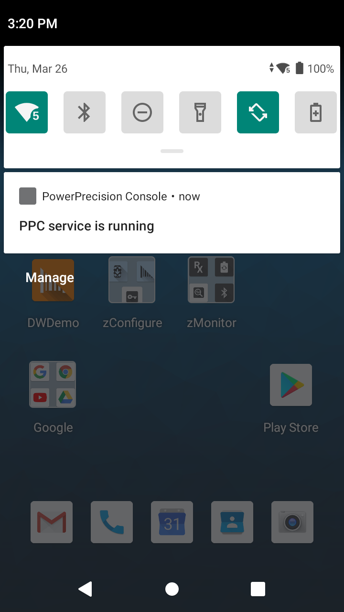

## Overview

PowerPrecision Console (PPC) is a battery management solution that provides administrators a centralized view of statistical battery data from Zebra mobile device batteries, including battery health and charge level, to maximize workforce productivity. It continuously monitors battery health data analyzed in real time, giving administrators insight to determine when battery health could affect productivity as it reaches its EOL (end-of-life) and when the battery should be removed from service. Customized notifications can be triggered to alert device users of actions needed for battery swapping or decommissioning, ensuring optimized deployment of healthy batteries at all times. The centralized view of battery health is grouped into color-coded categories of "good health", "nearing EOL" and "in EOL", to identify and remove aging batteries from the battery pool prior to impacting workforce productivity.

> PowerPrecision Console operates on WiFi networks and does not support WWAN.

##Main Features
PowerPrecision Console main features:

- Centralized dashboard to easily view battery information tracking: state-of-health (SOH), state-of-charge (SOC), battery status, and other information from deployed Zebra mobile computer batteries
  - Color-coded battery health indicator for SOH categories: green for good, amber for nearing end-of-life (EOL), and red for EOL
  - Historical trend of battery health
  - Filter and sort data
- Admin actions on batteries to segregate and decommission nearing EOL or EOL batteries
- Customizable EOL message notifying end-users to prepare to decommission their poor health battery
- Customizable snooze options to give end-users an opportunity to complete a task before taking action to decommission the battery
- HTTPS support for secure connections
- Battery tagging for easier organization and identification
- Report generation to export data collected
- Capability for device staging with the use of an EMM such as Zebra's [StageNow](/stagenow/latest/about) with [Battery Manager CSP](/mx/batterymgr).

## How it works

The PPC client software registers the device with the on-premise PPC server and reports battery information based on preset configurations such as frequency of reporting and event triggers including new battery inserted, battery low and device power-off. The state of battery health is monitored continuously, with multiple electrical and historical characteristics used to determine each battery’s health relative to a new battery. As battery life diminishes over time, custom messages can be triggered based on pre-determined thresholds to notify users of required actions.

## MDNA Enterprise License

Beginning with PPC 3.0, a [Mobility DNA Enterprise license](/licensing) is required to use PowerPrecision Console on Zebra Professional-series devices, including TC21 and TC26. Out of the box, Zebra Professional-series devices have a non-functional PPC client pre-installed.

### Unlicensed

When unlicensed, the app displays a “Mobility DNA Enterprise license required” prompt (shown below) when a user attempts to open PPC on a device. When the unlicensed PPC client is configured via StageNow or an EMM, a staging error occurs indicating a [Mobility DNA Enterprise license](/licensing) is required. **Learn more about [purchasing an MDNA Enterprise license](/licensing/process).**

_MDNA Enterprise license required_

### Licensed

After a Zebra Professional-series device is licensed with the [Mobility DNA Enterprise license](/licensing) for the first time, the non-functional app client must be uninstalled and replaced with [PPC 3.0 or higher](https://www.zebra.com/us/en/support-downloads/software/productivity-apps/device-tracker-on-prem.html). For full functionality, accept all permissions when prompted. See [Client Install & Setup](../setup/#clientinstallsetup).

If a device is being relicensed, PPC is fully functional provided all the [permissions are accepted and configuration] are implemented. See [Client Install & Setup](../setup/#clientinstallsetup).

### License Expired

After the [Mobility DNA Enterprise license](/licensing) expires on a Zebra Professional-series device, a message appears stating that a license is required (see [device screen](./#unlicensed) above) and PPC client no longer functions. All communication is terminated to the PPC Server. The PPC client can no longer be configured by StageNow or any EMM. The PPC notification message indicating the service is running remains displayed in the device notification drawer:

_PPC service_

## New in PPC 3.0

* New device support for Android 10 devices. See supported devices on <a href="https://www.zebra.com/us/en/support-downloads/software/productivity-apps/power-precision-console.html">Zebra support portal</a> 
* <a href="/licensing/about">Mobility DNA Enterprise license</a> required for Zebra Professional-series devices.
* PPC 2.3.1 or earlier cannot be upgraded to 3.0. All prior versions must be uninstalled before installing [PPC 3.0](https://www.zebra.com/us/en/support-downloads/software/productivity-apps/power-precision-console.html).
* Removed requirement for PPCClientMgr.apk. The functionality is now combined into the [PPC client app](https://www.zebra.com/us/en/support-downloads/software/productivity-apps/power-precision-console.html) file.

## Recent Version History

### New in 2.3.1

- Extended [EOL Alert](../config) options on the portal to include the ability to set an expiration time following a battery EOL, after which no further snooze options are allowed and users are prevented from using batteries that have reached EOL.
- Self-signed certificates are now supported to help simplify deployment of product demos and trials.

### New in 2.2.1

- Added method to start server background services to run at startup and without a logged-in user.
- New device support for:
  - Android P: TC52, TC72, PS20
  - Android O: ET51/ET56, L10 Android, EC30, MC9300, TC8300
  - Android N: WT6000
- Behavior changes due to new Android 9 Pie requirements:
  - When opening PPC client app after initial install, permission needs to be granted to allow the device to register to the server.
  - A PPC Client and PPCClientMgr notification message is displayed in the device notifications drawer when the respective app is running.

### New in 2.0

- New Zebra DNA Visibility Console (ZDVC) server 2.0 support with updated server URL root path.
- Support added for Server Auth Name and Password in:
  - PPC Client
  - PPC Plug-in

## Supported Devices

Refer to supported devices in the <a href="https://www.zebra.com/us/en/support-downloads/software/productivity-apps/power-precision-console.html">Zebra PPC download page</a>.

<!-- 
<table class="facelift" align="center" style="width:70%" border="1" padding="5px">
  <tr bgcolor="#dce8ef">
    <th>Device</th>
    <th style="text-align:center">Android 6.x  (Marshmallow)</th>
    <th style="text-align:center">Android 7.x  (Nougat)</th>
    <th style="text-align:center">Android 8.x  (Oreo)</th>
    <th style="text-align:center">Android 9.x  (Pie)</th>
  </tr>
  <tr>
    <td>EC30</td>
    <td></td>
    <td></td>
    <td style="text-align:center">&#x25cf;</td>
    <td></td>
  </tr>
  <tr>
    <td>ET51/ET56</td>
    <td></td>
    <td></td>
    <td style="text-align:center">&#x25cf;</td>
    <td></td>
  </tr>
  <tr>
    <td>L10 Android</td>
    <td></td>
    <td></td>
    <td style="text-align:center">&#x25cf;</td>
    <td></td>
  </tr>
  <tr>
    <td>MC3300 </td>
    <td></td>
    <td style="text-align:center">&#x25cf;</td>
    <td style="text-align:center">&#x25cf;</td>
    <td></td>
  </tr>
  <tr>
    <td>MC9300</td>
    <td></td>
    <td></td>
    <td style="text-align:center">&#x25cf;</td>
    <td></td>
  </tr>
  <tr>
    <td>PS20</td>
    <td></td>
    <td></td>
    <td></td>
    <td style="text-align:center">&#x25cf;</td>
  </tr>
  <tr>
    <td>TC70X/TC75X</td>
    <td style="text-align:center">&#x25cf;</td>
    <td style="text-align:center">&#x25cf;</td>
    <td style="text-align:center">&#x25cf;</td>
    <td></td>
  </tr>
  <tr>
    <td>TC51/TC56 </td>
    <td style="text-align:center">&#x25cf;</td>
    <td style="text-align:center">&#x25cf;</td>
    <td style="text-align:center">&#x25cf;</td>
    <td></td>
  </tr>
  <tr>
    <td>TC52</td>
    <td></td>
    <td></td>
    <td style="text-align:center">&#x25cf;</td>
    <td style="text-align:center">&#x25cf;</td>
  </tr>
  <tr>
    <td>TC57</td>
    <td></td>
    <td></td>
    <td style="text-align:center">&#x25cf;</td>
    <td></td>
  </tr>
  <tr>
    <td>TC72</td>
    <td></td>
    <td></td>
    <td style="text-align:center">&#x25cf;</td>
    <td style="text-align:center">&#x25cf;</td>
  </tr>
  <tr>
    <td>TC77</td>
    <td></td>
    <td></td>
    <td style="text-align:center">&#x25cf;</td>
    <td></td>
  </tr>
  <tr>
    <td>TC8300</td>
    <td></td>
    <td></td>
    <td style="text-align:center">&#x25cf;</td>
    <td></td>
  </tr>
  <tr>
    <td>WT6000</td>
    <td></td>
    <td style="text-align:center">&#x25cf;</td>
    <td></td>
    <td></td>
  </tr>
</table>  -->

## Important Notes

Important notes for consideration during PPC use:

- **For Android Oreo devices or higher, when the device is rebooted after the PPC app is force stopped, the user must manually launch PPC.** If the user force stops PPC (through Android Settings > Apps & notifications > PowerPrecision Console > Force Stop) then reboots the device, PPC does not automatically restart on startup, requiring the user to manually launch PPC. This is due to an Android restriction that considers the app in a stopped state and thus requires the app to be launched manually even after reboot.
   
   

---

## See Also

- [PowerPrecision Console Install & Setup](../setup)
- [Admin View](../admin)
- [Battery Management](../mgmt)
- [EOL Management](../eol)
- [Configuration](../config)
- [Troubleshooting & FAQ](../troubleshooting)
