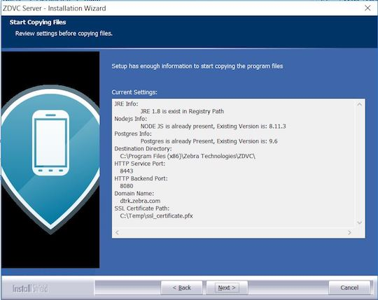
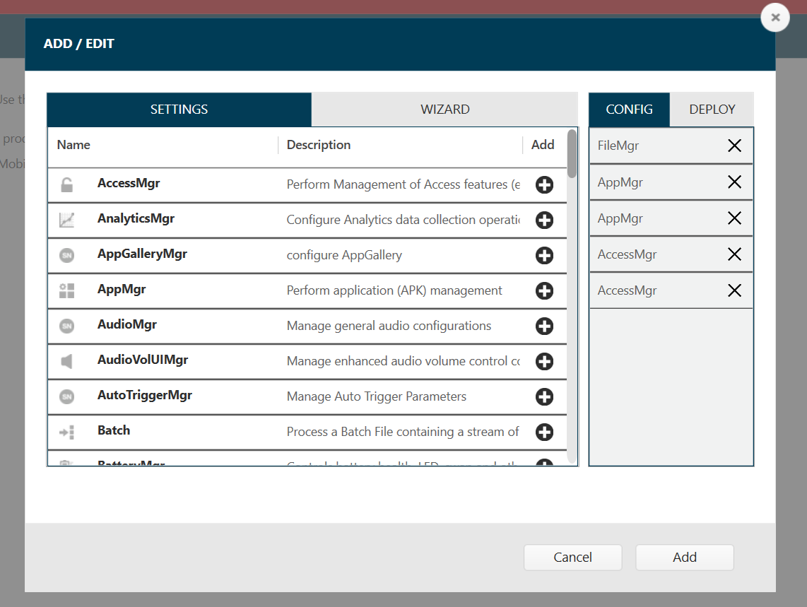
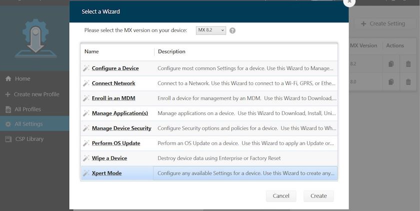

## Overview

PowerPrecision Console (PPC) consists of the following two components:

- **Client** – PPC client app runs on [supported Zebra Android mobile devices](../about#devicerequirements). It collects and sends battery and device information to the server.
- **Server** – PPC server became part of the Zebra DNA Visibility Console server solution starting with v2.0, a common server software for both [Device Tracker](/devicetracker/latest/guide/about) and PowerPrecision Console. It provides a centralized dashboard that is accessible from a supported browser running on a kiosk, tablet, or PC. The server collects and analyzes device battery data, monitors battery information, sends notifications and generates reports.

Before installing, ensure to prepare additional steps for system setup - consult your local IT department for assistance:

- **Install a server certificate** - Supported certificates:
  - **SSL certificate** - use for secure HTTPS communications. The SSL certificate must be procured and signed from a trusted third-party Certificate Authority (CA), such as Verisign or Thawte, and must contain the complete certificate chain, including intermediate certificates.
  - **Self-signed certificate** - use for demos and trials. A self-signed certificate is considered as untrusted - _use at your own risk._
- **Open specific incoming and outgoing ports** - for server communication through the firewall, based on ports specified during server installation
- **Add DNS (Domain Name Server) Entry** - an entry is added to the DNS to map the server IP address to the domain

## System Requirements

This section provides the server and device requirements. PPC supports a maximum of 10,000 devices and 20,000 batteries per installation based on the hardware requirements.

### Server Requirements

1. Windows Operating Systems supported:
   - Windows® Server 2012, 64-bit processor
   - Windows® Server 2016, 64-bit processor

2. Browsers supported (connect over https):
   - Chrome Browser version 63 or higher
   - Internet Explorer 11
   - Microsoft Edge for Windows 10
   - Safari for Mac version 9 or higher

3. Software Required (included in server installation):
   - Java runtime
   - Node.js version 6.11
   - PostgreSQL 9.6.3-3 or higher
   - PowerPrecision Console software (server and client)

4. Network Access Requirements (see **Server Setup** below):
   - If required, **open incoming and outgoing ports** for communication between server and mobile devices through the server firewall. Sample ports are:
     - Backend Server: Data port 8080 for PPC client to register and upload battery data
     - Web Portal: UI port 8443 for accessing PPC web portal
   - If required, perform **DNS setup** to add server IP address to the DNS server.

5. Certificate requirement: An SSL Certificate for secure communications or a self-signed certificate for product demos and trials.

6. Internet Access Required: Internet access is needed to download npm package dependencies.

7. Hardware Requirements: 
   &nbsp;&nbsp;&nbsp;&nbsp;&nbsp;&nbsp;○&nbsp;&nbsp;&nbsp;Minimum CPU cores: 16 
   &nbsp;&nbsp;&nbsp;&nbsp;&nbsp;&nbsp;○&nbsp;&nbsp;&nbsp;Minimum memory (RAM): 64 GB 
   &nbsp;&nbsp;&nbsp;&nbsp;&nbsp;&nbsp;○&nbsp;&nbsp;&nbsp;Minimum available hard drive space: 500 GB 

### Device Requirements

1. Supported Devices: Refer to <a href="https://www.zebra.com/us/en/support-downloads/software/productivity-apps/power-precision-console.html">PPC download site</a> for supported devices.

2. Supported Battery Types: [Zebra PowerPrecision Plus](https://www.zebra.com/us/en/products/accessories/powerprecision-battery-solutions.html), [Zebra PowerPrecision](https://www.zebra.com/us/en/products/accessories/powerprecision-battery-solutions.html) (limited support and [additional setup required](../mgmt/#powerprecisionbatteries))  
   Refer to [PowerPrecision and Battery Management Fact Sheet](https://www.zebra.com/content/dam/zebra_new_ia/en-us/solutions-verticals/product/Software/Mobility%20Software/powerprecision/fact-sheets/data-capture-dna-power-precision-fact-sheet-en-us.pdf) for more information.
3. Zebra Data Services agent is required to be running on the mobile computer. This agent collects battery health data from the device and sends it to the ZDVC server.
4. The ZDVC server is installed and running.

## Server Install & Setup

For existing PPC installations, uninstall PPC and ensure all PPC folders are removed. Then proceed to a new ZDVC Server installation.

For new installations, download ZDVC Server from [Zebra Support and Downloads](https://www.zebra.com/us/en/support-downloads/software/productivity-apps/power-precision-console.html). Install ZDVC server on the supported system that meets the specified requirements. After server installation, further network and certificate setup is required to allow communication between the server and devices via DNS and firewall. Instructions for server installation and setup:

### Server Prerequisites

The following are the prerequisites required for the server:  

1.  **DNS (Domain Name Server) Setup.** ZDVC server runs in a domain, for example _company.com_. An entry with the server hostname and corresponding IP address is required in the DNS server for name resolution. The DNS server and ZDVC server are required to be on the same network. Contact your local IT Administrator to configure the domain to IP address mapping.

2.  **Server Certificate.** An SSL certificate is required for secure communications or a self-signed certificate can be used for product demos and trials. The certificate must be in .pfx format and set with a password. See [Server Certificate](./#servercertificate) for details.

3.  **Open Inbound/Outbound Ports on the Firewall.** The appropriate ports are required to be opened for inbound/outbound network traffic flow through the firewall for communication between the server and devices. The UI and Backend Server ports are specified during server install. The method to open the ports depends on the firewall software used by the network administrator.
    * Backend Server (data) Port: inbound (e.g. port 8080)
        * Web Portal (UI) Port: inbound and outbound (e.g. port 8443)

 

### Server Certificate

An SSL tool is required to generate the server certificate. Download and install the SSL toolkit [OpenSSL](https://www.openssl.org/source). Instructions follow to generate an SSL certificate or self-signed certificate.

#### SSL Certificate

An SSL certificate is needed for secure connections. Domain level and wildcard certificates are acceptable. Generate the CSR (Certificate Signing Request) with private key and submit it to the trusted CA. The CA issues the SSL Certificate signed with the public key (in .p7b format). Use this issued certificate to generate the SSL certificate with the private key. The final, complete SSL certificate contains the server certificate, any intermediate certificates, the public key and private key. The procedure to accomplish this is separated into two sections below:

- **Procure server certificate** (.p7b format) with public key
- **Generate complete SSL certificate** (.pfx format) with both public and private keys

If the server certificate with public key already exists, skip to the second section _Generate complete SSL Certificate_. If the complete SSL certificate already exists, skip to section _Server Installation_.   
**Procure server certificate:** Create a private key and generate the CSR. Submit the CSR to the CA for signing. The server certificate issued should be in .p7b format. Watch a video demonstration or follow the steps below:
<video controls width="430" height="290"> <source src="../../../videos/ZDVC_ServerCert-Step1.mp4" type="video/mp4">
</video>

1. Add a new "openSSL" environment variable to the Windows system and set the value to the location where openSSL is installed (e.g. "C:\Program Files\OpenSSL-Win64\bin\"). 
2. Create a folder named "ServerCert". Open the command prompt to this folder path. 
3. Create a private key. It prompts to enter the passphrase - _make note of this passphrase_, which is used in PPC. Run the command:  
   &nbsp;&nbsp;&nbsp;&nbsp;&nbsp;`openSSL genrsa -des3 -out ppcdemo.key 2048` 
   where "ppcdemo.key" can be replaced with a custom file name.
4. Create a CSR based on the new private key. Run the command: 
&nbsp;&nbsp;&nbsp;&nbsp;&nbsp;`openSSL req -key ppcdemo.key -new -out ppcdemo.csr` 
where "ppcdemo.key" (same file name as in step 3) and "ppcdemo.csr" (new file created) can be replaced with custom file names. It prompts to enter the private key password (created in step 3). Enter in the required fields when prompted (the information entered must match that registered with the CA):

    - **Country Name** - Enter the two-letter code without punctuation for country, for example: US or CA.
    - **State or Province** - Enter the full state or province name without abbreviation, for example: California.
    - **Locality or City** - Enter the city or town name without abbreviation, for example: Berkeley or Saint Louis.
    - **Organization Name** - Enter the company. If the company or department contains a special character such as "&" or "@", the symbol must be spelled out or omitted in order to enroll successfully.
    - **Organizational Unit Name** - Enter the name of the department or organization unit making the request. This is optional, to skip, press Enter on the keyboard.
    - **Common Name** - Enter the fully qualified host name, for example: "hostname.company.com". _This is the same name to be used in the Server Installation in step 5 for the Domain name._
    - **Email Address** - Enter the contact email address.  
When prompted for the challenge password, it is not required - <i>do not supply one.</i> 

5. Submit the CSR created to the CA. They will supply a certificate in .p7b format, e.g. ssl_certificate.p7b.

**Generate complete SSL Certificate:** Zebra requires the certificate be procured in .p7b format and combined with the private key (.key file) to generate the SSL certificate in .pfx file format. If the certificate is in a different format, use an SSL certificate converter tool to convert to the proper format. Watch a video demonstration or follow the steps below:
<video controls width="450" height="280"> <source src="../../../videos/ZDVC_ServerCert-Step2.mp4" type="video/mp4">
</video>

1. Create an ssl_certificate.cer file with the command: 
   &nbsp;&nbsp;&nbsp;&nbsp;&nbsp;`openssl pkcs7 -print_certs -in ssl_certificate.p7b -out ssl_certificate.cer` 
   where "ssl_certificate.p7b" is the certificate issued by the CA.
2. Create SSL certificate "ssl_certificate.pfx" with command (using the private key password created from step 4 in the previous section):  
   &nbsp;&nbsp;&nbsp;&nbsp;&nbsp;`openssl pkcs12 -export -in ssl_certificate.cer -inkey ppcdemo.key -out ssl_certificate.pfx` 
   where "ppcdemo.key" is the private key generated from step 4 in the previous section and "ssl_certificate.cer" is the file generated from the previous step 1. When prompted, enter the passphrase (from step 4 in the previous section) and specify an export password.
3. Import the SSL certificate on the server. Double-click the certificate on the local computer and follow the Certificate Import wizard. When prompted for a password, enter the password set from the previous step.
4. Use SSL certificate "ssl_certificate.pfx" and the private key password for PPC server installation and setup in the sections that follow.

#### Self-Signed Certificate
A self-signed certificate can be used for for product demos and trials. Procedure to generate a self-signed certificate:

1. Generate a private key: 
   &nbsp;&nbsp;&nbsp;&nbsp;&nbsp;`openssl genrsa -des3 -out ppcdemo.key 2048` 
   where "ppcdemo.key" is the name of the private key.
2. When prompted, enter a pass phrase.
3. Generate a CSR: 
   &nbsp;&nbsp;&nbsp;&nbsp;&nbsp;`openssl req -new -key ppcdemo.key -sha256 -out ppcdemo.csr`  
   where "ppcdemo.key" is the name of the private key from step 1 and "ppcdemo.csr" is the name of the CSR.
4. When prompted, enter the pass phrase set in step 2.
5. When prompted, enter information in the fields requested, including the challenge password.
6. Generate a self-signed certficate: 
   &nbsp;&nbsp;&nbsp;&nbsp;&nbsp;`openssl x509 -req -days 365 -in ppcdemo.csr -signkey ppcdemo.key -sha256 -out ppcdemo.crt` 
   where "ppcdemo.crt" is the self-signed certficate to be used for the client app.
7. When prompted, enter the pass phrase set in step 2.
8. Generate the .pfx certificate file: 
   &nbsp;&nbsp;&nbsp;&nbsp;&nbsp;`openssl pkcs12 -export -out ppcdemo.pfx -inkey ppcdemo.key -in ppcdemo.crt` 
   where "ppcdemo.pfx" is the certificate required to install on the server.
9. When prompted, enter the pass phrase for the private key.
10. Use self-signed certificate "ppcdemo.pfx" and the private key password for PPC server installation and setup in the sections that follow.

### Server Installation

ZDVC Server Installation steps for a new installation:  

1. Double-click on the .EXE to launch the installer.
2. At the initial window, click **Next.**
   
   _Installation - initial screen_
3. Accept the license agreement. Click **Next.**
   
   _Installation - EULA_
4. Accept the default folder or browse to the destination folder. Click Next.
   
   _Installation - destination location_
5. Enter in the server configurations, then click **Next:**  
   * **Domain** - fully qualified domain name (FQDN) which consists of the hostname and domain name, e.g. "hostname.company.com"
   * **Server Certificate Path** - location of server certificate (.pfx file)
   * **Server Certificate Password** - password for server certificate
   * **UI port** - designated UI port, can default to 8443 \* **Backend Server Port** - designated server port, can default to 8080
   
   _Installation - server configuration_
6. Set the server authentication and login credentials, then click **Next:**
   * Super admin and database password
   * Server auth key 
   * Server auth password
    
**Important**: Use of the following special characters is not supported for the "Server auth key" and "Server auth password":  
&nbsp; &nbsp; &nbsp; &nbsp; &nbsp; &lt; (less than)  
&nbsp; &nbsp; &nbsp; &nbsp; &nbsp; &gt; (greater than)  
&nbsp; &nbsp; &nbsp; &nbsp; &nbsp; &#38; (ampersand)  
&nbsp; &nbsp; &nbsp; &nbsp; &nbsp; &#39; (single quote)  
&nbsp; &nbsp; &nbsp; &nbsp; &nbsp; &#34; (double quote)  

_Installation - server authentication and credentials_

7. Review settings. Click **Next.** Third party applications (such as Postgres and Node.js) will be installed if it does not pre-exist in the system.
   
   _Installation - review settings_
8. Installation complete. Click **Finish.**
   
   _Installation - complete_
9. For first time installations, reboot the server. Otherwise, perform one of the following to start the server: 
   A. Reboot the server. The ZDVC server services automatically start as scheduled tasks. 
   B. Manually start the **ZDVC Backend Server** and **ZDVC WebUI Server** scheduled tasks to run the services. Open **Task Scheduler** in **Administrative Tools.** For each scheduled task, right-click on the task and select **Run** from the menu.
   
   _Run ZDVC service_

### Server Upgrade
ZDVC Server can be upgraded from a previous existing ZDVC installation. Prior to upgrading, the ZDVC services must be stopped. Procedure to upgrade:

1. Follow steps to [stop the application server.](./#stopapplicationserver)
2. Run the new installer.
3. Click **Yes** when prompted to upgrade.
4. At the initial window, click **Next** to proceed with the upgrade.
5. Once installation completes, click **Finish.**

###Server Downgrade
To downgrade the server, uninstall the previous version, terminate the ZDVC server processes and install the older server version. Procedure to downgrade:

1. Uninstall ZDVC server.
2. Terminate the active processes running on specified ports by using one of the following methods: 
   A. Reboot the system. 
   B. Run the following commands from the command prompt to find the process ID and terminate the specific process ID: 
   &nbsp; &nbsp; &nbsp; &nbsp; &nbsp;`netstat -aon | find /i "8080"` 
   &nbsp; &nbsp; &nbsp; &nbsp; &nbsp;`taskkill /pid 1234 /f`
     
   Where "8080" represents the specific backend server port number specified during install and "1234" represents the process ID returned from the first command. Repeat these steps for the Web UI port.
3. Run the installer for the older server version. Follow the prompts to complete installation.

### Server Setup

Steps for ZDVC server setup after installation:  
&nbsp; &nbsp; &nbsp;1. **Run ZDVC Server Software.** Start the server services either manually or by rebooting the server after install. Refer to the last step in the [Server Installation](#serverinstallation) section. 
&nbsp; &nbsp; &nbsp;2. **View the web portal.** Open a supported browser. Enter the default WebUI server URL: `https://hostname.company.com:8443/zdvc`, where "hostname.company.com:8443" is replaced with the appropriate hostname, domain and port number. 
&nbsp; &nbsp; &nbsp;3. **Select app to launch.** As part of ZDVC, the server consists of multiple solution offerings. Select "PowerPrecision Console". 
&nbsp; &nbsp; &nbsp;4. **Login.** Enter the login credentials. The default user name is "SAdmin". The password is the _super admin and database password_ entered during server installation. _If using an SSL certificate, proceed to step 5._

- **If using self-signed certificate for the first time,** permission needs to be granted. Follow the steps below to login depending on the browser:
  - **For Chrome, Safari, or Internet Explorer:** 
    &nbsp; &nbsp; &nbsp;A. In the browser, enter the backend URL: `https://hostname.company.com:8080`, where "hostname.company.com:8080" is replaced with the appropriate hostname, domain and port number. Enter the username and password. This is the _Server Auth Key_ and _Server Auth Password_ set during server install. 
    &nbsp; &nbsp; &nbsp;B. A message appears indicating the connection is not private due to the lack of a secured certificate. Click "Proceed...". 
    &nbsp; &nbsp; &nbsp;C. Enter the WebUI server URL: `https://hostname.company.com:8443/zdvc`, where "hostname.company.com:8443" is replaced with the appropriate hostname, domain and port number. 
    &nbsp; &nbsp; &nbsp;D. A message appears indicating the connection is not private due to the lack of a secured certificate. Click "Advanced", then click "Proceed..."
  - **For Edge:** 
    &nbsp; &nbsp; &nbsp;A. In the browser, enter the backend URL: `https://hostname.company.com:8080`, where "hostname.company.com:8080" is replaced with the appropriate hostname, domain and port number. Enter the username and password. This is the _Server Auth Key_ and _Server Auth Password_ set during server install. 
    &nbsp; &nbsp; &nbsp;B. Click “Continue to this website”.  
    &nbsp; &nbsp; &nbsp;C. Click on “Certificate error” in the address bar, then click “View certificates." 
    &nbsp; &nbsp; &nbsp;D. Click “Install Certificate”.  
    &nbsp; &nbsp; &nbsp;E. Click “Place all certificates in the following store”, then click “Browse”. Do not rely on the pre-selected option to automatically select the certificate store since this will not work. 
    &nbsp; &nbsp; &nbsp;F. In the dialog box, click “Trusted Root Certification Authorities”, then click “OK”.  
    &nbsp; &nbsp; &nbsp;G. Click "Finish".  
    &nbsp; &nbsp; &nbsp;H. A security warning is displayed. Click “Yes” to trust the certificate.  
    &nbsp; &nbsp; &nbsp;I. Reload the page.  
    &nbsp; &nbsp; &nbsp;J. Enter the WebUI server URL: `https://hostname.company.com:8443/zdvc`, where "hostname.company.com:8443" is replaced with the appropriate hostname, domain and port number. 
    &nbsp; &nbsp; &nbsp;K. Click "Advanced" and then click "Proceed..."

&nbsp; &nbsp; &nbsp;5. **SSL certificate validation.** For SSL certificates, an SSL Tool (such as [ssltools.com](http://ssltools.com/)) can be used to aid in diagnostics and validate the SSL certificate chain. 
&nbsp;&nbsp;&nbsp;&nbsp;&nbsp;&nbsp;&nbsp;&nbsp;&nbsp;A. Open [ssltools.com](http://ssltools.com/) in the browser. 
&nbsp;&nbsp;&nbsp;&nbsp;&nbsp;&nbsp;&nbsp;&nbsp;&nbsp;B. Enter the Web UI URL, for example `https://hostname.company.com:8443/zdvc` 
&nbsp;&nbsp;&nbsp;&nbsp;&nbsp;&nbsp;&nbsp;&nbsp;&nbsp;C. Click the Scan button. A successful result returns green checks for each step. _See screen below._  
&nbsp;&nbsp;&nbsp;&nbsp;&nbsp;&nbsp;&nbsp;&nbsp;&nbsp;D. Enter the backend URL for your server, for example `https://hostname.company.com:8080/zdvc`  
&nbsp;&nbsp;&nbsp;&nbsp;&nbsp;&nbsp;&nbsp;&nbsp;&nbsp;E. Click the Scan button. A successful result returns green checks for each step:

_SSLTools.com results_

### Stop Application Server
Procedure to stop the application server:

1. Stop the **ZDVC Backend Service** and **ZDVC Web UI Service** from **Task Scheduler** in **Administrative Tools.** Right-click on the service and select **End.**
   
   _End ZDVC service_
2. Terminate the active processes that are running on specified ports by using one of the following methods: 
   &nbsp;&nbsp;&nbsp;A. Reboot the system. 
   &nbsp;&nbsp;&nbsp;B. Run the following commands from the command prompt to find the process ID and terminate the specific process ID returned: 
   &nbsp;&nbsp;&nbsp;&nbsp;&nbsp;&nbsp;&nbsp;&nbsp;&nbsp;netstat -aon | find /i "8080" 
   &nbsp;&nbsp;&nbsp;&nbsp;&nbsp;&nbsp;&nbsp;&nbsp;&nbsp;taskkill /pid 1234 /f 
   where "8080" represents the backend server port number specified during install and "1234" represents the process ID returned from the first command. Repeat these steps for the Web UI port.

## Client Install & Setup

Install PPC client app to register the device, upload device battery data and display end-of-life (EOL) battery alerts. The device must be connected to the same network as the server. The server address must be configured on the PPC client to communicate with the PPC Server. PPC client app installation and configuration can be performed either manually or remotely, with Zebra's [StageNow](/stagenow/latest/about) or an EMM (Enterprise Mobility Management) system for device deployment.

### Installation

_PPC client application 2.3.1 or earlier cannot be upgraded to 3.0._ Prior versions must be [uninstalled](./#uninstallation) before installing PPC 3.0. Installation can be performed using one of the following methods:
* **Manual installation** - manually copy and install the client app to the device
* **Remote installation** - use Zebra's [StageNow](/stagenow/latest/about) or an EMM (Enterprise Mobile Management) tool to create a StageNow profile for device deployment

#### Manual Installation
Steps for manual client installation:

1. Download PPC Client from [Zebra Support and Downloads](https://www.zebra.com/us/en/support-downloads/software/productivity-apps/power-precision-console.html). Extract the files and folders.
2. Install PowerPrecisionConsole.apk.
<!--   - For Android Marshmallow and Nougat devices, install the .APK located in folder `PPCClient\Client\M_N`.
   - For Android Oreo and Pie devices, install the .APK located in folder `PPCClient\Client\O_P`.
-->
3. Open PowerPrecision Console app.
4. When prompted, enable the “Apps that can draw over other apps” overlay permission.
5. When prompted, enable the "Usage access" permission for the Zebra Data Services agent to collect battery data.
6. Accept the permissions when prompted. On Android O or higher devices, a PPC notification message is displayed in the device notifications drawer. This notification cannot be dismissed, indicating that PPC is running in the background.
   
   _PPC client notification_  

#### Remote Installation

For remote installation, create a StageNow installation profile to install and setup the client app on the device using Zebra's [StageNow](https://www.zebra.com/us/en/support-downloads/software/utilities/stagenow.html) tool or an EMM for device deployment.

To create a StageNow installation profile:

1. Open StageNow on a host computer.
2. In the StageNow home screen, click **Create New Profile** from the left menu.
3. Ensure MX version 8.0 or higher is selected from the top drop-down selector. The MX version on the device should match this or higher. See [MX documentation](/mx/mx-version-on-device) for instructions how to check the version. If automatically bypassing the overlay permission and usage access permission, select MX 10.0 or higher.
4. Select **Xpert Mode** from the list and click **Create.**
   <i>Wizard selection</i>

5. Enter the profile name. Click **Start.**
6. If using StageNow to copy the install file to the device, scroll down and click the plus (+) sign next to **FileMgr.** This adds FileMgr to the Config tab on the right side.
7. Scroll to **AppMgr** and click the plus (+) sign next to it. This adds AppMgr to the Config tab on the right side.
8. Repeat step 7 again. AppMgr is listed twice in the Config tab.
   <i>Config list</i>

9. If automatically bypassing the screen overlay permission, scroll to **AccessMgr** and click the plus (+) sign next to it. This adds **AccessMgr** to the Config tab on the right side.
10. If automatically bypassing the usage access permission, scroll to **AccessMgr** and click the plus (+) sign next to it. This adds **AccessMgr** to the Config tab on the right side.
11. Click **Add.**
12. If using StageNow to copy the install file to the device, proceed with this step.  Otherwise, skip to step 13. 
_StageNow Config 1_ - Copy the install file to the device with FileMgr. In the **FileMgr** screen under the **Create New Setting** tab, select and enter the desired options to install the APK, for example: 
    &nbsp;&nbsp;&nbsp;&nbsp;&nbsp;• **File Action:** Transfer/Copy File 
    &nbsp;&nbsp;&nbsp;&nbsp;&nbsp;• **Target Access Method:** File in the device file system 
    &nbsp;&nbsp;&nbsp;&nbsp;&nbsp;• **Target Path and File Name:** [enter file path] 
    &nbsp;&nbsp;&nbsp;&nbsp;&nbsp;• **Source Access Method:** [select applicable method] 
    &nbsp;&nbsp;&nbsp;&nbsp;&nbsp;• **Source File URI:** [enter information prompted] 
    Click **Continue.**
13. _StageNow Config 2_ – Install the client app. For the first **AppMgr,** select the following: 
    &nbsp;&nbsp;&nbsp;&nbsp;&nbsp;• **Action:** Install 
    Enter/select the desired options for the remaining fields. Click **Continue.**
14. _StageNow Config 3_ – Battery Optimization. For the second **AppMgr,** enter/select the following: 
    &nbsp;&nbsp;&nbsp;&nbsp;&nbsp;• **Action:** Application for Battery Optimization 
    &nbsp;&nbsp;&nbsp;&nbsp;&nbsp;• **Remove Application for Battery Optimization:** com.zebra.ppcclient 
    Click **Continue.**
15. _StageNow Config 4_ - Grant overlay permission. For AccessMgr, enter the following: 
    &nbsp;&nbsp;&nbsp;&nbsp;&nbsp;• **Permission Access Action:** Grant Permission to an Application 
    &nbsp;&nbsp;&nbsp;&nbsp;&nbsp;• **Permission Name:** System Alert Window 
    &nbsp;&nbsp;&nbsp;&nbsp;&nbsp;• **Application Package Name:** com.zebra.ppcclient 
    &nbsp;&nbsp;&nbsp;&nbsp;&nbsp;• **Application Signature:** [path of certificate file extracted (see <a href="#extractclientappcertificate">Extract Client App Certificate</a> below) 
    Click **Continue.**
16. _StageNow Config 5_ - Grant usage access permission. For AccessMgr, enter the following: 
    &nbsp;&nbsp;&nbsp;&nbsp;&nbsp;• **Permission Access Action:** Grant Permission to an Application 
    &nbsp;&nbsp;&nbsp;&nbsp;&nbsp;• **Permission Name:** Package Usage Stats 
    &nbsp;&nbsp;&nbsp;&nbsp;&nbsp;• **Application Package Name:** com.zebra.ppcclient 
    &nbsp;&nbsp;&nbsp;&nbsp;&nbsp;• **Application Signature:** [path of certificate file extracted (see <a href="#extractclientappcertificate">Extract Client App Certificate</a> below) 
    Click **Continue.**
17. Click **Complete Profiles.** Profile creation is complete.

**Device Deployment:**

The device must be connected to the network during deployment. After creating the StageNow profile, use one of the following methods based on the desired tool for device deployment:

* **StageNow:** Generate the barcode from the StageNow profile. Open StageNow client on the device and scan the barcode(s) generated from the installation, configuration and/or BLE profile. 
* **EMM:** Export each StageNow XML file from the StageNow installation, connection and BLE profiles. Do not edit the XML file - it can cause unexpected behavior. Send the XML using either [OEMConfig](/oemconfig) or [MX](/mx/overview/) to configure the app and grant all required permissions. The installation profile and server connectivity profile XML files must be used separately.
 

#### Extract Client App Certificate

The PPC certificate must be extracted as a pre-requisite to creating the StageNow installation profile in order to automatically grant the screen overlay and usage access permissions. This prevents the screen overlay detected and device usage access warnings from appearing to the end user.

Steps to extract the client app certificate:

1.  Download SigTools.jar from [Zebra’s App Signature Tools](https://techdocs.zebra.com/emdk-for-android/latest/samples/sigtools/).
2.  Follow the instructions provided from the link to extract the certificate from PPC’s APK file using command:
<pre class="prettify">
    java -jar SigTools.jar GetCert -INFORM APK -OUTFORM DER -IN [filename.apk] -OUTFILE [filename.crt]
</pre>
where _[filename.apk]_ is the full path and file name of the PPC APK install file and _[filename.crt]_ is the designated certificate file name. The file extensions should be preserved in both file names.  &nbsp;&nbsp;&nbsp;&nbsp;&nbsp;&nbsp;&nbsp;&nbsp;3. The certificate file is extracted as the CRT file, which is needed to create the StageNow Installation Profile.
  

### Uninstallation

PPC client app can be uninstalled from the device either manually or by using StageNow. If using StageNow to uninstall PPC 2.3.1, scan the barcode in PPC_UNINSTALL_FOR_2.3.1.pdf, provided with the download package from [Zebra Support and Downloads](https://www.zebra.com/us/en/support-downloads/software/productivity-apps/power-precision-console.html).

### Configuration

After client installation, configure the server address, port, server auth username (if applicable) and server auth password either manually or remotely. For information on using CSP for remote configuration deployment, refer to [MX documentation](/mx/overview).

#### Manual Configuration

Steps for manual configuration:

1. Open PowerPrecision Console Client.
2. Grant all permissions requested by the app. _If using an SSL certificate,_ proceed to step 4.
3. **If using a self-signed certificate,** open the StageNow application. Scan the barcode from file "EnabledSelfSigned_PPC.pdf" to enable self-signed certificates in the client app. The .PDF file is included as part of the PPC client installation package.
4. Tap the hamburger menu at the top right, then tap "Settings".
5. Enter the following information: 
   * **Server URL** - URL with port number and PPC path specified, for example: `hostname.company.com:8080/zdvc/ppc`, where "hostname.company.com:8080" is replaced with the appropriate hostname, domain name and port number. _The URL must **not** contain "https://" nor "http://"._
   * **Server Auth UserName** - user name specified during server installation. 
   * **Server Auth Password** - password specified during server installation.
   On the EC30, if Enterprise Keyboard is used to enter the user name and password, the text entered is partially cut-off. To address this, disable the option [Show scan tab](/enterprise-keyboard/latest/guide/settings/#preferences) in the Enterprise Keyboard Preferences section.
6. Tap **OK** to save the changes and return to the main screen. PPC Client registers with the server and uploads battery data. _If using an SSL certificate,_ manual client configuration is complete.
7. **If using a self-signed certificate,** proceed as follows: 
   &nbsp;&nbsp;&nbsp;A. Copy the self-signed certificate .CRT file to folder `/sdcard/Android/data/com.zebra.ppcclient/files/cert` on the device to establish communication with the server. The .CRT certificate file was generated from step 6 above in the **Self-Signed Certificate** subsection under **Server Certificate**.  
   &nbsp;&nbsp;&nbsp;B. The message "Connected via untrusted certificate" is displayed on the app:
   
   _Figure 12. Untrusted certificate message in client app_ 
   &nbsp;&nbsp;&nbsp;C. To disable self-signed certificates in the app, scan the barcode from "DisableSelfSigned_PPC.pdf" (part of the PPC client installation package).

#### Remote Configuration
For remote configuration using StageNow or an EMM (with XML or Managed Config), follow these steps after client installation to create the following StageNow profiles:

1. Start PPC client
2. Configure PPC settings with CSP

Detailed procedures for each follow in the sections below.

When using StageNow or any EMM system for remote configuration, use of the following special characters is not supported (for example, when setting the password):  
&nbsp; &nbsp; &nbsp; &nbsp; &nbsp; &lt; (less than)  
&nbsp; &nbsp; &nbsp; &nbsp; &nbsp; &gt; (greater than)  
&nbsp; &nbsp; &nbsp; &nbsp; &nbsp; &#38; (ampersand)  
&nbsp; &nbsp; &nbsp; &nbsp; &nbsp; &#39; (single quote)  
&nbsp; &nbsp; &nbsp; &nbsp; &nbsp; &#34; (double quote)  

**Important Notes:**

- Use of a StageNow profile which combines installation and configuration into a single profile is not supported. Two separate profiles need to be created: 
  &nbsp; &nbsp; &nbsp; &nbsp; &nbsp; 1. Install PPC client. Start the PPC client activity. 
  &nbsp; &nbsp; &nbsp; &nbsp; &nbsp; 2. Configure PPC settings.

**Steps to create StageNow profile to launch PPC client app,** with the option of deployment through Enterprise Mobile Management (EMM):

1. Open [StageNow](https://www.zebra.com/us/en/support-downloads/software/utilities/stagenow.html) on a PC.
2. In the StageNow home screen, click “Create New Profile” from the left menu.  
3. Ensure the proper MX version is selected at the top drop-down selector. This should match the StageNow client version on the device. Select “XpertMode" from the table. Click Create. 
   
   _Profile wizard_  
4. Enter the profile name. Click Start. 
5. Scroll down and click the plus (+) sign next to “Intent”. This adds to the Config tab on the right side. Click Add. 
   
   _Add Setting_  
6. Enter the following information:
   _ **Action:** StartActivty
   _ **Android Action Name:** android.intent.action.MAIN
   _ **Package Name:** com.zebra.ppcclient
   _ **Class Name:** com.zebra.ppcclient.activity.MainActivity  
   Click Continue.
   
   _Configure Setting_  
7. Click “Complete Profile."  
8. In the Publish section, select the desired barcode type. Click Test.
   
   _Generate StageNow barcode_  
9. A window opens with the generated StageNow barcode in .pdf format. When ready to publish, click Publish. 
10. For EMM Staging, continue to section "Steps for EMM Staging" below.
11. Open the StageNow client on the device.
12. Scan the barcode generated to start the PPC client app remotely.

**Steps for remote configuration with StageNow and CSP Plug-in**, with the option of deployment through Enterprise Mobile Management (EMM):

1. Download PPC Client software from [Zebra Support and Downloads](https://www.zebra.com/us/en/support-downloads/software/productivity-apps/power-precision-console.html). Extract the files from the download:
    * PPC_PluginCSP.zip
    * PPCClient.apk
    * DisableSelfSigned_PPC.pdf
    * EnableSelfSigned_PPC.pdf
    * PPC_UNINSTALL_FOR_2.3.1.pdf

2. Open [StageNow](https://www.zebra.com/us/en/support-downloads/software/utilities/stagenow.html) on a PC.
3. Import the CSP Plugin Library.  
   A. In the StageNow home screen, click “CSP Library” from the left menu.  
   B. Upload the PPC_PluginCSP.zip file to the CSP Library by clicking “Choose File” then browsing to the PPC_PluginCSP.zip file, or by dragging and dropping the .zip file. 
   C. Once successfully uploaded, the CSP Library is listed in the Plugin tab. 
   
   _Import plugin into CSP Library_
4. Create a new setting. 
   A. In the StageNow home screen, click “All Settings” from the left menu. Click “Create Setting” button at the top right.  
   
   _Import into CSP Library_  
   B. Select the MX version for the device and enter the following settings:  
   &nbsp;&nbsp;&nbsp;&nbsp;&nbsp;**• Setting Type:** select “com.zebra.ppcclient" 
   &nbsp;&nbsp;&nbsp;&nbsp;&nbsp;**• Name:** enter a name for the setting 
   &nbsp;&nbsp;&nbsp;&nbsp;&nbsp;**• Server URL:** enter the server URL e.g. `hostname.company.com:8080/zdvc/ppcdata`, where "hostname.company.com:8080" is replaced with the appropriate hostname, domain name and port number.  
   &nbsp;&nbsp;&nbsp;&nbsp;&nbsp;**• Allow edit settings:** select the desired option to determine whether or not to allow the end user to edit the setting 
   &nbsp;&nbsp;&nbsp;&nbsp;&nbsp;**• Server Auth UserName:** enter the "Server Auth Key" designated during server install 
   &nbsp;&nbsp;&nbsp;&nbsp;&nbsp;**• Server Auth Password:** enter the "Server Auth Password" designated during server install 
   &nbsp;&nbsp;&nbsp;&nbsp;&nbsp;**• Enable self-signed certificate:** enable/disable based on whether self-signed certificate is in use  
   
   _Create New Setting_  
   C. Tap Save. The new setting is listed in the Settings screen.
5. Create profile. 
   A. In the StageNow home screen, click “Create New Profile” from the left menu.  
   B. Make sure the proper MX version is selected. 
   C. Select “XpertMode." Click Create. 
   D. Enter the profile name. Click Start. 
   E. In the Settings list, click the add (+) sign next to “com.zebra.ppcclient”. This adds to the Config tab on the right side. Click on Add button. 
   
   <i>Add CSP to profile</i>  
   F. In the StageNow Config section, click “Re-use Saved Setting” tab. The screen is populated with the information from the setting created in step 5 depending on the version of PPC: 
   
   <i>Re-use saved setting for PPC 2.0</i>  
   <!--
   _Re-use saved setting for PPC 1.0_   -->
   G. Click Continue.  
   H. In the Review section, review the settings and make modifications if needed. Click “Complete Profile."  
   I. In the Publish section, select the desired barcode type.
   
   _Generate StageNow barcode_  
   J. Click Test. A window opens with the generated StageNow barcode in .pdf format. 
7. For EMM Staging, continue to section "Steps for EMM Staging" below.
8. Open the StageNow client on the device.
9. Scan the barcode with the StageNow client to configure the PPC Client.  

For more information refer to [StageNow download](https://www.zebra.com/us/en/support-downloads/software/utilities/stagenow.html) and [StageNow documentation](http://techdocs.zebra.com/stagenow).
 
 

**Steps for EMM Staging (optional):**

1. Follow the steps above for "Remote Configuration Deployment with StageNow and CSP Plugin" up to step 6.
2. Select the "Export option for EMM" to export the .xml file. Save the .xml file.
   
   _Export for EMM_
3. Push the .xml settings via EMM to the device for PPC Client configuration.

<!--
####Remote Configuration Deployment Without StageNow
Steps for remote configuration deployment with CSP and EMM:
1. In "PPCConfig.xml" distributed as part of the PPC Console software, edit ServerURL parameter with the appropriate server address and set the "AllowEditing" value to either true or false to control whether the user is permitted to edit the server URL:
	<parm name="ServerURL" value="name.company.com:8080/ppcdata  />
	<parm name="AllowEditing" value="false">
2. Save changes.
3. Push "PPCConfig.xml" to folder /sdcard.
4. In the EMM, send the intent to the PPC Client to configure settings based on the following information:  
	**Intent Type:** StartService  
	**Package Name:** com.zebra.ppcclient 
	**Class Name:** ConfigService 
	**Extras:** SET_CONFIG_FILE: /sdcard/PPCConfig.xml file
5. Configure the EMM to receive the configuration response by registering for the intent: 
	**Intent Type:** Broadcast  
	**Action Name:** com.zebra.ppcclient.RESPONSE 
	**Extras:**  
	STATUS: Success or Failed 
	ERROR_MESSAGE: Error Message
6. PPC Client configuration is complete. It registers with the server and uploads battery data.
-->

##  

## See Also

- [About PowerPrecision Console](../about)
- [Admin View](../admin)
- [Battery Management](../mgmt)
- [EOL Management](../eol)
- [Configuration](../config)
- [Troubleshooting & FAQ](../troubleshooting)
