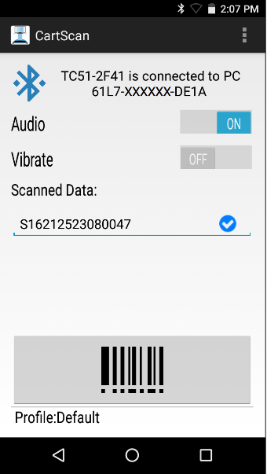

## Overview

RxLogger was developed to simplify patient data collection by healthcare workers as they make their rounds through a facility. This process often involves a computer wheeled from room to room on a cart, with the worker manually entering patient data using the keyboard. The RxLogger solution saves trips to the keyboard by sending collected data to the computer as keystrokes over Bluetooth. The solution also has applications in the warehouse, transportation and logistics, and numerous other industries. 

### Supported Devices

* **MC40 HC KitKat**
* **MC40 HC Lollipop**
* **TC51 HC Marshmallow**

<!-- RxLogger is an app for Zebra Android devices that scans barcode data and delivers it as keystrokes to a nearby Windows PC via Bluetooth. RxLogger enables users in healthcare and other industries to collect data wirelessly, helping to increase productivity and workflow efficiency. RxLogger communicates only with RxLogger PC Wedge, a Windows service that must be on the PC running the line-of-business application that is collecting the scanned data. 
-->

-----

## How It Works

The RxLogger solution includes two components:

* The RxLogger app for Android (`"cartscan.apk"`)

* The RxLogger PC Wedge service for Windows (`"RxLoggerPCwedge.exe"`)

_The RxLogger app for Android_
 

The PC Wedge service continuously monitors the Bluetooth connection that tethers the host computer to a supported Zebra mobile device. By design, only one mobile device can be connected with the PC at a time, and the RxLogger app can communicate only with PC Wedge. When the PC receives scanned data, it inserts the data as ordinary keystrokes into the active field of the foreground application. 

If the need is to populate multiple fields with separate types of scanned data (for example patient and doctor names plus an administered medication), the mobile device can be configured to move the cursor to a subsequent field after each segment of scanned data is transmitted. Data also can be processed on the device before transmittal. See [Settings](../settings) for more information. 

<!-- 
<iframe width="560" height="315" src="https://www.youtube.com/embed/dPzyDFMcJzI" frameborder="0" allowfullscreen></iframe>
 -->

<!-- 
-----

#### Learn more about:
* [Text correction features](../settings#textcorrection)
* The "Loadable" [Personal Dictionary](../../../../mx/personaldictionarymgr) 
-->