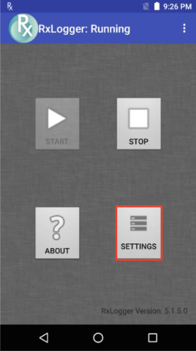
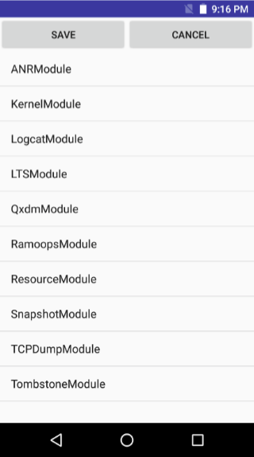
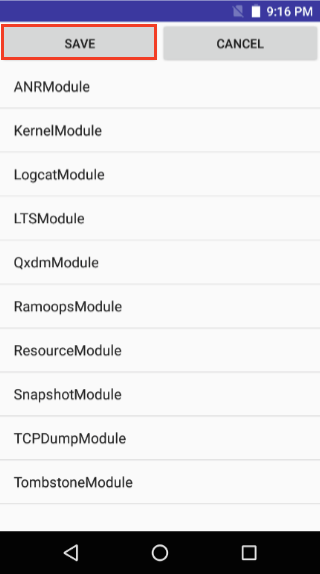

## Overview
RxLogger settings are configured through the RxLogger user interface or by pushing a configuration file to the device. Settings are stored as one of four data types: 

* **Integer -** used to hold data that must be numerical such as the number of files to store. Allowable integers range between 0 - 2,147,483,647. For fields such as file size that do not allow a value of 0, a 1 is substituted at runtime. For integer fields, the UI accepts only numerical input.  

* **String -** used to hold text, such as for file names and storage paths. The UI accepts any alphanumeric input and symbols as permitted by the file system. 

* **Boolean -** used to store true/false information such as to enable/disable a module; represented in the UI as a checkbox.

* **List -** used to select one value from a list of pre-assigned values; represented in the UI as a group of radio buttons. 

-----

### Settings GUI

**To configure Settings through the GUI**: 

1. **Tap the Settings button** to display a list of configurable modules currently loaded by `diagdaemon`: 

 
2. **Tap the module to be edited** to display a list of its parameters: 

 
3. **Edit settings as required**. Tap the BACK key when done. 

 
4. **Repeat Steps 2 and 3** until all modules are edited as desired. 
5. On the modules listing screen, **tap "SAVE" to preserve all changes**.  

 

See the [Modules page](../modules) for settings information. 

----

### Settings File

All RxLogger settings are stored in a file on the device, permitting remote configuration and mass deployment of settings files to devices across an enterprise. **Warning**: While this human-readable file can be edited by hand, **Zebra recommends modifying RxLogger settings only through the RxLogger UI or intents** to avoid unpredictable behavior.

* **File name -** `config.json`

* **Location -** `/<internal_storage>/RxLogger` 

* **With external SD Card**: 
`/storage/sdcard1/RxLogger`

* **With no external SD Card**: 
`/storage/sdcard0/RxLogger`

When a new settings file is pushed to the device, RxLogger restarts all affected modules and applies the new settings immediately. 

>**Important**: Zebra recommends modifying RxLogger settings only through the RxLogger UI or intents. 

**Related Guides**: 

[RxLogger Intent APIs](../apis)

