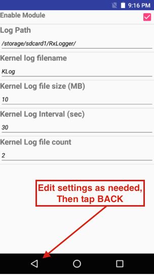

## Overview
RxLogger settings are configured through the RxLogger user interface or by pushing a configuration file to the device. Settings are stored as one of four data types: 

* **Integer -** used to hold data that must be numerical such as the number of files to store. Allowable integers range between 0 - 2147483647. For fields such as file size that do not allow a value of 0, a 1 is substituted at runtime. For integer fields, the UI accepts only numerical input.  

* **String -** used to hold text, such as for file names and storage paths. The UI accepts any alphanumeric input and symbols as permitted by the file system. 

* **Boolean -** used to store true/false information such as to enable/disable a module; represented in the UI as checkboxes.

* **List -** used to select one value from a list of pre-assigned values; represented in the UI as a group of radio buttons. 

<!-- 
2147483647 = max Int = 2^32 (need to confirm)
 -->
-----

### Settings GUI

**To configure through the GUI**: 

1. **Tap the Settings button** to display a list of configurable modules currently loaded by `diagdaemon`: 

 
2. **Tap the module to be edited** to display a list of its parameters: 

 
3. **Edit settings as required**. Tap the BACK key when done. 

 
4. **Repeat Steps 2 and 3** until all modules are edited as desired. 
5. On the modules listing screen, **tap "SAVE" when finished to preserve changes**.  

 

----

### Settings File

All RxLogger settings are stored in a file on the device, permitting remote and mass deployment of settings to devices across an enterprise. While this file is human-readable and can be edited by hand, **Zebra recommends modifying RxLogger settings using the UI and deploying the automatically generated settings file to other devices** to avoid unpredictable behavior.

**File name -** `config.json`

**Location -** `/<internal_storage>/RxLogger` 

If no external card: 
`/storage/sdcard0/RxLogger`

If yes external card: 
`/storage/sdcard1/RxLogger`

you can chose your own

When a new settings file is pushed to the device, RxLogger restarts all affected modules and applies the new settings immediately. 

>**Important: Zebra recommends modifying RxLogger settings using the UI and deploying the automatically generated settings file to other devices**.  

Special Note: It is possible to manual edit the config file but is not recommended. It is better to edit the configurations through the user interface and take the auto generated file and place it on other devices.

There are four type of configurations in RxLogger

2.2.1. Integer

Integer type configurations are used to hold data that must be numerical such as number of files to keep. Integers must be positive numbers between 0 and 2,147,483,647. Note most integers values will replace 0 with 1 during run time if 0 is not a valid number such as file count or file size.

In the user interface Integer configuration types are represented as a text field that will only except numerical input.

2.2.2. String

String type configurations are used to hold generic text based data such as paths and file names.

In the user interface String configuration types are represented as a text field that will except any text based input.

2.2.3. Boolean

Boolean type configurations are used to store true false type information such as enable module.

In the user interface, Boolean configuration types are represented as check boxes.

2.2.4. List

List type configurations are used to select one value for a list of pre-assigned values

In the user interface List configuration types are represented as a group of radio buttons.

_The About button displays loaded modules and version numbers._
 

